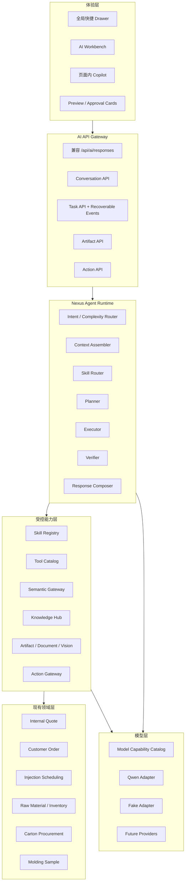
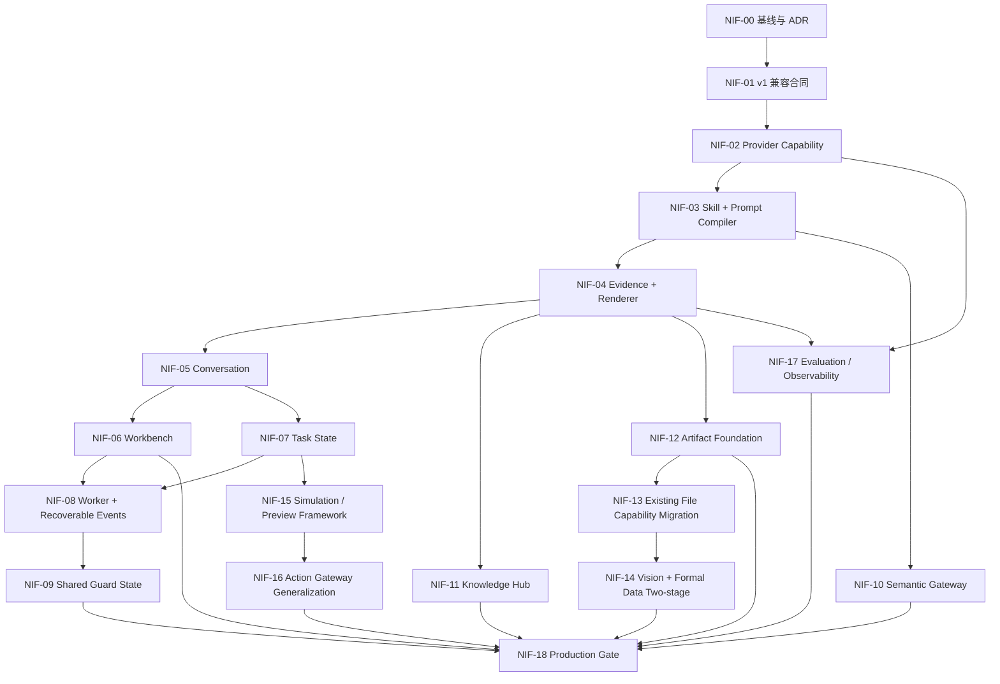

# Royal Regent Nexus AI 中枢模块 Codex 开发方向

> 从现有 AI Pilot 与 AI-B1～AI-B15 继续演进到 Nexus Intelligence Fabric

| 项目 | 内容 |
| --- | --- |
| 项目 | Royal Regent Nexus（RR-Nexus） |
| 用户产品名 | Nexus Copilot |
| 平台架构名 | Nexus Intelligence Fabric（NIF） |
| 文档性质 | 基于架构蓝图和当前仓库事实生成的 Codex 分批实施计划 |
| 生成日期 | 2026-08-12 |
| 源设计文档 | `C:\Users\匡树杰\Downloads\Royal_Regent_Nexus_AI_Module_Architecture_Blueprint.md` |
| 建议入库路径 | `docs/ai/AI_MODULE_DEVELOPMENT_PLAN.md` |
| 当前交付路径 | `C:\Users\匡树杰\Downloads\Royal_Regent_Nexus_AI_Codex_Development_Direction_2026-08-12.md` |
| 观察仓库 | `D:\RR\royal-regent-nexus` |
| 观察基线 | 当前 checkout `67da509`；已验证远程 `main` 为 `18dc3b1` |
| 实施基线要求 | 每个开发批次开始前重新验证远程默认分支、工作树和唯一 Alembic head |

---

## 0. 使用说明

这份文档不是要求 Codex 一次性实现整个 AI 中枢，也不是对蓝图的简单重排。

它完成四件事：

1. 将蓝图中的“目标架构”与当前源码中的“已实现能力”分开；
2. 剔除已经进入最新远程 `main` 的 AI-B1～AI-B15，避免重复开发；
3. 把后续工作拆成可独立验收、回滚和审查的 `NIF-00`～`NIF-18`；
4. 为每个任务包规定范围、依赖、文件、数据、接口、测试、门禁和停止条件。

执行时每次只选择一个任务包。除非用户在当前回合明确要求，不执行 commit、push 或创建 PR。

### 0.1 事实标签

本文使用以下标签：

| 标签 | 含义 |
| --- | --- |
| `CURRENT-CHECKOUT` | 直接从当前工作目录 `67da509` 观察到的事实 |
| `VERIFIED-REMOTE` | 通过远程引用和 `git ls-remote` 验证的 `origin/main=18dc3b1` 事实 |
| `IMPLEMENTED` | 已在源码中看到实现，不等同于本轮运行测试通过 |
| `VERIFIED-HERE` | 本轮实际执行检查并获得结果 |
| `BLUEPRINT` | 源架构蓝图中的目标或判断 |
| `DECISION-GATE` | 未经产品、业务、安全或运维确认不能自动成为正式规则 |
| `DEFERRED` | 明确不在当前路线的前置阶段实现 |

### 0.2 源文件校验

- 行数：2,563 行；
- 文件大小：78,513 字节；
- SHA-256：`F9D4F2A52017984BD5E4702C6C4C060611807752DE78F7FCA93ABDC122257B71`；
- 已完整读取到 EOF；
- 文档自身明确声明它是架构蓝图，不是文件级开发步骤。

---

## 1. 执行结论

### 1.1 正确的继续方向

RR-Nexus 已经不再处于“尚无 AI 接入”的状态。最新远程 `main` 已经包含：

- 默认关闭的 Fake/Qwen Responses Provider；
- `/api/ai/responses`、SSE、Request ID、限时与取消；
- 白名单 Tool Registry、严格 Pydantic 入参、权限和厂区复查；
- 全局内存型 AI Drawer；
- 注塑排产、内部报价、啤办、纸箱采购、原料库存、客户订单等受控只读能力；
- Vision Pilot；
- 工作簿语义快照和映射建议；
- 云端翻译开关与本地翻译回退；
- 排产 PREVIEW 生成与比较；
- 动作确认记录和第一条仅作用于 DRAFT 的受控 Apply。

因此，下一阶段不是重新实现 AI-B1～AI-B15，而是把这些纵向功能整理成可持续的平台能力：

```text
现有安全 Pilot
  → 稳定兼容契约
  → Provider 能力路由
  → Skill 与 Prompt Compiler
  → Evidence 与 Renderer
  → 持久化会话
  → 可恢复任务
  → Semantic / Knowledge
  → Artifact / 多模态
  → 通用 Preview / Action Gateway
  → 多实例与生产治理
```

### 1.2 产品原则

> 让 AI 在理解、规划、分析和表达上足够自由；在正式取数、确定性计算、审批和执行上足够严谨。

具体边界：

- LLM 负责理解歧义、选择受控能力、形成分析和解释；
- FastAPI、IAM、厂区隔离、领域 Service、Revision、状态机和数据库约束继续权威；
- Runtime 不直接查询领域业务表，不执行模型生成的 SQL；
- 页面上下文只是语义信号，每次 Tool/Action 都重新鉴权；
- 实时业务事实使用 Tool，不能用静态 RAG 替代；
- DRAFT、PUBLISHED、Scenario、Preview、用户文件和模型推断必须明确区分；
- 写操作继续遵守 Proposal → Approval → Idempotent Command → Verification → Audit；
- AI 故障、Provider 429、断流或 Kill Switch 不得影响普通业务功能。

### 1.3 当前最值得优先解决的问题

优先级从高到低：

1. 当前 checkout 落后远程 `main` 6 个提交，不能直接作为新开发基线；
2. `PROJECT_MEMORY.md` 在最新 `main` 中存在 AI 状态自相矛盾，需要先修正；
3. Provider Contract 仍然很薄，模型、推理强度和事件能力基本是全局固定；
4. 前端 `store.ts` 已承担大量结果解析和业务 Renderer，继续扩展会失控；
5. 会话仍是浏览器内存，关闭 Drawer 会清空；
6. 长任务仍缺少持久状态、Worker、租约、恢复和事件游标；
7. Skill、Prompt、Evidence、Semantic 和 Knowledge 还没有形成独立平台边界；
8. Pilot 限流与预算仍是进程内状态，多实例前必须迁移；
9. Artifact 尚未统一，Vision、工作簿和翻译能力仍是分散入口；
10. 现有 Controlled Apply 需要先完成现场与生产门禁验收，再考虑第二个正式写动作。

### 1.4 明确不采用的路线

后续开发不得：

- 让模型执行任意 SQL；
- 让模型直接调用任意 FastAPI 路由；
- 复制领域 Service 中的报价、导入、库存或排产规则；
- 以页面选择的厂区代替后端授权；
- 直接将全公司正式数据复制到第三方向量库；
- 把用户文件、OCR、网页或 Tool 自由文本当成系统指令；
- 在没有冻结参数、Revision、TTL、权限复查和幂等的情况下执行写入；
- 把 `store=false` 解释为供应商绝对零保留；
- 因为模型支持 1M 上下文就默认发送超大业务数据；
- 用多个 Agent 的数量代替清晰的 Skill、Tool 和状态机；
- 一次性移动整个 `backend/app/services/ai/` 或重写现有 Pilot；
- 在当前落后分支上直接开始 NIF 开发。

---

## 2. 本轮仓库基线审计

### 2.1 Git 与迁移状态

| 检查项 | 结果 | 判定 |
| --- | --- | --- |
| 仓库根 | `D:\RR\royal-regent-nexus` | `VERIFIED-HERE` |
| 当前分支 | `agent/ai-b1-b9-internal-quote-20260811` | `VERIFIED-HERE` |
| 当前 HEAD | `67da509e97efc9b18a7194f59da845386e2dbb3a` | `VERIFIED-HERE` |
| 远程默认分支 | `origin/main` | `VERIFIED-HERE` |
| 远程 main | `18dc3b11333742a0963248b39c235939b9685939` | `VERIFIED-REMOTE` |
| 当前 HEAD 对远程 main | 0 ahead / 6 behind | `VERIFIED-HERE` |
| 当前 checkout Alembic head | `20260811_0065` | `VERIFIED-HERE` |
| 远程 main Alembic head | `20260812_0066` | `IMPLEMENTED`，由远程树与迁移链确认 |
| 跟踪文件 | 无未提交修改 | `VERIFIED-HERE` |
| 未跟踪内容 | QA、artifact、backend/data、截图、outputs 等 10 个路径 | 必须保留 |

远程 `main` 比当前 checkout 新增的关键合并：

- PR #202：合并当前 AI Pilot 与内部报价只读能力；
- Hotfix：Pilot 用户容量调整；
- PR #204：合入 `def32a3 feat: complete AI copilot B9-B15`；
- AI action confirmation 迁移 `20260812_0066`。

### 2.2 当前工作区保护边界

下列未跟踪路径属于既有用户或验收资产，本轮没有修改，未来任务也不得清理或通过 `git add -A` 误纳入：

```text
.codex-phase1-qa/
artifacts/
backend/data/
design-qa-injection-scheduling-default.png
design-qa-injection-scheduling-expanded-region.png
design-qa-injection-scheduling-expanded.png
design-qa-injection-scheduling-time-format-region.png
design-qa-injection-scheduling-time-format.png
outputs/molding-sample-material-purpose-20260721/
outputs/molding-sample-print-optimization-20260721/
```

### 2.3 实施基线规则

任何 NIF 任务包开工前必须：

1. 重新读取 `AGENTS.md`；
2. 按关键词完整读取 `PROJECT_MEMORY.md` 相关段落；
3. 验证远程 `main` 当前 SHA，而不是沿用本文 SHA；
4. 从最新远程 `main` 创建干净独立 worktree/分支；
5. 重新运行 `alembic heads` 并确认唯一 head；
6. 检查目标工作树已有改动和未跟踪内容；
7. 不在本轮观察到的落后分支上叠加新架构开发。

### 2.4 本轮“实现”与“验证”边界

本轮完成的是源码与 Git 基线审计、蓝图分析和计划编写。

本轮没有：

- checkout 或合并远程 `main`；
- 修改项目代码或迁移；
- 运行 AI 后端测试、前端测试或构建；
- 调用真实 Qwen；
- 验证线上部署、TLS、Cookie、Provider Secret 或 Pilot 用户；
- 验证生产数据库是否已经升级到 `0066`。

因此，“远程 main 已实现”与“当前环境已经运行通过”必须继续分开报告。

---

## 3. 蓝图与最新源码差异矩阵

### 3.1 已存在，不得重做

| 蓝图能力 | 最新远程 main 状态 | 后续处理 |
| --- | --- | --- |
| Fake + Qwen Responses Provider | 已存在 | 扩展 Contract，不推翻 |
| `store=false` | Qwen 请求已显式设置 | 保持默认；平台自有会话 |
| `/api/ai/responses` | 已存在 | 冻结 v1 兼容行为 |
| 版本化 SSE 与 Request ID | 已存在 | 扩展事件，不破坏 v1 |
| Tool Registry / Executor | 已存在 | 升级为 Skill + Tool Catalog |
| IAM、厂区、部门双重校验 | 已存在 | 每批回归 |
| 结果行/字段/字节限制 | 已存在 | 后续增加分页、句柄、摘要 |
| 全局 AI Drawer | 已存在 | 保留快速入口，增加 Workbench |
| 注塑模块知识和只读 Tool | 已存在 | 包装为 Skill，扩 Evidence |
| 内部报价只读 Tool | 已存在 | 不重复建设 |
| 啤办/纸箱/原料/订单只读 Tool | 远程 main 已存在 | 不安排旧 B9 重做 |
| Vision Pilot | 已存在，默认关闭/受同意控制 | 迁入 Artifact，两段式扩展 |
| 工作簿语义快照 | 已存在 | 迁入 Artifact，不重做解析核心 |
| Mapping Proposal/Profile Draft 边界 | 已存在 | 保留确定性确认和 Profile 治理 |
| 云翻译开关与本地回退 | 已存在 | 保留本地隐私路径 |
| 排产 Scenario/PREVIEW | 已存在 | 包装为通用 Simulation 契约 |
| Action Confirmation | 已存在 `0066` | 先做默认关闭的兼容泛化；真实启用与现场验收留给 NIF-18 |
| Apply Preview Run 到 DRAFT | 已存在，默认关闭 | 不扩到 Publish/Rollback |

### 3.2 部分存在，需要平台化

| 目标能力 | 已有部分 | 仍缺 |
| --- | --- | --- |
| Provider Capability | 基础 ProviderRequest/Response | 能力别名、路由、缓存/地域/格式/回退政策 |
| 风险等级 | `READ_ONLY`、`PREVIEW_WITH_AUDIT`、写级别枚举 | 统一自治策略与审批矩阵 |
| Evidence | Tool Envelope 有 source 元数据 | 持久引用、字段级最小化、重新授权、Renderer 合同 |
| Module Knowledge | 注塑单一知识文件 | 全模块发布、版本、Owner、过期和检索 |
| Context | 页面、厂区、权限；`selected_entity` 当前固定为空 | 服务端验证实体、任务、会话摘要、Artifact、预算 |
| Action Gateway | 一个确认表、一个 DRAFT Apply | 通用 Handler Policy、审批等级、补偿、后置验证框架 |
| Preview | 排产与工作簿各自实现 | 通用 Preview/Evidence/TTL/状态语义 |
| Observability | 元数据日志、Request ID | 模型运行/成本/成功率/评测与反馈闭环 |
| 文件能力 | 图片、工作簿、翻译各有入口 | 统一 Artifact、保留、扫描、授权下载、派生产物 |
| 前端结果卡 | 多个卡片已存在 | 独立 Renderer Registry，解除 `store.ts` 巨型解析 |

### 3.3 当前缺失

- 持久化 Conversation、Message 和 Summary；
- 临时会话与可删除长期会话的明确保留政策；
- 持久化 Task、Step、Event、Lease 和恢复状态；
- 长任务 Worker 和断线恢复；
- 独立 Skill Registry 与版本化 Manifest；
- Prompt Compiler 与 Prompt 发布评测；
- 企业 Semantic Gateway 与受控 Query Plan；
- Knowledge Hub、审核发布和可靠 Citation；
- 统一 Artifact 元数据与存储适配；
- 共享原子限流、并发和日预算；
- Model Capability Router；
- 跨领域编排与 Verifier（本路线明确 `DEFERRED`，等待单领域 Eval、稳定关联键和权威 Ledger）；
- 用户反馈到评测集的审核流水线；
- 专门的 AI Workbench/任务中心；
- 安全外部研究与 MCP 治理；
- PDF/OCR 解析流水线（本路线明确 `DEFERRED`，Artifact v1 只治理文件，不承诺解析）；
- 生产级代码计算沙箱（本路线明确 `DEFERRED`，NIF-00～18 不开放生产代码执行）。

### 3.4 必须修正的冲突

1. 蓝图以旧远程审计点为基线，最新远程 `main` 已经继续实现 B9～B15；
2. 蓝图称当前大致是 L0+L1，但最新源码已有 L2 PREVIEW 和一条默认关闭的 L3 型 DRAFT Apply；
3. 当前 checkout 的迁移头是 `0065`，最新远程 main 已经是 `0066`；
4. 最新 `PROJECT_MEMORY.md` 第 2 节仍称没有 AI 专属数据库状态和 consequential write，但同文件后文与 `ai_action_confirmations` 实现相反；
5. 蓝图中的 `19422cf...` 不等于当前已验证远程 `main=18dc3b1`；
6. 蓝图建议的 `none/minimal/low/medium/high/xhigh` 是抽象策略，不应直接假设所有 Provider 都支持同一枚举；
7. 模型 1M Context 是能力上限，不是把业务数据扩大到 1M Token 的产品验收指标；
8. Provider `store=false` 与平台自己持久化会话是两套不同的保留责任；
9. `DELETE conversation` 必须和不可删除审计的保留语义分开；
10. Skill/Prompt 的 Git 文件与数据库版本表不能同时成为双主来源。

---

## 4. 目标架构边界

### 4.1 目标结构



上图是目标边界，不代表 NIF-00～18 会一次性开放所有自治能力。NIF-03 只实现可审计的 Intent/Complexity Router 和有界 Runtime Plan；NIF-07/08 只执行冻结的注册 Skill/Tool 计划。通用跨领域 Planner、PDF/OCR 和代码沙箱属于后续独立决策包，不纳入本路线的生产完成定义。

### 4.2 硬边界

| 层 | 可以做 | 不可以做 |
| --- | --- | --- |
| UX | 传递意图、页面/实体标识、展示状态 | 决定权限、提交完整可信业务对象 |
| API Gateway | 认证、限流、幂等请求、流协议 | 复制领域规则 |
| Runtime | 理解、计划、路由、验证、解释 | 直接 SQL、绕过 Tool/Action |
| Skill | 组合已登记 Tool、Prompt、输出合同 | 自己发明权限或业务事实 |
| Tool | 调用现有 Service，返回最小结构化结果 | 暴露 ORM、任意查询、隐式跨厂 |
| Semantic | 实体、别名、指标、受控 Query Plan | 将自然语言直接翻译成 SQL |
| Knowledge | SOP、字段、状态、模块知识 | 替代实时订单、报价、库存或排产事实 |
| Artifact | 不可变原件、派生产物、解析证据 | 原地修改源件、无授权下载 |
| Action | 提案、冻结、审批、幂等、执行、验证 | 模型直接执行写命令 |
| Provider | 模型推理、工具调用建议、结构化输出 | 成为权限或正式业务状态来源 |

### 4.3 事实与证据等级

```text
FORMAL_DOMAIN_SERVICE
VERSIONED_KNOWLEDGE
USER_PROVIDED_ARTIFACT
APPROVED_EXTERNAL_SOURCE
MODEL_INFERENCE
```

规则：

- `FORMAL_DOMAIN_SERVICE` 是实时业务事实的最高优先级；
- `VERSIONED_KNOWLEDGE` 只能解释版本化流程和规则；
- `USER_PROVIDED_ARTIFACT` 只表示用户本次提供的内容；
- 外部来源必须带 URL、访问时间和可信等级；
- `MODEL_INFERENCE` 必须明确标记，不可伪装为正式事实；
- 任何 Evidence 在再次展示业务详情时都要重新鉴权；
- Evidence 保存引用、版本、哈希和最小摘要，不复制业务表成为第二真相。

---

## 5. 建议 ADR 决策

### 5.0 状态规则

本节所有内容在 NIF-00 正式记录前均为 `PROPOSED`，不是已经批准的政策。只有业务、产品、安全或运维责任人明确确认后，ADR 才能标为 `ACCEPTED`；依赖该 ADR 的任务包在其状态不是 `ACCEPTED` 时不得编码或建表。

### ADR-001：以最新远程 main 建立新 worktree

**决定建议**：所有 NIF 开发从实施时已验证的 `origin/main` 新建独立 worktree，不在当前 `67da509` 分支继续。

原因：当前分支缺少已经合并的 B9～B15 和迁移 `0066`，在这里开发会重新制造迁移、接口和文件冲突。

### ADR-002：保留 v1 Responses 兼容窗

**决定建议**：保留 `/api/ai/responses` 和当前 SSE v1；Conversation/Task 使用新资源 API。至少在 Drawer 和新 Workbench 同时通过验收前，不移除 v1。

### ADR-003：Skill 与 Prompt 采用 Git-first

**决定建议**：

- Manifest、Prompt Fragment、输出 Schema 和 Eval Cases 以版本控制文件为权威；
- 数据库只记录运行时使用的 ID、版本、内容哈希和发布状态快照；
- 不允许同一 Skill 同时被数据库自由编辑和 Git 文件定义。

### ADR-004：Nexus 自己管理会话，Provider 默认 `store=false`

**决定建议**：

- 多轮会话由 RR-Nexus PostgreSQL 保存；
- 默认继续向 Provider 发送 `store=false`；
- 不依赖 `previous_response_id` 作为业务任务状态；
- Context Assembler 发送有预算的历史、摘要、证据和工具定义；
- 若未来启用供应商 Session Cache，必须单独通过地域、保留、成本和删除评审。

阿里云官方 Responses 文档说明 `store` 默认是 `true`；设置 `false` 后不能再通过 `previous_response_id` 使用该响应。因此当前显式 `store=false` 是必须保留的配置，而不是可省略的默认值。

### ADR-005：会话保留值必须先由业务确认

**建议起点，不自动成为正式规则**：

| 类型 | 建议 |
| --- | --- |
| 临时会话 | 不持久化消息正文；仅保留必要安全审计元数据 |
| 普通持久会话 | 默认 30 天，可由用户提前删除正文 |
| 任务记录 | 按业务审计策略保存，和聊天正文分离 |
| Action 审计 | 不随会话删除；按领域正式审计期限保留 |
| 用户偏好 | 显式选择、可查看、可撤销；不存业务事实 |

在 NIF-05 建表前，必须确认最终期限、删除、匿名化、管理员访问和法律保留语义。

### ADR-006：Pilot 规模优先使用 PostgreSQL 任务租约

**决定建议**：第一版 Worker 使用 PostgreSQL 状态表、`FOR UPDATE SKIP LOCKED`、租约、心跳和幂等重试；通过接口隔离队列实现，将来达到吞吐阈值后再替换 Redis/专业 Broker。

原因：生产已经依赖 PostgreSQL，可以先减少新基础设施；但 Worker 必须独立进程，不能靠 API 进程内后台任务承载可靠长任务。

### ADR-007：共享限流先使用 PostgreSQL 原子桶

**决定建议**：将并发、RPM、日 Token 预算和运行禁用状态迁移到事务性共享表/原子更新；建立实现接口。当数据库竞争或规模指标达到门槛后再评估 Redis。

### ADR-008：Knowledge Hub v1 先本地、后向量

**决定建议**：

- 第一版使用审核后的 Git 文档、结构化元数据和 PostgreSQL 全文/精确检索；
- 先建立引用正确率、召回率和过期治理；
- 只有评测证明语义召回不足时才增加 pgvector；
- 内部敏感文档默认不进入百炼 File Search；
- 实时业务数据永远使用 Tool。

官方 `file_search` 当前一次只接受一个知识库 ID；空或无效 ID 可能不报错而让模型使用自身知识回答。RR-Nexus 不能把这一行为当作正式事实检索的可靠失败语义。

### ADR-009：Artifact 原件不可变

**决定建议**：AI Artifact 使用数据库元数据 + 存储适配器：

- 原件以 SHA-256、上传者、厂区、分类、保留期限登记；
- 原始字节不可原地覆盖；
- 映射、翻译、OCR 和报表都是新的派生产物；
- 下载和派生操作重新鉴权；
- 扫描器使用生产真实实现、测试 Fake；
- 扫描不可用时，生产外部上传默认失败关闭。

### ADR-010：业务代码只引用模型能力别名

内部能力使用：

```text
FAST_ROUTER
GENERAL_CHAT
DEEP_REASONING
MULTIMODAL_GENERAL
STRUCTURED_EXTRACTION
DOCUMENT_OCR
TRANSLATION
EMBEDDING
RERANK
```

`DOCUMENT_OCR` 仅保留为未来能力别名，不在 NIF-00～18 注册真实实现，也不能被 Capability API 报告为可用。

Provider Adapter 再将其映射到当前可用模型和推理参数。业务代码不得散落 `qwen3.7-plus` 判断。

### ADR-011：推理策略使用内部档位

内部只使用 `FAST`、`BALANCED`、`DEEP` 等稳定语义；Provider Capability Probe 将它映射到该 API 实际支持的参数。不能假设每个 Provider 都支持蓝图列出的全部 effort 枚举。

### ADR-012：现有 DRAFT Apply 仍是唯一写 Pilot

在真实 TLS、Secret 轮换、Secure Cookie、权限配置、Fault Drill、浏览器验收和现场业务验收完成前：

- 不新增第二个 CONSEQUENTIAL_WRITE；
- 不开放 PUBLISHED、Rollback、最终放行或库存调整；
- 不让模型直接看到执行 Handler；
- 只允许模型创建 Proposal，最终执行由独立 API 完成。

### ADR-013：External Research 与任意 MCP 暂不开放

在域名白名单、下载隔离、敏感查询外发、来源评级、日志、地域和管理员登记完成前，`EXTERNAL_RESEARCH`、任意 MCP URL 和公网代码执行保持关闭。

### ADR-014：单 Runtime 优先

普通任务使用一个 Runtime + 多 Skill/Tool/Verifier。Planner、Executor、Reviewer 是内部角色，不创建多个面向用户的机器人，也不引入自治 Agent 群。

---

## 6. 官方模型/API 复核

复核日期：2026-08-12。

### 6.1 已确认事实

- `qwen3.7-plus` 当前支持文本、图片和视频输入、Function Calling 与 Structured Output；官方模型页明确列出 Web Search，其他内置工具必须按模型、地域和 API 兼容矩阵逐项验证；
- 官方模型资料列出的上下文上限为 1,000,000 Token，最大输出为 131,072 Token；
- Responses API 支持流式输出、自定义 Function Tool 和该接口实际支持的内置工具；
- Responses API 的 `store` 默认值为 `true`；
- `store=false` 后响应不能通过 `previous_response_id` 延续；
- Responses 可通过请求参数/Provider能力使用推理策略，但 RR-Nexus 应先做兼容映射；
- File Search 当前一次只接受一个知识库 ID；
- Structured Output 仍需要应用端 Schema 校验，不能因为模型返回 JSON 就直接执行动作。

### 6.2 不能由模型上限直接推出的结论

- 1M Context 不代表每次请求都应该发送 1M Token；
- Built-in Code Interpreter 不代表可以访问生产数据或网络；
- File Search 可用不代表敏感文档已经获准上传；
- Provider 保存关闭不代表 RR-Nexus 自己没有保留责任；
- 模型支持工具不代表工具已经通过 RR-Nexus 权限和风险策略；
- 支持视觉不代表可以跳过文件同意、脱敏和 Prompt Injection 防护。

### 6.3 官方参考

- [阿里云 Model Studio 模型列表](https://help.aliyun.com/en/model-studio/models)
- [qwen3.7-plus 模型详情](https://help.aliyun.com/en/model-studio/qwen3-7-plus)
- [视觉理解与 qwen3.7-plus 能力](https://help.aliyun.com/en/model-studio/vision-model/)
- [OpenAI-compatible Responses API](https://help.aliyun.com/en/model-studio/qwen-api-via-openai-responses)
- [知识检索 / File Search](https://help.aliyun.com/en/model-studio/file-search)
- [Structured Output](https://help.aliyun.com/en/model-studio/qwen-structured-output)
- [Context Cache](https://help.aliyun.com/en/model-studio/context-cache)
- [模型价格](https://help.aliyun.com/en/model-studio/model-pricing)

---

## 7. 总体依赖顺序



### 7.1 可以有限并行的事项

- NIF-06 Workbench 与 NIF-07 Task 模型可以在 NIF-05 合同冻结后并行，但合并顺序要先后验证 API 类型；
- NIF-10 Semantic 与 NIF-11 Knowledge 可在 Evidence 合同冻结后并行；
- 各领域 Eval Case 可以与对应功能开发并行编写，但安全门禁不能延后到最终阶段。

### 7.2 不能并行或不能倒置的事项

- 不能在 NIF-00 之前开始任何代码迁移；
- 不能在 NIF-01 冻结兼容合同前重构 `/api/ai/responses`；
- 不能在 Tool/Evidence 合同前扩展跨领域统一查询；
- 不能在会话保留政策确定前创建 Conversation 表；
- 不能在 Task 事件持久化前实现断线恢复；
- 不能在 Artifact 安全基座前扩展 Excel/PDF/图片上传；
- 不能在 Preview/Verifier 稳定前泛化 Action；
- 不能在共享 Guard 状态前宣称多实例 Pilot 可用；
- 不能在现有 Controlled Apply 现场验收前增加第二个写动作；
- 不能在业务 Ledger 不完整时让 Customer Order Skill 声称正式订单总量。

---

## 8. 里程碑与用户价值

| 里程碑 | 包含任务包 | 用户获得的能力 | 停止条件 |
| --- | --- | --- | --- |
| M0 基线稳定 | NIF-00～01 | 现有 Pilot 不被新架构破坏 | v1 合同回归通过 |
| M1 平台内核 | NIF-02～04 | 模型/Skill/证据/结果渲染可扩展 | 未注册能力和未知 Schema 均失败关闭 |
| M2 持续会话 | NIF-05～06 | 关闭 Drawer、切页后可继续会话 | 删除、临时模式、权限和摘要正确 |
| M3 可靠任务 | NIF-07～09 | 长任务可查看、取消、恢复，多实例有共享保护 | API/Worker 重启、任务 UI 和断线恢复通过 |
| M4 懂系统 | NIF-10～11 | 单领域受控语义查询、模块导师和证据引用 | 无越权、引用正确、无 RAG 幻觉 |
| M5 文件与视觉 | NIF-12～14 | 文件成为可治理 Artifact，视觉可与正式数据核对 | 原件不变、两类 Evidence 分开 |
| M6 受控执行 | NIF-15～16 | Preview/Proposal/Approval/Verification 形成默认关闭的平台合同 | 只兼容现有 DRAFT Apply；现场启用留给 NIF-18 |
| M7 生产治理 | NIF-17～18 | 可量化效果、成本、故障和安全 | 生产门禁全部有证据 |

---

## 9. Codex 任务包

每个任务包遵循统一报告格式：

任务包是一个验收单元，不强制等于一个超大 PR。NIF-02、NIF-03、NIF-04、NIF-08、NIF-13、NIF-16 应按“合同与测试 → 后端适配 → 前端/迁移 → 启用证据”拆成可独立审查的子 PR；所有子 PR 继续受同一个默认关闭 Feature Flag 保护，在整包验收前不得生产启用。

```text
Changed Files
Implemented Behavior
Verification Commands and Results
Unverified or Field-only Checks
Remaining Risks
Rollback
PROJECT_MEMORY Decision
Next Package Preconditions
```

### NIF-00：最新主线再基线、矛盾修复与 ADR 冻结

#### 目标

建立后续 NIF 开发唯一可信的代码、迁移、文档和决策基线。本包以审计和文档为主，不改变生产运行行为。

#### 用户价值

避免 Codex 在旧分支重复开发 B9～B15，避免从错误迁移头继续，确保后续每个 PR 都有一致边界。

#### 开工前读取

```text
AGENTS.md
PROJECT_MEMORY.md
C:\Users\匡树杰\Downloads\Royal_Regent_Nexus_AI_Module_Architecture_Blueprint.md
C:\Users\匡树杰\Downloads\Royal_Regent_Nexus_AI_Codex_Development_Direction_2026-08-12.md
backend/app/core/config.py
backend/app/api/ai.py
backend/app/api/ai_actions.py
backend/app/services/ai/
backend/app/models/ai_action.py
backend/alembic/versions/20260812_0066_add_ai_action_confirmations.py
src/features/ai-assistant/
package.json
```

#### 范围

- 验证远程默认分支和 SHA；
- 从最新 `origin/main` 建立干净 worktree/分支；
- 运行唯一 Alembic head 检查；
- 生成最新 AI 能力 disposition matrix；
- 明确 B1～B15 的复用路径；
- 将本计划以规范路径放入 `docs/ai/AI_MODULE_DEVELOPMENT_PLAN.md`；
- 创建 `docs/ai/adr/` 下的已决定/待决定 ADR；
- 修正 `PROJECT_MEMORY.md` 关于 AI 专属数据库状态和 consequential write 的内部矛盾；
- 审计 Capability API “平台可能能力”与“当前运行时实际开放能力”的差异，只记录现状、期望合同和 NIF-01 测试；本包不修改接口运行行为。

#### 明确不做

- 不重构 Provider、Orchestrator、Tool 或 Drawer；
- 不新增表或迁移；
- 不新增模型、Tool、Skill、页面或写动作；
- 不启用任何默认关闭的 AI 配置；
- 不修改生产 Secret、部署或真实数据库。

#### 预计修改

```text
docs/ai/AI_MODULE_DEVELOPMENT_PLAN.md
docs/ai/adr/0001-baseline-and-compatibility.md
docs/ai/adr/0002-skill-prompt-source-of-truth.md
docs/ai/adr/0003-conversation-retention.md
docs/ai/adr/0004-task-worker-and-shared-state.md
docs/ai/adr/0005-knowledge-and-artifact-data-location.md
docs/ai/adr/0006-action-autonomy-matrix.md
PROJECT_MEMORY.md
```

ADR 文件名可以按仓库既有文档习惯微调，但不得把尚未批准的推荐写成已决定事实。

#### 数据库迁移

无。

#### 测试与验证

```powershell
git status --short --branch
git ls-remote origin HEAD refs/heads/main
git rev-list --left-right --count origin/main...HEAD
backend\.venv\Scripts\alembic.exe -c backend\alembic.ini heads
git diff --check
```

#### 验收标准

- 新工作树基于实施时最新远程 `main`；
- Alembic 只有一个 head；
- 计划不再安排重新实现 AI-B1～B15；
- 文档明确“源码已实现”和“当前环境已验证”的差异；
- `PROJECT_MEMORY.md` 不再同时声称“无 AI 专属状态/写路径”和“已有确认表/DRAFT Apply”；
- `/api/ai/capabilities` 的配置关闭、当前用户不可用、当前上下文不可用和平台理论支持差异已形成审计记录、明确 ADR 与 NIF-01 测试要求；本包没有声称接口行为已修复；
- 未跟踪 QA、数据和输出资产未改变。

#### 停止条件

出现以下任一情况立即停止，不进入 NIF-01：

- 远程 main 或迁移头无法确定；
- 工作树包含无法隔离的用户改动；
- `PROJECT_MEMORY.md` 与代码冲突无法通过源码判定；
- 会话保留、任务队列、知识地域或 Artifact 政策被误写为自动批准；
- 计划仍包含旧 AI-B 批次重建。

#### 回滚

仅回滚本包文档和 `PROJECT_MEMORY.md` 的明确路径；不操作业务数据。

#### 依赖

无。所有后续任务包依赖本包。

---

### NIF-01：冻结现有 Pilot 兼容合同

#### 目标

在重构前建立 v1 Golden Contract，确保 `/api/ai/responses`、SSE、Tool、Vision、Capability 和 Action API 的现有行为不会被 NIF 迁移破坏。

#### 用户价值

用户可以继续使用当前 Drawer、只读 Tool、Vision Pilot、工作簿 Preview，以及默认关闭、仅在配置和现场批准后才可启用的受控 DRAFT Apply；新架构可以逐步上线。

#### 范围

- 记录当前 API 输入、输出、错误码和 SSE 事件序列；
- 记录图片请求禁用 Tool 的现有合同；
- 记录现有 13 个默认 ToolSpec，以及 Controlled Apply 开启后的额外 Proposal Tool；
- 记录 Capability API 的运行时实际能力；
- 建立 v1 JSON/SSE Golden Fixtures；
- 为 Fake Provider 建立可重复的正常、工具、截断、失败和异常 EOF 场景；
- 建立新架构 Feature Flag，默认关闭，不改变 v1；
- 规定 v1 去除的最低条件和兼容期限。

#### 明确不做

- 不增加 Conversation、Task 或 Artifact 表；
- 不改变 Tool 结果字段；
- 不扩大消息、工具、附件或输出上限；
- 不启用并行 Tool；
- 不修改 Action 风险等级。

#### 预计读取/修改

```text
backend/app/api/ai.py
backend/app/api/ai_actions.py
backend/app/schemas/ai/
backend/app/services/ai/orchestrator.py
backend/app/services/ai/providers/fake.py
backend/app/services/ai/tool_registry.py
backend/app/services/ai/tool_executor.py
backend/tests/test_ai_api.py
backend/tests/test_ai_provider.py
backend/tests/test_ai_tool_registry.py
backend/tests/test_ai_action_confirmation.py
src/api/ai.ts
src/api/aiActions.ts
src/features/ai-assistant/store.ts
src/features/ai-assistant/__tests__/
```

建议新增：

```text
backend/tests/fixtures/ai_legacy_responses_v1.json
backend/tests/fixtures/ai_legacy_sse_v1.json
backend/tests/test_ai_legacy_contract.py
src/features/ai-assistant/__tests__/aiLegacyContract.spec.ts
```

#### 数据库迁移

无。

#### 合同

- v1 使用当前消息数组和 SSE；
- 新能力通过新版本字段或新资源 API 暴露；
- 事件必须保持严格递增序号和唯一终态；
- 未知事件可安全忽略，但不能改变已有事件含义；
- Capability 响应以当前配置、当前用户、当前厂区和当前页面为准；
- 配置关闭的 Proposal 不得被 Capability 标记为可用；
- Feature Flag 关闭时所有 Golden Contract 结果不变。

#### 测试

- 未登录、Pilot Deny、Factory Deny、Explicit Deny；
- 文本直答、只读工具、多轮工具；
- Tool 超时、结果超限、Provider 429/5xx、异常 EOF；
- Vision consent、错误 MIME、超大图片、图片工具禁用；
- PREVIEW Tool 开关；
- Proposal/Confirmation/Execute 的隔离；
- SSE 断流和取消；
- 前端未知事件与未知结果降级。

#### 验证命令

```powershell
backend\.venv\Scripts\python.exe -m pytest backend/tests/test_ai_api.py backend/tests/test_ai_provider.py backend/tests/test_ai_tool_registry.py backend/tests/test_ai_tool_security.py backend/tests/test_ai_action_confirmation.py backend/tests/test_ai_legacy_contract.py -q
backend\.venv\Scripts\ruff.exe check backend/app/api/ai.py backend/app/api/ai_actions.py backend/app/services/ai backend/tests/test_ai_legacy_contract.py
npm run test:unit -- src/features/ai-assistant
npm run typecheck:test
npm run build
git diff --check
```

#### 验收标准

- Feature Flag 关闭时 v1 Golden Contract 完全一致；
- Capability 不再误报被配置关闭的能力；
- 当前 Drawer 无可见回归；
- 既有 Action API 不能被模型直接调用执行；
- 未授权率和跨厂泄露率为 0；
- 所有 Fake 测试不访问真实 Provider。

#### 回滚

删除新 Fixture/Flag/兼容测试即可；生产行为不应需要回滚。

#### 依赖

NIF-00。

---

### NIF-02：Provider Capability Catalog 与标准事件

#### 目标

把当前“固定模型 + 薄 ProviderRequest”升级为能力驱动的 Provider Contract，同时保持 Qwen/Fake 和 v1 行为兼容。

#### 用户价值

简单问题更快，复杂分析可以使用更合适的推理档位；未来换模型或增加 OCR/Rerank 不需要修改业务 Skill。

#### 范围

- 定义内部能力别名和能力约束；
- 定义 `FAST/BALANCED/DEEP` 推理政策；
- 扩展 Provider Request：响应格式、存储政策、缓存政策、地域、数据分类、Tool Choice、Multimodal；
- 标准化文本、工具、拒绝、不完整、错误、用量事件；
- Qwen Adapter 完成兼容映射；
- Fake Provider 覆盖所有新事件；
- Model Catalog 从配置加载并校验；
- 记录请求实际 Provider、模型、能力档位和版本；
- 有限重试仅用于安全、无副作用的 Provider 请求；
- 故障切换不得跨地域或降低必需能力。

#### 明确不做

- 不启用第二个真实 Provider；
- 不启用云 File Search、Web Search、MCP 或 Code Interpreter；
- 不增加业务 Tool；
- 不扩大默认上下文或输出；
- 不把私有推理链返回用户。

#### 预计修改/新增

```text
backend/app/core/config.py
backend/app/schemas/ai/capabilities.py
backend/app/services/ai/providers/base.py
backend/app/services/ai/providers/qwen_responses.py
backend/app/services/ai/providers/fake.py
backend/app/services/ai/provider_factory.py
backend/app/services/ai/orchestrator.py
backend/tests/test_ai_provider.py
backend/tests/test_ai_api.py

backend/app/services/ai/providers/capabilities.py
backend/app/services/ai/providers/catalog.py
backend/app/services/ai/providers/router.py
backend/tests/test_ai_provider_capabilities.py
```

#### 数据库迁移

无。Catalog v1 使用配置/Git 文件。

#### Provider Contract

```text
capability_profile
reasoning_policy
response_format
store_policy
conversation_state_policy
cache_policy
tool_choice_policy
built_in_tools
custom_tools
parallel_tool_policy
multimodal_inputs
output_modalities
retry_policy
fallback_policy
region_policy
data_classification
```

#### 安全要求

- Qwen 默认始终显式 `store=false`；
- API Key、Workspace ID 不进入响应、日志或前端；
- 认证失败不重试；
- 写动作执行后不经过 Provider 重放；
- Fallback 必须满足 Skill 最低能力和同等数据地域；
- 不支持的 reasoning 值必须在 Adapter 层拒绝或安全降级；
- Structured Output 必须再由 Pydantic 校验。

#### 测试

- Catalog 缺项、重复 alias、未知 capability；
- Qwen Payload 映射；
- Fake 每类事件；
- `store=false` 不可被配置意外覆盖；
- 429/5xx 有界退避；
- auth/validation 不重试；
- region mismatch fail closed；
- incomplete/refusal/error 转换；
- v1 Golden Contract 回归。

#### 验证命令

```powershell
backend\.venv\Scripts\python.exe -m pytest backend/tests/test_ai_provider.py backend/tests/test_ai_provider_capabilities.py backend/tests/test_ai_api.py backend/tests/test_ai_legacy_contract.py -q
backend\.venv\Scripts\ruff.exe check backend/app/services/ai/providers backend/app/services/ai/provider_factory.py backend/app/services/ai/orchestrator.py backend/tests/test_ai_provider_capabilities.py
git diff --check
```

#### 验收标准

- 业务代码只引用能力 alias，不判断模型名；
- 当前 Qwen 文本/Vision 合同不回归；
- 关闭新路由时模型、reasoning、预算保持旧值；
- Provider 错误不影响普通业务 API；
- 事件模型能表达 refusal、incomplete 和 usage；
- 测试不调用真实云端。

#### 回滚

Feature Flag 切回旧 ProviderRequest 适配路径；保留 v1 Provider Adapter。

#### 依赖

NIF-01；ADR-010、ADR-011 必须处于 `ACCEPTED`。

---

### NIF-03：Skill Registry 与 Prompt Compiler

#### 目标

把当前 Page Policy + Tool Group + 单一系统 Prompt 升级为版本化 Skill 能力包，同时复用全部现有 ToolSpec。

#### 用户价值

AI 能按任务而不是按页面牢笼选择能力；模块规则不再堆入一个越来越长的系统提示词。

#### 范围

- 定义 Skill Manifest Schema；
- 定义 Skill Registry 和 Skill Router；
- 定义可审计的 Intent/Complexity Router：规则优先，模型分类只允许闭合 Schema，并有确定性回退；
- 定义有界 Runtime Plan：一个主 Skill、注册 Tool 白名单、最大步骤、风险上限和输出合同；不接受模型生成的任意执行图；
- 将现有能力包装为 Legacy/Current Skills；
- 实现 Prompt Compiler；
- 核心政策、身份范围、页面/实体、Skill、知识、工具、输出格式分段编译；
- 为 Prompt 和 Skill 记录版本与内容哈希；
- 页面是路由信号，不再是唯一能力组织方式；
- Tool 可见性继续由当前 Registry/IAM/Context 决定；
- 每个 Skill 绑定 Renderer Schema，并预留稳定的可选 `eval_suite_ref`；NIF-17 之前该引用不表示评测已运行或通过；
- 为现有 `ToolSpec` 增加显式 `side_effect_class`、`idempotency` 和 `retry_policy` 合同；旧 Tool 未分类时默认 `NEVER_RETRY`，不能由 Worker 猜测可重试性。

#### 第一批 Skill

```text
system.module_tutor
business.current_page_query
internal_quote.read_summary
molding_sample.read_summary
carton_procurement.read_summary
raw_material.read_summary
customer_order.capability_and_audit
injection_scheduling.read_context
injection_scheduling.preview_advisor
files.workbook_mapping_preview
files.document_translation
vision.screenshot_observation
```

这些只是现有能力的组织包装，不应扩展字段或权限。

#### 明确不做

- 不创建数据库可编辑 Prompt；
- 不实现持久 Conversation/Task；
- 不引入 RAG 或向量库；
- 不新增跨领域查询；
- 不新增正式写动作；
- 不删除 Page Context 校验。

#### 预计新增

```text
backend/app/services/ai/skills/__init__.py
backend/app/services/ai/skills/contracts.py
backend/app/services/ai/skills/registry.py
backend/app/services/ai/skills/router.py
backend/app/services/ai/runtime/router.py
backend/app/services/ai/runtime/plan.py
backend/app/services/ai/skills/manifests/*.yaml
backend/app/services/ai/prompts/compiler.py
backend/app/services/ai/prompts/registry.py
backend/app/services/ai/prompts/core_policy.md
backend/tests/test_ai_skill_registry.py
backend/tests/test_ai_prompt_compiler.py
backend/tests/test_ai_runtime_router.py
backend/tests/test_ai_tool_retry_contract.py
```

预计修改：

```text
backend/app/services/ai/orchestrator.py
backend/app/services/ai/context_builder.py
backend/app/services/ai/tool_registry.py  # extend existing ToolSpec
backend/app/schemas/ai/capabilities.py
```

#### 数据库迁移

无。Git 文件是权威；运行记录只携带版本/哈希，持久化在后续批次实现。

#### Skill Manifest 最小字段

```yaml
id: injection_scheduling.read_context
version: 1.0.0
owner: production-engineering
status: pilot
intents:
  - explain_plan
  - query_backlog
required_context:
  factory_scope: required
allowed_tools:
  - injection_scheduling.get_plan_context
  - injection_scheduling.search_backlog
model_policy:
  capability: GENERAL_CHAT
risk_policy:
  maximum: READ_ONLY
output_contract:
  schema: injection_scheduling.context.v1
eval_suite_ref: injection_scheduling_read_v1  # optional until NIF-17
```

#### 安全要求

- Manifest 的 Tool 必须已存在于 Tool Registry；
- Skill 不能扩大 Tool Permission；
- 用户无权限的 Skill 不进入模型上下文；
- Prompt Fragment 不能包含 Secret；
- 文件、OCR 和 Tool 自由文本只能作为 data block；
- core policy 保持短小且不可被 Skill 覆盖；
- 同一请求有一个主 Skill；多 Skill 只能组合共同可用 Tool；
- Runtime Plan 只可引用已授权 Skill/Tool，并受步骤数、风险和 Token 预算限制；
- Tool 重试必须使用注册的 `retry_policy`；未声明、非幂等或有副作用 Tool 一律不自动重放；
- 未知 Skill/版本 fail closed。

#### 测试

- Manifest Schema、重复 ID、未知 Tool、风险越界；
- 路由中文口语、页面提示、文件提示；
- Intent/Complexity Router 的规则、闭合分类、未知意图和确定性回退；
- Runtime Plan 的未知 Skill/Tool、步骤超限、风险越界和注入尝试；
- ToolSpec 重试元数据缺失、兼容默认值和注册校验；
- 无权限 Skill 不可发现；
- Prompt 顺序、长度预算、哈希稳定；
- Prompt Injection 数据不能进入 system policy；
- Legacy v1 在 Flag 关闭时不变；
- Fake Provider Skill 选择可重复。

#### 验证命令

```powershell
backend\.venv\Scripts\python.exe -m pytest backend/tests/test_ai_skill_registry.py backend/tests/test_ai_prompt_compiler.py backend/tests/test_ai_runtime_router.py backend/tests/test_ai_tool_retry_contract.py backend/tests/test_ai_tool_registry.py backend/tests/test_ai_tool_security.py backend/tests/test_ai_legacy_contract.py -q
backend\.venv\Scripts\ruff.exe check backend/app/services/ai/skills backend/app/services/ai/prompts backend/app/services/ai/runtime backend/tests/test_ai_skill_registry.py backend/tests/test_ai_prompt_compiler.py backend/tests/test_ai_runtime_router.py backend/tests/test_ai_tool_retry_contract.py
git diff --check
```

#### 验收标准

- 现有 Tool 无复制实现；
- Tool 权限与厂区边界完全沿用；
- 关闭 NIF Flag 时 v1 不变；
- 打开后可以解释当前页面并选择一个明确 Skill；
- Router 产生的计划只包含已授权能力，未知或越界计划失败关闭；
- 所有可由 Worker 执行的 Tool 都有显式副作用、幂等和重试合同；
- Prompt 版本、Skill 版本和 Tool 版本可追踪；
- 未授权/未知能力不能出现在 Provider Tool 定义中。

#### 回滚

关闭 Skill Router Flag，回到现有 Orchestrator + Tool Group；不删除 Manifest 文件以便诊断。

#### 依赖

NIF-01、NIF-02；ADR-003、ADR-014 必须处于 `ACCEPTED`，Provider Capability alias 和事件类型必须先冻结。

---

### NIF-04：Evidence v1 与 Renderer Registry

#### 目标

建立统一 Evidence 合同，并将前端 `store.ts` 中不断增长的业务结果解析拆成版本化 Renderer Registry。

#### 用户价值

每个业务结论都能显示来源、厂区、时间、完整性和事实等级；新增业务卡片不再继续膨胀一个 Store。

#### 范围

- 定义 `AIEvidenceReferenceV1`；
- 为 Tool Result 增加稳定 Evidence 列表；
- 明确 `source_level`、factory、as_of、entity、revision/hash、truncated、cursor；
- 结果字段仍由各领域闭合 Serializer 决定；
- 建立后端 Verifier 的最小规则；
- 前端按 `schema_version + result_type` 注册 Renderer；
- 将现有 Internal Quote、Molding、Carton、Raw Material、Customer Order、Scheduling、Action Card 解析迁出 `store.ts`；
- 未知 Schema 安全降级为只读 JSON/表格，不执行链接或 Action；
- 业务实体链接使用命名路由/白名单路径。

#### 明确不做

- 不持久化 Evidence 表；
- 不新增业务字段；
- 不增加跨领域聚合；
- 不构建图表平台；
- 不把 ORM 或完整 Tool Payload 暴露前端。

#### 预计新增/修改

```text
backend/app/schemas/ai/evidence.py
backend/app/services/ai/evidence.py
backend/app/services/ai/verifier.py
backend/app/services/ai/tool_executor.py
backend/app/services/ai/serializers/
backend/tests/test_ai_evidence.py
backend/tests/test_ai_verifier.py

src/features/ai-assistant/renderers/registry.ts
src/features/ai-assistant/renderers/contracts.ts
src/features/ai-assistant/renderers/internalQuote.ts
src/features/ai-assistant/renderers/moldingSample.ts
src/features/ai-assistant/renderers/cartonProcurement.ts
src/features/ai-assistant/renderers/rawMaterial.ts
src/features/ai-assistant/renderers/customerOrder.ts
src/features/ai-assistant/renderers/injectionScheduling.ts
src/features/ai-assistant/renderers/actionConfirmation.ts
src/features/ai-assistant/store.ts
src/features/ai-assistant/types.ts
src/features/ai-assistant/AiBusinessResultCard.vue
```

#### 数据库迁移

无。持久 Evidence 在 Task/Conversation 批次中引用本合同。

#### Evidence Contract

```json
{
  "evidence_id": "request-local-id",
  "source_level": "FORMAL_DOMAIN_SERVICE",
  "source_name": "injection_scheduling.get_plan_context",
  "factory_id": "huakang-a",
  "as_of": "2026-08-12T10:00:00+08:00",
  "entity_type": "scheduling_plan",
  "entity_id": "...",
  "entity_revision": 7,
  "content_hash": "sha256...",
  "truncated": false,
  "cursor": null,
  "access_policy": "REAUTHORIZE_ON_OPEN"
}
```

#### Verifier 最小规则

- 关键正式结论必须至少有一个 Evidence；
- 不允许混用不同 factory 而不分组；
- 不允许把 DRAFT 说成执行计划；
- 不允许把 Preview/Scenario 说成已执行；
- 不允许把截断结果说成全量；
- 不允许把用户文件说成系统正式数据；
- 失败 Tool 不能支撑成功结论；
- Evidence 打开时重新走领域权限。

#### 测试

- Evidence Schema、哈希、时间、厂区；
- 敏感字段不进入 Evidence 摘要；
- 跨厂 Evidence 拒绝或分组；
- DRAFT/PUBLISHED、Preview/Executed 误标拦截；
- Renderer 白名单字段、未知字段 fail closed；
- 恶意 link、script、HTML、原型污染；
- 旧结果卡快照；
- Store 只负责状态，不再包含领域字段解析。

#### 验证命令

```powershell
backend\.venv\Scripts\python.exe -m pytest backend/tests/test_ai_evidence.py backend/tests/test_ai_verifier.py backend/tests/test_ai_tool_security.py backend/tests/test_ai_legacy_contract.py -q
backend\.venv\Scripts\ruff.exe check backend/app/schemas/ai/evidence.py backend/app/services/ai/evidence.py backend/app/services/ai/verifier.py backend/tests/test_ai_evidence.py backend/tests/test_ai_verifier.py
npm run test:unit -- src/features/ai-assistant
npm run typecheck:test
npm run build
git diff --check
```

#### 验收标准

- 现有卡片外观和行为不回归；
- `store.ts` 不再直接解析各领域业务字段；
- 每张正式业务卡都有来源等级、厂区、时点和截断状态；
- 未知 Renderer 不渲染可执行按钮；
- Evidence 链接重新鉴权；
- 未授权率、跨厂泄露率为 0。

#### 回滚

Renderer Registry 保留旧适配器；Feature Flag 可切回旧提取路径。后端 Evidence 新字段保持向后兼容可选，直到 v2 强制。

#### 依赖

NIF-03；可在 NIF-02 后合并 Provider usage Evidence。

---

### NIF-05：Conversation 持久化、临时模式与保留策略

#### 目标

建立普通对话可恢复所需的服务端持久化、临时模式和删除/保留合同，同时把平台保留与 Provider 保留责任分开；具体 Drawer/Workbench 恢复体验在 NIF-06 验收。

#### 用户价值

用户的会话具备可授权读取、继续、删除和临时模式的服务端基础，不再只能依赖浏览器内存。

#### 决策门

编码前必须批准：

- 默认保留期限；
- 临时会话是否完全不落消息正文；
- 删除是硬删正文、软删、匿名化还是进入保留队列；
- 安全/Action 审计保留期限；
- 管理员是否可读正文；
- 敏感数据分类和数据库备份中的删除语义；
- 用户偏好是否在本包实现。

未批准时只允许完成模型/接口 ADR，不建表。

#### 范围

- `ai_conversations`；
- `ai_messages`；
- `ai_conversation_summaries`；
- 所有权、厂区范围、模式、保留时间和删除状态；
- 创建、列表、详情、追加消息、删除 API；
- 临时会话；
- 服务端选择有预算的历史；
- 会话摘要使用独立受控流程；
- 正式业务事实下次必须重新 Tool 查询；
- Provider 继续 `store=false`；
- v1 `/responses` 可选绑定 conversation，但未绑定时保持旧行为。

#### 明确不做

- 不实现 Task/Step；
- 不保存长期业务事实作为个人记忆；
- 不保存完整 Tool 原始敏感结果；
- 不使用 Provider `previous_response_id` 作为会话来源；
- 不实现组织级知识；
- 不新增 Action。

#### 预计新增/修改

```text
backend/app/models/ai_conversation.py
backend/app/schemas/ai/conversation.py
backend/app/services/ai/conversation_service.py
backend/app/services/ai/conversation_retention.py
backend/app/api/ai_conversations.py
backend/app/main.py
backend/app/db.py
backend/alembic/env.py
backend/alembic/versions/<implementation-time-next-head>_add_ai_conversations.py
backend/tests/test_ai_conversations.py
backend/tests/test_ai_conversation_migration.py
backend/tests/test_ai_conversation_retention.py
src/api/aiConversations.ts
src/features/ai-assistant/stores/conversations.ts
```

迁移文件名中的 revision 必须在实施时从唯一 Alembic head 顺延。当前远程观察 head 是 `0066`，但本文不预占未来 revision。

#### API

```text
POST   /api/ai/conversations
GET    /api/ai/conversations
GET    /api/ai/conversations/{conversation_id}
DELETE /api/ai/conversations/{conversation_id}
POST   /api/ai/conversations/{conversation_id}/messages
```

#### 数据合同

- `id` 使用不可猜测字符串 ID；
- `owner_user_id` 不可变；
- `factory_scope` 是创建时验证的范围，不授予 Tool 权限；
- 每次 Tool 仍重新鉴权；
- `TEMPORARY` 不持久化正文；
- `PERSISTENT` 按批准期限保存；
- Assistant Message 记录 Skill/Prompt/Model 版本和 Evidence 引用；
- Tool 结果只存最小引用和哈希；
- Action 审计与会话正文删除解耦；
- 列表不返回消息正文。

#### 测试

- 会话所有权、枚举防护、跨用户/跨厂；
- Explicit Deny；
- 临时模式不落正文；
- 删除正文后审计仍在；
- Retention 到期；
- 摘要不混入未授权业务数据；
- 旧事实必须重新 Tool 查询；
- Provider 请求仍 `store=false`；
- migration upgrade/downgrade，downgrade 数据保护策略；
- SQLite 开发和 PostgreSQL 语义一致。

#### 验证命令

```powershell
backend\.venv\Scripts\alembic.exe -c backend\alembic.ini heads
backend\.venv\Scripts\python.exe -m pytest backend/tests/test_ai_conversations.py backend/tests/test_ai_conversation_retention.py backend/tests/test_ai_conversation_migration.py backend/tests/test_ai_api.py backend/tests/test_ai_tool_security.py -q
backend\.venv\Scripts\ruff.exe check backend/app/models/ai_conversation.py backend/app/schemas/ai/conversation.py backend/app/services/ai/conversation_service.py backend/app/services/ai/conversation_retention.py backend/app/api/ai_conversations.py backend/tests/test_ai_conversations.py
npm run test:unit -- src/features/ai-assistant
npm run typecheck:test
npm run build
git diff --check
```

#### 验收标准

- API/服务进程重启后，授权用户仍可按 conversation ID 和列表 API 恢复持久会话；浏览器 Drawer/Workbench 恢复留给 NIF-06；
- 临时会话不写入消息正文；
- 用户只能访问自己的会话；
- 删除语义符合批准 ADR；
- Provider `store=false` 不变；
- 业务事实不被个人记忆当作权威；
- AI 关闭时普通业务不受影响；
- 单一 Alembic head。

#### 回滚

- 先关闭 Conversation Feature Flag，使 Drawer 回到内存模式；
- 保留表但停止写入，完成导出/保留评估后再决定 downgrade；
- 有持久用户数据时不得盲目 downgrade。

#### 依赖

NIF-04；ADR-004、ADR-005 必须处于 `ACCEPTED`，否则只允许完成合同/ADR，不得建表。

---

### NIF-06：AI Workbench 与持续会话体验

#### 目标

在保留全局 Drawer 快问入口的同时，增加专门的 AI Workbench，用于长会话、证据和后续任务入口。

#### 用户价值

用户可以在完整页面查看会话历史和证据，不再把复杂分析塞在窄 Drawer 中。

#### 范围

- 新增 `/workbench/ai` 路由；
- Conversation List、标题、最后活动时间和删除；
- 长会话页面；
- Evidence Panel；
- Drawer “在工作台继续”入口；
- 页面切换时保持会话 ID；
- 临时/持久模式清晰显示；
- Context Assembler 使用服务端历史和摘要；
- 保留当前焦点陷阱、Escape、焦点恢复和 Body Scroll Lock；
- Renderer Registry 用于业务结果；
- 空状态、加载、断流、删除和权限失效 UX。

#### 明确不做

- 不实现 Task Timeline；
- 不实现 Artifact 上传；
- 不实现 Action 审批中心；
- 不改变普通业务页面布局；
- 不在前端保存正式业务事实作为长期记忆。

#### 预计新增/修改

```text
src/router/index.ts
src/components/layout/AppShell.vue
src/api/aiConversations.ts
src/features/ai-assistant/AiAssistantDrawer.vue
src/features/ai-assistant/stores/conversations.ts
src/features/nexus-copilot/workbench/AiWorkbenchView.vue
src/features/nexus-copilot/components/ConversationList.vue
src/features/nexus-copilot/components/EvidencePanel.vue
src/features/nexus-copilot/components/ConversationRetentionBadge.vue
src/features/nexus-copilot/__tests__/aiWorkbench.spec.ts
src/features/nexus-copilot/__tests__/conversationRecovery.spec.ts
```

#### 数据库迁移

无；依赖 NIF-05。

#### UX 合同

- Drawer 仍适合快问；
- Workbench 适合长会话；
- 关闭 Drawer 不删除会话；
- 临时会话关闭后的行为和文案符合 ADR；
- 删除操作显示影响，不删除 Action 审计；
- Evidence 重新加载时可能因权限变化而显示“不可访问”，不能显示缓存详情；
- 未知业务结果只读降级；
- 不显示私有思维链，只显示安全阶段摘要。

#### 测试

- 路由权限和登录边界；
- 会话列表分页；
- 刷新/切页恢复；
- 临时与持久模式；
- 删除和 404/403；
- Evidence 权限失效；
- 键盘、焦点、Escape、窄屏；
- Drawer/Workbench 同时更新；
- 未知 Renderer 安全降级。

#### 验证命令

```powershell
npm run test:unit -- src/features/ai-assistant src/features/nexus-copilot
npm run typecheck:test
npm run build
git diff --check
```

#### 验收标准

- 持久会话跨刷新恢复；
- Drawer 和 Workbench 使用同一 Conversation 状态；
- 不登录不能访问；
- 切换账号不泄露上一用户会话；
- 删除/保留文案准确；
- 键盘操作和焦点恢复通过；
- 当前业务页面无布局回归。

#### 回滚

关闭 Workbench 路由和入口，Drawer 继续使用 NIF-05 API或回退内存模式。

#### 依赖

NIF-05。

---

### NIF-07：Task、Step、Event 数据模型与状态机

#### 目标

将复杂文件、单领域分析和模拟从单次 60 秒 SSE 请求中分离出来，建立可持久化、可检查的任务状态。

#### 用户价值

复杂任务能够显示计划、步骤和进度；页面刷新后不会丢失任务身份。

#### 范围

- `ai_tasks`；
- `ai_task_steps`；
- `ai_task_events`；
- Task 与 Conversation、主 Skill、Factory Scope、风险等级关联；
- 保存经过验证的有界 Runtime Plan 快照、Skill/Prompt/Tool 版本与输入哈希；
- 状态机和严格允许转换；
- 事件严格递增序号；
- 创建、读取、取消请求、恢复请求和事件读取 API；
- 先只支持 READ/COMPUTE/SIMULATE/PREVIEW 类型；
- 任务事件保存元数据、Evidence 引用和 Artifact 引用，不复制敏感 Tool 原文；
- Action 继续走现有独立确认 API，不纳入本包执行状态。

#### 状态机

```text
CREATED
  → UNDERSTOOD
  → PLANNED | RUNNING
  → WAITING_INPUT | RUNNING
  → VERIFYING
  → COMPLETED

RUNNING | PLANNED | WAITING_INPUT
  → CANCELLING
  → CANCELLED

RUNNING | VERIFYING
  → FAILED
FAILED
  → RETRY_PENDING
  → RUNNING
```

`WAITING_APPROVAL` 暂不接正式 Action，预留枚举但不允许进入，避免与现有 Confirmation 产生第二套状态机。

#### 预计新增/修改

```text
backend/app/models/ai_task.py
backend/app/schemas/ai/task.py
backend/app/services/ai/task_service.py
backend/app/services/ai/task_state_machine.py
backend/app/services/ai/task_events.py
backend/app/api/ai_tasks.py
backend/app/main.py
backend/app/db.py
backend/alembic/env.py
backend/alembic/versions/<implementation-time-next-head>_add_ai_tasks.py
backend/tests/test_ai_tasks.py
backend/tests/test_ai_task_state_machine.py
backend/tests/test_ai_task_migration.py
```

#### 数据库迁移

一个迁移，包含 Task/Step/Event 基础表、唯一约束、外键、工厂/Owner 索引和事件序号约束。

#### API

```text
POST /api/ai/tasks
GET  /api/ai/tasks/{task_id}
POST /api/ai/tasks/{task_id}/cancel
POST /api/ai/tasks/{task_id}/resume
GET  /api/ai/tasks/{task_id}/events?after=<sequence>
```

#### 安全合同

- Owner/Factory/Permission 每次读取重新校验；
- Task 保存 Scope 不授予未来访问；
- Resume 时重新校验 Skill、Tool、权限和数据新鲜度；
- 任务不得保存 Provider Secret；
- Event Payload 使用闭合 Schema；
- 取消请求是状态意图，不强制假装外部调用已经停止；
- 重试仅允许幂等 Step；
- PREVIEW 与正式写入分离。

#### 测试

- 所有合法和非法状态转换；
- 并发事件序号；
- 重复创建幂等；
- 跨用户/跨厂访问；
- Explicit Deny；
- 取消竞态；
- Resume 权限变化；
- PREVIEW 不进入 Action 执行；
- migration upgrade/downgrade 数据保护；
- 事件中不含敏感原文。

#### 验证命令

```powershell
backend\.venv\Scripts\alembic.exe -c backend\alembic.ini heads
backend\.venv\Scripts\python.exe -m pytest backend/tests/test_ai_tasks.py backend/tests/test_ai_task_state_machine.py backend/tests/test_ai_task_migration.py backend/tests/test_ai_tool_security.py -q
backend\.venv\Scripts\ruff.exe check backend/app/models/ai_task.py backend/app/schemas/ai/task.py backend/app/services/ai/task_service.py backend/app/services/ai/task_state_machine.py backend/app/services/ai/task_events.py backend/app/api/ai_tasks.py backend/tests/test_ai_tasks.py
git diff --check
```

#### 验收标准

- API 重启后 Task/Step/Event 仍存在；
- 事件序号无重复、无倒退；
- 非法转换返回稳定错误码；
- 用户不能读取他人或越权厂区任务；
- 取消/恢复有审计；
- 本包没有后台 Worker，也不声称长任务已自动执行；
- 单一 Alembic head。

#### 回滚

关闭 Task API Flag；如果已有任务记录，保留表并停止新建，不盲目 downgrade。

#### 依赖

NIF-05、NIF-03、NIF-04；任务保留 ADR 必须处于 `ACCEPTED`。

---

### NIF-08：PostgreSQL Worker、租约与可恢复事件流

#### 目标

让 NIF-07 的任务可靠执行，支持 API 重启、浏览器断线、取消、租约恢复和安全重试。

#### 用户价值

Excel 分析、单领域复杂查询或排产比较不再依赖一个永不结束的 HTTP 请求；用户可以离开页面后回来查看、取消或恢复。

#### 范围

- Worker 独立进程；
- PostgreSQL Claim/Lease/Heartbeat；
- 幂等 Step 执行；
- 超时和有限重试；
- `Last-Event-ID` 或 `after` 游标恢复；
- 事件来源于持久 Event 表；
- 任务取消信号；
- 进程异常后租约过期重领；
- Deployment/Compose 增加 Worker 服务；
- Fake Task Skill 用于端到端测试；
- 初期只运行 READ/COMPUTE/SIMULATE/PREVIEW；
- 不执行现有 Action Handler；
- 在 AI Workbench 增加 Task List、Task Detail/Timeline、事件游标续接、Cancel/Resume 操作和明确终态；
- 浏览器刷新后从 Task API 恢复，不以本地内存伪造进度。

#### 明确不做

- 不引入 Redis/Celery；
- 不启用多模型并行 Agent；
- 不执行 COMMAND/HIGH_RISK_COMMAND；
- 不进行公网访问；
- 不把 API 进程后台任务当可靠 Worker。

#### 预计新增/修改

```text
backend/app/services/ai/task_queue.py
backend/app/services/ai/task_worker.py
backend/app/services/ai/task_runner.py
backend/app/services/ai/task_lease.py
backend/app/api/ai_tasks.py
backend/app/core/config.py
backend/app/main.py
Dockerfile.backend
docker-compose.prod.yml
backend/tests/test_ai_task_worker.py
backend/tests/test_ai_task_recovery.py
backend/tests/test_ai_task_stream.py

src/api/aiTasks.ts
src/features/nexus-copilot/components/TaskList.vue
src/features/nexus-copilot/components/TaskTimeline.vue
src/features/nexus-copilot/components/TaskControls.vue
src/features/nexus-copilot/__tests__/taskRecovery.spec.ts
```

#### 数据库迁移

如果 NIF-07 未包含 lease 字段，本包新增一个小迁移；优先在 NIF-07 设计时一次性包含，避免无意义迁移。

#### Worker 合同

- 一次只有一个有效 lease；
- lease 带 owner instance、expires_at、heartbeat；
- Step 开始前验证状态与幂等键；
- Provider 调用超时可安全失败；
- Tool 调用只有在 NIF-03 的 `idempotency` 与 `retry_policy` 都显式允许时才可重试；未知或 `NEVER_RETRY` 一律不重放；
- 取消后不启动新 Step；
- 已开始的外部调用返回时再次检查取消状态；
- Worker 崩溃后只重试可重试 Step；
- 每个状态变化写 Event 和审计元数据。

#### 测试

- 两 Worker 竞争同一 Task；
- Lease 续期与过期；
- Worker Crash 后恢复；
- API 重启后事件恢复；
- 浏览器 after/Last-Event-ID；
- Task List/Timeline 的加载、空态、终态、刷新恢复和权限失效；
- Cancel/Resume 按钮只在允许状态出现，重复点击不制造重复命令；
- Cancel 竞态；
- Provider 429/5xx；
- 非幂等 Step 不重放；
- 跨厂 Scope 不变；
- Worker 没有业务表直接访问；
- 普通 API 健康不受 Worker 故障影响。

#### 验证命令

```powershell
backend\.venv\Scripts\python.exe -m pytest backend/tests/test_ai_task_worker.py backend/tests/test_ai_task_recovery.py backend/tests/test_ai_task_stream.py backend/tests/test_ai_tasks.py -q
backend\.venv\Scripts\ruff.exe check backend/app/services/ai/task_queue.py backend/app/services/ai/task_worker.py backend/app/services/ai/task_runner.py backend/app/services/ai/task_lease.py backend/tests/test_ai_task_worker.py
npm run test:unit -- src/features/nexus-copilot
npm run typecheck:test
npm run build
docker compose -f docker-compose.prod.yml config
git diff --check
```

#### 验收标准

- 重启 API 不丢任务；
- 重启 Worker 后租约恢复；
- 同一 Step 不被并发执行两次；
- 断线恢复不重复显示或漏掉持久事件；
- Workbench 能查看、取消和恢复授权任务，刷新后状态来自服务端；
- Cancel 行为真实，不虚报已停止；
- Worker 故障不影响普通业务 API；
- 所有正式写 Action 仍在 Worker 范围外。

#### 回滚

停止 Worker 服务并关闭新 Task 创建；保留状态供诊断和恢复。旧 `/api/ai/responses` 继续可用。

#### 依赖

NIF-07、NIF-06；ADR-006 必须处于 `ACCEPTED`。

---

### NIF-09：共享限流、预算与多实例 Guard

#### 目标

将当前进程内 Pilot 并发、RPM、日 Token 预算和运行状态迁移到共享原子存储，为多 API/Worker 实例做准备。

#### 用户价值

扩容后不会因为请求落在不同实例而绕过预算或并发保护，Kill Switch 和限流表现一致。

#### 范围

- 抽象 Guard State Backend；
- PostgreSQL 原子并发租约、RPM 窗口、日预算；
- API 与 Worker 使用同一状态；
- Instance ID、清理和过期；
- 现有文件 Kill Switch 保留为本机紧急开关；
- 增加共享全局/用户/厂区禁用状态；
- 元数据指标；
- 单实例兼容模式；
- 压力和竞争测试。

#### 明确不做

- 不改变批准用户、厂区或预算默认值；
- 不自动启用多实例；
- 不引入 Redis；
- 不开放更多 Tool/Action；
- 不将账单成本当作实时强一致限流来源。

#### 预计新增/修改

```text
backend/app/models/ai_guard.py
backend/app/services/ai/guard_backend.py
backend/app/services/ai/postgres_guard_backend.py
backend/app/services/ai/pilot_guard.py
backend/app/services/ai/runtime_gate.py
backend/app/core/config.py
backend/alembic/versions/<implementation-time-next-head>_add_ai_shared_guards.py
backend/tests/test_ai_shared_guard.py
backend/tests/test_ai_guard_migration.py
backend/tests/test_ai_guard_concurrency.py
```

#### 数据库迁移

一个迁移。表只保存最小计数、时间桶、lease 和状态，不保存 Prompt 或业务正文。

#### 测试

- 多线程/多进程竞争；
- 并发 lease 泄漏恢复；
- RPM 边界；
- Asia/Shanghai 日预算切换；
- User/Factory/Global Disable 优先级；
- Explicit Pilot Deny；
- Worker 与 API 共享预算；
- PostgreSQL 临时不可用 fail closed；
- 迁移与数据清理。

#### 验证命令

```powershell
backend\.venv\Scripts\alembic.exe -c backend\alembic.ini heads
backend\.venv\Scripts\python.exe -m pytest backend/tests/test_ai_shared_guard.py backend/tests/test_ai_guard_concurrency.py backend/tests/test_ai_guard_migration.py backend/tests/test_ai_pilot_guard.py -q
backend\.venv\Scripts\ruff.exe check backend/app/models/ai_guard.py backend/app/services/ai/guard_backend.py backend/app/services/ai/postgres_guard_backend.py backend/app/services/ai/pilot_guard.py backend/tests/test_ai_shared_guard.py
git diff --check
```

#### 验收标准

- 两实例不能绕过同一用户并发/RPM/日预算；
- 失败时默认拒绝 AI，不影响普通业务；
- 原有 Pilot allowlist/deny 行为不变；
- Kill Switch 在 API 和 Worker 一致；
- 不记录 Prompt/业务明细；
- 单一 Alembic head。

#### 回滚

保留共享表，配置切回单实例 Guard；正式多实例必须同时关闭，不能一边回退一边保留多实例流量。

#### 依赖

NIF-08；ADR-007 必须处于 `ACCEPTED`。

---

### NIF-10：Semantic Gateway v1 与受控 Query Plan

#### 目标

建立统一实体、别名、指标和受控查询计划，让自然语言跨页面理解业务，但不生成任意 SQL。

#### 用户价值

用户可以用“啤机、模具、走货期、报价、待排”等厂内语言查询，AI 会选择正确领域 Tool 并保留厂区和来源。

#### 范围

- Entity Catalog；
- Alias Catalog；
- Metric Catalog；
- 日期、时区、数量、单位、币种规范化接口；
- Query Plan Pydantic Schema；
- Query Plan Validator；
- 从 Plan 映射到注册 Tool；
- 当前选中实体只允许前端提交 type、ID、revision；
- 服务端重新加载实体并最小化；
- 第一版只支持单领域查询；
- 注塑和内部报价作为首批语义 Fixture；
- 客户订单只暴露当前权威的 Capability/Export Audit，不提供订单总量。

#### 明确不做

- 不生成 SQL；
- 不做任意跨厂聚合；
- 不实现客户订单正式 Ledger；
- 不让 Metric Formula 由模型执行；
- 不开放跨领域结论，直到单领域 Eval 通过；
- 不让页面实体 Payload 成为可信对象。

#### 预计新增/修改

```text
backend/app/services/ai/semantic/entities.py
backend/app/services/ai/semantic/aliases.py
backend/app/services/ai/semantic/metrics.py
backend/app/services/ai/semantic/query_plan.py
backend/app/services/ai/semantic/validator.py
backend/app/services/ai/semantic/entity_loader.py
backend/app/schemas/ai/query_plan.py
backend/app/schemas/ai/context.py
backend/app/services/ai/context_builder.py
backend/tests/test_ai_semantic_catalog.py
backend/tests/test_ai_query_plan.py
backend/tests/test_ai_selected_entity.py
src/features/ai-assistant/pageContext.ts
src/features/ai-assistant/types.ts
```

#### 数据库迁移

无。Catalog v1 使用版本化 Git 文件/代码。正式 Metric 仍调用领域 Service。

#### Query Plan 示例

```json
{
  "entity": "scheduling_backlog_order",
  "operation": "LIST",
  "factory_scope": ["huakang-a"],
  "filters": [
    {"field": "due_date", "operator": "LTE", "value": "2026-08-15"}
  ],
  "sort": [{"field": "due_date", "direction": "ASC"}],
  "page_size": 20,
  "metric_ids": []
}
```

服务器只接受 Catalog 中允许的 entity、field、operator、sort 和 metric，并将其转换为具体 Tool Input。

#### 安全要求

- Scope 来自服务端 AuthContext，不由模型扩大；
- 跨厂必须使用独立授权 Tool；
- Selected Entity 每次重新加载和鉴权；
- Query Plan 成本有上限；
- Literal wildcard、前导零、日期和业务 ID 正确；
- Tool Result 仍是 Evidence，不是 Query Plan 自己产生的事实；
- 任何未知字段/Operator fail closed。

#### 测试

- 中文别名、错别字、厂内术语；
- 订单号/料号前导零；
- Asia/Shanghai 时间；
- 未知字段/Operator；
- 跨厂请求；
- Selected Entity 伪造/过期 revision；
- Customer Order Ledger 边界；
- 计划到 Tool 的确定映射；
- 不产生 SQL；
- Prompt Injection 不能改变 Plan Policy。

#### 验证命令

```powershell
backend\.venv\Scripts\python.exe -m pytest backend/tests/test_ai_semantic_catalog.py backend/tests/test_ai_query_plan.py backend/tests/test_ai_selected_entity.py backend/tests/test_ai_tool_security.py -q
backend\.venv\Scripts\ruff.exe check backend/app/services/ai/semantic backend/app/schemas/ai/query_plan.py backend/tests/test_ai_semantic_catalog.py backend/tests/test_ai_query_plan.py
npm run test:unit -- src/features/ai-assistant
npm run typecheck:test
git diff --check
```

#### 验收标准

- 单领域自然语言能稳定映射到受控 Tool；
- 不存在模型生成 SQL 的路径；
- 页面实体被服务端重新验证；
- 客户订单不虚构正式台账；
- 跨厂和 Explicit Deny 测试全部通过；
- 每个事实带 Evidence。

#### 回滚

关闭 Semantic Router，Skill 继续使用现有明确 Tool Prompt；Catalog 文件可保留供评测。

#### 依赖

NIF-03、NIF-04。可与 NIF-11 并行。

---

### NIF-11：Knowledge Hub v1、审核发布与引用

#### 目标

建立版本化、可审核、可过期的系统知识层，让 Nexus Copilot 真正理解模块、SOP、字段和状态；第一版不依赖向量库。

#### 用户价值

用户可在所有主要模块获得准确的页面帮助、流程解释、权限说明和深链，而不是只有注塑知识文件。

#### 范围

- Knowledge Manifest；
- Owner、Version、Reviewed At、Source Files、适用厂区/岗位、有效期；
- Git 文档候选发布与校验；
- 精确/关键词/PostgreSQL FTS 检索适配；
- Citation Contract；
- 过期检测和启动/CI 校验；
- 首批模块知识：AI 使用、内部报价、啤办、纸箱、原料、客户订单能力边界、注塑；
- Module Tutor Skill；
- RAG 无结果时返回缺少证据，不让模型自由补全；
- 知识与实时 Tool Evidence 分层显示。

#### 明确不做

- 不上传敏感内部文档到百炼 File Search；
- 不引入 pgvector；
- 不把 `PROJECT_MEMORY.md` 暴露给普通业务用户；
- 不把实时业务数据索引为静态知识；
- 不允许用户反馈自动发布知识；
- 不让文档内容改变权限。

#### 预计新增/修改

```text
docs/ai/modules/*.md
docs/ai/knowledge-manifest.yaml
backend/app/services/ai/knowledge/contracts.py
backend/app/services/ai/knowledge/registry.py
backend/app/services/ai/knowledge/retriever.py
backend/app/services/ai/knowledge/citations.py
backend/app/services/ai/module_knowledge.py
backend/app/services/ai/skills/manifests/system.module_tutor.yaml
backend/tests/test_ai_knowledge_registry.py
backend/tests/test_ai_knowledge_retrieval.py
backend/tests/test_ai_knowledge_citations.py
```

若采用 PostgreSQL FTS 索引缓存，需要一个独立小迁移；若第一版启动时构建内存索引，则无迁移。NIF-00 ADR 必须先决定。

#### Knowledge 发布流程

```text
DRAFT
  → OWNER_REVIEWED
  → SOURCE_BOUND
  → INDEXED
  → PILOT_READY

NIF-17 评测平台就绪后才允许：
PILOT_READY
  → EVAL_PASSED
  → PUBLISHED
  → EXPIRED / RETIRED
```

NIF-11 本身不伪造 `EVAL_PASSED`。在 NIF-17 之前，知识只允许以 `PILOT_READY` 对批准的 Pilot 用户开放；生产 `PUBLISHED` 必须绑定真实 Dataset、Runner 结果和审核人。

#### 安全要求

- Knowledge 文本按不可信数据通道注入；
- Manifest 只能引用允许目录；
- 普通用户不能访问开发文档 K2；
- 按 factory/role 过滤；
- 过期文档不能作为权威回答；
- Citation 精确到文档/段落/版本；
- RAG 无结果不允许模型编造模块规则；
- 用户纠正进入 Review Queue，而不是直接改全局知识。

#### 测试

- Manifest 校验、重复 ID、失效 Source；
- Owner/review/expiry；
- Factory/Role 过滤；
- K2 开发知识隔离；
- 检索命中与无结果；
- Citation 指向正确版本；
- Prompt Injection 文档；
- 知识与正式 Tool 冲突时 Tool 优先；
- 模块深链白名单。

#### 产品 Eval

- “这个页面怎么用”；
- “为什么我看不到发布按钮”；
- “DRAFT 和 PUBLISHED 有什么区别”；
- “客户订单中心目前能做什么”；
- “这个错误码是什么意思”；
- 旧 SOP 过期；
- 无答案时诚实说明。

#### 验证命令

```powershell
backend\.venv\Scripts\python.exe -m pytest backend/tests/test_ai_knowledge_registry.py backend/tests/test_ai_knowledge_retrieval.py backend/tests/test_ai_knowledge_citations.py backend/tests/test_ai_module_knowledge.py -q
backend\.venv\Scripts\ruff.exe check backend/app/services/ai/knowledge backend/tests/test_ai_knowledge_registry.py backend/tests/test_ai_knowledge_retrieval.py
git diff --check -- docs/ai backend/app/services/ai/knowledge backend/tests
```

#### 验收标准

- 至少 7 个模块有版本化候选知识，并能达到 `PILOT_READY`；
- 所有权威回答有 Citation；
- 无权限/不适用厂区知识不可检索；
- 过期文档不能无警告使用；
- 实时事实继续使用 Tool；
- 不依赖云端 Knowledge Base；
- 注入文档不能改变 Tool/Action 权限。

#### 回滚

关闭新 Retriever，回退现有注塑 `module_knowledge.py`；保留 Manifest 和知识文件。

#### 依赖

NIF-03、NIF-04；ADR-008 必须处于 `ACCEPTED`。

---

### NIF-12：统一 Artifact 安全基座

#### 目标

为 Excel、CSV、PDF、Word、图片及翻译/生成文件建立统一、不可变、可追踪的 Artifact 存储生命周期。本包只治理文件，不承诺 PDF/OCR 解析。

#### 用户价值

用户上传的文件可以跨会话/任务安全使用、查看状态和下载派生产物，同时原件永不被 AI 原地修改。

#### 决策门

编码前必须确认：

- 生产存储位置与备份；
- 文件级数据分类；
- 病毒扫描实现与不可用策略；
- 各类型最大大小、页数、像素和压缩比；
- 默认保留期限；
- 删除、派生产物和备份保留语义；
- 哪些分类可发送到哪个 Provider/地域；
- 客户工作簿、普通文档、图片分别独立的同意政策。

#### 范围

- `ai_artifacts`；
- Storage Adapter；
- Scanner Adapter；
- 文件登记、SHA-256、MIME/扩展名/魔数；
- Owner、Factory Scope、Classification、Retention；
- Parent/Derived lineage；
- 上传、元数据、下载、删除请求 API；
- 授权下载；
- 解析状态；
- 派生产物；
- Retention Cleanup；
- 测试 Fake Storage/Scanner；
- 第一版只服务 AI 专属新上传，不迁移历史领域附件。

#### 明确不做

- 不重写各领域已有附件系统；
- 不自动上传 Provider；
- 不解析工作簿/PDF；
- 不提供公网永久 URL；
- 不让代码沙箱访问生产文件系统；
- 不覆盖源文件。

#### 预计新增/修改

```text
backend/app/models/ai_artifact.py
backend/app/schemas/ai/artifact.py
backend/app/services/ai/artifacts/contracts.py
backend/app/services/ai/artifacts/storage.py
backend/app/services/ai/artifacts/scanner.py
backend/app/services/ai/artifacts/service.py
backend/app/services/ai/artifacts/retention.py
backend/app/api/ai_artifacts.py
backend/app/core/config.py
backend/app/main.py
backend/app/db.py
backend/alembic/env.py
backend/alembic/versions/<implementation-time-next-head>_add_ai_artifacts.py
backend/tests/test_ai_artifacts.py
backend/tests/test_ai_artifact_security.py
backend/tests/test_ai_artifact_migration.py
```

#### 数据模型最小字段

```text
id
owner_user_id
factory_id
original_filename
normalized_extension
declared_mime_type
detected_mime_type
size_bytes
sha256
classification
storage_key
scanner_status
parser_status
parent_artifact_id
derivation_type
retention_until
deleted_at
created_at
```

#### API

```text
POST   /api/ai/artifacts
GET    /api/ai/artifacts/{artifact_id}
GET    /api/ai/artifacts/{artifact_id}/download
DELETE /api/ai/artifacts/{artifact_id}
```

#### 安全要求

- Filename 不参与存储路径；
- SHA-256 和不可变 Storage Key；
- 扩展名、MIME、魔数一致性；
- Zip Bomb、路径穿越、宏/OOXML、超大像素；
- 未扫描文件不能进入 Parser/Provider；
- 下载重新验证 Owner/Factory/Permission；
- 不使用公开 Bucket；
- 日志只记录 ID、大小、类型、哈希前缀和状态；
- 删除不删除领域审计引用；
- 派生产物保存 parent 和 parser/model version。

#### 测试

- 假扩展、错误 MIME、空文件、重复文件；
- 路径穿越和 Unicode Filename；
- Zip Bomb/高压缩比；
- 超大图片/PDF 页数；
- Scanner unavailable/rejected；
- 跨用户/跨厂下载；
- Retention 和删除；
- Parent/Derived lineage；
- Storage 写失败的事务回滚；
- migration downgrade 数据保护。

#### 验证命令

```powershell
backend\.venv\Scripts\alembic.exe -c backend\alembic.ini heads
backend\.venv\Scripts\python.exe -m pytest backend/tests/test_ai_artifacts.py backend/tests/test_ai_artifact_security.py backend/tests/test_ai_artifact_migration.py -q
backend\.venv\Scripts\ruff.exe check backend/app/models/ai_artifact.py backend/app/schemas/ai/artifact.py backend/app/services/ai/artifacts backend/app/api/ai_artifacts.py backend/tests/test_ai_artifacts.py
git diff --check
```

#### 验收标准

- 原件字节不可修改；
- 下载和派生均重新鉴权；
- 未扫描或被拒绝文件不可处理；
- 生成文件是新 Artifact；
- 无公开永久 URL；
- AI 关闭不影响领域文件工具；
- 单一 Alembic head。

#### 回滚

关闭 Artifact 上传入口；保留已有 Artifact 元数据和字节直到完成安全导出/保留。不得在有用户文件时盲目 downgrade。

#### 依赖

NIF-04；ADR-009 和文件存储/扫描/保留政策必须处于 `ACCEPTED`。

---

### NIF-13：将现有工作簿、Vision 和翻译能力迁入 Artifact

#### 目标

复用已经实现的 B7/B10/B11/B12，将分散的原始上传入口适配到统一 Artifact，而不是重新编写工作簿或翻译核心。

#### 用户价值

用户可以看到文件状态、来源、处理历史和派生结果；工作簿映射和翻译在刷新后可恢复。

#### 范围

- 工作簿 Inspect 接受 `artifact_id`；
- Mapping Proposal 接受 Inspect Snapshot/Artifact；
- 翻译接受 Artifact，生成新 Artifact；
- Vision Attachment 转为 Artifact 引用；
- 保留旧 multipart API 兼容入口，内部先登记 Artifact；
- 记录 parser/model/terms/profile version；
- Task Runtime 承载大文件处理；
- 本地翻译仍为默认；
- 云 Mapping/Translation 仍默认关闭且需独立同意；
- Profile Draft、DEMAND_ORDER/BACKLOG、确定性校验边界不变；
- 未选择的工作表/页面/段落保持不变；
- 生成新文件，源件不修改。

#### 明确不做

- 不新增任意 Excel 正式导入；
- 不让模型凭空创建注塑排产业务 Task、机台或排产日期；AI Runtime 的 `ai_tasks` 仅是编排记录，不是生产任务；
- 不把图片同意扩展为工作簿同意；
- 不替换 CTranslate2/SentencePiece 本地翻译；
- 不迁移所有历史领域附件；
- 不实现 PDF OCR。

#### 预计修改

```text
backend/app/api/ai.py
backend/app/api/tools.py
backend/app/services/ai/workbook_inspection.py
backend/app/services/ai/workbook_mapping.py
backend/app/services/ai/cloud_document_translation.py
backend/app/services/ai/attachment_service.py
backend/app/services/document_translation.py
backend/app/services/ai/task_runner.py
backend/app/schemas/ai/workbook.py
backend/tests/test_ai_workbook_semantics.py
backend/tests/test_ai_cloud_document_translation.py
backend/tests/test_ai_attachments.py
src/api/ai.ts
src/api/tools.ts
src/components/tools/DocumentTranslationTool.vue
src/features/ai-assistant/AiAttachmentTray.vue
src/features/injection-scheduling-v2/components/InjectionSchedulingImportWizard.vue
```

建议新增：

```text
backend/app/services/ai/artifacts/workbook_adapter.py
backend/app/services/ai/artifacts/translation_adapter.py
backend/app/services/ai/artifacts/vision_adapter.py
backend/tests/test_ai_artifact_workflows.py
src/features/nexus-copilot/components/ArtifactCard.vue
```

#### 数据库迁移

原则上无；使用 NIF-12 Artifact 表和 NIF-07 Task 表。

#### 测试

- 旧 multipart 合同兼容；
- Artifact ID 所有权/厂区；
- Snapshot SHA 与源 Artifact 一致；
- 工作簿前导零、隐藏列、合并表头、公式；
- Profile Draft 仍需人工审核；
- DEMAND_ORDER 不生成 Task；
- 本地翻译默认；
- 云端同意分别控制 Workbook/Document/Image；
- 源件字节完全不变；
- 派生产物 lineage；
- Task 重启恢复；
- Prompt Injection 单元格只作数据。

#### 验证命令

```powershell
backend\.venv\Scripts\python.exe -m pytest backend/tests/test_ai_workbook_semantics.py backend/tests/test_ai_cloud_document_translation.py backend/tests/test_ai_attachments.py backend/tests/test_ai_artifact_workflows.py backend/tests/test_ai_task_recovery.py -q
backend\.venv\Scripts\ruff.exe check backend/app/services/ai/workbook_inspection.py backend/app/services/ai/workbook_mapping.py backend/app/services/ai/cloud_document_translation.py backend/app/services/ai/artifacts backend/tests/test_ai_artifact_workflows.py
npm run test:unit -- src/features/ai-assistant src/features/nexus-copilot src/features/injection-scheduling-v2
npm run typecheck:test
npm run build
git diff --check
```

#### 验收标准

- 旧 API 仍可用；
- 新处理都能追溯 Artifact 和版本；
- 源件 SHA 不变；
- 云端开关关闭时不发生外发；
- 各文件类型同意互不继承；
- 本地翻译可独立工作；
- Unknown Template 仍进入人工/Profile Draft；
- 大任务刷新后可恢复。

#### 回滚

关闭 Artifact Workflow Adapter，旧 multipart 路径继续使用现有实现；保留已登记 Artifact。

#### 依赖

NIF-08、NIF-12。

---

### NIF-14：两段式 Vision Observation → 正式 Tool 核对

#### 目标

将当前“图片请求强制禁用工具”安全升级为两段式流程：视觉模型先生成结构化 Observation，Runtime 再在独立阶段调用正式只读 Tool 核对。

#### 用户价值

用户可以上传排期截图或单据图片，并让 AI 明确比较“图片里看见的内容”和“系统正式数据”。

#### 两段式合同

```text
Stage A
  Image Artifact
  → Vision Provider
  → Strict Observation Schema
  → source_level=USER_PROVIDED

Stage B
  User explicitly requests/accepts comparison
  → server revalidates factory/page/entity/permission
  → registered READ Tool
  → source_level=FORMAL_DOMAIN_SERVICE
  → deterministic difference builder
```

模型不能在同一次 Provider 工具循环中使用图片文本改变 Tool 或权限。

#### 范围

- Observation Schema 和置信度；
- 图片 Artifact；
- Stage A 单 Provider Call、无 Tool；
- Stage B 新 Runtime Step；
- 正式 Tool 结果独立 Evidence；
- 差异由确定性字段匹配器生成；
- 第一批只支持注塑 Backlog 截图核对；
- UI 分栏显示图片观察、正式结果、差异和无法确认字段；
- 图片中的恶意指令测试；
- 每请求同意、地域和 Provider Policy 保留。

#### 明确不做

- 不执行写动作；
- 不把 OCR 文字直接变成 Tool Arguments；
- 不支持任意页面/任意领域；
- 不将低置信度识别自动写入 Mapping/Profile；
- 不在图片阶段开放 Tool；
- 不上传未批准的正式工作簿或文档。

#### 预计新增/修改

```text
backend/app/schemas/ai/vision_observation.py
backend/app/services/ai/vision_observation.py
backend/app/services/ai/vision_comparison.py
backend/app/services/ai/task_runner.py
backend/app/services/ai/orchestrator.py
backend/app/services/ai/attachment_service.py
backend/tests/test_ai_vision_observation.py
backend/tests/test_ai_vision_comparison.py
backend/tests/test_ai_vision_prompt_injection.py
src/features/nexus-copilot/renderers/visionComparison.ts
src/features/nexus-copilot/components/VisionComparisonCard.vue
src/features/nexus-copilot/__tests__/visionComparison.spec.ts
```

#### 数据库迁移

无；Observation 和 Evidence 通过 Task/Event/Artifact 保存。若需新增 Artifact metadata 字段，应先更新 NIF-12 Schema，而不是临时 JSON。

#### 测试

- 真实图片、模糊图片、错误 MIME、超大像素；
- 空 Observation、低置信度、重复行；
- 图片恶意指令；
- OCR 订单号前导零；
- Stage A 无 Tool；
- Stage B 重新鉴权；
- Factory mismatch；
- 正式 Backlog 变更后重新读取；
- USER_PROVIDED 与 FORMAL 标签；
- Provider 失败不影响业务；
- 图片删除/过期后的任务行为。

#### 产品验收场景

> 识别这张华康 A 排期截图中的待排订单，再和系统正式 Backlog 比较，不要修改任何数据。

必须显示：

- 图片 Observation；
- 识别置信度；
- 正式 Backlog 的查询时点；
- 两边差异；
- 无法确认项；
- 截断状态；
- “没有写入”的明确状态。

#### 验证命令

```powershell
backend\.venv\Scripts\python.exe -m pytest backend/tests/test_ai_vision_observation.py backend/tests/test_ai_vision_comparison.py backend/tests/test_ai_vision_prompt_injection.py backend/tests/test_ai_attachments.py backend/tests/test_ai_tool_security.py -q
backend\.venv\Scripts\ruff.exe check backend/app/schemas/ai/vision_observation.py backend/app/services/ai/vision_observation.py backend/app/services/ai/vision_comparison.py backend/tests/test_ai_vision_observation.py
npm run test:unit -- src/features/ai-assistant src/features/nexus-copilot
npm run typecheck:test
npm run build
git diff --check
```

#### 验收标准

- 图片文本不能影响权限或 Tool 名；
- Stage A 永远无 Tool；
- Stage B 重新验证权限和厂区；
- 两类 Evidence 分开显示；
- 不产生业务写入；
- 低置信度不伪装成确定事实；
- Provider 故障不影响正式 Backlog 页面。

#### 回滚

关闭 `AI_VISION_TOOL_COMPARISON_ENABLED`，回到当前 Vision 单阶段、工具禁用模式。

#### 依赖

NIF-10、NIF-12、NIF-13。

---

### NIF-15：通用 Simulation / Preview / Verifier 框架

#### 目标

将已存在的排产 Preview、工作簿 Mapping Preview 和计算检查统一到 `PREVIEW_WITH_AUDIT` 合同，但不重写领域算法。

#### 用户价值

用户能清楚看到“输入假设、候选方案、差异、风险和有效期”，不会把模拟误认为正式执行。

#### 范围

- Preview Manifest；
- 输入哈希、数据快照/Revision、有效期；
- 领域 Service 适配器；
- Evidence 与假设；
- Scenario Compare Contract；
- 通用 Verifier；
- 结果卡统一状态；
- 排产 B13 作为首个适配；
- Workbook Mapping 作为第二个只读适配；
- Task Runtime 执行；
- Preview 过期/陈旧检测；
- Apply/Import 仍由独立领域流程决定。

#### 明确不做

- 不创建新排产算法；
- 不修改 Heuristic/CP-SAT；
- 不自动 Apply；
- 不 Publish/Rollback；
- 不让模型计算正式报价或库存；
- 不把所有领域 Preview 强行塞入同一巨型表。

#### 预计新增/修改

```text
backend/app/schemas/ai/preview.py
backend/app/services/ai/previews/contracts.py
backend/app/services/ai/previews/registry.py
backend/app/services/ai/previews/verifier.py
backend/app/services/ai/previews/scheduling_adapter.py
backend/app/services/ai/previews/workbook_mapping_adapter.py
backend/app/services/ai/scheduling_advisor.py
backend/app/services/ai/workbook_mapping.py
backend/app/services/ai/task_runner.py
backend/tests/test_ai_preview_registry.py
backend/tests/test_ai_preview_verifier.py
backend/tests/test_ai_scheduling_advisor_tools.py
src/features/nexus-copilot/renderers/preview.ts
src/features/nexus-copilot/components/PreviewCard.vue
```

#### 数据库迁移

原则上无：排产 Preview 继续使用现有 Run，工作簿 Preview 使用 Task/Artifact。若确需通用 Preview 元数据表，应作为独立后续迁移，不在本包顺带创建。

#### Preview Contract

```text
preview_id
preview_type
source_revision_hash
factory_id
input_hash
assumptions
evidence_refs
created_by
created_at
expires_at
status
can_propose_action
```

#### Verifier

- Source Revision 未变；
- Factory 一致；
- 领域权限仍有效；
- Preview 未过期；
- 假设完整；
- 结果来自确定性 Service；
- Scenario/DRAFT/PUBLISHED 标签准确；
- Apply Capability 只表示可创建 Proposal，不表示可直接执行。

#### 测试

- 排产 Run 生成/比较；
- 过期和 stale revision；
- DRAFT/PUBLISHED 混淆；
- 同 factory/跨 factory；
- Workbook Mapping 无写入；
- Preview Task 恢复；
- Provider 只负责解释；
- 未注册 Preview 类型；
- Renderer 未知字段；
- 旧 B13 合同回归。

#### 验证命令

```powershell
backend\.venv\Scripts\python.exe -m pytest backend/tests/test_ai_preview_registry.py backend/tests/test_ai_preview_verifier.py backend/tests/test_ai_scheduling_advisor_tools.py backend/tests/test_ai_workbook_semantics.py backend/tests/test_ai_tool_security.py -q
backend\.venv\Scripts\ruff.exe check backend/app/schemas/ai/preview.py backend/app/services/ai/previews backend/tests/test_ai_preview_registry.py backend/tests/test_ai_preview_verifier.py
npm run test:unit -- src/features/ai-assistant src/features/nexus-copilot src/features/injection-scheduling-v2
npm run typecheck:test
npm run build
git diff --check
```

#### 验收标准

- 现有排产算法和 Run 数据不重复；
- Preview 有来源、Revision、假设、TTL 和状态；
- 任何 stale Preview 不能创建有效 Action；
- 模拟结果不显示“已执行”；
- 工作簿 Preview 不写正式订单/Task；
- 旧 B13 UI/API 不回归。

#### 回滚

适配器切回现有排产/工作簿专用输出；不删除已有 Run 或 Task。

#### 依赖

NIF-07、NIF-08、NIF-04；排产领域当前服务合同已重新验证。

---

### NIF-16：Action Gateway 泛化与现有 DRAFT Apply 兼容适配

#### 目标

从现有 `ai_action_confirmations` 和单一排产 Apply 兼容演进为默认关闭的通用 Action Gateway，不创建第二套互相冲突的 Proposal/Approval 状态机。本包只完成代码、迁移兼容与自动验证，不执行真实现场启用。

#### 用户价值

用户未来启用时能看到准确的动作影响、风险、过期时间和执行结果；在 NIF-18 之前，第一条 DRAFT Apply 仍保持默认关闭，不声称现场可用。

#### 关键兼容决定

蓝图建议 `Action Proposal + Approval`，主线已有 `AIActionConfirmation`。本包应采用兼容演进：

```text
现有 AIActionConfirmation
  → 扩展为 Action Proposal 状态主体
  → Approval 作为独立事件/记录或规范子实体
  → 保留现有 ID/API 兼容映射
```

不得平行建立一个完全独立的 `ai_action_proposals` 流程，再让两个状态机同时执行写入。

#### 范围

- 通用 Action Handler Manifest；
- Proposal 状态、冻结参数、风险、影响摘要；
- Approval Policy；
- Existing Confirmation API 兼容；
- Current DRAFT Apply Handler 适配；
- 权限/厂区/Revision/TTL/参数哈希/幂等复查；
- 执行后重新读取正式 DRAFT；
- Domain Audit ID；
- 可用补偿/撤销说明；
- 失败状态与不可重放规则；
- 产出交给 NIF-18 的现场验收清单，但本包不执行或签署现场验收；
- 默认继续关闭 Controlled Apply；
- 不新增第二个业务写动作。

#### 明确不做

- 不 Publish/Rollback；
- 不做库存调整或最终放行；
- 不让模型调用 Execute Endpoint；
- 不允许 Worker 自动批准；
- 不将 Preview 的“可 Apply”当作授权；
- 不把图片、RAG 或用户文本当成 Approval。

#### 预计新增/修改

```text
backend/app/models/ai_action.py
backend/app/schemas/ai/action_confirmation.py
backend/app/services/ai/action_registry.py
backend/app/services/ai/action_confirmation.py
backend/app/services/ai/controlled_apply.py
backend/app/api/ai_actions.py
backend/tests/test_ai_action_confirmation.py
backend/tests/test_ai_controlled_apply.py

backend/app/services/ai/actions/contracts.py
backend/app/services/ai/actions/policy.py
backend/app/services/ai/actions/gateway.py
backend/app/services/ai/actions/verification.py
backend/tests/test_ai_action_gateway.py
backend/tests/test_ai_action_compatibility.py
```

如果需要拆出 Approval 表，只允许一个向前兼容迁移，并保持现有 Confirmation 记录可解释。迁移前必须形成数据映射和 downgrade 拒绝规则。

#### Action 生命周期

```text
PROPOSED
  → WAITING_APPROVAL
  → APPROVED | REJECTED | EXPIRED | CANCELLED
APPROVED
  → COMMITTING
  → VERIFYING
  → EXECUTED | FAILED | STALE
```

#### 安全要求

- 模型只能调用 `propose_*` Tool；
- Execute API 由用户明确操作触发；
- Proposal 创建和最终提交都重新鉴权；
- Approval 绑定 User、Factory、Action、Args Hash、Entity Revision、TTL；
- Execute Request 有独立幂等 ID；
- 数据变化返回 `STALE`，不能静默重算后执行；
- 执行后读取正式对象验证；
- Domain Service 决定业务校验和事务；
- 高风险 Action 继续未注册；
- Provider 故障发生在 Proposal 后不影响执行 API 的确定性状态。

#### 启用前门禁（由 NIF-18 执行）

以下是本包必须固化成检查清单和可观测证据字段的门禁，不是 NIF-16 的开工依赖，也不能在本包中标记通过：

- 真实 TLS/HSTS 边缘；
- Secure Session Cookie；
- Provider Secret 已轮换；
- 正式 Pilot 用户/厂区批准；
- AUTHZ 模式和 Permission Write 姿态确认；
- Kill Switch 演练；
- 并发重复点击；
- Stale Revision；
- 真实 DRAFT/Run；
- 执行后计划、任务、Revision 和 Audit 核对；
- 回滚/恢复演练；
- 成本和错误告警。

#### 测试

- 旧 Confirmation API 兼容；
- 重复 Proposal、重复 Approval、重复 Execute；
- TTL、stale revision、权限变化、factory mismatch；
- Explicit Deny；
- Handler 未注册；
- 模型尝试直接 Execute；
- DRAFT 与 PUBLISHED；
- 事务失败；
- 执行成功但后置验证失败；
- 审计 ID 和幂等 ID；
- Migration 兼容（如有）。

#### 验证命令

```powershell
backend\.venv\Scripts\alembic.exe -c backend\alembic.ini heads
backend\.venv\Scripts\python.exe -m pytest backend/tests/test_ai_action_confirmation.py backend/tests/test_ai_controlled_apply.py backend/tests/test_ai_action_gateway.py backend/tests/test_ai_action_compatibility.py backend/tests/test_ai_action_confirmation_migration.py backend/tests/test_ai_tool_security.py -q
backend\.venv\Scripts\ruff.exe check backend/app/services/ai/actions backend/app/services/ai/action_confirmation.py backend/app/services/ai/controlled_apply.py backend/app/api/ai_actions.py backend/tests/test_ai_action_gateway.py
npm run test:unit -- src/features/ai-assistant src/features/nexus-copilot src/features/injection-scheduling-v2
npm run typecheck:test
npm run build
git diff --check
```

#### 验收标准

- 现有确认记录和 API 可兼容读取；
- 没有第二套可独立执行的状态机；
- 模型不能执行 Handler；
- 只作用于 DRAFT；
- stale/expired/denied 全部拒绝；
- 重复 Execute 不产生第二次业务写入；
- 现场门禁未完成时 Feature Flag 保持关闭；
- 本包完成只代表兼容代码和自动测试通过，不代表现场验收或生产启用；
- 本包没有新增第二个写动作。

#### 回滚

关闭通用 Gateway 和 Controlled Apply，恢复现有 Confirmation 只读显示；保留所有审计记录。若迁移已有数据，不盲目 downgrade。

#### 依赖

NIF-09、NIF-15；ADR-012 必须处于 `ACCEPTED`。真实现场授权和启用只属于 NIF-18，不是本包依赖。

---

### NIF-17：产品评测、反馈、可观测性与成本

#### 目标

在现有安全/协议测试之外，建立“是否真正完成用户任务”的可重复评测和生产元数据指标。

#### 用户价值

AI 的改进由任务成功、证据正确和用户纠正数据驱动，而不是只靠增加 Prompt 或主观感觉。

#### 范围

- Eval Dataset 文件格式；
- Eval Runner；
- Skill/Prompt/Model 版本绑定；
- 中文自然语言、业务、文件、视觉、排产和安全套件；
- 用户反馈 API；
- 反馈审核与 Eval Case 提议；
- Model Run/Tool Call/Task/Action 元数据指标；
- Token、延迟、重试、错误和成功成本；
- Grounded Claim、Tool Selection、Argument Accuracy；
- Unauthorized/Cross-Factory 目标为 0；
- Dashboard/导出接口先面向管理员；
- 不记录默认 Raw Prompt/Tool Result。

#### 明确不做

- 不将用户反馈自动修改 Prompt/Knowledge；
- 不保存 Chain of Thought；
- 不把成本指标当业务审批依据；
- 不开放普通用户读取他人会话/任务指标；
- 不因为离线 Eval 通过就宣称生产通过。

#### 预计新增/修改

```text
backend/app/services/ai/evals/contracts.py
backend/app/services/ai/evals/runner.py
backend/app/services/ai/evals/metrics.py
backend/app/services/ai/observability/metrics.py
backend/app/services/ai/feedback.py
backend/app/api/ai_feedback.py
backend/app/schemas/ai/feedback.py
backend/tests/evals/
backend/tests/test_ai_eval_runner.py
backend/tests/test_ai_feedback.py
backend/tests/test_ai_observability.py
src/api/aiFeedback.ts
src/features/nexus-copilot/components/FeedbackControls.vue
```

若保存 Feedback/Eval Run 元数据，需要一个独立迁移。离线 Dataset 仍以 Git 文件为权威。

#### 核心指标

| 指标 | 目标/用途 |
| --- | --- |
| Task Success Rate | 按 Skill 和场景比较 |
| Grounded Claim Rate | 正式业务事实接近 100% 有 Evidence |
| Citation Accuracy | 引用与结论一致 |
| Tool Selection Precision | 选择正确领域能力 |
| Tool Argument Accuracy | 厂区、日期、ID、过滤正确 |
| Unauthorized Action Rate | 必须为 0 |
| Cross-Factory Leakage Rate | 必须为 0 |
| Preview/Executed Mislabel Rate | 必须为 0 |
| User Correction Rate | 衡量业务准确性 |
| P50/P95 Latency | 按快问/分析/任务分层 |
| Cost per Successful Task | 不是单纯每请求成本 |
| Retry/Failure Rate | Provider/Tool/Worker 分开 |

#### Eval 分类

- 中文口语、省略、错别字、厂内术语、多轮指代；
- 页面帮助、权限原因、深链；
- 单厂、集团、Explicit Deny、空结果、分页、截断；
- DRAFT/PUBLISHED、Preview/Executed；
- Excel 合并表头、前导零、公式、隐藏列、恶意文本；
- 图片恶意指令和正式数据不一致；
- 注塑资格、模具、机台、急单、Scenario；
- Provider 429/5xx、Worker Crash、Kill Switch；
- Action 重放、过期、stale、重复提交。

#### 验证命令

```powershell
backend\.venv\Scripts\python.exe -m pytest backend/tests/test_ai_eval_runner.py backend/tests/test_ai_feedback.py backend/tests/test_ai_observability.py backend/tests/evals -q
backend\.venv\Scripts\ruff.exe check backend/app/services/ai/evals backend/app/services/ai/observability backend/app/services/ai/feedback.py backend/tests/test_ai_eval_runner.py
npm run test:unit -- src/features/nexus-copilot
npm run typecheck:test
npm run build
git diff --check
```

#### 验收标准

- 每个已发布 Skill 有 Eval Suite；
- Eval 可使用 Fake 完全离线重复；
- Live Provider Eval 单独标记，不作为普通 CI；
- 未授权和跨厂泄露为 0；
- 反馈不能自动污染知识或 Prompt；
- 指标不记录默认原始敏感正文；
- 版本、模型、Skill、Prompt 和 Dataset 可追踪。

#### 回滚

关闭在线 Feedback/Metric Export；离线 Eval 保留。不能通过回滚删除已有安全审计。

#### 依赖

从 NIF-02 起逐批增加 Eval；本包在 NIF-04、NIF-08 后形成完整平台。

---

### NIF-18：生产灰度、故障演练与下一自治门

#### 目标

完成从“代码能力存在”到“生产可用且可回滚”的证据闭环，并决定是否允许下一条 L3 动作。

#### 用户价值

当且仅当相应前置包和现场门禁均通过时，Nexus Copilot 才在真实生产环境中具备稳定、可控、可观测的持续会话、任务、知识和文件能力；业务负责人知道哪些动作实际开放。

#### 范围

- 真实 TLS/HSTS；
- Secure Cookie；
- Secret 轮换；
- Provider 地域/Workspace/Endpoint 验证；
- 正式 Pilot User/Factory；
- Shared Guard；
- API/Worker 多实例演练；
- Kill Switch；
- Provider 429/Timeout/DNS/5xx；
- Worker Crash/Lease Recovery；
- 数据库备份与迁移；
- Artifact 存储/扫描/保留；
- 成本告警；
- 浏览器全流程验收；
- Controlled Apply DRAFT 现场验收；
- 回滚镜像和数据库兼容评估；
- 形成下一自治 ADR。

#### 明确不做

- 不自动开放第二个写动作；
- 不开放 L4 Publish、Rollback、Final Release 或库存调整；
- 不将临时 HTTP rollout 认定为生产通过；
- 不在没有备份验证时迁移生产；
- 不通过 reset 脚本重置生产数据；
- 不把 Repo 配置示例当作 Live State。

#### 生产门禁

| 门禁 | 必须证据 |
| --- | --- |
| Git | 明确 revision、干净、fast-forwardable |
| Migration | 备份、dump 校验、单一 head、upgrade 结果 |
| TLS | 浏览器到 Nexus 全链路 HTTPS、HSTS |
| Session | Secure/HttpOnly/SameSite 实测 |
| Secret | Provider Key 已轮换且仅 API Secret Boundary 可见 |
| IAM | 生产 AUTHZ 模式和 Pilot Permission 确认 |
| Provider | Beijing Region、Workspace、store=false、预算 |
| Guard | 多实例并发/RPM/日预算一致 |
| Worker | Crash、Lease、Cancel、Resume |
| Artifact | Scanner、Retention、Download Auth |
| Evidence | 来源、厂区、时点、截断、重新授权 |
| Action | DRAFT-only、TTL、Revision、幂等、Audit |
| Failure | Provider/AI 故障不影响普通业务 |
| Rollback | API/Web 镜像、迁移兼容、业务数据保护 |
| Cost | Token/任务成本阈值和告警 |

#### 现场验收场景

1. 持久会话关闭 Drawer、刷新、切页面后继续；
2. 临时会话不落正文；
3. 单厂用户请求另厂数据被拒绝且不泄露存在性；
4. 单领域语义分析只使用已授权 Tool 与正式 Evidence；通用跨领域分析仍保持 `DEFERRED`；
5. 图片 Observation 与正式 Backlog 分开展示；
6. 工作簿 Mapping 只 Preview，不写正式数据；
7. 排产 Scenario 明确未 Apply；
8. 经批准 DRAFT Apply 幂等、可审计、不可 Publish；
9. Provider 429/断流后普通报价、订单、排产页面可用；
10. Worker Crash 后任务安全恢复；
11. Kill Switch 同时阻止 API 与 Worker 新 AI 工作；
12. 未知 Renderer/Tool/Skill 全部失败关闭。

#### 验证命令

仓库内自动验证继续使用：

```powershell
backend\.venv\Scripts\alembic.exe -c backend\alembic.ini heads
$aiTestFiles = Get-ChildItem -LiteralPath backend/tests -Filter 'test_ai_*.py' | Select-Object -ExpandProperty FullName
backend\.venv\Scripts\python.exe -m pytest @aiTestFiles -q
backend\.venv\Scripts\ruff.exe check backend/app/services/ai backend/app/api/ai.py backend/app/api/ai_actions.py @aiTestFiles
npm run test:unit -- src/features/ai-assistant src/features/nexus-copilot src/features/injection-scheduling-v2
npm run typecheck:test
npm run build
docker compose -f docker-compose.prod.yml config
git diff --check
```

现场验证必须使用部署手册和 readiness/fault drill，不把本地命令结果冒充线上通过。

#### 验收标准

- 自动测试、迁移、构建和安全 Eval 通过；
- 真实浏览器/网络/数据库/Provider/Worker 现场证据完整；
- 普通业务故障隔离通过；
- Controlled Apply 仅 DRAFT 且默认开关由批准人控制；
- 回滚可执行且不要求删除业务数据；
- 只有在业务、安全和运维共同批准后，才形成下一条 L3 Action ADR；
- L4 继续保持禁止。

#### 回滚

优先顺序：

1. 关闭对应 NIF Feature Flag；
2. 启动共享 Kill Switch；
3. 停止 Worker；
4. 回退 API/Web 镜像；
5. 保留新表和审计数据；
6. 只有迁移明确可逆且无新业务数据时才 downgrade；
7. 验证普通业务健康和数据完整性。

#### 依赖

NIF-06、NIF-08、NIF-09、NIF-10、NIF-11、NIF-12、NIF-14、NIF-16、NIF-17，以及本次实际投产能力对应的全部 ADR 和现场授权。未投产的可选包不得被 NIF-18 报告为生产可用。

---

## 10. 自治与审批矩阵

### 10.1 自治等级

| 等级 | 能力 | 当前路线状态 | 默认审批 |
| --- | --- | --- | --- |
| L0 | 对话、帮助、总结、翻译解释 | 已有/持续增强 | 无，但受数据和预算策略约束 |
| L1 | 授权只读业务查询 | 已有多个领域 | 每次服务端鉴权 |
| L2 | 分析、Simulation、Preview、Mapping Proposal | 部分已有 | 不写正式业务状态 |
| L3 | 低风险、可回滚写动作 | 只有默认关闭的 DRAFT Apply | 明确单人批准 + 全部复查 |
| L4 | 发布、最终放行、库存调整等高影响动作 | `DEFERRED` | 强权限、二次/双人批准，另行治理 |
| L5 | 不可逆批量修改、越权聚合、绕过审批 | 禁止 | 不开放 |

### 10.2 Tool/Action 分类

| 类型 | 模型可见 | 可自动执行 | 例子 |
| --- | --- | --- | --- |
| READ | 是，授权后 | 是 | 查询 Backlog 摘要 |
| COMPUTE | 是，授权后 | 是，无副作用 | 资格校验、确定性重算 |
| SIMULATE | 是，授权后 | 是，生成非正式结果 | 排产 Scenario |
| PREVIEW | 是，授权后 | 是，必须审计 | 工作簿映射、差异预览 |
| PROPOSE | 是，授权后 | 只创建 Proposal | 提议 Apply 一个 Run |
| COMMAND | 否，模型不可直接见 Handler | 只有独立 Approval/Execute API | Apply 到 DRAFT |
| HIGH_RISK_COMMAND | 否 | 当前禁止 | Publish、库存调整 |

### 10.3 每个写动作必须绑定

```text
actor_user_id
factory_id
domain_permission
action_type/version
canonical_arguments
arguments_hash
entity_type/id/revision
source_preview_id/hash
risk_level
expires_at
approval_policy
approver(s)
execution_request_id
domain_audit_id
postcondition_evidence
```

任何字段缺失、Revision 变化、权限变化、TTL 过期或参数哈希不一致，都必须拒绝执行。

---

## 11. 跨领域能力后续成熟度门（当前路线 `DEFERRED`）

NIF-00～18 不实现通用跨领域编排，也不把“跨模块分析”列入生产完成定义。完成 NIF-17 单领域 Eval、稳定实体关联键、双域权限交集和权威 Ledger 后，每一个跨领域场景都必须作为新的独立任务包立项，不能靠在 NIF-10 上打开开关获得。

### 11.1 未来可评估的跨域只读候选

- 注塑排产：已有结构化计划、Backlog、资源、Preview、Revision 和审计；
- 内部报价：已有结构化协作状态、Revision 和服务端计算，但敏感字段需专用 Projection；
- 啤办：已有持久业务对象和权限；
- 纸箱采购：已有采购、到货、库存、月结合同；
- 原料主数据与厂区库存：必须区分全局 Master 和厂区 Balance。

### 11.2 当前受限领域

客户订单中心仍缺少：

- 规范化持久订单；
- 不可变 Order Version；
- 正式确认；
- Confirmed Demand 发布；
- PMC 集成；
- 生产反馈闭环。

因此，NIF 当前只能使用：

- 客户映射能力边界；
- Preview 能力说明；
- Export Audit；
- 文件识别/字段映射 Preview。

不能声称：

- 正式订单总量；
- 订单交期全量风险；
- 报价与正式订单的完整关联；
- 已向 PMC 发布的权威需求。

蓝图场景 B“报价 + 对应正式订单交期”必须等待 Order Ledger 完成，或明确标记为 `DEFERRED`。

### 11.3 跨域上线门

每增加一个跨域分析场景，必须确认：

1. 两边都有正式权威 Service；
2. 实体关联键和前导零语义稳定；
3. 时间口径和厂区口径一致；
4. 各领域权限独立通过；
5. 任一领域拒绝时不泄露存在性；
6. 分页/截断不会被说成全量；
7. Evidence 分别保留；
8. 业务负责人批准指标与结论口径；
9. Eval Dataset 覆盖空关联、多关联和陈旧数据；
10. 不将跨域结果写回正式领域。

### 11.4 后续独立任务包候选

下列能力来自蓝图，但被有意排除在 NIF-00～18 的生产承诺之外：

| 候选包 | 进入条件 | 最小边界 |
| --- | --- | --- |
| `NIF-X1` 跨领域只读编排 | NIF-17 单域 Eval 通过；两个领域均有权威 Service、稳定关联键和 Owner 批准 | 只读、权限取交集、Evidence 分开、禁止跨域写回 |
| `NIF-X2` PDF/OCR | NIF-12/13 Artifact 现场通过；OCR 引擎、地域、保留、页数和恶意 PDF 策略批准 | 本地优先；OCR 仅为 `USER_PROVIDED` Observation；正式事实另走 Tool |
| `NIF-X3` 受控计算沙箱 | 独立 Threat Model、安全评审、资源配额和故障演练通过 | 无生产文件系统、Secret、任意网络和业务数据库访问；默认不注册 |

这些候选包需要新的文件级计划、测试集和生产门禁；不能因为 NIF-18 完成就视为已实现。

---

## 12. 文件、云端和隐私矩阵

图片、工作簿、文档和知识库是四类不同的数据外发决策，不能相互继承同意。

| 数据类型 | 默认处理 | 云端开关 | 同意 | 正式规则 |
| --- | --- | --- | --- | --- |
| 页面截图/业务图片 | 本地验证、脱元数据后可选 Vision | 默认关闭 | 每请求 | 只产生 USER_PROVIDED Observation |
| Excel/CSV | 本地安全解析/语义快照 | Mapping 默认关闭 | 独立文件同意 | 原件不变；正式导入由领域 Parser |
| 文档翻译 | 本地 CTranslate2/SentencePiece | Cloud Translation 默认关闭 | 独立文档同意 | 数字、单位、ID、版式复核 |
| PDF/OCR | 本地 OCR 优先 | 未来可选 | 独立文档同意 | OCR 不是正式事实 |
| 模块/SOP 知识 | Git/本地 Knowledge | File Search 默认禁用 | 管理员发布审批 | 实时数据不用 RAG |
| 正式 Tool Result | 仅最小字段进入模型 | 随 Skill Provider Policy | 系统策略，不靠泛化用户同意 | 每次 Tool 鉴权 |

### 12.1 Provider `store=false` 的正确解释

- RR-Nexus 必须显式发送 `store=false`；
- 这意味着不能使用该响应的 `previous_response_id` 延续；
- 它不自动定义供应商所有日志、风控和保留行为；
- 它不代表 RR-Nexus 本地 Conversation 没有保留义务；
- UI 和隐私说明不得写成“绝对不会被供应商留存”；
- 每种数据外发要按地域、分类、删除和合同单独评审。

---

## 13. Context、记忆与预算

### 13.1 Context Envelope v2

```json
{
  "request": {
    "request_id": "...",
    "conversation_id": "...",
    "task_id": "...",
    "user_message": "..."
  },
  "identity": {
    "user_id": "...",
    "department": "...",
    "position": "..."
  },
  "scope": {
    "mode": "single_factory",
    "factory_ids": ["huakang-a"],
    "verified_permissions": ["..."]
  },
  "page": {
    "route_name": "...",
    "module_id": "...",
    "view_state_version": "..."
  },
  "selection": [
    {
      "entity_type": "scheduling_plan",
      "entity_id": "...",
      "revision": 7
    }
  ],
  "artifacts": [
    {
      "artifact_id": "...",
      "classification": "internal"
    }
  ],
  "memory": {
    "conversation_summary_id": "...",
    "preference_ids": []
  },
  "policy": {
    "allowed_skill_ids": ["..."],
    "max_autonomy_level": "L2"
  }
}
```

### 13.2 Context Assembler 优先级

1. 当前用户问题；
2. 当前 Task 状态；
3. 当前验证身份和范围；
4. 当前页面和服务端重载的选中实体；
5. 正式 Evidence；
6. 主 Skill 和最小 Tool 定义；
7. 相关版本化知识；
8. 会话摘要与少量必要历史；
9. 用户可控偏好；
10. 省略清单。

超出预算时优先保留正式 Evidence，而不是保留大量聊天历史。

### 13.3 上限调整原则

当前 12 条消息、40,000 字符、4/6 Tool Round 和 4,096 Output Token 是 Pilot 安全值。不能直接因为模型支持 1M Context 就放大。

每次上限调整必须由 Eval 证明：

- Task Success 显著改善；
- Grounded Claim 不下降；
- P95 Latency 可接受；
- Cost per Successful Task 可接受；
- Tool 轮数有实际必要；
- 敏感数据最小化仍成立；
- 超限和取消行为稳定。

---

## 14. 失败、重试和故障隔离

### 14.1 Provider

- Authentication/Validation：不重试；
- 429/连接中断/5xx：仅对无副作用模型调用有限退避；
- Refusal/Incomplete：标准化为明确事件；
- Fallback：必须同地域、同数据政策、满足最低能力；
- Circuit Open：AI 返回可理解降级，普通业务继续；
- 写动作后：不依赖 Provider 重试，查询幂等执行状态。

### 14.2 Tool

- READ/COMPUTE：按 ToolSpec 和幂等性有限重试；
- SIMULATE/PREVIEW：必须绑定输入哈希，重复返回同一或明确新版本；
- Tool Timeout：停止本轮并记录失败 Evidence；
- Result Too Large：优先分页/聚合/句柄，不假装完整；
- Permission Denied：简洁说明，无对象存在性泄露；
- Unknown Tool/Arguments：失败关闭。

### 14.3 Action

- Proposal 创建可幂等；
- Approval 不自动重试；
- Execute 使用独立幂等键；
- Commit 结果不明时查询业务审计/正式对象，不能盲目重放；
- Stale/Expired/Denied 不自动重新 Proposal；
- 后置验证失败显示“执行状态需要人工核对”，不能声称成功。

### 14.4 Worker

- Lease 超时只重领可安全重试 Step；
- Cancel 是持久状态，不依赖单一进程内事件；
- Worker 崩溃不影响 API 健康；
- Task Error 不应自动扩大权限或切换地域；
- Kill Switch 阻止新 Step，并按策略处理正在运行 Step。

---

## 15. 固定安全门禁

这些门禁不是 NIF-17 最后才做，而是必须下沉到每个任务包：

- 服务端 IAM、岗位、部门、厂区重新校验；
- Explicit Deny 永远优先；
- Tool 展示前与执行前双重校验；
- Action Proposal 和最终提交再次校验；
- 严格闭合 Input/Output Schema；
- 用户文本、Excel、PDF、OCR、网页、Tool/MCP 自由文本全部不可信；
- Prompt 与数据通道分离；
- 正式、知识、用户文件、外部来源、模型推断分级；
- DRAFT/PUBLISHED、Preview/Executed 不混淆；
- 文件源件不可变；
- 敏感字段使用用途型 Projection；
- 原始 Prompt/Tool Result 默认不日志；
- Provider 地域和存储策略不被 Fallback 突破；
- 请求、Tool、Attachment、Output、Task、成本都有绝对上限；
- AI 故障不影响普通业务；
- 未授权动作率和跨厂泄露率必须为 0；
- 每个 Feature 有 Flag、Kill Switch、停止条件和回滚；
- 未验证的线上状态不得写成通过。

---

## 16. 验证体系

### 16.1 当前真实可用命令

前端 `package.json` 当前只有这些相关脚本：

```powershell
npm run test:unit
npm run typecheck:test
npm run build
```

当前没有现成的 npm lint、Playwright E2E 或 accessibility 脚本，计划不得虚构它们。若某任务包新增这些能力，必须在该包明确增加脚本和 CI 合同。

后端当前可使用：

```powershell
backend\.venv\Scripts\python.exe -m pytest <target-tests> -q
backend\.venv\Scripts\ruff.exe check <target-files>
backend\.venv\Scripts\alembic.exe -c backend\alembic.ini heads
```

通用：

```powershell
git diff --check
```

### 16.2 验证层级

完成报告必须分别列出：

```text
Implemented
Unit / Contract Verified
Integration / Migration Verified
Browser Verified
Live Provider Verified
Staging / Field Verified
Production Enabled
Not Verified
Remaining Risk
Next Gate
```

### 16.3 测试层级

| 层级 | 内容 |
| --- | --- |
| Unit | Schema、状态机、Catalog、Serializer、Policy |
| Contract | API、SSE、Provider、Tool、Renderer、Action |
| Integration | PostgreSQL、Worker、Storage、领域 Service |
| Migration | upgrade、single head、downgrade guard、数据兼容 |
| Security | IAM、跨厂、注入、重放、敏感字段、文件攻击 |
| Product Eval | 中文理解、工具选择、证据、任务成功 |
| Frontend | Store、Renderer、Workbench、Keyboard、Responsive |
| Live Provider | 非敏感专用环境，和 CI 分开 |
| Field | TLS、Cookie、Secret、真实浏览器、Fault Drill |

---

## 17. Feature Flag 建议

```text
AI_NIF_RUNTIME_ENABLED=false
AI_PROVIDER_CAPABILITY_ROUTER_ENABLED=false
AI_SKILL_ROUTER_ENABLED=false
AI_EVIDENCE_V1_ENABLED=false
AI_CONVERSATIONS_ENABLED=false
AI_WORKBENCH_ENABLED=false
AI_TASKS_ENABLED=false
AI_TASK_WORKER_ENABLED=false
AI_SHARED_GUARD_ENABLED=false
AI_SEMANTIC_GATEWAY_ENABLED=false
AI_KNOWLEDGE_HUB_ENABLED=false
AI_ARTIFACTS_ENABLED=false
AI_ARTIFACT_WORKFLOWS_ENABLED=false
AI_VISION_TOOL_COMPARISON_ENABLED=false
AI_PREVIEW_FRAMEWORK_ENABLED=false
AI_ACTION_GATEWAY_V2_ENABLED=false
```

原则：

- 默认关闭；
- 先 Shadow，再允许用户；
- Flag 关闭时 v1 Pilot 行为不变；
- Capability API 只报告当前实际可用能力；
- Flag 不能替代权限；
- Kill Switch 优先级高于所有 Flag；
- Flag 值来自服务器配置，不接受前端请求覆盖。

---

## 18. 第一阶段推荐

### 18.1 最小可行第一阶段

只执行 `NIF-00`。

它应交付：

- 基于实施时最新远程 main 的新工作树；
- 最新能力矩阵；
- B1～B15 复用清单；
- 规范入库开发计划；
- ADR 状态表；
- `PROJECT_MEMORY.md` 矛盾修正；
- Capability Runtime 语义修正方案；
- 唯一迁移头证据；
- 未跟踪资产保护说明。

### 18.2 第一阶段明确不做

- 不实现 NIF Runtime；
- 不增加 Provider 参数；
- 不增加 Skill、Conversation、Task、Artifact 或 Action 表；
- 不改变现有 Drawer；
- 不启用 Vision、Cloud Mapping、Cloud Translation 或 Controlled Apply；
- 不运行生产部署；
- 不提交/推送/开 PR，除非用户当前回合明确要求。

### 18.3 第一阶段完成定义

- Codex 从最新 main 建立正确工作树；
- 当前和远程/部署状态分层记录；
- 所有 ADR 有 `ACCEPTED / PROPOSED / DEFERRED / REJECTED` 状态；
- 尚未由用户批准的保留、云端、队列、写动作政策不写成既定事实；
- 后续 NIF-01 入口清晰；
- 无项目业务行为变化。

---

## 19. 交给 Codex 的第一条精确提示词

```markdown
请执行《docs/ai/AI_MODULE_DEVELOPMENT_PLAN.md》中的【NIF-00：最新主线再基线、矛盾修复与 ADR 冻结】。

本任务只做基线和文档治理，不实现 NIF-01 或任何后续代码能力。

强制要求：

1. 先完整读取并遵守仓库根目录 `AGENTS.md`。
2. 按 AI、权限、厂区、文件、部署、报价、订单、排产关键词读取 `PROJECT_MEMORY.md` 的完整相关段落。
3. 验证真实仓库根、当前工作树、远程默认分支和远程 main SHA；不要沿用计划中的历史 SHA。
4. 当前观察到的旧分支曾为 `agent/ai-b1-b9-internal-quote-20260811@67da509`，并落后已验证的 `origin/main@18dc3b1` 6 个提交。必须从执行时最新的 `origin/main` 建立独立、干净 worktree/分支，不在旧分支上开发。
5. 保护所有已有未提交和未跟踪内容，不得清理 `.codex-phase1-qa/`、`artifacts/`、`backend/data/`、设计 QA 图片或 `outputs/`。
6. 重新运行 Alembic heads，确认唯一 head；历史观察远程 main 已含 `20260812_0066`，但以执行时实际结果为准。
7. 完整核对 AI-B1～AI-B15 在最新 main 的状态。Provider、Orchestrator、Tool Registry、Drawer、Vision、多个只读域、Workbook Mapping、Cloud Translation 开关、Scheduling Preview、Action Confirmation 和 DRAFT Controlled Apply 已有实现时，不得重新建设。
8. 将本计划规范保存为 `docs/ai/AI_MODULE_DEVELOPMENT_PLAN.md`，并创建 ADR 目录/状态表；尚未批准的建议必须标为 `PROPOSED` 或 `DECISION_REQUIRED`。
9. 修正 `PROJECT_MEMORY.md` 中关于 AI 专属数据库状态、Consequential Write 和迁移 head 的内部矛盾，以当前源码、迁移和测试为准。
10. 检查 `/api/ai/capabilities` 是否准确反映当前配置、用户、厂区、页面和 Feature Flag；将发现和修正合同写入 ADR/NIF-01，本任务不修改该接口实现。
11. 本任务不修改项目运行代码，不新增数据库迁移、模型能力、Tool、Skill、Conversation、Task、Artifact、Renderer、页面或业务写动作。
12. 不修改真实 Excel/PDF，不调用真实 Provider，不部署生产。
13. 除非当前回合明确要求，不要 commit、push 或创建 PR。

至少验证：

- `git status --short --branch`
- `git ls-remote origin HEAD refs/heads/main`
- `git rev-list --left-right --count origin/main...HEAD`
- `backend\\.venv\\Scripts\\alembic.exe -c backend\\alembic.ini heads`
- `git diff --check`

完成报告必须分开列出：

- Changed Files
- Implemented Behavior
- Verification Commands and exact Results
- Implemented but Not Verified
- Remaining Decisions/Risks
- Rollback
- PROJECT_MEMORY changes
- Whether NIF-01 prerequisites are satisfied
```

---

## 20. 后续任务包通用提示词模板

```markdown
请执行 `docs/ai/AI_MODULE_DEVELOPMENT_PLAN.md` 中的【NIF-XX：任务包名称】。

强制要求：

1. 先读取并遵守 `AGENTS.md`。
2. 按任务关键词读取 `PROJECT_MEMORY.md` 完整相关段落。
3. 核对远程 main、当前分支、工作树和唯一 Alembic head，保护已有用户改动。
4. 只实现 NIF-XX，不提前实现后续任务包，不重构无关模块。
5. 复用现有 Provider、Orchestrator、Tool Registry、IAM、厂区隔离、领域 Service、Revision、Audit、Vision、Workbook、Preview 和 Confirmation 能力。
6. 先写/更新测试，再实现行为；Fake Provider/Storage/Scanner/Worker 用于普通自动测试。
7. 数据库变更必须使用一个清晰 Alembic 迁移，并验证唯一 head；有业务数据时不得盲目 downgrade。
8. Tool、Skill、Evidence、Artifact、Task 和 Action 均使用闭合 Schema；未知输入、类型、权限或版本失败关闭。
9. 任何写路径必须经过 Proposal、Approval、参数哈希、Revision、TTL、幂等、领域 Service、后置验证和审计。
10. 实时业务事实通过授权 Tool；RAG、用户文件和模型推断不能冒充正式事实。
11. 每个 Feature 默认关闭并有回滚；AI 故障不得影响普通业务。
12. 运行该任务包列出的全部验证。不能把“已实现”“本地测试”“浏览器验证”“现场验收”“生产启用”混为一谈。
13. 除非当前回合明确要求，不要 commit、push 或创建 PR。

完成报告：

- Changed Files
- Implemented Behavior
- Unit/Contract Verification
- Integration/Migration Verification
- Browser Verification
- Live/Field Verification
- Not Verified
- Remaining Risks
- Feature Flag/Rollback
- PROJECT_MEMORY Decision
- Next Package Preconditions
```

---

## 21. 尚需用户、业务、安全或运维确认

这些问题不得由 Codex 自行决定：

1. 会话正文默认保留多久？
2. 临时会话是否完全不落正文？
3. 用户删除会话时，正文、摘要、备份和审计分别如何处理？
4. 管理员是否有权读取会话正文？
5. Task/Event/Artifact/Action 的保留期限分别是多少？
6. Worker v1 是否批准采用 PostgreSQL 租约？
7. Shared Guard v1 是否批准采用 PostgreSQL 原子状态？
8. 什么规模指标触发 Redis/专业 Broker 评估？
9. Knowledge v1 是否批准本地 Git + PostgreSQL FTS 路线？
10. 哪些文档允许进入云 File Search？当前建议默认无。
11. Artifact 生产存储、病毒扫描和备份方案是什么？
12. 图片、工作簿、PDF、翻译文档各自的云端同意、地域、保留和删除政策是什么？
13. 是否允许本地持久用户偏好？允许哪些字段？
14. 哪些岗位可以使用 L2 Preview？
15. 当前唯一 L3 DRAFT Apply 的正式 Pilot 人员和厂区是谁？
16. 哪些 L3 动作需要第二审批人？
17. L4 动作是否长期保持禁止？
18. 当前临时 HTTP AI rollout 何时切换真实 TLS/HSTS？
19. 生产 Provider Secret 何时轮换？
20. 生产 `AUTHZ_MODE` 和权限写入姿态是什么？
21. 每个 Skill 的业务 Owner 是谁？
22. 哪些产品 Eval 指标是合并门禁，阈值是多少？
23. 每个成功任务的成本警戒线是多少？
24. 客户订单权威 Ledger 何时完成，何时允许跨域订单分析？
25. 第二个 L3 写动作是什么？建议在 NIF-18 后另行决定。

---

## 22. 源码与文档证据索引

### 22.1 仓库规则和当前事实

```text
D:\RR\royal-regent-nexus\AGENTS.md
D:\RR\royal-regent-nexus\PROJECT_MEMORY.md
D:\RR\royal-regent-nexus\package.json
D:\RR\royal-regent-nexus\docker-compose.prod.yml
D:\RR\royal-regent-nexus\nginx.prod.conf
```

### 22.2 当前 AI 基础

```text
backend/app/core/config.py
backend/app/main.py
backend/app/api/ai.py
backend/app/api/ai_actions.py
backend/app/schemas/ai/
backend/app/services/ai/orchestrator.py
backend/app/services/ai/provider_factory.py
backend/app/services/ai/providers/
backend/app/services/ai/context_builder.py
backend/app/services/ai/pilot_guard.py
backend/app/services/ai/runtime_gate.py
backend/app/services/ai/tool_registry.py
backend/app/services/ai/tool_executor.py
backend/app/services/ai/action_registry.py
backend/app/services/ai/action_confirmation.py
backend/app/services/ai/controlled_apply.py
backend/app/models/ai_action.py
backend/alembic/versions/20260812_0066_add_ai_action_confirmations.py
```

### 22.3 已实现领域与文件能力

```text
backend/app/services/ai/tools/
backend/app/services/ai/serializers/
backend/app/services/ai/workbook_inspection.py
backend/app/services/ai/workbook_mapping.py
backend/app/services/ai/cloud_document_translation.py
backend/app/services/ai/scheduling_advisor.py
backend/app/services/document_translation.py
docs/ai/modules/injection-scheduling.md
```

### 22.4 前端

```text
src/api/ai.ts
src/api/aiActions.ts
src/features/ai-assistant/AiAssistantDrawer.vue
src/features/ai-assistant/AiBusinessResultCard.vue
src/features/ai-assistant/AiActionConfirmationCard.vue
src/features/ai-assistant/pageContext.ts
src/features/ai-assistant/store.ts
src/features/ai-assistant/types.ts
```

### 22.5 测试

```text
backend/tests/test_ai_*.py
src/features/ai-assistant/__tests__/
src/features/injection-scheduling-v2/__tests__/
```

### 22.6 源蓝图关键行

| 主题 | 行号 |
| --- | --- |
| 文档定位与执行前复核 | 1–26 |
| 自由表达、受控行动 | 56–81 |
| 当前限制（需按主线修正） | 147–174 |
| 架构原则 | 262–377 |
| 自治 L0–L5 | 484–508 |
| 总体架构 | 512–593 |
| Runtime/Skill/Tool/Action | 636–744 |
| Provider Capability | 775–887 |
| Task 状态机 | 891–987 |
| Skill/Tool Manifest | 991–1,149 |
| Context/Semantic | 1,178–1,336 |
| Knowledge/RAG | 1,340–1,398 |
| Conversation/Task/Memory | 1,402–1,440 |
| Artifact/Excel/Vision/Translation | 1,444–1,554 |
| 安全与审计 | 1,680–1,752 |
| API/Event/Data Model | 1,756–1,846 |
| Prompt/评测/UX | 1,971–2,186 |
| Horizon 与验收场景 | 2,190–2,321 |
| 关键决策 | 2,325–2,350 |
| Codex 执行模板 | 2,422–2,450 |

---

## 23. 最终完成定义

NIF 整体路线只有在以下条件全部满足时，才可以称为“形成强大 AI 中枢模块”；单一任务包完成不能使用这一结论：

- v1 Pilot 兼容合同稳定；
- Provider 能力驱动而非模型名驱动；
- Skill、Prompt、Tool、Evidence 和 Renderer 版本化；
- Conversation 可控持久化且有临时模式；
- Task 可恢复、取消和安全重试；
- Shared Guard 支持多实例；
- Semantic Gateway 不生成任意 SQL；
- Knowledge 有 Owner、审核、版本、引用和过期；
- Artifact 原件不可变、扫描、授权和保留闭环；
- Vision 两段式区分用户观察与正式事实；
- Preview、Proposal、Approval、Execute、Verification、Audit 闭环；
- 现有 DRAFT Apply 完成现场验收；
- L4 仍受独立治理；
- 产品 Eval、安全指标、成本和故障演练有证据；
- TLS、Cookie、Secret、Provider、Worker、数据库和回滚现场通过；
- 普通业务在 AI 故障时继续工作；
- “代码已实现、测试通过、浏览器通过、现场通过、生产启用”分别报告。

> 本路线的目标不是让模型绕过系统，而是让 RR-Nexus 把现有安全 Pilot 升级为一套可理解、可查询、可分析、可处理文件、可恢复任务，并能在明确批准后安全执行有限动作的制造业智能操作层。
