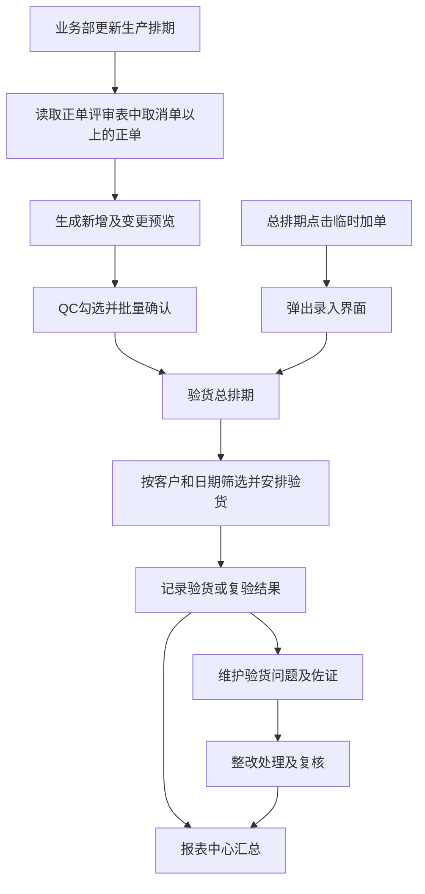

# QC验货运营中心业务需求

版本：V1.0 整理稿

整理日期：2026年9月16日

依据：用户提供的《QC完整业务流程.docx》正文、流程图和报表示例，以及本次对话中明确的业务调整。

本文用于统一 QC 验货运营中心的业务流程、页面职责、数据来源和验收标准。系统围绕“验货总排期、验货执行、问题处理、报表汇总”组织工作，使同一笔验货业务能够从安排到结果、问题和统计持续追踪。

本文是目标需求，不代表所列功能已经全部上线。原文中的 AI 构想已按实际业务重新归并；未确定的业务口径集中列在第十二节，不能由系统自行猜测。

## 当前实现范围

本地工作台已替换旧中心页面，入口为“验货总排期、排期明细、问题处理、报表中心”。总排期负责导入和临时加单；排期明细单独打开表格，只列已确认导入且未完成验货的订单，保留待安排日期项，自动排除已完成或已取消项。临时单与历史记录通过“全部验货记录”查询，不删除原记录。独立表格默认查看北京时间当天，按计划验货日期一天一个区块，支持前后一天、日期范围、全部日期和待安排日期视图；同一天不拆分页。已实现客户、日期、状态和机构组合筛选、跨业务周查看和勾选批量填写验货结果，临时加单弹窗、调整排期弹窗，以及导入预览的跨页勾选、筛选全选、保留原值、明确跳过和分段确认。未勾选项保留待处理，可重新读取已有批次继续确认。报告改名前端页面与调用入口已移除，历史业务数据和附件保留。

验货／复验、问题登记和 XLSX 报表继续使用现有持久化业务接口。本文其他目标（例如客户配置页面、新报表排版与排序、仅行验问题镜像、外部原件归档）不因此视为全部完成；待确认的业务口径仍见第十二节。以上为本地实现范围，不等同于生产部署。

## 一 已明确的调整

| 事项 | 本次确定的要求 |
| --- | --- |
| 生产排期来源 | 只识别“正单评审表”中“取消单”分界以上的正单；该部分就是未走货订单 |
| 其他 Sheet | 接单表、ITEM 表和其他 Sheet 不作为此次导入来源，取消单及其以下内容不导入 |
| 批量导入 | 预览后允许勾选多条订单并批量导入，不必逐条点击确认 |
| 临时加单 | 合并到“验货总排期”，作为可选操作；点击后单独弹出录入界面，不再设置独立导航页面 |
| 排期明细 | 单独打开表格，只记录已确认导入且未完成验货的排期；已完成、已取消和临时单不混入，历史记录另行查询 |
| 客户筛选 | 验货总排期可按各客户筛选，既能查看全部客户，也能只查看指定客户 |
| 报告改名 | 从本中心的功能范围和导航中取消 |

## 二 业务范围和页面组织

### 2.1 页面结构

| 页面 | 主要用途 | 主要操作 |
| --- | --- | --- |
| 验货总排期 | 集中查看未走货订单及已安排的验货任务 | 导入排期、筛选各客、勾选批量导入、临时加单、调整排期、进入验货详情 |
| 验货详情 | 查看一笔任务并记录历次验货、复验和结果 | 填写执行信息、查看问题摘要、关联佐证和报告 |
| 验货问题 | 统一维护验货问题及其处理过程 | 填写问题、上传佐证图片、指定责任人、记录整改与复核 |
| 报表中心 | 从已确认的数据生成统计与明细 | 选择厂区、客户、周期、报表类型，预览和导出 |
| 客户配置 | 维护 QC 使用的客户及常用业务信息 | 维护客户、常用验货机构、香港跟客、适用排序规则 |

“验货详情”由总排期中的订单进入。“临时加单”使用总排期上的弹窗入口。不同客户的验货排期使用同一套页面和数据，通过筛选查看，不重复建设客户专用系统。

### 2.2 参与人员

| 角色 | 业务职责 |
| --- | --- |
| 业务部 | 提供更新后的生产排期，解释合同、PO、货号、数量、走货期等来源信息 |
| QC人员 | 核对导入内容，安排验货，录入执行结果，维护问题及佐证 |
| QC主管或经理 | 检查排期和问题处理，维护客户配置，复核本厂报表 |
| 生产部门及责任人 | 提供问题原因、整改措施、完成时间及验证材料 |
| 香港跟客或业务跟单 | 协调客户、出货、验货机构及异常处置 |
| 集团授权人员 | 查看授权范围内的跨厂汇总 |

所有业务记录归属具体厂区。客户筛选不能扩大厂区权限；集团汇总需要单独授权。

## 三 整体业务流程

三个阶段各有明确产出：

1. **验货前**：形成可追溯的订单与验货安排，识别并确认来源变更。
2. **验货中**：记录每次实际验货、结果及问题，保留复验历史。
3. **验货后**：跟踪问题处理，从同一套记录生成客户、本厂和集团报表。

## 四 验货总排期

### 4.1 页面布局

页面顶部放置厂区、客户、日期和状态筛选；其下是导入生产排期、临时加单、导出当前排期等操作；主体为排期表。导入预览在当前工作区展开，避免为每一条变更连续弹窗。

总排期至少展示以下内容：

| 分类 | 字段 |
| --- | --- |
| 识别信息 | 系统验货单号、客户、销售合同号、客户PO、客户货号、产品名称 |
| 数量信息 | 订单数量、装箱资料、箱数 |
| 计划信息 | 走货期、计划验货期、行验或客验、计划验货机构、生产部门、香港跟客 |
| 执行信息 | 实际验货日期、最新验货结果、是否复验、当前进度 |
| 问题信息 | 是否存在问题、问题摘要、处理状态 |
| 来源信息 | 排期导入或临时加单、原文件、Sheet、原始行号、最近更新时间 |

客户、零售商或市场、出口国分别表达不同信息。例如 BUZZBEE 与 WMU/WMC 不能在统计时不加区分地当作同一层级客户；“国家标准”也不能直接充当出口国。无法唯一确定客户归属时显示待确认，不按文件名或简称暗自归类。

### 4.2 客户及其他筛选

- 客户筛选默认提供“全部客户”，支持搜索并选择指定客户；切换后列表和数量统计同步变化。
- 客户选项来自当前厂区可见的客户资料及相关历史记录，不能只写死几个示例客户。
- 支持按计划验货日期、实际验货日期、走货日期分别筛选，界面必须标明当前使用哪一种日期。
- 支持按业务周、行验或客验、验货机构、待安排或待验或已验、是否有问题筛选。
- 关键词可查合同号、PO、货号、产品名称和系统验货单号。
- 客户、日期和状态条件可组合；页面显示当前筛选条件，并提供清除筛选。
- 导出当前排期时沿用当前筛选条件，并在导出文件中注明范围。

**导入范围与排期筛选分开处理**：正单评审表中的未走货订单可以跨多周，不能因页面当前业务周不同而在读取文件时静默丢弃。导入后再由 QC 根据走货期和计划验货期筛选、安排。有客户指定验货日期时优先按该日期排期；客户验货日期为空时按走货日期排期，并标明“按走货日期排期”。两者都为空才进入“待安排”。计划验货日期筛选、排序、待安排数量和新生成的排期报表使用同一规则。

### 4.3 每日排期与批量登记

- 默认查看当天，按有效计划验货日期一天一个独立表格，日期标题醒目；可切换前后一天或回到今天。
- 日期范围与全部日期视图仍按天分块，逐批展开日期，不把同一天的订单拆到不同页。无任何日期的订单通过“待安排日期”单独查看。
- 每个日期区块可整天勾选，也可逐条勾选或全选当前筛选结果。全选筛选结果包含尚未展开的日期，按钮旁明确显示总数；切换日期或其他筛选条件时清空勾选。
- “批量填写验货结果”弹窗列出所选订单，共同填写实际验货日期、结果、验货员、登记说明及新记录验货类型。结果或日期不同的订单分批处理；结果不预设为通过。
- 无已有记录的订单创建验货事件；已有待验事件沿用其类型及明细，只登记本次填写的结果等资料。未填写的抽样、实检数量、缺陷和处置不凭订单数量推断。
- 提交检查厂区权限与订单版本，已完成、已取消或被其他人更新的订单提示核对。逐条显示成功或失败，重试复用原请求，成功项不重复提交。成功后从待验表移出，历史记录与异常问题继续保留。

### 4.4 排序规则

各报表和页面的排序用途不同，不能统一成一种顺序：

| 场景 | 排序要求 |
| --- | --- |
| 每周验货排期 | 区分行验和客验，行验在前、客验在后；各区内按验货日期查看 |
| 普通客户排期 | 不人为设置客户优先等级；保留清晰、稳定的日期与原始行顺序 |
| DICKIE排期 | 货号去除显示空格后，取前五位之后的四位数字排序；保留原货号显示，例如 `20 374 2018` 排在 `20 374 2019` 前 |
| 客户行验台账 | 按客户分类，在年度内按实际验货时间持续累积 |
| 每周统计及华兴明细 | 客验在前、行验在后，各区内按实际验货时间排列 |

DICKIE 货号不符合约定格式时提示核对，不能截错位或丢弃该条记录。业务日历和周末订单归属按第十二节确认。

## 五 生产排期导入和批量确认

### 5.1 读取边界

1. 只定位名为“正单评审表”的 Sheet。
2. 找到表头和独立的“取消单”分界行，只读取分界以上的正单。
3. 当前模板订单类型以“正单”“正式PO”识别；空行、备料单、说明和小计不作为正式订单。
4. 不读取其他 Sheet，也不继续读取取消单、已走货及其后区域。
5. 缺少指定 Sheet、订单类型或明确分界时，给出可操作的错误提示，不改用其他表代替。
6. 支持现有 XLS、XLSX、XLSM 文件范围，单文件上限沿用 35 MB。

合同号、PO、货号按文本保存，保留前导零。数量保留精度，装箱资料允许原有文本形式；来源中的合计、数量、箱数不能互相替代。

### 5.2 生成差异预览

导入先生成预览，不立即创建或覆盖验货单。每行显示来源 Sheet 和行号、主要业务字段、已有值与新值的差异，以及能否导入的原因。

| 预览结果 | 处理方式 |
| --- | --- |
| 未找到对应任务 | QC可选择创建新验货单 |
| 找到一个待处理候选且字段变化 | 显示前后值，QC选择更新或保留 |
| 找到多个候选 | 必须人工选择正确任务或暂不处理，不自动覆盖 |
| 与原任务一致 | 标识无变化，不重复创建 |
| 字段缺失或含义不明确 | 提示需核对，补正重新预览或明确跳过 |

合同号和货号用于寻找候选，不能作为验货单的唯一身份。同一合同和货号可能分批、分次验货，每笔验货单有独立编号，实际结果和问题按具体任务及验货记录关联。

### 5.3 勾选批量导入

预览提供逐行复选框、全选当前可导入项、取消选择和“导入所选”按钮，并显示已选数量、将新增数量、将更新数量及需核对数量。

- 用户可选择部分订单，也可一次选择全部有效订单。
- 新增和更新必须在按钮旁明确区分，不能把“批量导入”暗中变成覆盖全部旧数据。
- 更新操作保留每行的差异信息，允许改为保留原值。
- 校验不通过的记录不能随全选直接入库；多候选记录必须先明确目标。
- 未选记录保留待处理，不默认视为跳过，不要求先处理完所有异常才能导入有效订单。
- 有搜索或客户筛选时，“全选”仅作用于界面标明的范围，不能悄悄选中筛选外记录。
- 提交期间防止重复点击；同一批次已成功处理的行不能再次重复导入。
- 处理后显示成功数量、剩余数量及失败原因，已确认内容可追溯到操作人和时间。

### 5.4 更新排期时的约束

每周重新导入时，重点提示走货期、计划验货期、PO、数量和产品信息变化。QC 确认后才更新相应字段。

已有明确客户验货日期时，走货期变化不覆盖该日期。客户验货日期为空时，排期随走货日期变化，不回填或覆盖原始客户日期；两者都为空才保留待安排。出现非空的 `9/21-10% 10/23-80%` 等分阶段说明时展示原文，具体如何建立多次验货由 QC 确认。已有验货结果、问题、复验和报告不能被新排期覆盖。

## 六 临时加单弹出界面

### 6.1 操作入口

在验货总排期操作区提供“临时加单”。仅有权限的人员可以操作，点击后打开独立弹窗或侧边抽屉；保存或取消后返回原排期，保留原筛选条件和浏览位置。

临时加单不再占用独立导航入口。它用于处理尚未进入业务部正式排期、但需要 QC 安排验货的订单。

### 6.2 表单内容

| 字段组 | 内容及规则 |
| --- | --- |
| 业务归属 | 厂区、客户；默认带入当前厂区，客户可从有权使用的选项中选择 |
| 订单身份 | 合同号、客户PO、客户货号；PO按现有业务约束为必填，不能用合同号自动代填 |
| 产品与数量 | 产品名称、数量、装箱资料、箱数；数量必须有效 |
| 验货计划 | 行验或客验、计划验货日期、走货日期、验货机构 |
| 协作信息 | 生产部门、香港跟客、出口国或市场、加单原因及备注 |

具体必填项沿用已批准的主单校验；确需放宽时单独确认，不能以临时加单为由绕过。常用机构和跟客可以从客户配置提供建议值，保存前必须可见、可修改。

### 6.3 保存及异常处理

- 校验失败时保留已填写内容，并在对应字段说明原因。
- 保存前提醒可能重复的合同、PO及货号组合，不能静默合并已有验货任务。
- 保存成功后生成独立验货单号，来源标为“临时加单”，记录创建人、时间和原因。
- 新记录符合当前筛选条件时显示在总排期；不符合时提示已保存及其归属，并提供查看入口，不能让用户误以为保存失败。
- 临时单后续出现在正式排期中时，作为候选提示关联或更新，保留原加单来源与历史，不自动生成重复单。

从剪贴板智能分列、批量手工加单可作为后续优化；本轮优先完成清晰可靠的单单弹窗录入。

## 七 验货执行和复验

### 7.1 记录每次实际验货

QC 从总排期进入验货详情，填写实际验货日期、行验或客验、机构、人员、验货数量、结果、备注及适用佐证。

计划与实际分别保存。延期或提前调整计划时不改写已经发生的验货；复验新增一次执行记录，不覆盖初验。一个任务可以有多次执行记录，问题应关联具体发生的那次验货。

### 7.2 区分结果和业务处置

- 待验货是进度，不是“不合格”。
- PASS、FAIL、有条件通过等是验货结论。
- 退货、返工、AOD、让步接收等是明确的业务处置，需要记录依据、数量、责任人和处理结果。
- 不合格不自动等于退货，有条件通过不自动等于 AOD。
- 取消验货需保留取消原因，不能仅因取消就统计为一次实际验货或退货。

状态名称及处置审批责任需要与实际业务统一；未经确认，不新增复杂审批层级。

## 八 验货问题及处理

### 8.1 唯一录入入口

“验货问题”页面是问题描述、退货原因、整改措施、责任人和处理结果的统一维护入口。验货详情和排期可以提供“登记问题”入口，但应打开同一份问题记录，不另存一份相同问题。

总排期和报表中的问题摘要由问题记录生成，保持只读；不能在三处分别填写互不一致的问题文字。

### 8.2 发现和回显问题

- 已提交的不通过结果进入需核对的问题列表，由 QC 补齐实际描述。
- PASS 也可能存在需要记录的问题，允许 QC 主动登记。
- 不因记录还处于待验状态而自动生成质量问题。
- 按原业务要求，行验记录只要存在问题，就应在排期中回显问题摘要，不以 PASS 或 FAIL 决定是否回显。
- 客验问题保存在对应验货记录和问题页面，不自动回填到总排期；按原文规则，总排期的问题摘要仅回显行验问题。

回显使用系统验货单及执行记录的关联关系，不能只凭合同号和货号把问题同步到多个不相关任务。

### 8.3 问题字段及闭环

问题至少包含客户、合同、PO、货号、产品、发生日期、对应验货记录、问题分类、描述、佐证图片、责任部门、第一责任人、第二责任人、退货或返工等处置、整改措施、完成期限、复核结果和当前状态。

建议的最小处理流程为“待补充 → 待处理 → 待复核 → 已关闭”。退回继续整改时保留前一次处理记录；关闭需要记录复核人、时间和结论。

同一次问题可以有多张图片或多次补充；同一任务可以存在多个不同问题，不能被强制合并为一条。

## 九 报表中心

### 9.1 生成原则

报表直接读取同一套验货任务、执行和问题数据。文件1至文件5是不同查看角度，不要求先导出文件1再人工复制到文件2或后续表。

报表页面展示厂区、客户和期间条件。预览使用最新已确认数据；已经导出的正式版本保留当时内容，后续修正生成新版本，并记录生成时间、生成者和数据范围。

### 9.2 五类核心报表

| 报表 | 汇总范围和排列 | 特殊要求 |
| --- | --- | --- |
| 文件1 客户验货汇总 | 当年客验按实际验货时间汇总；行验按客户分类并在年度内持续累积 | 可按客户查看从年度第一单到最新一单；日期表达统一、易查 |
| 文件2 每周统计 | 按月分类，再按周汇集；客验在前、行验在后，各区按实际时间排列 | 每周第一天的第一条记录标黄，明确每周起点 |
| 文件3 华兴明细 | 本厂按周列出逐单验货明细；客验在前、行验在后 | 原 O 列“验货问题”改为“备注”；每周表下附厂区验货数据统计表 |
| 文件4 华兴聚合 | 从华兴明细按周汇总，采用厂区验货数据统计表结构 | “香港跟客”调整为“第一责任人／第二责任人”；“客人未退货由工厂自行”调整为“处理明细” |
| 文件5 集团汇总 | 按周、厂区及客户汇总，在授权范围内展示 | 不保留第一／第二责任人和处理明细列，改为“香港跟客” |

原文规定华兴周明细按五个工作日组织。周起止、调休及周末发生的验货如何归属，应先统一口径；不能漏掉周末记录。

### 9.3 其他业务报表

保留原资料中的每日验货表、每周验货问题统计表、全年验货统计、客户验货总结和产品质量汇总需求。能从相同数据生成的报表不重复录入。

产品质量汇总按客户、货号和产品名称查询，单条问题保留序号、图片、描述、发生日期及来源。原资料的分类包括：客户投诉与客验问题、啤机、喷油、来料、装配、包装资料、QA测试。

这些生产过程和 QA 资料可能来自其他部门。只有已确认来源和责任边界的数据才能纳入本中心汇总，不能据此自动把所有部门的质量业务都划给 QC。

### 9.4 统计口径

| 指标 | 必须明确的口径 |
| --- | --- |
| 验货单数 | 按系统验货单统计，不能等同于 Excel 行数 |
| 实际验货次数 | 按已完成的执行记录统计，初验与复验分别可查 |
| 合格率 | 说明是否包含复验、有条件通过及取消记录，分子分母使用同一范围 |
| 问题数量 | 区分问题条数、涉及验货单数和涉及客户数 |
| 退货次数与数量 | 以明确退货处置为依据，不用 FAIL 数量替代 |
| 客户及集团汇总 | 保持厂区、客户、期间和计数单位一致，避免重复累加 |

尚未确定的指标先展示基础明细，不发布未经确认的比例结论。

## 十 数据一致性和历史保留

| 信息 | 维护来源 | 其他页面的使用方式 |
| --- | --- | --- |
| 合同、PO、货号、数量、原始日期 | 生产排期导入或有权限的人工更正 | 总排期与报表引用确认后的值 |
| 临时加单内容 | 总排期弹出表单 | 与正式导入任务共用后续流程，保留来源区别 |
| 实际验货及结果 | 每次验货执行记录 | 回显最新状态，统计时保留历次记录 |
| 问题、整改及处理结论 | 验货问题记录 | 排期只读回显，报表按范围汇总 |
| 客户默认机构及跟客 | 客户配置 | 新录入时建议带入，不追溯改写历史记录 |
| 报表 | 已确认的业务记录 | 保留每次导出的版本和范围 |

源文件保持原样。导入应保留文件摘要、Sheet、行号、字段来源、确认人和时间。更改走货期、数量、结果或问题处理时记录原值、新值、原因和操作者。

已有验货、问题或报表关联的任务，不能通过简单删除抹掉历史。移除误加任务时按其业务状态采用取消或留痕处理。原文的“拖拽排序”“批量删除”“Ctrl+Z撤销”不作为本轮默认承诺，需在明确权限和历史保护方式后另行设计。

## 十一 实施顺序和验收标准

### 11.1 建议顺序

1. **统一总排期入口**：按客户筛选、固定正单评审表读取范围、预览勾选及批量导入、临时加单弹窗。
2. **统一执行与问题**：计划与实际分开，保留初验和复验，问题单点维护并回显。
3. **统一报表口径**：先完成五类核心报表，再整理每日、全年和质量汇总。
4. **后续便利功能**：剪贴板辅助录入、批量手工加单、受控的排序与撤销等，经业务确认后实施。

### 11.2 主要验收场景

| 场景 | 预期结果 |
| --- | --- |
| 一个文件含接单表、ITEM 表及正单评审表 | 只取正单评审表中取消单以上的正单 |
| 分界以下仍有正式PO行 | 不导入取消及已走货区域 |
| 缺少取消单分界 | 明确报错，不扫描其他表凑数据 |
| PO或货号有前导零 | 预览、保存和导出均保持一致 |
| 勾选部分有效订单批量导入 | 只处理所选内容，未选及异常项继续待处理 |
| 有效项与异常项混在同一批次 | 可以先导入已选有效项，不自动跳过或导入异常项 |
| 已有任务走货期变化 | 显示前后值，经确认后更新，历史结果不变 |
| 同一合同和货号存在多个验货任务 | 要求指定目标，不自动覆盖 |
| 重复提交同一批次已处理行 | 不产生重复任务或重复修改 |
| 总排期选择一个客户 | 列表、数量及当前排期导出使用相同客户范围 |
| 点击临时加单 | 弹出独立录入界面，保存后返回原筛选状态 |
| 新增临时单不符合当前筛选 | 提示保存成功及归属，提供查看入口 |
| PASS但行验存在问题 | 问题可登记，并在排期回显 |
| 初验失败后复验通过 | 两次记录均保留，不能覆盖初验 |
| 验货不通过但未退货 | 不进入退货统计 |
| 不同厂区有相同合同和货号 | 不串数据，不越权查看和修改 |
| 使用导航和操作菜单 | 临时加单在总排期中，报告改名不再作为业务入口 |

## 十二 需要确认的业务口径

以下事项不影响本次已明确的页面调整，但会影响后续数据安排和报表准确性，应在对应功能实施前确认。

1. **业务周**：五个工作日如何确定，调休和周末验货归哪一周。
2. **客户层级**：BUZZBEE 等业务客户与 WMU/WMC 等市场或零售商的对应关系，由谁维护及确认。
3. **行验与客验**：具体判定依据及默认值来源，不能只凭机构名称猜测。
4. **分阶段验货**：多日期及比例说明如何拆成执行计划，比例对应订单数量还是检查范围。
5. **缺少PO的正式订单**：继续补齐后导入，还是允许特定例外；未确认前沿用现有必填规则。
6. **合格率与退货率**：初验、复验、有条件通过及取消记录的计入方式，分母按单数、次数还是数量。
7. **责任人及处理明细**：谁负责填写、复核，和香港跟客是否允许为同一人。
8. **其他部门质量记录**：啤机、喷油、来料和 QA 等资料是只引用汇总，还是需要在本中心录入。

## 十三 原文构想的整理结论

| 原文内容 | 整理后的处理 |
| --- | --- |
| 三阶段业务流程 | 保留，按总排期、执行、问题、报表划清页面职责 |
| 合同号加货号作为唯一键 | 改为候选匹配，正式关联使用系统验货单及执行记录 |
| 逐项弹窗确认全部变更 | 改为集中预览，支持勾选批量处理，保留逐项核对能力 |
| 临时订单独立功能 | 移到总排期内，通过弹出表单添加 |
| 问题统计表单点录入 | 保留，同一记录在排期和报表只读回显 |
| 一张主单对应一条问题 | 调整为一笔任务可有多次验货及多个问题，防止遗漏或覆盖 |
| 非PASS或非空问题自动归入问题统计表 | 明确只处理已提交的验货结果，排除待验状态；问题与退货处置分别记录 |
| 文件1至文件5汇总链路 | 延续系统自动聚合的方向，明确各报表从统一业务记录生成，并保留各自展示口径 |
| 剪贴板识别、拖拽、批量删除及撤销 | 作为后续便利功能，不混入当前已确认的核心需求 |

本地已实现的范围见文档开头说明；其余报表和目标功能仍需逐项实施与验收。需求目标或本地验证不能作为生产环境已上线证明。
