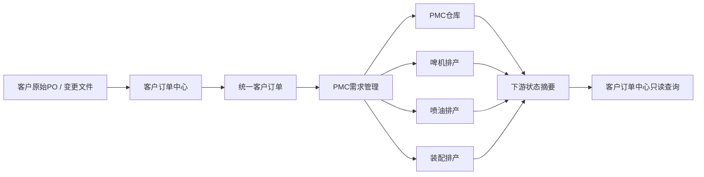
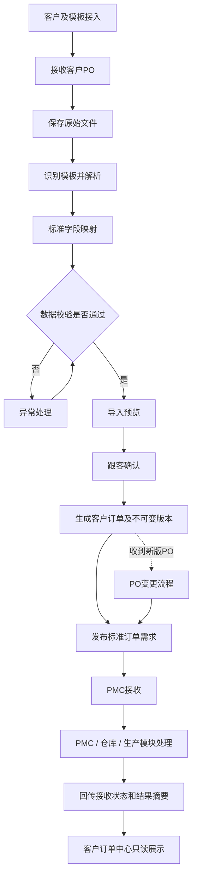
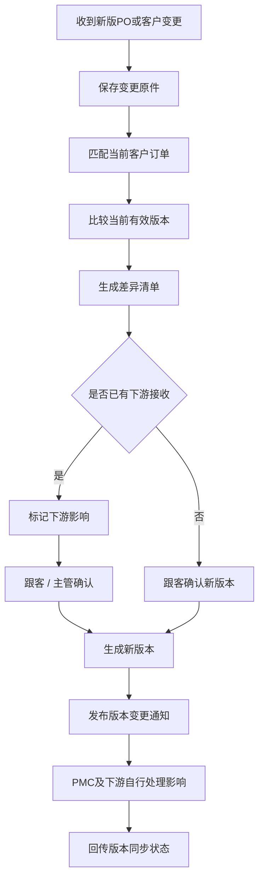
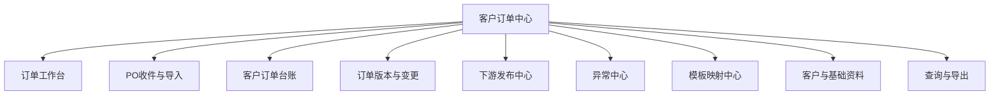

# 客户订单中心业务流程与需求说明书

> 文档版本：V2.1
> 文档状态：正式业务方案
> 正式名称：客户订单中心
> 原名称：PO入排期、订单交付中心
> 更新日期：2026-07-27
> 当前阶段：BuzzBee PO解析、17字段确认与真实客户排期导出已进入基础试用；订单持久化和下游接口尚未实施
> 替代文档：本文档取代《订单交付中心业务流程与需求说明书》
> 后续实施：见《[客户订单中心后续实施规划](./customer-order-center-next-steps-plan.md)》

## 1. 文档目的

本文档用于明确“客户订单中心”的业务定位、数据边界、完整流程、功能范围及与 PMC仓库、啤机排产、喷油排产、装配排产等后续模块的协作方式。

本次调整的核心是：

> 客户订单中心只负责客户订单原件、标准订单数据、数据确认、版本变更和向下游供数，不负责库存执行、生产排产和走货执行。

客户订单中心不是单纯的文件仓库，而是公司客户需求的唯一可信数据源。

BuzzBee 基础试用允许同一批选择多份客户 PO，并与一份当前客户排期共同解析。所有确认通过的订单行合并写入一份输出排期的接单表、正单评审表及对应的子弹枪/水枪 ITEM 表订单行；存在同货号备料单时，ITEM 兼容输出会在 H 列原公式或数量后直接减去本合同数量，但不自动补 3000，也不新增样板/备料行。下载文件保持上传排期的原文件名，但处理过程不直接修改或覆盖上传原件。

## 2. 正式名称与模块说明

模块正式名称确定为：

# **客户订单中心**

模块说明文案建议使用：

> 统一接收、校验和沉淀客户PO，为PMC、仓库及各生产排产模块提供标准订单需求数据。

模块卡片建议展示：

- 待解析；
- 待确认；
- 异常待处理；
- 已发布订单；
- 变更待同步。

模块能力标签建议使用：

- PO接收；
- 数据校验；
- 订单主数据；
- 版本管理；
- 下游供数。

## 3. 产品定位

客户订单中心是公司业务订单的源头系统，承担三层职责：

### 3.1 原始资料层

完整保存客户原始 PO、历史排期、PO变更文件及其来源信息。

### 3.2 标准订单层

将不同客户、不同跟客、不同格式的 PO 转换为统一的客户订单、订单明细和交付需求数据。

### 3.3 数据服务层

将确认后的标准订单需求提供给：

- PMC；
- 仓库；
- 啤机排产；
- 喷油排产；
- 装配排产；
- 后续其他生产或管理模块。

下游模块可以回传处理状态供查询，但不在客户订单中心直接维护库存、排产和生产执行数据。

## 4. 为什么不能只保存原始文件

如果客户订单中心只保存原始 Excel，下游模块仍然需要分别处理四五十个客户的不同格式，会造成：

- PMC重复解析客户PO；
- 啤机、喷油、装配使用不同数量口径；
- 同一PO变更后各模块版本不一致；
- 无法稳定关联原始PO与生产任务；
- 重复导入和漏单难以发现；
- 无法知道哪个版本是当前有效版本。

因此，客户订单中心必须同时保留：

1. 原始文件；
2. 标准化订单数据；
3. 人工确认结果；
4. PO版本历史；
5. 下游发布和接收记录。

## 5. 总体业务架构

推荐的正式数据链是：

1. 客户订单中心发布客户成品需求；
2. PMC判断库存满足情况和生产需求；
3. PMC根据产品结构和工艺路线形成各部门生产需求；
4. 啤机、喷油、装配模块根据 PMC 下发的需求进行排产；
5. 下游将接收状态、完成摘要和异常结果回传；
6. 客户订单中心只读展示，不代替下游执行。

生产模块可以查询原始PO和客户要求，但不应各自从原始文件重新解析订单。

## 6. 模块职责边界

### 6.1 客户订单中心负责

- 客户资料和负责跟客；
- 原始 PO 文件保存；
- 历史排期原表保存；
- 输入模板管理；
- 字段映射；
- PO解析；
- 数据校验；
- 重复判断；
- 跟客确认；
- 统一客户订单主数据；
- PO明细和客户交付需求；
- PO版本管理；
- PO变更识别；
- 客户特殊字段保留；
- 标准订单查询和导出；
- 向下游发布确认订单；
- 向下游发布PO变更；
- 下游接收状态查询；
- 来源追溯和操作审计。

### 6.2 客户订单中心不负责

- 成品库存计算；
- 库存占用、释放和扣减；
- 原材料和半成品库存；
- BOM展开；
- PMC需求拆分；
- 生产工厂分配；
- 机台、产线和人员排产；
- 啤机排产；
- 喷油排产；
- 装配排产；
- 生产报工；
- 实际生产数量维护；
- 走货执行；
- 仓库出入库；
- 订舱、装柜、报关和物流；
- 财务应收、开票和收款。

### 6.3 可以查询但不能维护

客户订单中心可以读取并展示下游回传的摘要，例如：

- PMC是否已接收；
- 库存是否可满足；
- 需要生产的数量；
- 啤机任务状态；
- 喷油任务状态；
- 装配任务状态；
- 生产是否存在延期风险；
- 已走货数量；
- 下游使用的PO版本。

这些数据的业务所有权仍属于对应下游模块。

## 7. 数据所有权矩阵

| 数据或动作 | 权威模块 | 客户订单中心权限 |
| --- | --- | --- |
| 客户原始PO | 客户订单中心 | 保存和读取 |
| PO标准字段 | 客户订单中心 | 新增、确认、版本管理 |
| 客户要求数量 | 客户订单中心 | 维护有效版本 |
| 客户要求交期 | 客户订单中心 | 维护有效版本 |
| 客户目的地和交付要求 | 客户订单中心 | 维护有效版本 |
| 客户PO变更 | 客户订单中心 | 识别、确认、发布 |
| 产品BOM | 工程或PMC主数据 | 只读引用 |
| 库存数量 | PMC仓库 | 只读摘要 |
| 库存占用和扣减 | PMC仓库 | 不可操作 |
| 生产需求拆分 | PMC | 只读摘要 |
| 啤机排产 | 啤机排产模块 | 只读摘要 |
| 喷油排产 | 喷油排产模块 | 只读摘要 |
| 装配排产 | 装配排产模块 | 只读摘要 |
| 生产实际完成量 | 对应生产模块 | 只读摘要 |
| 仓库出入库 | PMC仓库 | 只读摘要 |
| 实际走货 | PMC仓库或走货模块 | 只读摘要 |

## 8. 业务角色与职责

| 角色 | 主要职责 |
| --- | --- |
| 跟客 | 上传PO、处理解析结果、确认订单、发起和确认PO变更 |
| 业务主管 | 处理重大数据异常、审核高风险变更、监督订单数据质量 |
| 模板管理员 | 建立、测试、发布和停用客户映射模板 |
| 客户资料管理员 | 维护客户、跟客归属和客户字段配置 |
| PMC | 接收确认订单，形成库存及生产需求 |
| 仓库 | 在仓库模块维护库存和出入库，回传摘要 |
| 生产计划 | 在对应生产模块接收PMC任务并排产 |
| 系统管理员 | 管理权限、数据接口、基础配置和异常规则 |
| 管理层 | 查看接单、异常、变更和下游接收情况 |

## 9. 核心业务对象

| 业务对象 | 说明 |
| --- | --- |
| 客户 | 客户订单的业务归属 |
| 负责跟客 | 客户或订单的内部责任人 |
| 模板家族 | 多个相似客户可复用的基础映射规则 |
| 客户模板 | 某客户特有的PO格式及版本 |
| 原始文件 | 客户提供的PO、历史排期或变更文件 |
| 导入批次 | 一次上传、解析、校验和确认的完整过程 |
| 客户订单 | 一张客户PO在系统中的稳定业务身份 |
| 订单版本 | 客户订单某一次确认后的不可变版本 |
| 订单明细 | 款号、颜色、尺码和数量等明细 |
| 交付需求 | 客户要求的数量、日期、目的地和交付方式 |
| 客户扩展字段 | 客户特有但标准字段未覆盖的信息 |
| 订单变更 | 新旧版本之间的差异及确认记录 |
| 下游发布记录 | 某个订单版本向哪些模块发布、何时发布 |
| 下游接收状态 | 下游是否已接收及使用哪个订单版本 |
| 异常记录 | 导入、映射、校验或同步问题 |
| 操作日志 | 用户对订单和模板执行的重要操作 |

## 10. 标准订单数据范围

### 10.1 订单单头

建议至少包含：

- 内部客户订单ID；
- 客户；
- 业务归属工厂或业务主体；
- 负责跟客；
- 客户PO号；
- 客户PO版本；
- PO日期；
- 接收日期；
- 系统确认日期；
- 币种；
- 订单备注；
- 当前有效状态；
- 原始文件；
- 当前版本。

### 10.2 订单明细

建议至少包含：

- 内部订单明细ID；
- 客户款号；
- 公司款号；
- 产品或SKU；
- 颜色；
- 尺码；
- 单位；
- 当前确认数量；
- 取消数量；
- 当前有效数量；
- 客户明细备注；
- 客户特殊属性。

### 10.3 客户交付需求

同一订单明细可以存在多个客户交付需求：

- 客户要求日期；
- 要求数量；
- 目的地；
- 走货方式；
- 收货方；
- 客户批次号；
- 特殊包装或交付要求。

客户交付需求只表达客户的要求，不表达工厂生产计划。

### 10.4 来源追溯

每条标准数据必须记录：

- 原始文件ID；
- 原始文件名；
- Sheet名称；
- 原始行号；
- 原始客户字段值；
- 映射模板及版本；
- 导入批次；
- 确认人和确认时间。

## 11. 端到端主流程

## 12. 详细业务流程

### 12.1 阶段一：客户及模板接入

#### 12.1.1 触发条件

- 新客户首次接入；
- 原有客户首次使用系统；
- 客户PO格式发生变化；
- 原模板无法继续识别。

#### 12.1.2 操作步骤

1. 建立客户资料；
2. 设置业务归属和负责跟客；
3. 收集典型PO、新版PO、变更PO和说明文件；
4. 判断是否可以复用已有模板家族；
5. 配置Sheet、标题行和字段映射；
6. 配置必填字段、默认值和字典转换；
7. 配置重复判断和版本判断规则；
8. 使用样例文件进行试解析；
9. 核对数量、明细和客户要求日期；
10. 发布客户模板版本。

#### 12.1.3 模板规则

- 模板修改必须形成新版本；
- 已完成导入继续引用历史模板版本；
- 列结构明显变化时不得静默使用旧模板；
- 客户特殊规则不得污染公共模板；
- 临时映射只用于本次导入；
- 正式模板必须由模板管理员发布。

### 12.2 阶段二：历史排期初始化

历史排期表可以作为资料入口，但只提取客户订单需求数据。

#### 12.2.1 原表处理

- 完整保存客户原始排期文件；
- 提取PO号、款号、颜色、尺码、订单数量和客户交期；
- 已走货、库存和生产数据保留为历史参考快照；
- 历史库存不进入客户订单主数据；
- 历史生产排期不进入客户订单主数据；
- 历史走货不由客户订单中心持续维护。

#### 12.2.2 上线切点

- 切点以前的数据标记为“历史初始化”；
- 切点以后的订单必须通过原始PO导入；
- 无法追溯原始PO的历史数据必须带来源说明；
- 只有完成核对的在手订单才能发布给PMC。

### 12.3 阶段三：客户PO接收

#### 12.3.1 V1入口

- 跟客选择客户；
- 上传Excel PO；
- 填写必要的来源说明；
- 系统生成导入批次。

后续可以扩展邮件附件和客户平台接口，但不属于V1必需能力。

#### 12.3.2 原始文件处理

系统必须：

- 原样保存文件；
- 计算文件唯一指纹；
- 记录上传人和上传时间；
- 记录客户和跟客；
- 检查文件是否重复；
- 不允许解析失败影响已有正式订单。

### 12.4 阶段四：模板识别与解析

系统根据以下信息识别模板：

- 客户；
- 文件类型；
- Sheet名称；
- 标题行；
- 关键列名称；
- 模板特征；
- 已发布模板版本。

识别结果分为：

- 已准确识别；
- 可能匹配，需要确认；
- 未识别，需要配置；
- 模板疑似发生变化。

### 12.5 阶段五：字段映射

映射能力应支持：

- 单列映射到标准字段；
- 多列合并；
- 单列拆分；
- 固定值和默认值；
- 日期、数字和文字格式转换；
- 客户款号与公司款号对照；
- 颜色、尺码和单位字典；
- 空白行、合计行和说明行排除；
- 客户特殊字段保留；
- 原始值与转换值同时追溯。

映射结果进入临时解析区，不能直接进入正式订单。

### 12.6 阶段六：数据校验

#### 12.6.1 必填校验

至少校验：

- 客户；
- 客户PO号；
- 产品识别字段；
- 数量；
- 客户要求日期；
- 客户要求的颜色、尺码或其他明细。

#### 12.6.2 数量校验

至少校验：

- PO总数与明细合计；
- 款号合计与颜色尺码明细；
- 数量是否为有效正数；
- 取消数量是否超过确认数量；
- 同一交付需求的数量是否超过明细有效数量。

#### 12.6.3 日期校验

至少区分：

- PO日期；
- 接收日期；
- 客户要求日期；
- 系统确认日期。

PMC计划日期、生产日期和走货日期不由本模块维护。

#### 12.6.4 主数据校验

- 客户是否有效；
- 跟客是否有权限；
- 客户款号是否可识别；
- 公司款号是否匹配；
- 颜色、尺码和单位是否符合规则；
- 业务归属是否明确。

#### 12.6.5 重复与版本校验

系统需要判断当前文件属于：

- 全新PO；
- 完全重复文件；
- 同一PO重复内容；
- 同一PO新增明细；
- 同一PO数量变化；
- 同一PO日期变化；
- 同一PO取消或替换；
- 无法确定的新版本。

### 12.7 阶段七：异常处理

校验结果分为：

- 可确认；
- 警告但可确认；
- 必须处理；
- 无法识别；
- 完全重复，无需入单。

异常处理方式：

- 修正字段映射；
- 补充必填值；
- 选择标准款号；
- 设置本次默认值；
- 排除说明或合计行；
- 标记为重复；
- 转入PO变更；
- 暂不导入；
- 退回客户确认。

阻断分为两类：

- **硬阻断**：WM 客的 P/O#、所有客户的合同号、产品编号、数量、装箱数、客要求走货期等订单识别或数量字段缺失，以及非整箱数量；未解决时不得正式确认或导出。BuzzBee 普通客允许 P/O# 为空，但 Contract No. 必须存在。
- **可后补阻断**：跟客掌握但当前客户排期中尚未维护的中文名称、单价HK。跟客可以在预览页逐项勾选“跳过并后补”，导出时对应字段及依赖金额留空，不得自动填 `0` 或历史猜测值。

当前无状态基础试用只记录本次页面选择；订单持久化完成后必须保存跳过人、时间、原因、字段和后补状态。

### 12.8 阶段八：导入预览与跟客确认

确认页面必须展示：

- 新增PO数量；
- 新增明细行数；
- 新增总数量；
- 重复数量；
- 变更数量；
- 异常行数；
- 无法识别行数；
- 客户要求日期分布；
- 本次将生成的订单版本。

跟客确认后：

1. 冻结解析结果；
2. 建立或更新稳定的客户订单身份；
3. 生成不可变订单版本；
4. 生成订单明细；
5. 生成客户交付需求；
6. 记录确认人和时间；
7. 将订单置为可发布状态。

### 12.9 阶段九：标准订单发布

#### 12.9.1 发布对象

标准订单原则上首先发布给PMC。

PMC根据库存、BOM、工艺路线和工厂能力，形成：

- 库存满足计划；
- 成品生产需求；
- 啤机生产需求；
- 喷油生产需求；
- 装配生产需求；
- 其他工序需求。

#### 12.9.2 发布内容

- 客户订单ID；
- 订单版本ID；
- 订单明细ID；
- 客户和客户PO号；
- 公司款号和产品信息；
- 颜色、尺码；
- 当前有效数量；
- 客户交付需求；
- 客户要求日期；
- 目的地和交付方式；
- 客户特殊要求；
- 原始文件追溯信息；
- 发布人和发布时间。

#### 12.9.3 发布规则

- 只有已确认版本可以发布；
- 下游必须记录所接收的订单版本；
- 重复发布同一版本不得重复生成业务数量；
- 新版本发布时必须提示旧版本影响；
- 被取消或失效的版本不得作为新任务来源；
- 下游不得直接修改客户订单主数据。

### 12.10 阶段十：下游接收

下游模块返回：

- 是否已接收；
- 接收人和接收时间；
- 使用的订单版本；
- 是否需要补充资料；
- 是否存在无法处理的数据；
- 是否已经生成下游业务单据；
- 下游业务单据编号。

客户订单中心只记录接收结果，不在本模块完成库存或排产操作。

### 12.11 阶段十一：下游状态摘要

下游可以回传只读摘要：

- PMC处理状态；
- 仓库可满足摘要；
- 各生产模块任务状态；
- 当前主要风险；
- 下游最后更新时间；
- 下游当前使用的PO版本。

客户订单中心仅用于查询和追溯：

- 不允许修改库存；
- 不允许调整生产排程；
- 不允许填写生产实际数量；
- 不允许登记走货；
- 点击详情时应进入对应下游模块。

### 12.12 阶段十二：订单归档与关闭

客户订单中心中的关闭属于客户订单主数据状态，不等于本模块执行完走货。

订单可以关闭的条件建议为：

- 下游反馈全部业务已经结束，或客户已正式取消；
- 无待确认PO变更；
- 无版本同步异常；
- 跟客确认不再发生后续业务。

关闭后：

- 当前版本只读；
- 原始文件和版本历史保留；
- 下游关联记录可继续查询；
- 如客户重新追加，必须形成新版本或新订单。

## 13. PO变更流程

### 13.1 变更类型

- 新增明细；
- 增加数量；
- 减少数量；
- 整单取消；
- 部分明细取消；
- 修改客户要求日期；
- 修改款号；
- 修改颜色或尺码；
- 修改目的地；
- 修改交付方式；
- 拆分或合并客户交付需求。

### 13.2 变更记录

每次变更必须保留：

- 变更原始文件；
- 旧版本；
- 新版本；
- 字段级差异；
- 数量差异；
- 日期差异；
- 变更原因；
- 确认人；
- 确认时间；
- 已发布的下游模块；
- 各下游同步结果。

### 13.3 职责边界

客户订单中心负责说明“客户改了什么”。

下游模块负责判断：

- 库存如何调整；
- 生产需求如何调整；
- 已排产任务如何处理；
- 已生产数量如何处理；
- 已走货数量如何处理。

客户订单中心不替下游作出处理决定，只跟踪下游是否已经使用最新版本。

## 14. 状态体系

### 14.1 导入批次状态

| 状态 | 含义 |
| --- | --- |
| 已上传 | 原始文件已保存 |
| 解析中 | 正在识别模板和解析数据 |
| 待映射 | 未找到可用模板 |
| 待处理异常 | 存在阻断问题 |
| 待确认 | 数据可由跟客确认 |
| 已确认 | 已生成正式订单版本 |
| 已放弃 | 本批次不再入单 |
| 已撤销 | 已撤销本批次业务影响，但保留历史 |

### 14.2 客户订单状态

| 状态 | 含义 |
| --- | --- |
| 待发布 | 已确认但尚未提供给下游 |
| 有效 | 当前有效订单 |
| 变更中 | 新版PO正在确认或同步 |
| 已取消 | 客户已正式取消全部有效需求 |
| 已关闭 | 订单及下游业务已结束 |

### 14.3 下游同步状态

每个下游模块独立记录：

| 状态 | 含义 |
| --- | --- |
| 未发布 | 尚未向该模块发布 |
| 待接收 | 已发布，等待下游确认 |
| 已接收 | 下游已接收当前版本 |
| 待补资料 | 下游要求补充信息 |
| 版本落后 | 下游仍在使用旧版本 |
| 变更处理中 | 下游正在处理新版本影响 |
| 已同步 | 下游已使用最新版本 |
| 同步失败 | 发布或处理出现异常 |

### 14.4 只读下游状态

PMC、仓库和生产状态仅作为摘要显示，不纳入客户订单中心自己的业务状态流。

## 15. 数量口径

客户订单中心只维护客户订单数量口径：

| 数量 | 定义 |
| --- | --- |
| 原始PO数量 | 客户首次PO中的数量 |
| 当前确认数量 | 当前有效版本确认的数量 |
| 取消数量 | 客户已经正式取消的数量 |
| 当前有效数量 | 当前仍然有效的客户需求 |
| 客户交付需求数量 | 按客户日期、目的地或批次拆分的数量 |

基础关系：

`当前有效数量 = 当前确认数量 - 取消数量`

以下数量不由客户订单中心维护：

- 可用库存数量；
- 库存占用数量；
- 生产需求数量；
- 已生产数量；
- 已入库数量；
- 已走货数量。

这些数量由对应下游模块维护，客户订单中心只读取摘要。

## 16. 日期口径

客户订单中心负责：

| 日期 | 定义 |
| --- | --- |
| PO日期 | 客户PO文件上的日期 |
| 接收日期 | 跟客实际收到PO的日期 |
| 上传日期 | 原始文件上传系统的日期 |
| 确认日期 | 跟客确认正式订单版本的日期 |
| 客户要求日期 | 客户要求的交付日期 |
| 变更日期 | 客户提出或系统确认变更的日期 |

客户订单中心不负责维护：

- PMC计划日期；
- 工厂计划开工日期；
- 工厂计划完成日期；
- 实际生产日期；
- 实际入库日期；
- 实际走货日期。

上述日期可以由下游回传并只读展示。

## 17. 订单身份与版本规则

### 17.1 内部身份

系统必须生成内部稳定标识：

- 客户订单ID；
- 订单明细ID；
- 客户交付需求ID；
- 订单版本ID。

客户PO号不能作为唯一内部身份，因为可能存在：

- 不同客户使用相同PO号；
- 同一客户重复使用PO号；
- 一个PO包含多款、多色、多尺码；
- 一个明细存在多个客户要求日期；
- PO号在新版文件中被修改。

### 17.2 版本原则

- 每次确认形成一个不可变版本；
- 当前有效版本单独标记；
- 旧版本永不被覆盖；
- 下游必须记录使用的版本；
- 新版发布后可以判断哪些下游仍使用旧版；
- 版本差异必须可以按字段和数量查看。

### 17.3 明细连续性

同一逻辑明细在不同版本之间应尽量保持稳定关联，以便下游识别：

- 原明细未变化；
- 原明细数量变化；
- 原明细被取消；
- 新增明细；
- 原明细被拆分或合并。

## 18. 异常中心

### 18.1 异常分类

| 异常类别 | 典型问题 |
| --- | --- |
| 文件异常 | 文件损坏、加密、格式不支持 |
| 模板异常 | Sheet、标题或列结构变化 |
| 字段异常 | 必填字段缺失、格式错误 |
| 数量异常 | 合计不平、无效数量 |
| 日期异常 | 日期无法识别或明显不合理 |
| 主数据异常 | 款号、颜色、尺码或单位无法匹配 |
| 重复异常 | 重复文件、重复PO、重复明细 |
| 版本异常 | 无法判断是新PO还是新版PO |
| 发布异常 | 下游接收失败或重复发布 |
| 同步异常 | 下游仍使用旧版本 |

### 18.2 异常状态

- 待处理；
- 处理中；
- 待跟客确认；
- 待主管确认；
- 已解决；
- 已接受风险；
- 已关闭。

接受风险必须填写原因并保留确认人。

## 19. 页面结构建议

### 19.1 订单工作台

- 待解析；
- 待确认；
- 异常待处理；
- 今日确认；
- 已发布；
- 下游待接收；
- 版本落后；
- 变更待同步。

### 19.2 PO收件与导入

- 文件上传；
- 模板识别；
- 字段映射；
- 数据校验；
- 导入预览；
- 跟客确认；
- 导入批次历史。

### 19.3 客户订单台账

- 客户订单；
- 订单明细；
- 客户交付需求；
- 当前有效版本；
- 原始文件；
- 来源追溯；
- 下游摘要。

### 19.4 订单版本与变更

- 新旧版本比较；
- 数量差异；
- 日期差异；
- 新增和取消明细；
- 变更确认；
- 下游影响；
- 同步进度。

### 19.5 下游发布中心

- 待发布订单；
- 已发布版本；
- 下游接收状态；
- 待补资料；
- 版本落后；
- 同步失败；
- 重新发布。

### 19.6 异常中心

- 导入异常；
- 模板异常；
- 主数据异常；
- 重复异常；
- 版本异常；
- 发布和同步异常。

### 19.7 模板映射中心

- 模板家族；
- 客户模板；
- 模板版本；
- 字段映射；
- 字典转换；
- 样例测试；
- 发布和停用。

### 19.8 查询与导出

- 公司统一订单清单；
- 当前有效PO；
- 客户订单需求表；
- 本次新增PO；
- PO变更对照表；
- 异常清单；
- 下游待接收清单；
- 指定客户格式的数据输出。

客户格式输出只是标准订单数据的展示，不承担生产排期计算。

## 20. 工作台指标

建议展示：

- 今日上传文件数；
- 今日新增PO数；
- 今日确认数量；
- 待解析批次数；
- 待确认批次数；
- 阻断异常数；
- 当前有效订单数；
- 已发布未接收数；
- 下游版本落后数；
- PO变更待同步数；
- 模板识别成功率；
- 重复导入拦截数。

## 21. 权限设计

### 21.1 跟客

- 上传负责客户的PO；
- 处理解析和校验；
- 确认普通订单；
- 发起PO变更；
- 查看负责客户的订单和下游摘要。

### 21.2 业务主管

- 查看本业务范围全部订单；
- 审核重大数量或取消变更；
- 接受高风险异常；
- 处理跨跟客客户归属。

### 21.3 模板管理员

- 建立和修改模板；
- 发布模板版本；
- 停用错误模板；
- 查看模板识别质量。

### 21.4 PMC及下游

- 读取已发布订单；
- 确认接收；
- 返回补资料请求；
- 回传版本和状态摘要；
- 不可直接修改客户订单主数据。

## 22. 审计要求

必须记录：

- 原始文件上传；
- 模板选择和修改；
- 映射结果；
- 异常处理；
- 跟客确认；
- 订单版本生成；
- PO变更确认；
- 下游发布；
- 下游接收；
- 重新发布；
- 导入撤销；
- 订单取消和关闭；
- 高风险异常接受。

任何重要数据必须能够回答：

- 来自哪个文件；
- 由哪个模板解析；
- 谁确认；
- 哪个版本当前有效；
- 发布给了哪些模块；
- 下游使用哪个版本；
- 后续发生过哪些变更。

## 23. 撤销与回退规则

- 上传失败不得修改正式订单；
- 解析结果在确认前可以整体放弃；
- 确认后不得物理删除订单版本；
- 尚未发布下游的错误版本可以撤销有效性；
- 已被下游接收的版本不能直接撤销，必须发布更正版本；
- 重复发布不得重复生成下游数量；
- 所有撤销、失效和重新发布必须保留审计记录。

## 24. 历史数据处理

### 24.1 原始历史排期

整张文件原样保存，确保以后能够查看原貌。

### 24.2 可进入标准订单的数据

- 客户；
- PO号；
- 款号；
- 颜色；
- 尺码；
- 订单数量；
- 客户要求日期；
- 客户目的地和特殊要求。

### 24.3 仅作为参考快照的数据

- 历史库存；
- 历史生产进度；
- 历史排产日期；
- 历史走货数量；
- 历史入库数量。

这些信息等待对应 PMC仓库或生产模块建设时再迁移到正确的数据域。

## 25. 分阶段建设建议

### 25.1 第一阶段：标准PO入库

目标：建立可靠的客户订单源数据。

范围：

- 客户和跟客归属；
- 原始文件保存；
- 客户模板；
- PO解析；
- 字段映射；
- 数据校验；
- 导入预览；
- 人工确认；
- 客户订单、明细和交付需求；
- 订单版本；
- 统一查询和导出；
- 异常及审计。

### 25.2 第二阶段：下游供数

目标：让PMC和后续模块稳定读取同一版本订单。

范围：

- 标准订单发布；
- 下游接收确认；
- 订单版本标识；
- 幂等发布；
- 补资料反馈；
- 版本落后预警；
- PO变更通知；
- 下游状态摘要。

### 25.3 第三阶段：模板规模化

目标：逐步覆盖四五十个客户并减少人工配置。

范围：

- 模板家族；
- 客户规则继承；
- 模板版本比较；
- 格式变化识别；
- 映射复用；
- 模板质量评分；
- 映射建议。

### 25.4 第四阶段：跨模块追溯

目标：从客户PO追溯到PMC和各生产模块，但不改变数据所有权。

范围：

- 查看PMC需求单；
- 查看库存处理摘要；
- 查看啤机任务；
- 查看喷油任务；
- 查看装配任务；
- 查看下游当前使用版本；
- 跨模块跳转；
- 综合状态只读查询。

## 26. 第一阶段验收标准

第一阶段至少满足：

1. 能保存客户原始PO并保持文件不变；
2. 能为不同客户配置独立或复用模板；
3. 能将不同PO格式映射为统一订单字段；
4. 能识别必填、数量、日期和主数据异常；
5. 能识别重复文件和重复PO；
6. 确认前不会产生正式订单；
7. 跟客确认后生成订单、明细、交付需求和不可变版本；
8. 每条数据能够追溯到原文件、Sheet和行号；
9. PO新版不会覆盖旧版本；
10. 能按当前有效版本查询标准订单；
11. 能输出标准订单需求清单；
12. 不在本模块维护库存、排产、生产和走货执行数据；
13. 试点客户的数量和客户要求日期与原文件核对一致。

## 27. 第二阶段验收标准

第二阶段至少满足：

1. PMC能够读取已确认订单；
2. 同一版本重复发布不会重复生成需求；
3. 下游记录所使用的订单版本；
4. 客户订单中心可以看到下游是否已接收；
5. 新版PO发布后能够识别版本落后的下游；
6. 下游可以返回补资料请求；
7. 客户订单中心不能直接修改下游库存或排产结果；
8. 可以从订单跳转到相关下游业务单据。

## 28. 试点客户建议

首批选择 6 至 10 个具有代表性的客户：

- 订单量最大的客户；
- PO格式较标准的客户；
- PO格式复杂的客户；
- 经常发生PO变更的客户；
- 一个PO含多款、多色或多尺码的客户；
- 一个PO存在多个客户要求日期的客户。

每个客户准备：

- 典型新PO；
- 新版或变更PO；
- 当前年度排期原表；
- 字段解释；
- 跟客现有操作说明；
- 至少一组人工核对结果。

先归纳模板家族，再逐步覆盖所有客户，不建议一次为四五十个客户分别开发。

## 29. 默认决策

本方案确认：

- 模块正式名称为“客户订单中心”；
- “订单交付中心”名称和旧范围停止作为当前正式方案；
- 客户订单中心是客户订单需求的唯一可信源；
- 客户外部PO格式不强制统一；
- 公司内部订单字段、身份和版本统一；
- 原始文件与标准数据同时保留；
- 解析结果必须经人工确认；
- 已确认版本不可覆盖；
- 客户订单中心以系统“厂区总排期”向PMC及获授权的生产模块提供已确认成品交付需求；
- 厂区总排期是订单交付数据视图，不是另一张Excel，不需要合并或导出总排期工作簿；
- 生产模块可以读取原始确认需求和版本，但详细工序需求、机台/产线排期仍由PMC及对应生产模块负责；
- 下游模块不得直接修改客户订单；
- 库存、生产排产、生产执行和走货数据由下游维护；
- 客户订单中心只读展示必要的下游状态摘要。

### 29.1 订单数据台账与厂区总排期

- 订单数据台账保存全部订单主数据、来源、版本和确认历史；
- 厂区总排期从当前有效订单投影交付需求，按厂区、客户、月份和走货日期组织；
- 厂区总排期展示待走货PO、临期、逾期、生产未下发和生产未完成；
- 两者使用同一 `order_line_id`、`delivery_demand_id` 和订单版本，不复制第二份订单主数据；
- 生产完成率、未完成原因和反馈时间来自下游生产模块，在客户订单中心只读；
- 跟客人员不能通过厂区总排期修改啤机、喷油、装配或仓库数据。

## 30. 待进一步确认

- 客户PO中“交期”对各客户分别代表出厂日、走货日还是到货日；
- 公司款号匹配由哪个岗位维护；
- 订单发布是否全部先经过PMC；
- 哪些生产模块需要直接读取原始PO附件；
- “即将到期”和“临期”的公司级天数阈值；
- 未确认订单是否进入厂区总排期主视图；
- 多生产部门任务的总体完成率与阻断部门聚合规则；
- 哪些PO变更需要业务主管审批；
- 客户订单关闭的具体确认规则；
- 第一批试点客户名单；
- “行Q、客Q”的正式业务定义及客户差异。

## 31. 与现有系统衔接

现有系统中已登记的用户可见名称是“PO入排期”，技术标识为 `po-schedule-intake`。

本次仅完成产品范围和文档调整：

- 正式名称改为“客户订单中心”；
- 旧“订单交付中心”方案被本文档取代；
- 暂不修改现有页面、路由、权限和技术标识；
- 后续实现时应先调整模块卡片名称、说明、指标和能力标签；
- 技术标识是否改名需评估路由、测试和历史兼容性。

## 32. 下一步产品产出

正式进入开发前，建议依次补充：

1. [《客户订单中心统一字段字典》](./customer-order-center-unified-field-dictionary.md)（已完成 V1.3）；
2. [《试点客户PO模板与映射规则清单》](./pilot-customer-po-template-mapping-rules.md)（已完成 BuzzBee V1.2）；
3. [《客户订单中心后续实施规划》](./customer-order-center-next-steps-plan.md)（已完成 V2.0）；
4. 《客户订单中心页面原型与交互说明》；
5. 《客户订单中心状态与权限矩阵》；
6. [《客户订单中心下游数据接口清单》](./customer-order-center-downstream-data-interface.md)（已完成 V0.1草案）；
7. [《客户订单中心异常与提醒规则》](./customer-order-center-exception-reminder-rules.md)（已完成 V0.1草案）；
8. 《客户订单中心第一阶段开发执行清单》。
