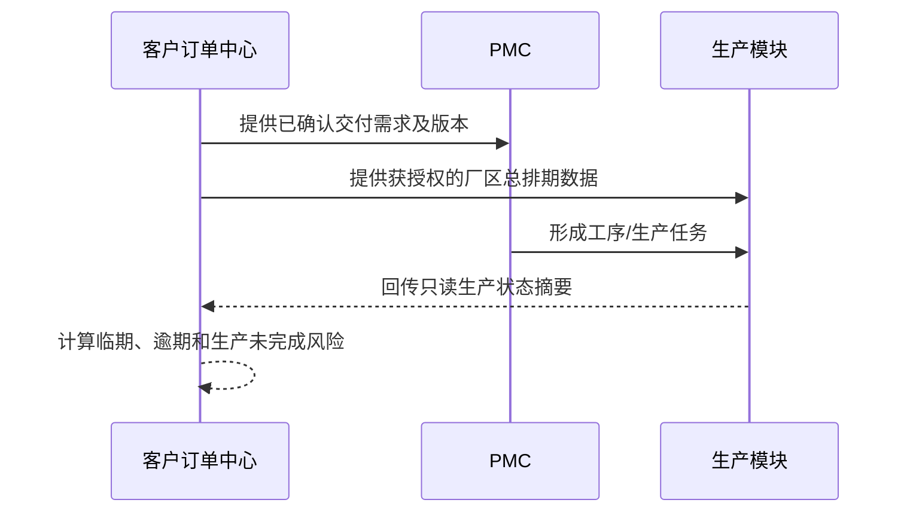

# 客户订单中心下游数据接口清单

> 文档版本：V0.1
> 文档状态：数据合同草案
> 当前阶段：只定义未来接口，不开发后端
> 上游权威：客户订单中心
> 下游范围：PMC、啤机、喷油、装配及后续获授权生产模块

## 1. 目的

本文档明确：

1. 生产部门以后从客户订单中心读取哪些厂区总排期数据；
2. 下游如何识别订单、交付需求和版本；
3. 生产模块以后向客户订单中心回传哪些状态；
4. 哪些字段由客户订单中心维护，哪些字段只能由生产模块维护。

厂区总排期是系统数据视图，不是Excel文件。所有接口都必须使用稳定ID和版本号，不使用工作簿行号或页面序号。

## 2. 数据流

## 3. 核心身份

| 字段 | 用途 |
| --- | --- |
| `order_id` | 标识一张公司标准订单 |
| `order_line_id` | 标识一条产品订单行 |
| `delivery_demand_id` | 标识一条具体交付需求或走货批次 |
| `demand_version` | 标识下游正在使用的订单需求版本 |
| `factory_id` | 标识需求所属厂区 |
| `customer_id` | 标识客户主数据 |
| `source_batch_id` | 追溯原始PO导入批次 |

下游任务必须同时保存：

- `order_line_id`；
- `delivery_demand_id`；
- `demand_version`。

仅保存P/O#或产品编号不足以识别唯一需求。

## 4. 厂区总排期查询接口

### 4.1 候选接口

`GET /api/v1/customer-order-center/factory-schedule`

当前只是未来路径草案，不代表已实现。

### 4.2 查询条件

| 参数 | 必填 | 说明 |
| --- | --- | --- |
| `factory_id` | 是 | 当前厂区 |
| `ship_month` | 否 | `YYYY-MM` |
| `ship_date_from` | 否 | 走货日期起点 |
| `ship_date_to` | 否 | 走货日期终点 |
| `customer_id` | 否 | 客户 |
| `delivery_risk_status` | 否 | 计划中、即将到期、临期、逾期 |
| `production_status` | 否 | 未下发、生产中、未完成、已完成 |
| `changed_since` | 否 | 只读取某时间之后的变更 |
| `page` / `page_size` | 否 | 分页 |

### 4.3 返回的17个基础字段

| 统一字段 | 接口代码 | 下游默认可见 |
| --- | --- | --- |
| 来单日期 | `received_date` | 是 |
| P/O# | `customer_po_no` | 是 |
| Contract No. | `sales_contract_no` | 是 |
| 客名/国家 | `customer_name`、`country_or_market` | 是 |
| 产品编号 | `product_no` | 是 |
| 中文名称 | `product_name_zh` | 是 |
| 产品名称 | `product_name` | 是 |
| 数量 | `order_quantity` | 是 |
| 装箱数 | `units_per_carton` | 是 |
| 箱数 | `carton_count` | 是 |
| 国家标准 | `compliance_standard` | 是 |
| 单价HK | `unit_price_hkd` | 否，需商业权限 |
| 金额HK | `amount_hkd` | 否，需商业权限 |
| 包装 | `packaging` | 是 |
| 行Q | `line_q` | 是 |
| 客Q | `customer_q` | 是 |
| 客要求走货期 | `requested_ship_date` | 是 |

### 4.4 排期与版本字段

| 字段 | 说明 |
| --- | --- |
| `schedule_month` | 走货月份 |
| `schedule_week` | 走货周 |
| `days_to_ship` | 距走货天数 |
| `delivery_risk_status` | 交付风险状态 |
| `order_data_status` | 订单是否已确认 |
| `publishable_to_downstream` | 是否可供下游调用 |
| `demand_version` | 当前需求版本 |
| `last_order_change_at` | 最近订单变更时间 |
| `downstream_version_status` | 下游版本正常或版本落后 |

### 4.5 返回范围

默认只返回：

- 当前生效版本；
- 订单数据已确认；
- `publishable_to_downstream = true`；
- 未取消；
- 未关闭或仍需要下游处理。

待确认和阻断订单可以在客户订单中心总排期异常区显示，但不能进入生产部门的默认调用结果。

## 5. 生产反馈接口

### 5.1 候选接口

`POST /api/v1/customer-order-center/production-feedback`

也可以在后续架构中改用事件总线。当前只确定数据合同。

### 5.2 回传字段

| 字段 | 必填 | 说明 |
| --- | --- | --- |
| `source_module` | 是 | `pmc`、`molding`、`painting`、`assembly`等 |
| `source_task_id` | 是 | 下游任务ID |
| `feedback_version` | 是 | 本反馈版本，用于幂等 |
| `order_line_id` | 是 | 标准订单行ID |
| `delivery_demand_id` | 是 | 交付需求ID |
| `demand_version` | 是 | 下游使用的需求版本 |
| `task_status` | 是 | 任务状态 |
| `required_qty` | 是 | 当前任务需求数量 |
| `completed_qty` | 是 | 已完成数量 |
| `incomplete_qty` | 是 | 未完成数量 |
| `incomplete_reason` | 否 | 未完成原因 |
| `estimated_completion_date` | 否 | 预计完成日期 |
| `feedback_at` | 是 | 反馈时间 |

### 5.3 幂等规则

建议幂等键：

`source_module + source_task_id + feedback_version`

重复发送同一个反馈版本不能重复累计完成数量。

### 5.4 版本规则

当 `demand_version` 不是客户订单中心当前版本时：

- 保存反馈来源；
- 标记“下游版本落后”；
- 不使用该反馈覆盖新版本需求；
- 通知对应下游重新读取需求；
- 客户订单中心不得自动修改下游任务。

## 6. 状态枚举草案

### 6.1 交付风险

- `PLANNED`：计划中；
- `UPCOMING`：即将到期；
- `DUE_SOON`：临期；
- `OVERDUE`：逾期；
- `SHIPPED`：已走货；
- `CLOSED`：已关闭。

### 6.2 生产状态

- `NOT_PUBLISHED`：订单尚不可供下游读取；
- `NOT_RECEIVED`：已发布但下游未接收；
- `NOT_STARTED`：已接收，未开始；
- `IN_PROGRESS`：生产中；
- `PARTIALLY_COMPLETED`：部分完成；
- `BLOCKED`：生产受阻；
- `COMPLETED`：已完成；
- `CANCELLED`：任务取消。

## 7. 总体生产状态聚合草案

在多生产部门场景下，暂定原则：

1. 任何必经部门为 `BLOCKED`，订单总体显示“生产受阻”；
2. 必经部门存在未完成，总体不能显示已完成；
3. 全部必经部门完成，订单总体才显示已完成；
4. 完成率不能简单平均各部门百分比；
5. 优先使用统一需求数量计算完成率；
6. 无法统一数量口径时，显示各部门状态，不展示误导性的总体百分比。

最终规则需等啤机、喷油和装配模块的数据模型确定。

## 8. 权限

| 角色 | 读取订单需求 | 读取价格金额 | 回传生产反馈 | 修改订单 |
| --- | --- | --- | --- | --- |
| 跟客 | 是 | 是 | 否 | 按订单权限 |
| 业务主管 | 是 | 是 | 否 | 审批后 |
| PMC | 是 | 按授权 | 是 | 否 |
| 啤机部门 | 是 | 默认否 | 是 | 否 |
| 喷油部门 | 是 | 默认否 | 是 | 否 |
| 装配部门 | 是 | 默认否 | 是 | 否 |
| 仓库 | 按需求 | 默认否 | 以后定义 | 否 |

## 9. 前端静态阶段验收

- 总排期页面能显示是否“可供生产调用”；
- 待确认或阻断订单显示“不可调用”；
- 每条记录展示需求版本；
- 可以按客户查看当前筛选月份的PO、数量和最近走货日期；
- 可以看到临期/逾期和生产未完成数量；
- 生产反馈明确标注为下游权威、客户订单中心只读；
- 页面不提供修改生产完成数量的操作；
- 页面不要求导入或导出厂区总排期Excel。

交付与生产异常的优先级、去重和解除规则见《[客户订单中心异常与提醒规则](./customer-order-center-exception-reminder-rules.md)》。
