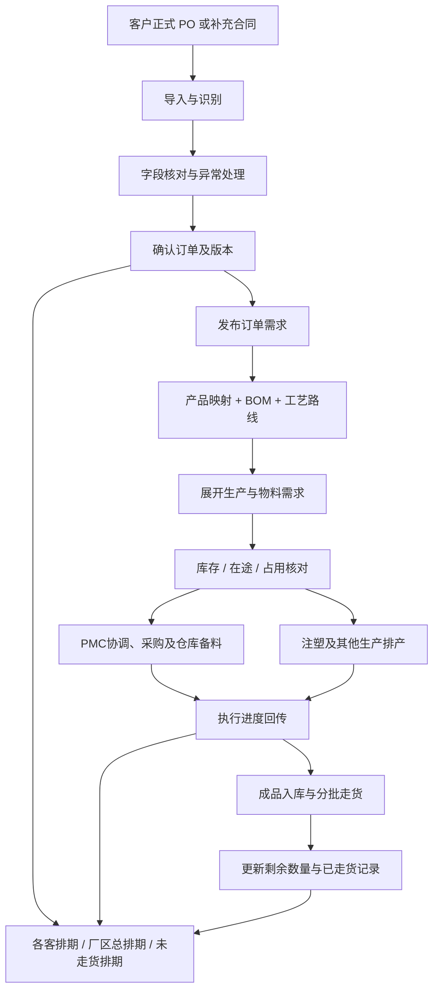

# 客户订单中心：排期统一维护与下游协同规划

> 版本：V0.1（可编辑讨论稿）
> 整理日期：2026-09-13
> 用途：记录已确认的整体方向，供后续补充业务规则、划分实施范围。
> 本文描述目标流程，不表示订单持久化、BOM 展开或各模块接口已经完成。

## 1. 整体目标

将目前分散在各客 Excel 中的排期，逐步迁入客户订单中心统一维护。

各客负责人日常导入客户 PO，核对并确认订单信息后，便能在对应客户排期中看到映射字段；厂区总排期汇总本厂各客的公共字段。订单需求向注塑排产中心、PMC 和各仓库发布，下游执行结果回传到订单中心，形成从接单到走货的业务闭环。

当前最关键的缺口是：**把客户订购的成品，转换成每张订单实际需要的部件、物料和生产需求。** 这一层需要产品映射、BOM、工艺路线，以及库存和在途分配规则共同支撑。

## 2. 已确认方向与待设计内容

| 类别 | 内容 |
| --- | --- |
| 已确认 | 整个排期以后在客户订单中心维护；各客通过导入 PO 形成排期数据 |
| 已确认 | 各客排期保留客户专属字段；厂区总排期展示公共字段 |
| 已确认 | 未走货订单承接现在各客正单评审表的跟进工作；已走货记录进入对应历史区域 |
| 已确认 | 订单中心连接注塑排产、PMC、仓库等模块，实现订单需求接收和执行进度回传 |
| 已确认 | 补充合同可以作为正式 PO 审批前的提前排产依据，正式 PO 到齐后需要核对关联 |
| 建议方案 | 导入、核对、确认、发布分开；通过稳定订单明细身份和版本关联下游 |
| 待设计 | 发布审批权限、BOM 维护归属、物料计算规则、库存分配规则、走货回传与变更处理 |

## 3. 一套订单数据，多个排期视图

各视图共用同一套订单及明细数据。客户排期中的交期等权威字段更新后，其他视图同步反映，不再重复手工修改多张表。

| 视图 | 展示范围 | 主要用途 |
| --- | --- | --- |
| 各客排期 | 本厂、本客户订单的公共字段及客户专属字段 | 各客日常维护、核对 PO、跟进交付 |
| 厂区总排期 | 本厂各客订单的公共字段 | 厂区统筹、交期协调、查看生产和缺料风险 |
| 未走货订单排期 | 仍有未走货数量的订单明细 | 承接正单评审、生产准备及交付跟进 |
| 已走货区域 | 已确认走货批次及已完成订单 | 查询历史交付、追溯走货数量与时间 |

公共字段可包括：厂区、客户、合同号、客户 PO、订单识别号、产品编号、订单数量、客户要求交期、已走货数量、未走货数量和当前状态。最终清单需要结合各客实际表格逐项确认。

客户专属字段通过客户映射规则维护，不能因为总排期只展示公共字段而丢失。价格、成本等敏感字段的可见范围需要单独定义。

## 4. 现有三张表在系统中的对应关系

| 现有表格 | 目标业务关系 |
| --- | --- |
| ITEM 表 | 订单产品明细及客户要求：货号、数量、包装、装箱、标签、交期等 |
| 接单表 | 接单信息、商务信息及业务跟进 |
| 正单评审表 | 订单评审、生产准备和未走货跟进 |

三者通过同一订单明细关联。原来依靠公式查找、复制行、移动行完成的关联，逐步转为系统字段和状态变化。

Excel 可以继续作为历史迁入、核对和必要导出的载体。迁入完成后的日常权威数据由系统保存；对外导出格式及继续使用 Excel 的过渡期限另行确认。

## 5. 订单主流程

建议的关键控制点：

1. 导入结果先进入待核对状态，识别成功不等于已发布。
2. 确认货号、数量、交期、厂区等关键事实后，才能向下游发布。
3. 每次发布保留来源、订单版本、发布时间和操作人。
4. 客户改数量、改交期或取消订单，形成新版本并通知已接收的模块。
5. 已发生的采购、领料、生产、入库和走货记录保留，不随订单改版被覆盖。

## 6. 补充合同与正式 PO 的衔接

客户正式 PO 尚在审批、但已经先提供补充合同或箱唛资料时，可先按实际提供的信息建立订单并进入核对流程。

- 保留补充合同原件，标注来源类型及待正式 PO 核对状态。
- 没有提供的价格等字段保留空白，不补成零或自动套用历史价格。
- 提前发布生产或备料需求的权限与确认条件需要明确。
- 正式 PO 到齐后，关联已有订单，核对数量、交期、包装、价格等差异。
- 同一需求不因再次收到正式 PO 而重复下发。
- 若正式 PO 与先行版本不同，按订单变更处理，保留已执行数量和差异处理结果。

## 7. 未走货、分批走货与结单

未走货排期以**订单明细仍需交付的数量**为依据。对于有多个交付日期的订单，还需要区分交付批次。

例如一张订单为 10,000 件，先确认走货 3,000 件：

- 未走货排期继续显示剩余 7,000 件。
- 已走货区域保留本次 3,000 件的批次、日期及来源单据。
- 后续批次完成后逐步减少剩余数量；全部走货后退出未走货视图。

对于没有变更、取消、退货的普通订单，可按“有效订单数量 − 累计已确认走货数量”计算未走货数量。取消、短交结单、退货、超交及重新交付的计算口径需要另行定义。

“生产完成”“成品入库”“已经走货”应分别记录。已走货状态由获授权的实际出货记录驱动，不以手工移动一行代替出货事实。

## 8. 各模块的职责与数据往来

| 模块 | 接收或维护什么 | 向订单中心回传什么 |
| --- | --- | --- |
| 客户订单中心 | 客户需求、原件、核对结果、版本、发布记录 | 提供统一订单与交付需求 |
| 产品资料 / BOM 管理 | 客户货号与内部产品映射、版本、组成用量、工艺路线 | 可用于需求展开的受控资料 |
| PMC / 需求计算能力 | 已发布订单、BOM、库存与在途情况 | 毛需求、净需求、齐套与缺料情况、协调计划 |
| 注塑排产中心 | 注塑件及数量、需求日期、对应订单版本 | 排产计划、开工与完工进度、异常及完成数量 |
| 各仓库 | 备料、库存预留、收料、领料、成品入库及出货 | 真实库存和收发记录、订单物料及成品状态 |
| 采购 / 外协 | 采购和外协需求 | 下单进度、承诺到货、实际到货及异常 |

订单中心展示执行摘要；各执行模块维护其权威记录。订单发布不能直接生成没有业务依据的库存扣减或生产完成记录。

模块关联使用稳定的订单、明细、交付批次和版本标识，不能使用 Excel 行号作为永久身份。相同需求重复传递时，应识别为同一业务动作。

## 9. 下一阶段重点：订单转换为生产和物料需求

### 9.1 需要打通的链路

**客户货号 → 内部产品与版本 → BOM 和工艺路线 → 按订单数量展开 → 库存与在途分配 → 生产、采购、外协和备料需求。**

BOM 表示产品由哪些部件、原料、配件和包装材料组成，以及每件使用多少。工艺路线表示哪些部件需要经过注塑、喷油、装配或外协等环节。

### 9.2 必备基础资料

| 基础资料 | 需要明确的内容 |
| --- | --- |
| 产品映射 | 客户货号对应哪个内部产品；颜色、版本、包装和厂区是否影响映射 |
| BOM | 每种部件及物料的编码、单位用量、计量单位、有效版本与生效条件 |
| 工艺路线 | 自制、采购、外协及相应生产环节；需要注塑的是哪些部件 |
| 损耗与转换 | 损耗的计算方式、重量与件数换算、包装用量和取整规则 |
| 库存可用性 | 可用于本单的库存、已占用数量、跨仓及跨厂调拨条件 |
| 在途可用性 | 已采购或在制数量、承诺到货日期，以及是否能分配给本单 |
| 版本与替代 | BOM 改版、替代物料和订单专用配置的确认及追溯规则 |

### 9.3 毛需求与净需求

- **毛需求**：根据订单数量、BOM 用量及已确认损耗规则，展开得到的总需求。
- **净需求**：毛需求扣除可用于本单的库存及可按期分配给本单的在途供应后，仍需补充的数量。

这些是业务计算方向，尚不是可直接上线的公式。多层 BOM、批次取整、余料、预留、时间范围及同一供应被多单重复使用的问题，需要在实施前明确。

### 9.4 计算结果应可追溯

每条展开结果应能说明：来自哪张订单及哪一行、采用哪版 BOM、对应哪种物料、用量依据、需求日期、供应分配及剩余缺口。订单变更后，只对差异和未执行部分提出调整；已经执行的业务保留原始证据。

需求计算放在 PMC 或独立的需求计算能力中，具体模块归属待定。客户订单中心提供已确认需求并展示计算结果。

## 10. 分阶段实施建议

| 阶段 | 主要工作 | 验收重点 |
| --- | --- | --- |
| 一：统一订单台账 | 确定字段、稳定身份、持久化、权限；迁入各客当前排期与历史记录 | 迁入前后订单身份、数量、交期和状态可核对；多个视图一致 |
| 二：发布与变更 | 确认、版本、需求发布、下游接收和变更通知 | 重复发布不重复建需求；变更可追溯 |
| 三：需求展开试点 | 选一个厂区、一类产品，建立产品映射、BOM、工艺路线和库存分配 | 每张订单的部件及物料需求能与人工计算逐项核对 |
| 四：执行闭环 | 接入采购、注塑、PMC、仓库、成品入库与走货回传 | 从订单到物料、生产和走货均可追溯；分批交付数量正确 |

历史迁入前需要备份和试迁，核对各客未走货、已走货、取消区域及数量口径。试点验收通过后，再扩大到其他客户和厂区。

## 11. 后续待补充清单

- [ ] 确认各客负责人及可维护字段。
- [ ] 确认厂区总排期公共字段和价格可见权限。
- [ ] 确认订单明细及交付批次的唯一识别规则。
- [ ] 确认导入、评审、发布、变更、取消的权限和审批条件。
- [ ] 确认补充合同允许提前开展哪些动作。
- [ ] 确认未走货数量、分批走货、短交结单和退货处理口径。
- [ ] 确认走货数据由哪个模块登记并回传。
- [ ] 确认产品映射、BOM、工艺路线由哪个部门建立和维护。
- [ ] 确认损耗、计量单位、取整、替代料与多层 BOM 规则。
- [ ] 确认库存预留、在途分配和跨厂协同规则。
- [ ] 选择首个试点厂区、客户及产品，准备人工核对样例。

## 12. 与已有文档的关系

本文记录 2026-09-13 确认的整体方向，作为后续修订的入口。已有文档的字段数量、试点阶段和“已实现”描述需要在实施前结合当前代码逐项核实，不能直接当作现状证明。

- [客户订单中心业务流程与需求说明书](customer-order-center-business-process.md)
- [客户订单中心后续实施规划](customer-order-center-next-steps-plan.md)
- [客户订单中心下游数据接口清单](customer-order-center-downstream-data-interface.md)
- [客户订单中心统一字段字典](customer-order-center-unified-field-dictionary.md)

后续修改时，将已确认规则写入对应章节，将未确定事项保留在待补充清单中；具体实现另行拆分任务。
