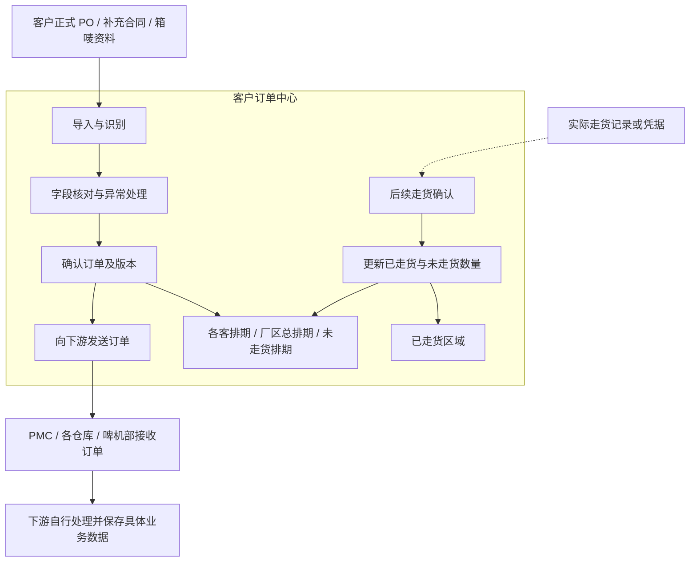

# 客户订单中心：排期统一维护与下游协同规划

> 版本：V0.2（含订单台账与历史迁入说明，可继续修改）
> 更新日期：2026-09-14
> 用途：记录已确认的整体方向，供后续补充业务规则、划分实施范围。
> 目标流程与当前实现范围分别说明；当前实现及验收边界见第 13、14 节。

## 1. 整体目标

将目前分散在各客 Excel 中的排期，逐步迁入客户订单中心统一维护。

各客负责人日常导入客户 PO，核对并确认订单信息后，便能在对应客户排期中看到映射字段；厂区总排期汇总本厂各客的公共字段。确认后的订单发送给 PMC、各仓库和啤机部（注塑排产中心）等下游模块，后续在订单中心确认订单走货情况。

**客户订单中心只负责三件事：订单录入、向下游发送订单、后续订单走货确认。** 排期视图围绕这三项工作维护。

订单处理主流程到“向下游发送订单”为止。每张订单需要订购什么物料、哪些部件需要注塑、如何备料和排产，由仓库、PMC、啤机部等下游模块自行处理并保存具体数据。物料展开与注塑明细不属于本订单中心的建设范围；后续走货确认作为订单交付跟进单独衔接。

## 2. 已确认方向与待设计内容

| 类别 | 内容 |
| --- | --- |
| 已确认 | 整个排期以后在客户订单中心维护；各客通过导入 PO 形成排期数据 |
| 已确认 | 各客排期保留客户专属字段；厂区总排期展示公共字段 |
| 已确认 | 未走货订单承接现在各客正单评审表的跟进工作；已走货记录进入对应历史区域 |
| 已确认 | 订单中心向注塑排产、PMC、仓库等下游模块发送已确认订单，具体执行数据在下游保存 |
| 已确认 | 订单中心保留后续走货确认，更新已走货与未走货数量 |
| 已确认 | 补充合同或箱唛资料可在正式 PO 审批前用于订单录入和发送，正式 PO 到齐后需要核对关联 |
| 建议方案 | 导入、核对、确认、发布分开；通过稳定订单明细身份和版本关联下游 |
| 本轮采用 | 业务人员凭出货单确认走货；按厂区和部门权限向 PMC、仓库、啤机部订单收件箱发送 |
| 待细化 | 各客历史排期迁入批次、特殊交付口径、具体人员授权及仓库自动回传 |

## 3. 一套订单数据，多个排期视图

各视图共用同一套订单及明细数据。客户排期中的交期等权威字段更新后，其他视图同步反映，不再重复手工修改多张表。

| 视图 | 展示范围 | 主要用途 |
| --- | --- | --- |
| 各客排期 | 本厂、本客户订单的公共字段及客户专属字段 | 各客日常维护、核对 PO、跟进交付 |
| 厂区总排期 | 本厂各客订单的公共字段 | 厂区统筹、交期协调、查看发送与走货情况 |
| 未走货订单排期 | 仍有未走货数量的订单明细 | 承接正单评审中的订单核对及交付跟进 |
| 已走货区域 | 已确认走货批次及已完成订单 | 查询历史交付、追溯走货数量与时间 |

公共字段可包括：厂区、客户、合同号、客户 PO、订单识别号、产品编号、订单数量、客户要求交期、订单发送状态、已走货数量、未走货数量和走货状态。最终清单需要结合各客实际表格逐项确认。

客户专属字段通过客户映射规则维护，不能因为总排期只展示公共字段而丢失。订单价格等敏感字段的可见范围需要单独定义。

## 4. 现有三张表在系统中的对应关系

| 现有表格 | 目标业务关系 |
| --- | --- |
| ITEM 表 | 订单产品明细及客户要求：货号、数量、包装、装箱、标签、交期等 |
| 接单表 | 接单信息、商务信息及业务跟进 |
| 正单评审表 | 订单信息核对、发送和未走货跟进 |

三者通过同一订单明细关联。原来依靠公式查找、复制行、移动行完成的关联，逐步转为系统字段和状态变化。

现有表格中涉及具体物料、生产准备和注塑安排的内容，按下游模块职责维护，不作为订单中心必须承接的字段。

Excel 可以继续作为历史迁入、核对和必要导出的载体。迁入完成后的日常权威数据由系统保存；对外导出格式及继续使用 Excel 的过渡期限另行确认。

## 5. 订单主流程

流程图中的下游处理仅表示职责交接，不在本文展开物料、注塑、库存或生产细节。走货记录的提供方式及确认人另行确定。

建议的关键控制点：

1. 导入结果先进入待核对状态，识别成功不等于已发布。
2. 确认货号、数量、交期、厂区等关键事实后，才能向下游发布。
3. 每次发送保留来源、订单版本、接收模块、发送时间、操作人及发送结果。
4. 客户改数量、改交期或取消订单，形成新版本并通知已接收的模块。
5. 下游自行处理订单变更对其业务的影响；订单中心保留发送记录和走货事实，不直接改写下游执行数据。

## 6. 补充合同与正式 PO 的衔接

客户正式 PO 尚在审批、但已经先提供补充合同或箱唛资料时，可先按实际提供的信息建立订单并进入核对流程。

- 保留补充合同原件，标注来源类型及待正式 PO 核对状态。
- 没有提供的价格等字段保留空白，不补成零或自动套用历史价格。
- 提前向下游发送订单的权限与确认条件需要明确；具体备料或排产由下游决定和维护。
- 正式 PO 到齐后，关联已有订单，核对数量、交期、包装、价格等差异。
- 同一需求不因再次收到正式 PO 而重复下发。
- 若正式 PO 与先行版本不同，按订单变更处理并通知原接收部门，保留原发送版本与已确认走货记录。

## 7. 未走货、分批走货与结单

未走货排期以**订单明细仍需交付的数量**为依据。对于有多个交付日期的订单，还需要区分交付批次。

例如一张订单为 10,000 件，先确认走货 3,000 件：

- 未走货排期继续显示剩余 7,000 件。
- 已走货区域保留本次 3,000 件的批次、日期及来源单据。
- 后续批次完成后逐步减少剩余数量；全部走货后退出未走货视图。

对于没有变更、取消、退货的普通订单，可按“有效订单数量 − 累计已确认走货数量”计算未走货数量。取消、短交结单、退货、超交及重新交付的计算口径需要另行定义。

本轮采用业务人员凭出货单确认走货：登记订单明细、走货数量、实际日期、出货单号和备注，并保存确认人及时间。登记错误时通过填写原因撤销原记录，再重新确认；原记录与撤销记录都保留。仓库自动回传后续另行接入。

生产完成、成品入库不能直接视为已经走货；这些执行记录由下游维护。订单中心确认走货后更新视图，不以手工移动一行代替走货事实。

## 8. 各模块的职责与数据往来

| 模块 | 职责与数据归属 | 与订单中心的联系 |
| --- | --- | --- |
| 客户订单中心 | 订单录入、字段核对、原件与版本、订单发送、走货确认、排期视图 | 提供统一的订单事实，维护发送和交付记录 |
| PMC | 接收订单，自行维护协调与执行所需的业务数据 | 接收订单及其变更、取消通知 |
| 各仓库 | 接收订单，保存本仓所需的物料、订料、库存和收发等具体数据，按实际分工办理出货 | 接收订单；相关出货记录可作为走货确认依据 |
| 啤机部 / 注塑排产中心 | 接收订单，自行确定哪些需要注塑，保存具体注塑和排产数据 | 接收订单及其变更、取消通知 |

物料、订料、注塑和库存数据的权威记录保存在对应下游模块，订单中心不重复维护，也不负责计算或汇总这些明细。下游内部部门如何协作，另在对应模块规划中说明。

模块关联使用稳定的订单、明细、交付批次和版本标识，不能使用 Excel 行号作为永久身份。相同需求重复传递时，应识别为同一业务动作。

## 9. 订单发送的范围

订单中心发送的是“客户订了什么、多少、何时交付，以及客户要求”，由接收部门根据订单开展本部门工作。

| 信息类别 | 建议发送内容 |
| --- | --- |
| 订单身份 | 厂区、客户、订单与明细标识、合同号或 PO 号、订单版本 |
| 客户需求 | 产品编号、名称、数量、单位、交期及交付批次 |
| 客户专属要求 | PO 中已有的包装、装箱、箱唛、标签或备注等适用字段 |
| 来源资料 | 正式 PO、补充合同或箱唛资料及其关联关系 |
| 发送与变更 | 接收部门、发送时间、发送人、发送结果，以及改量、改期或取消说明 |

客户提供的包装或箱唛要求属于订单事实，可以随单发送；内部要采购哪些材料、各用多少、哪些部件需要注塑等属于下游处理结果，不进入订单中心的计算和维护范围。

发送失败应能查看原因并重试，同一版本重试不能重复建立下游订单。是否需要人工签收及其展示方式待定。订单已发送不代表已经备料、生产完成或走货。

## 10. 分阶段实施建议

| 阶段 | 主要工作 | 验收重点 |
| --- | --- | --- |
| 一：统一订单台账 | 确定字段、稳定身份、持久化、权限；迁入各客当前排期与历史记录 | 迁入前后订单身份、数量、交期和状态可核对；多个视图一致 |
| 二：订单发送与变更 | 确认、版本、下游接收、发送结果和变更通知 | 下游收到正确的订单字段；重复发送不重复建单；变更可追溯 |
| 三：走货确认 | 明确走货依据与权限，支持分批确认、剩余数量和已走货区域 | 已走货与未走货数量可核对；全部走货后退出未走货视图 |

历史迁入前需要备份和试迁，核对各客未走货、已走货、取消区域及数量口径。试点验收通过后，再扩大到其他客户和厂区。

## 11. 后续待补充清单

- [ ] 确认各客负责人及可维护字段。
- [ ] 确认厂区总排期公共字段和价格可见权限。
- [ ] 确认订单明细及交付批次的唯一识别规则。
- [ ] 确认导入、评审、发布、变更、取消的权限和审批条件。
- [ ] 确认补充合同提前录入和发送的必要字段与确认条件。
- [ ] 确认各厂区订单发送到哪些部门、各部门需要接收哪些订单字段。
- [ ] 确认发送失败重试、重复发送、接收结果及变更通知规则。
- [ ] 确认未走货数量、分批走货、短交结单和退货处理口径。
- [x] 首轮走货由业务人员凭出货单确认；错误记录通过留痕撤销更正。
- [ ] 选择首个试点厂区和客户，准备订单录入、发送、分批走货核对样例。

## 12. 与已有文档的关系

本文记录 2026-09-13 确认的整体方向，作为后续修订的入口。已有文档的字段数量、试点阶段和“已实现”描述需要在实施前结合当前代码逐项核实，不能直接当作现状证明。

本次规划以 V0.2 的职责边界为准：订单录入、向下游发送订单、后续走货确认。下列旧文档若涉及订单中心展开物料、维护注塑明细或汇总生产执行细节，不作为本次建设要求，后续按模块职责另行修订。

- [客户订单中心业务流程与需求说明书](customer-order-center-business-process.md)
- [客户订单中心后续实施规划](customer-order-center-next-steps-plan.md)
- [客户订单中心下游数据接口清单](customer-order-center-downstream-data-interface.md)
- [客户订单中心统一字段字典](customer-order-center-unified-field-dictionary.md)

后续修改时，将已确认规则写入对应章节，将未确定事项保留在待补充清单中；具体实现另行拆分任务。

## 13. 首轮实现与使用顺序

### 第一步：保存订单与维护排期

- 继续使用原来的客户选择、PO 与排期上传、映射预览和人工确认流程；既有解析器、客户映射及 Excel 导出规则保持不变。
- 在预览中选择资料类型，点击“确认并保存订单”。服务器使用相同来源重新解析和校验后保存订单，不直接相信浏览器传来的订单数值。
- 订单台账和厂区总排期读取实际保存的数据，支持客户、关键词、未走货、已走货、已取消筛选及分页。客户专属字段、来源文件和历史版本保留在详情。
- 原来的“确认并生成客户排期”继续提供 Excel 导出。保存台账与导出 Excel 是两个明确操作，互不代替。
- 已有同一订单不重复建立；数量或客户要求存在差异时，提示核对。EDU 的台账身份使用客户合同和 PO，避免上传底表的临时续编号导致重复或冲突。
- 正式 PO 补齐或修订时，可在单条正式 PO 预览中选择“关联已有订单”，搜索并选择同客户、同货号的已有单，填写核对原因。关联保留原订单身份、旧编号、走货记录和历史版本。原有预览中的异常确认要求仍然生效。

### 第二步：向下游发送与处理变更

- 在订单详情选择 PMC、仓库或啤机部并发送；接收方从所属部门的“客户订单收件箱”查看、签收。
- 收件箱接收订单事实及已识别的客户包装、标签、箱唛等要求，不接收价格，也不直接建立纸箱采购行或注塑任务。
- 同一订单版本对同一部门只建立一条发送记录。已发送订单的改量、改期、取消和正式 PO 关联形成新版本，并通知原收件部门；旧版本和签收记录保留。
- 目前台账支持修改数量、交期及备注，客户原件和映射字段可通过新 PO 显式关联更新。改数量后受影响的金额、箱数清空待复核；改交期后相关验货日期、FCD、日期码清空待复核。台账不另行猜算客户专属规则。

### 第三步：凭出货单确认走货

- 业务人员填写实际走货日期、数量和出货单号，可分批确认；剩余数量继续显示在未走货排期。
- 全部确认走货后退出未走货视图。已走货区域可查询已交付订单，详情保留每次走货及更正记录。
- 重复提交、同一明细重复登记同一有效出货单号、超量走货，以及把订单数量改到已走货数量以下，都会被拦截。
- 取消表示停止剩余交付，保留原数量和已确认走货；取消后仍可更正原走货记录。

### 权限与试运行范围

订单读取、保存维护、发送、走货确认、下游查看和签收分别受后端权限及厂区范围控制。固定业务岗位提供订单操作权限，固定仓库和啤机岗位提供对应收件箱权限；具体员工的厂区范围及显式禁用继续生效。

本轮增加独立订单台账数据表，本地数据库已先备份并验证迁移。PO 保存入口仍用于已核对的 PO 订单；历史排期使用下述独立入口，不能把底表上传当成历史迁入。现有排期中的历史订单尚未自动批量写入实际台账。

当前前端的工作台和异常页仍属于预览辅助，正式维护入口为订单台账和厂区总排期。仓库自动回传、退货、超交、短交结单及多交付批次的专门管理，按前述待确认业务规则继续拆分；不得视为本轮已经实现。

## 14. 历史排期迁入与期初核对

入口：订单数据台账 → 历史排期迁入。先选当前厂区的客户，上传原 `.xlsx` 排期并预览，再选择要迁入的订单。每批最多 500 条。

1. 读取统一表头的 ITEM 表及 ITEM 分类表，保留订单字段、客户扩展列、原表页签和行号。正单评审表用于交叉核对，不与 ITEM 重复建单。
2. 明确的“取消单”“已走货订单”分隔行用于提示分区；备注中的“取消”文字不会改变后续行状态。分区不是走货凭证，业务人员仍须核对每条订单的状态与期初已走货量。
3. 缺少订单身份、无效数量、日期异常、公式没有已计算值、示例行及重复明细会被拦截；数量冲突需在原表核对后重新上传。不会猜算公式、合并多交付批次，或把已存在订单覆盖。
4. 填写统一的期初截止日期，逐单确认订单总量、有效/取消状态及截至该日期的累计已走货量。未走货填 0；部分走货填实际累计量；全量走货须核对后填写订单全量。页面提供批量填写辅助，最终仍需确认并填写核对说明。
5. 保存时服务器重新读取原件，核对预览指纹和订单身份后整批写入。保留原文件、核对人、日期、说明和不可改写的初始版本。重复提交同一次迁入不增加订单；期间被其他操作建立的订单不得覆盖。
6. 历史已走货作为期初事实，不伪造出货单。后续凭出货单登记的日期必须晚于期初截止日期，数量与期初累计合计不能超过订单总量。错误期初可在详情中填写原因更正，原值、原版本和后续出货单保留。
7. 取消订单不再有待交付数量；全部走货退出未走货视图。迁入不会自动发送订单，业务人员核对后再发送。下游收件箱同时显示发送时的订单总量、累计已走货、剩余待交付和历史期初截止日期；这些是发送时快照。

迁入和期初更正需要订单维护及走货确认权限；已发送订单的期初更正还需发送权限，并向原收件部门发出新版本。原有 PO 解析、客户映射、排期导出和人工确认规则不变。

已对提供目录中的 24 份排期作只读试解析；这只证明文件可读取及异常可列出，不代表各客期初口径已经业务验收。正式切换前仍需备份、选择试点客户、核对选中订单及汇总数量，再在页面确认迁入。多批次同号同货号、退货、超交和短交结单仍另行处理。
