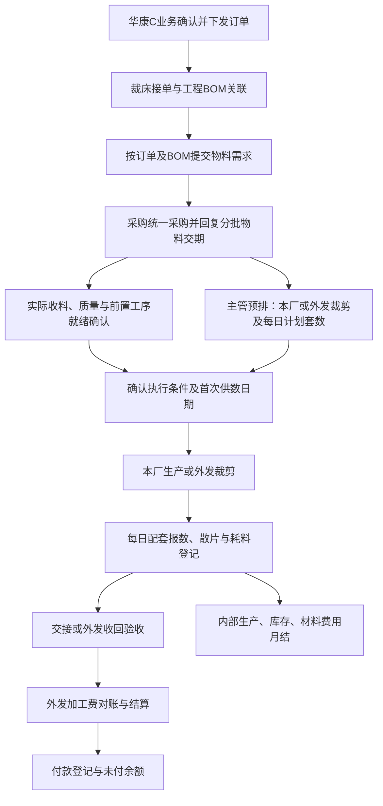

# 华康C裁床部生产管理模块方案

> 版本：V1.2 分阶段实施稿<br>
> 日期：2026-10-08<br>
> 定位：业务需求、界面规划与分阶段开发依据<br>
> 状态：P1a 已实现；P1b 基础资料、独立权限、生产 BOM 版本及必需物料配置已实现并通过隔离测试，默认关闭，业务库尚未迁移启用。订单、排期、库存及月结仍待后续阶段。

## 1. 已确认的业务范围

以下内容来自用户明确要求，属于本方案的确定边界。

| 项目 | 已确认要求 |
| --- | --- |
| 模块入口 | 华康C → 生产部 → 裁床部 |
| 订单来源 | 华康C业务订单中心接单并下发 |
| 上游流程 | 收到订单后，由工程提供BOM，提交采购需求；采购统一订布料和辅料并回复物料交期 |
| 排期责任 | 裁床主管根据物料交期安排每日计划完成数量，系统生成对应完成期 |
| 默认准备周期 | 收到物料后一般经过3个工作日开始供数；具体起算条件见待确认事项 |
| 部分到料排期 | 不要求所有辅料到齐；可设定当前生产阶段所需物料，部分到齐即可安排对应任务／批次，剩余辅料持续跟进 |
| 数量口径 | 交数按配套数量计算，不以所有裁片数量简单相加 |
| 执行方式 | 本厂裁剪、外发裁剪；本模块的外发仅包括裁剪 |
| 实际填数 | 裁床文员每日填回实际完成数量 |
| 六个业务区 | 排期、填数、物料库存、月结、基础资料、实际生产物料费用 |
| 月结范围 | 同时包含内部生产／库存／材料费用月结，以及外发裁剪厂加工费对账、应付金额和结算单 |
| 界面及设计思路 | 参照现有喷油部模块，结合裁床业务调整 |

本文其余内容为推荐设计。文中标明“建议”或列入第17节的规则，不应在开发时当作已经批准的业务规则。正式计价、结算及日历参数应由责任人确认后生效。

## 2. 当前系统基础与接入缺口

### 2.1 可以沿用的能力

- 订单中心已经具有订单明细、不可覆盖的历史版本、下发快照、签收和变更通知。
- 现有平台提供登录、厂区与部门权限、工作区组件、表格、弹窗和导出基础。
- 喷油重建模块提供独立工作区、订单追踪、未保存内容保护、操作结果核对、确认后更正、批次物料与期间冻结等参考实现。

### 2.2 需要补齐的部分

1. 当前华康C客户导入列表为空，部分既有外销客户配置归属华康D。按本次确认，应建设华康C自己的接单及下发能力，逐项确认客户清单和导入方式；不得整体搬回华康D客户或改写其历史订单。
2. 当前订单下发接收方仅有PMC、仓库和注塑，需要增加独立裁床接收方及其权限、变更通知和重复下发保护。
3. 生产BOM、布料采购及布料仓库尚不能视为已经完整接入。第一阶段必须补齐结构化资料登记和交期回复，或接入经核验的上游接口。
4. 工程页的BOM展示卡、生产计划展示卡不能作为真实业务接口已实现的依据；报价BOM也不能未经工程确认直接当作生产BOM。
5. 喷油模块当前默认关闭，生产页面仍保留占位入口。本方案依据其代码、界面合同和设计文档，不宣称已完成在线喷油界面操作或现场验收。

裁床模块应使用独立业务记录。喷油、纸箱、注塑的现有数据和计算规则保持各自边界；只在评估后复用通用组件及控制机制。

## 3. 界面：参照喷油部，组织为六个业务区

### 3.1 参考关系

| 喷油参考 | 裁床对应设计 |
| --- | --- |
| 独立全页工作区 | 从生产部进入裁床工作区，提供返回生产部入口 |
| 64px顶栏、72px紧凑导航 | 作为桌面布局参考，保留华康C、业务日期、订单检索和账号；按可读性适配 |
| 需求池＋排期主区 | 待排订单／执行任务＋每日计划表，时间轴作为辅助视图 |
| 现场执行的任务／日报切换 | 待填任务、每日报数、散片与异常、交接及外发回收 |
| 物料采购、批次、领退耗分区 | 布料辅料库存、采购交期、领退调拨、实际耗用及盘点 |
| 经营月结与资料缺项提示 | 实际材料费用、内部月结、外发应付结算及待核事项 |
| 订单追踪组件 | 从各页打开同一张订单的来源、BOM、物料、计划、实绩及费用 |
| 导入、操作记录工具入口 | 作为辅助入口，不额外占用六个核心导航位置 |

不照搬喷油的油漆、胶件、计件工资、工序产值或委托方收款规则。裁床外发结算主要是加工厂应付，与喷油委托方月结的业务方向不同。员工工资、人事考勤不在本次已确认范围内。

### 3.2 主界面结构

```text
┌──────────────────────────────────────────────────────────────────┐
│ 返回生产部  华康C · 裁床部  业务日期  查订单/生产单/货号  刷新  账号 │
├──────────┬───────────────────────────────────────────────────────┤
│ 排期     │ 页标题、当前筛选与主操作                                │
│ 填数     │ 待办及异常摘要 → 点击后筛选真实记录                       │
│ 物料库存 │                                                       │
│ 月结     │ 主工作区：表格／排期／报数／核对                         │
│ 基础资料 │                                                       │
│ 物料费用 │                                       订单追踪侧栏    │
│──────────│                                       或详情抽屉      │
│ 导入     │                                                       │
│ 操作记录 │                                                       │
└──────────┴───────────────────────────────────────────────────────┘
```

“物料费用”为导航短名称，页面完整标题使用“实际生产物料费用”。初始进入排期页的订单总台账；页内提供待排、缺BOM、缺物料交期、延期和未填数摘要，不额外建设演示驾驶舱。

### 3.3 统一交互原则

- 使用项目深青绿色主色、浅色底面、细边框和紧凑表格，遵循 `DESIGN.md`。
- 订单总台账固定生产单号、客户／货号等识别列，其他列按订单、物料、计划、实际和月份分组；宽表只在自身容器内滚动。
- 月份按所选期间动态展开，不把7月、8月等写死为固定字段；未知值显示“待确认”，缺报与明确填零分别显示。
- 全局业务日期用于日报和截至日期查询；月结、费用页面另有明确的月份选择，避免混淆“当天”和“整月”。
- 参照喷油订单侧栏：宽屏可并排展示，较窄屏幕改为抽屉；从订单进入其他页时保持该订单筛选。
- 小于1024px优先列表和单任务填报；窄屏保留日期、任务识别及主要按钮，复杂排期以表单提供等价操作。
- 保存期间阻止重复提交；网络超时保留填写并核对上次操作结果，不能再次生成一笔新业务。
- 切换页面、厂区或账号时处理未保存内容；失效的旧请求不能覆盖新上下文。模块只接受明确的华康C厂区，不回退其他厂。
- 配套、超产、缺料、待计价等状态同时使用文字和颜色；不能仅靠红绿底色表达。
- 首次上线无数据时显示真实空状态和下一步动作，不能沿用喷油演示数字。

## 4. 业务流程与单据链



采购预计交期支持预排，不等于物料已经可用。订单下发也不直接生成实际库存、耗料或完成数量。

建议的关联层次为：业务订单明细 → 裁床生产任务 → 本厂／外发执行任务 → 日计划、日报、物料流水、交接／验收、费用及结算。

一张订单可以有多个部件、颜色和执行任务；一张采购单可以供应多个生产任务。所有拆分和合并均保留原订单及数量分配关系。

## 5. 排期业务区

### 5.1 页面分区

- **订单总台账**：参照截图，查看订单、物料、计划、实绩、差额和月度汇总。
- **待排需求池**：显示待接单、待BOM、待采购回复和可排任务，支持筛选及批量关联。
- **日计划表**：按任务／执行方展示每天计划套数，支持日期窗口、批量填数、复制计划和局部调整。
- **计划版本**：查看首次发布计划、当前有效计划、调整原因及影响。

主操作为“接收订单”“拆分任务”“编制日计划”“预览调整”“发布计划”。确认或审批层级见第17节；不得自行增加不必要的逐日审批。

### 5.2 工作日及完成期

- 已确认准备周期为3个工作日；由生产日历定义休息日、节假日、调休和加班工作日。
- 已确认不要求所有辅料到齐，可按任务／批次设定当前生产阶段所需物料，部分到齐即可安排生产排期。未列为当前阶段必需的辅料不统一阻止排期，但须继续显示缺料数量、预计到期和后续影响。
- 建议以该批任务所配置的开工必需物料及前置工序就绪为三工作日的起算条件；到料当天是否计入、前置工序的具体约束仍待确认，不能以全部辅料最晚到期日作为统一起算日。
- 建议起算当天不计，从下一工作日起顺延3个工作日。示例：周一就绪、周二至周四均为工作日，则周四开始供数。此示例不是已批准参数。
- 采购回复用于预计首次供数日；实际到料确认后形成执行条件。计划开裁日、首次供数日、计划完成日分别记录。
- 系统按主管填入的有效日计划累计达到任务目标数量的日期计算计划完成期；未排足数量时显示“计划未排完”。
- 建议首次基准计划保留不可覆盖版本，后续调整形成新版本。物料延期提示受影响任务，不静默移动已发布计划或历史日报。
- 允许部分到料形成可生产批次；需要核对当前阶段每种已配置必需物料的实际可用量，并扣除其他任务已占用部分。只满足部分数量时，按可支持数量分批执行；预计后续来料支持预排，不冒充实际库存。
- 界面建议在物料清单增加“当前阶段是否必需”“适用部件／工序”“可支持生产数量”“未到料影响”及责任人字段，由有权限人员配置并保留调整记录。无需逐张订单重复勾选全部物料，可从工程确认模板带入再核对。
- “可开始裁剪”和“可报完整套数”分别判断：部分物料到齐可先安排相关部件裁剪，尚不能形成完整配套时保留散片／在制数量，不能提前计为合格完成套数。
- 不同产品套数不能直接等同于工作负荷。第一版以主管人工计划为主；同产品／已确认换算的资源可进行容量提示，标准工时未确认时不宣称自动最优排产。

### 5.3 排期示例

某任务目标6,350套，每个生产日安排1,500套，最后一天安排350套，需5个有效生产日。日期按实际工作日历落位，不能把中间休息日算作有效产出日。

本厂6,000套、外发4,000套组成同一订单10,000套时，应分别形成执行任务和日计划。允许暂时未分配完，明确显示待分配量；累计分配不得无依据超出有效需求。

## 6. 填数、配套及交接

### 6.1 配套口径

工程BOM应定义产品／款式、颜色、规格、部件及每套所需裁片数量。不同版本和不兼容规格不得混配。

对同一可配套范围，设部件i每套需用 `rᵢ` 片，尚未用于配套的合格可用量为 `qᵢ`：

`本次最多可新增配套数 = min(floor(qᵢ / rᵢ))`

例如每套需要前片1片、后片1片、袖片2片；分别有1,000、950、1,800片合格可用裁片，可组成900套，剩余裁片继续保留。缺少一种必需裁片不能按其他部件平均完成量报套数。

### 6.2 推荐两种填报方式

| 方式 | 使用条件 | 控制 |
| --- | --- | --- |
| 直接报合格配套数 | 现场已经完成核套，适合文员日常快速录入 | 记录核套人／依据与任务版本；声明为完整套，不伪造每种裁片实际产量 |
| 按裁片核套 | 现场有可靠裁片明细，需要管理散片及欠片 | 先登记合格裁片，再生成配套记录并扣减可配套散片，不重复生成生产完成量 |

一个任务／批次必须确定记录主口径。直接配套报数和裁片自动核套不能同时增加同一批产量。跨批、跨执行方合并配套需要可追溯的移交和数量分配，不能仅凭相同货号自动合并。

### 6.3 每日报数

文员按生产日期选择任务，登记当日新增合格配套数、未配套裁片、待判／不良／报废及异常原因。支持保存草稿、批量粘贴预览、确认和更正；具体确认人待定。

日报保留业务日期、录入时间、录入人、执行方、订单／BOM版本及更正关联。漏报与填零不同；超产允许登记真实事实，但应提示、留原因并核实是否纳入任务及结算额度。

日报确认不自动推定领料、耗料、仓库收回、下道交接或客户出货。上述事实分别登记，并由共同任务关联。

### 6.4 本厂与外发的数量状态

- 本厂：实际合格配套完成 → 待交接 → 已交给下道工序。
- 外发：外厂报称完成 → 发回在途 → 实际收回 → 验收合格／待判／不合格 → 交接。
- 外厂报称完成用于预计进度，不直接作为已验收数量或应付依据。
- 外发只含裁剪；后续车缝、手工和包装不重复记为裁床产量。
- 返工关联原任务，不重复计正常订单完成量；修正、退回和重新验收保留原记录。
- 本模块的裁片／配套交接不自动生成现有半成品仓入库，接收方和仓库接口另行确认。

### 6.5 统计口径

已确认将原“累计交货欠产”改名为“累计计划差额”，并单独列出“未完成套数”；两项不得混用。未完成套数的计算已确认采用“订单总数－已完成数”，两者均按同一订单的配套套数统计。计算功能随排期与填数阶段接入，规则确认不代表已经实现。

| 指标 | 口径（已确认项注明，其余为建议） |
| --- | --- |
| 当日计划套数 | 当前有效计划在所选业务日的数量 |
| 累计计划套数 | 截至所选日期的有效日计划合计，详情可对比首次基准计划 |
| 累计合格完成套数 | 确认的合格完成记录净额；外厂自报及验收采用独立列，不混计 |
| 累计计划差额 | 同一数量口径下的累计实际－累计计划，负数表示落后 |
| 未完成套数 | 已确认：`订单总数－已完成数`，按同一订单的配套套数计算，直接保留相减结果 |
| 完成率 | 累计合格完成÷任务有效目标；目标为零或未知时不计算，真实超产不截成100% |
| 已完成未交接 | 可交接合格数量扣除有效交接净额 |
| 月计划／月实际 | 按业务日期汇总该月明细，不能取页面当前加载的部分行求和 |

总台账同时保留“完成”和“交接”指标，最终哪一项映射截图的“实际交数”须确认，不得让两个指标使用同一模糊名称。

示例：订单总数153,000套、截至当日计划115,000套、已完成107,500套；计划差额为−7,500套，未完成套数为153,000－107,500＝45,500套，完成率约70.3%。

## 7. 截图字段对应表

截图仅用于字段与布局识别，没有原始工作簿，不据此确认隐藏列、公式、全部行数据或导入映射。截图中出现的日期、颜色和示例值不作为系统默认数据。

| 原字段 | 系统字段与来源 |
| --- | --- |
| 放产日期 | 业务放产日期；与下发时间、实际开裁日期分开 |
| 洋行名 | 客户名称，关联客户资料并保留订单快照；不设置“内／外”分类 |
| 负责仓管 | 人员资料关联及负责人历史快照 |
| 生产单号 | 裁床生产单标识，关联来源订单明细；编号规则待确认 |
| 合同号 | 保存原合同／MA等标识，各编号关系需业务确认 |
| 货号 | 产品识别，保留前导零、短横线及原字符串 |
| 货名 | 产品或部件名称，另列颜色／规格以支持独立配套 |
| 订单数量 | 原订单数量与单位；裁床目标套数单独记录并校验换算 |
| 物料期 | 显示关键物料预计就绪日期，展开查看采购批次及实际到料 |
| 贴合／捆条 | 前置工序要求、预计日期、实际状态；“/”“齐”等原值不能直接猜成日期 |
| 裁剪厂商 | 本厂车间或外发加工厂，关联执行任务 |
| 裁床计划 | 从每日计划生成文字摘要，明细是计算依据 |
| 当日计划交数／实际交数 | 对应所选日期的计划及明确业务口径的实际净额 |
| 累计计划总数／交货总数 | 截至所选日期的累计量，计划、完成和交接分列 |
| 累计交货欠产 | 已确认改名“累计计划差额”，单独列出“未完成套数” |
| 累计交货进度 | 根据明确分子和任务目标计算，展示对应指标名称 |
| 月交货总数／月计划总数 | 日期明细按月动态汇总，可展开，不按月份加数据库固定列 |

新增必要字段包括：来源订单版本、BOM版本、任务目标套数、执行方式、实际物料就绪日期、首次供数日、计划完成期、实际完成日期、合格完成／已交接量、物料费用状态及月结状态。

## 8. 物料库存与采购协同

### 8.1 唯一库存来源

布料仓库、裁床现场和外发厂应围绕同一套物料批次、存放位置及库存流水展示。若仓库模块尚未实施，先确定权威流水所属模块及接口，不能让两个模块各录一次收货。

| 位置 | 主要记录 |
| --- | --- |
| 布料／辅料仓 | 采购实收、质量状态、预留、发料、退回及盘点 |
| 本厂裁床现场 | 领入、可用余料、实际耗用、损耗、退回及调拨 |
| 外发加工厂 | 发出、签收／在途、在外结存、耗用、余料退回及差异 |

发料是位置及保管责任变化，不立即等于生产耗用。外发料在途与厂商确认收到分别记录，合并查看时不能重复算两份库存。

### 8.2 采购需求及到料

- 工程发布生产BOM，指定经办人根据任务数量、有效用量和损耗规则提交物料需求；提交岗位与审批人待确认。
- 采购可统一采购、分批回复预计日期与数量，保留采购明细到多个生产任务的分配关系。
- 采购承诺、供应商发货、仓库实收、质量可用分别记录；延期通知关联受影响计划。
- 物料用途区分当前裁剪阶段必需料与后续工序用料，支持配置部分到料即可排期；非当前必需辅料继续跟进到期，不一律阻止当前排期。哪些物料属于当前阶段必需、如何触发三工作日起算及后续工序约束，按任务适用规则明确。
- 上游未接通时允许带来源说明的结构化登记／模板导入；后续正式来源接入采用核对关联，不能重复入库或重复生成需求。
- 裁床不承担采购付款流程。布料供应商采购应付并未在本轮明确纳入裁床月结，需独立确认系统边界。

### 8.3 库存控制

- 物料身份至少包含编码、名称、规格、颜色、基本单位；批次、色缸、幅宽、克重等按物料类型补充。
- 预留影响可用量，不改变实物在库；共享批次不能重复分配给多个任务。
- 整卷、散料、可复用余料和报废分开；不同规格或质量状态不能直接合并。
- 单位换算需明确来源：公斤转米依赖对应物料及条件，不使用全局固定比例。
- 推荐无可用库存时阻止正常出库；特殊短账处理规则、审批及后补流程须先确认，不默认允许负库存。
- 更正通过关联原流水的冲销或调整完成；已被后续使用的物料不能无约束撤销原收货。
- 盘点以截止时点的账面与实际数比较，登记差异原因；期间锁定、并发收发和历史日期的影响必须核对。

## 9. 实际生产物料费用

### 9.1 页面与口径

提供“订单费用”“耗用明细”“标准与实际对比”“在制与待计价”四个页签，可按生产单、执行方、月份、物料及币种筛选。每笔金额可展开到耗料、批次价格和来源凭据。

| 费用 | 依据 |
| --- | --- |
| BOM标准材料费用 | 同一目标／比较产量的标准用量×已确认参考价格 |
| 实际材料费用 | 实际耗用数量×适用库存成本，包含明确归属的调整 |
| 未配套／在制材料费用 | 尚未归属于已完成配套的实际投入，按确认规则结转 |
| 外发加工费 | 外发验收与冻结单价形成，单独列示，不混入材料费用 |

不能将订单总量×BOM用量直接标成实际耗料，也不能用当前采购价重算已经结算的历史耗料。

### 9.2 耗用登记与对账

可直接登记任务实际耗用，并通过盘余核对：

`期初现场结存＋本期领入／调入－退回／调出－期末现场结存＝本期耗用及损耗`

该平衡式用于核对或经确认的盘余计耗方式，不与已经登记的耗用重复相加。正常耗用、报废、非生产损失和盘点差异分别分类；未分配到订单的公共耗料进入待分配池。

### 9.3 成本规则

- 批次原价、移动加权平均等计价方法由业务／财务选定。喷油的批次成本是参考，不自动成为裁床正式计价政策。
- 退料追溯原领用和成本来源；退回物料与供应商扣款是不同事实。
- 未知价格保留为空并显示待计价；明确的零价需要证据，不能用零掩盖缺失。
- 共用耗料的分摊规则、损耗承担、余料价值、税费和运费计入方式均需版本化确认。
- 不同款式的套数不能不经规则就作为统一费用分摊权重。
- 单套实际材料费用＝归属于对应合格配套产量的材料费用÷对应套数；套数为零或费用未归齐时显示待核对。
- 金额计算推荐后端Decimal，中间保持精度、单据金额按确认规则到分；保存币种和舍入规则。不同币种不直接相加。
- 费用补价形成调整证据，不能覆盖已冻结月结和历史导出；锁期后的补价采用批准的调整或反结流程。
- 材料费用不是订单总利润；人工、设备等成本未纳入时不展示“完整利润”。

## 10. 月结：内部核算与外发结算

### 10.1 内部月结

推荐页签：生产核对、物料收发存、材料费用与在制、锁月记录。

| 核对范围 | 主要内容 |
| --- | --- |
| 生产 | 本月计划／合格配套／交接数量、未填日报、超产、未完成订单、散片及返工 |
| 库存 | 期初、实收、位置转移、实际耗用、退料、损耗、盘点差异、期末及外发在外料 |
| 费用 | 已知材料费用、未计价、待分配、在制结转及订单成本差异 |
| 完整性 | 未确认单据、未解决更正、缺价格／规则、账实不符及结算争议 |

流程建议：生成核对草稿 → 跳转处理异常 → 责任人复核 → 冻结本期快照 → 锁定月份 → 导出。

跨月订单继续沿用原单，本月只归集本期事实。生产、库存和费用完成度分别展示；生产数量核对完成不代表财务已结清。物料缺价等未解决事项必须影响相关费用结清状态。

### 10.2 外发加工厂对账与应付

推荐页签：待结明细、对账单、结算单、付款登记、调整与历史。

- 外发任务保存加工厂、裁剪范围、计价单位、单价版本、币种及价格依据。生产按套统计；按片报价时另存计费数量和确认的转换关系。
- 建议以截止月份内已验收合格且未结算数量作为可结基础；外厂自报完成不能自动形成应付。验收岗位和税费口径待确认。
- 支持部分验收、部分结算和跨月继续结算；同一验收数量不能被两张单重复占用。
- 可结数量来自验收证据扣除已有有效结算分配及退回限制；未结退回释放或减少额度，已结退回形成关联原单的贷项／调整，不能既扣数量又扣款两次。
- 外发超产能否付费须单独确认；实际数量保留不等于超额费用自动获批。
- 我方材料成本与加工费分别归集，不能把我方供料再次算进外发加工费。
- 补料、返工、报废、扣款、补款及其他费用逐项记录来源、责任和确认结果。
- 在税费政策尚未确认前，只允许显示加工费试算和待核项目，不直接形成正式含税应付总额。

对账流程建议：生成草稿 → 核对验收／价格／调整 → 记录与加工厂的核对结果及凭证 → 内部确认 → 冻结结算单 → 登记付款与核销。

系统不自动对外发送信息。加工厂在线登录及消息发送属于后续单独确认范围。

### 10.3 付款及期间保护

- 结算确认与付款分开：已确认有效应付扣除有效付款核销，形成未付余额；退款、冲销和贷项分别关联处理。
- 一笔付款可分配多张结算单，多次付款可核销同一张单；币种、额度及重复登记需核对。
- 仅登记实际付款凭证和核销，不自动操作银行；预付款或超付需要独立规则，不默认为负未付余额。
- 内部月结与外发月结状态分别保存，互相展示未完成影响；外发争议金额未确认时，完整任务成本不能标为已结清。
- 锁月后不得直接编辑当期正式单据。更正采用开放期调整或有权限的反结，并保留原版本、原因、操作者和时间。
- 结算修订不删除已有付款证据；已有核销、后续期间或关联入账时，先检查影响再允许反结。
- 精确结账顺序、审批分工、未开票金额与争议费用处理，由财务确认后实施。

## 11. 基础资料

| 类别 | 建议内容 |
| --- | --- |
| 客户与订单映射 | 华康C客户清单、来源字段、订单编号及生产单关联；同名客户不等于同一来源 |
| 产品与配套 | 货号、款式、颜色、规格、部件、每套裁片数及有效BOM版本 |
| 物料 | 布料／辅料编码、规格、颜色、基本单位、专属换算和适用批次属性 |
| 单位与损耗 | 订单单位转套、物料单位换算、标准损耗规则及来源 |
| 工程资料 | BOM附件、结构化明细、用量、前置工序和发布／变更记录 |
| 执行资源 | 本厂车间、裁床资源、负责人、外发裁剪厂及有效状态 |
| 位置与保管 | 仓库、仓位、本厂现场、外发在途／厂商保管位置 |
| 工作日历 | 华康C生产日历，必要时配置外发厂日历；共用与差异规则需确认 |
| 价格与费用 | 外发价格版本、计价单位、币种、成本及分摊规则、月结规则 |

优先引用现有权威客户、人员等主资料。历史单据保留当时的名称、规格和价格快照；停用资料不删除历史证据。临时资料须标记待完善，不能用默认值伪造完整资料。

## 12. 角色与权限建议

| 角色 | 主要权限 | 边界 |
| --- | --- | --- |
| 华康C业务 | 接单、确认／下发、订单变更、进度查询 | 不能直接修改裁床实绩和库存 |
| 工程 | 生产BOM录入、发布、工艺资料和版本变更 | 不直接代替采购承诺到料 |
| 采购 | 接收需求、采购关联、物料交期回复及修订 | 不代替仓库登记实际收货 |
| 仓管 | 实收、质量状态衔接、发退料、盘点 | 不自行改外发单价或生产计划 |
| 裁床主管 | 接单、拆任务、执行方分配、计划发布调整、异常处理 | 月结、单价及付款权限另行授予 |
| 裁床文员 | 日报、散片、外发回报、交接登记 | 不默认拥有补价、锁月、反结和价格查看权限 |
| 财务／结算员 | 成本核对、外发对账、应付确认、付款登记、月结 | 具体岗位分工和复核要求待确认 |
| 管理人员 | 按范围查看汇总、异常和审计 | 跨厂权限必须明确授予 |

所有后台操作校验厂区、部门、动作及当前授权；不能只隐藏按钮。数量查看与成本、加工价格、付款查看分开。外发厂不因被选为执行方而自动获得内部账号或订单访问权。

## 13. 订单、BOM及其他异常处理

- **加单／减单**：接收新订单版本，比较已分配、已完成、已交接、已发料及已结算事实。减单低于已执行量进入异常处理，不能直接扣掉历史产量。
- **取消订单**：停止后续安排，保留已生产、在外料、退料、费用及结算处置任务，不删除整单证据。
- **BOM变更**：发布新版本并明确影响范围；已确认领耗料、日报及结算继续引用原版本，剩余任务经确认后切换。
- **采购延期／短料**：标出受影响任务和预计完成期，由主管重排；实际到料不可被采购预计日期覆盖。
- **超产／欠产／缺片**：真实数量保留，原因与处理分开，超产不直接扩大采购、交接或外发付费额度。
- **报数更正**：确认前改草稿，确认后关联原记录更正；检查其对配套、交接、库存和结算的影响。
- **重复点击／网络重试**：同一次业务操作只记账一次；保存结果未知时先查询原操作结果。
- **历史导入**：先预览映射和差异，再确认；只有累计值时作为有截止日期的期初，不能编造每天的实际数量。期初模式与完整历史流水重放不能重复采用。

## 14. 数据与接口规划（建议，不是已存在实现）

模块入口为 `/modules/production/cutting`，只接受明确的 `huakang-c`。基础资料页面接入 `/api/cutting-operations`，独立权限为 `cutting_ops:read`、`master_write`、`bom_write`、`bom_publish`。后端逐次校验厂区、部门和动作，显式禁止有效；工程负责 BOM 写入与发布，生产负责物料和执行资源维护，读取可授予生产或工程。固定岗位不自动获得这些新权限。其他五区仍为静态说明，不代表已有业务数据。

核心数据组：

1. 订单接收及版本关联、裁床任务、执行分配。
2. 生产BOM版本、部件配套规则、物料需求及采购来源关联。
3. 采购交期回复、实际到料及可用分配。
4. 生产日历、计划版本、每日计划与调整。
5. 日报、配套／裁片记录、质量状态及更正。
6. 库存批次、位置、预留、收发退调耗及盘点流水。
7. 外发任务、回收／验收、交接及退回。
8. 耗料成本、待分配费用、在制分配及成本调整。
9. 外发价格版本、对账／结算／付款与逐行核销。
10. 期间状态、冻结快照、附件、导入来源、操作回执和审计。

共享物料库存由统一事实源提供，最终物理表归属取决于布料仓库接入设计，不能按页面重复建账。上游工程及采购同样保留唯一权威资料，裁床保存关联与必要快照。

写入推荐采用版本检查、幂等键及事务保护。业务记录、数量／金额流水、审计和操作回执在同一事务内确认；库存、配套和结算额度须防止并发超用。服务端计算统计及费用，不能信任前端上传的累计总数。

新增数据库结构采用明确迁移，禁止启动时顺便重置业务数据；开发使用隔离环境和功能开关，验证后再安排业务环境迁移。当前文档不授权运行迁移、导入历史数据或发布上线。

## 15. 输出报表

| 报表 | 来源及用途 |
| --- | --- |
| 裁床生产总台账 | 接近截图，包含订单、物料期、计划、实际、差额及月度汇总 |
| 每日计划／实际报表 | 同一日期与口径对比，识别未填、欠产、超产及异常 |
| 配套及欠片表 | 配套BOM、可用裁片、已配套及未配套缺口 |
| 物料收发存表 | 按物料、批次、位置、期间核对期初与期末 |
| 外发在外物料表 | 已发、厂商签收、耗用、退回及结存 |
| 订单材料费用表 | 标准、实际、损耗、在制、缺价和待分配 |
| 内部月结表 | 生产、库存和材料费用分项核对及冻结状态 |
| 外发对账／结算单 | 加工厂、验收明细、计费数量、冻结价、调整及应付 |
| 付款及未付余额表 | 结算与付款核销关系，不等于银行自动付款 |

导出保留单位、币种、统计截止日期、口径、制表人及版本。涉及费用的导出重新校验金额查看权限；正式月结导出使用冻结快照。原始截图不是可逐单元格复刻的Excel模板，精确打印版式需取得原工作簿后确认。

## 16. 分阶段实施与验收

### 16.1 开发顺序

| 阶段 | 交付 | 验收重点 |
| --- | --- | --- |
| P0 业务与来源核对 | 确认第17节规则、华康C客户来源、真实订单及BOM／采购／结算样例 | 关键字段都有责任部门和权威来源 |
| P1 工作区与基础 | 六区导航、厂区权限、资料版本、订单下发和接收、最小BOM与采购交期链 | 真实空状态、无重复下发、华康C数据隔离 |
| P2 排期与填数 | 本厂／外发拆分、工作日计划、配套报数、交接与更正 | 计划、套数及不同实物阶段不重复统计 |
| P3 库存及实际费用 | 收发存、外发在外料、耗用、余料、计价和在制归集 | 库存数量与费用均可追溯，未知不补零 |
| P4 双范围月结 | 内部核对、外发验收结算、付款核销、锁月与调整、冻结导出 | 可部分结算、跨月延续、防重复和历史保护 |
| P5 业务试运行 | 历史期初预览、全流程回归、权限和并发、真实样例及浏览器验收 | 对账一致，正式迁移及启用单独安排 |

可以分批开发，但六个业务区及内部／外发月结均属于已确认的目标范围。不能以“只有排期和日报”宣称完整模块完成。

### 16.2 当前交付与后续顺序

本轮将 P1 拆为可独立验收的 P1a、P1b、P1c，不改变六区及双范围月结的完整目标。

| 批次 | 当前状态 | 交付与边界 |
| --- | --- | --- |
| P1a 入口与工作区 | 已实现 | 华康C生产部裁床卡片、独立工作区、六区导航及页内视图、字段预览、明确的待接入状态、返回生产部；支持直接链接及查询参数切厂防护 |
| P1b 基础与授权 | 已实现，待环境启用 | 独立权限、显式增量迁移、物料与本厂／外发资源版本、生产 BOM 草稿／发布、每套部件及必需物料配置、版本记录；默认关闭 |
| P1c 订单与交期 | 待实施 | 华康C客户映射、裁床下发接收方、订单版本／重复接收保护、采购交期回复及最小业务链 |
| P2–P5 | 待实施 | 依原方案推进排期填数、统一库存及实际费用、双范围月结和业务试运行 |

P1a 批次仅交付导航和字段预览。当前基础资料由 P1b 提供实际 API 及版本化持久化，但默认关闭；其他五区继续显示待接入状态，不提供无效录入、导入或结算操作。任何页面均不使用浏览器持久化业务记录或模拟数量。不能以六区页面开放声称 P1 全部完成。

前端实现位于 `src/features/cutting-operations/`，入口注册在 `src/data/enterpriseMock.ts`、`src/views/ModuleCenterView.vue` 和 `src/router/index.ts`。入口验收覆盖六区跳转、返回厂区、非华康C及重复厂区参数拒绝、同页修改厂区参数、页内视图重置和生产入口键盘操作；P1b 已增加后端厂区／部门授权和版本化资料测试，生产计算留待后续阶段。

P1a 文件清单：

- `src/features/cutting-operations/navigation.ts`：六区业务文案、字段及厂区常量。
- `src/features/cutting-operations/routes.ts`：独立路由、默认排期页与厂区入口检查。
- `src/features/cutting-operations/CuttingWorkspaceShell.vue`：顶栏、六区导航、账号及返回入口。
- `src/features/cutting-operations/CuttingWorkspacePage.vue`：页内视图、字段预览与待接入说明。
- `src/features/cutting-operations/workspace.css`：隔离样式、横向表格和窄屏布局。
- `src/features/cutting-operations/__tests__/navigation.spec.ts`：路由与工作区行为测试。
- `src/data/enterpriseMock.ts`、`src/views/ModuleCenterView.vue`、`src/router/index.ts`：华康C生产入口及主路由注册。
- `src/views/__tests__/moduleCenterFactoryScope.spec.ts`：华康C专属入口回归。
- 本文及 `PROJECT_MEMORY.md`：同步当前实现边界；原有 `.gitignore` 文档白名单变更保留。

P1a 原有入口及导航测试继续纳入回归；当前 P1b 的验证命令与边界见下文。

浏览器已验证本地华康C卡片可打开排期工作区，并核对月结页包含内部月结、外发对账、结算与应付、付款核销。六区切换和同页厂区改变由组件／路由测试覆盖；完整多尺寸、200%缩放、正式账号矩阵及真实业务数据验收尚未完成。

#### P1b 基础资料交付边界

- **物料**：布料／辅料、编码、规格、颜色、基本单位、权威物料编码／来源；维护的是裁床使用的资料引用，未替代全局物料主档或建立库存。暂不自动换算单位或计损耗。
- **执行资源**：本厂／外发执行方、联系人及来源；外发工序仅允许裁剪，不创建外发账号或授予访问权。
- **生产 BOM**：产品货号、款式、颜色、来源，部件编码及每套片数，固定物料版本、每套净用量、适用部件／阶段、当前裁剪是否必需、未到料影响。保存为草稿，由工程发布；修订产生新草稿，旧发布版本及其原物料名称继续可追溯。发布要求每个部件有用量依据、至少一种裁剪必需料，且引用物料当前未停用。非必需辅料允许保留；未实现可生产量或套数计算。
- **保存和追溯**：按预期版本检测冲突；工厂级事务锁串行化写入；同一操作编号相同请求返回原回执，异内容／异操作人拒绝。资料修订和操作回执在同一事务提交，记录操作者、时间及原因；停用保留历史。前端遇到保存结果未知会锁住表单并重试原操作。
- **数据结构**：迁移 `20261007_0131`（上游 `20260929_0130`）新增 `cutting_ops_masters`、`cutting_ops_revisions`、`cutting_ops_commands`。启动 `create_all` 无论功能开关状态都排除这三表。缺少迁移时接口拒绝读写，不自动创建表、迁移历史数据或授予权限。
- **启用顺序**：默认 `CUTTING_OPS_ENABLED=false`。先备份并验证目标库的 Alembic 状态，在隔离库演练通过后按环境流程执行迁移，再为指定华康C部门人员明确授权，最后启用并重启。已有未登记迁移版本的本地库需先核对迁移状态，不能直接 `stamp head` 或盲目跑整个历史链。回退先关闭开关，保留已保存资料；该迁移不提供删除业务历史的自动降级。
- **未纳入本批**：工程附件上传／上游接口、客户映射、订单及采购交期（P1c）、工作日历及三工作日计算（P2）、单位换算、库存、成本及月结。当前生产 BOM 为工程手动结构化登记，不能宣称上游订单或采购已经打通。
- **验证**：使用独立临时数据库进行接口、并发、权限及真实 Alembic 链迁移回归；前端验证表单、只读／未启用状态、版本冲突及原操作重试。业务库迁移、真实业务样例及 PostgreSQL 并发验收未执行。

P1b 主要文件：

- `src/features/cutting-operations/CuttingMasterPage.vue`、`api.ts`：基础资料实际表单、列表、查询、版本记录和请求处理；同目录路由、样式及测试同步。
- `backend/app/api/cutting_operations.py`、`models/cutting_ops.py`、`services/cutting_ops.py`、`services/cutting_schemas.py`：独立接口、模型、事务及数据校验。
- `backend/alembic/versions/20261007_0131_cutting_master.py`：显式增量迁移；主应用、数据库初始化、权限目录与部门策略作必要注册。
- `backend/tests/test_cutting_ops.py`、`test_cutting_migration.py`：隔离回归；`test_system_position_catalog.py` 同步新增权限目录但不扩张固定岗位。

验证命令：

```text
npm run build
npm run typecheck:test
npx vue-tsc --noEmit -p tsconfig.cutting-tests.json
npm run test:unit -- src/features/cutting-operations/__tests__ src/views/__tests__/moduleCenterFactoryScope.spec.ts
backend/.venv/Scripts/python.exe -m pytest backend/tests/test_cutting_ops.py backend/tests/test_cutting_migration.py backend/tests/test_system_position_catalog.py -q
```

上述构建和类型检查通过，前端定向测试 47 项通过；后端接口／迁移／固定岗位已有回归 34 项通过。迁移演练核对所有既有表的结构和原有记录不变，并通过完整性、外键检查。已纳入版本管理的 `tsconfig.cutting-tests.json` 显式包含裁床及厂区入口测试，不能用仓库通用测试类型配置替代。本地浏览器已核对华康C基础资料入口和关闭状态；真实保存由隔离 API 与组件测试覆盖，未在业务库写入验收样例。独立审查发现的岗位部门限制及 BOM 历史物料名称问题均已修正并加入回归。

#### P1a / P1b 保存保护与待验收项

P1a 可进行入口、导航及厂区隔离验收；P1b 已实现基础资料及保存保护，但正式启用验收尚未完成。保存保护的组件与真实路由定向回归已通过，仍需按下表完成环境及业务验收。

| 状态 | 内容 | 验收要求 |
| --- | --- | --- |
| 已修复，定向回归通过 | 未保存表单及状态变更原因的放弃确认 | 切换类型、替换编辑对象、取消或离开页面时提示；取消离开保留原内容，未修改表单不多余提示。 |
| 已修复，定向回归通过 | 保存中及结果未知时保留原操作并阻止业务导航离页 | 超时后重试沿用原操作标识；后续 401/403/409 拒绝不能清掉未知结果。401 隐藏表单并提供新标签页重新登录入口，回来后可重试。结果确认后解除保护。 |
| 已修复，定向回归通过 | 物料查询结果与当前查询和编辑对象一致 | 连续查询 A、B，令 A 晚于 B 返回，仍显示 B；旧查询失败也不覆盖新查询。修改搜索词或更换编辑对象后，旧结果不能加入 BOM。 |
| 启用前验收 | 目标业务库迁移与关闭开关回退 | 核对备份和迁移历史，在业务库副本演练，确认既有资料不变；未登记 Alembic 版本的库不得盲目升级或 stamp。 |
| 启用前验收 | 真实登录及 IAM 授权链路 | 使用生产、工程、只读和无权限账号，验证厂区／部门隔离、明确拒绝、撤权及停用用户；隔离测试替换当前用户不能代替此项。 |
| 按部署环境验收 | PostgreSQL 并发及真实 BOM 容量 | 目标环境采用 PostgreSQL 时验证同版本并发冲突、原操作重试和事务回滚；用真实规模 BOM 测试列表响应及查询量。 |

刷新／关闭使用浏览器原生离页提醒；用户确认强制刷新／关闭或浏览器崩溃仍会丢失内存草稿与原操作信息，不宣称支持跨刷新恢复，不使用浏览器持久化存放业务内容。新增保护回归覆盖正常放弃、取消放弃、真实路由跳转、无效厂区重定向、保存中、未知结果及重试拒绝、查询乱序和分页；浏览器原生弹窗和真实会话重新登录仍需在启用验收时人工确认。

建议随后完善版本冲突后的草稿保留与差异对照、按名称／货号查询、操作人名称展示；进入 P1c 前明确“正在编辑版本”和“当前有效发布版本”的选择及撤销规则。排期、完整套数计算、库存、成本、月结仍按 P2–P4 边界推进，不作为 P1a/P1b 的漏做项。

### 16.3 必测业务场景

1. 华康C新增订单下发一次，多次点击或重试只生成一次接收记录；变更作为新版本到达。
2. 一单10,000套拆成本厂6,000套、外发4,000套，汇总无重复；保留未分配及超分配校验。
3. 三工作日准备期跨周末、节假日及调休；当前阶段所配置的必需物料到齐、非必需辅料未到时可安排对应批次。缺当前必需料或数量不足时提示受影响任务，不假报已齐料；物料延期和重排保留基准计划。仅能裁部分部件时，散片不得提前计为完整套数。
4. 6,350套按1,500套日计划正确安排最后350套；计划不足不能给出虚假的完整完成期。
5. 前片1,000、后片950、袖片1,800且每套需1／1／2时只配900套；同批重复提交不重复核套。
6. 外发自报1,000套、收回900套、验收850套，分别呈现；按建议验收口径只能从850套中核对可结量。
7. 同一物料批次分配多单、部分到料及并发发料，不能重复占用；仓库到现场转移不重复增加全厂库存。
8. 日报完成不会再次扣库存；实际耗用、月末盘余核对不重复计费；退料追溯原成本。
9. 已确认耗料缺价时显示待计价；补价、更正及历史导出保持可追溯，不静默覆写。
10. 跨月在制、散片及在外料正确结转，未完成订单不被强制结清。
11. 同一验收行部分结算、跨月结算及并发选单不超量；已结退回与贷项不重复扣减。
12. 多笔付款／多张结算单核销守恒，错误付款可追溯更正；锁月后的写入与反结按授权处理。
13. 文员不能修改加工单价或直接锁月，其他厂用户不能靠修改URL查看或写入华康C记录。
14. 账号／厂区切换、保存超时、迟到响应和离页保护正常；1920、1440、1366、1024及窄屏可用，200%缩放与键盘操作单独验收。
15. 至少一张真实的跨月订单同时包含本厂及外发、分批到料、退料／损耗、部分结算，数量与金额全链路可追溯。

涉及计算、权限、数据库、导入与月结的实现应先形成实施计划，执行针对性自动化测试、与编写分开的审查和完成验证。应用改动完成后按仓库脚本运行相关检查；本文档阶段只校验文档结构、引用、范围及一致性，不以未运行的构建／测试作为验收结论。

## 17. 实施前待确认事项

| 事项 | 已知边界 | 尚需确认 |
| --- | --- | --- |
| 华康C接单资料 | 确定由华康C接单并下发 | 客户清单、PO／手工录入方式、编号与原华康D配置的关系 |
| 部分到料及三工作日起算 | 周期为3个工作日；不要求全部辅料到齐，允许配置部分到料即可排期 | 当前阶段必需物料的具体配置及维护岗位；到料当天是否计入；贴合／捆条的起算约束；本厂与外发日历 |
| 实际交数 | 按配套数量 | 总台账采用完成、交接还是验收套数；三者仍需独立保留 |
| 配套BOM | 按部件及每套数量核对 | 整套定义、款式颜色边界、直接报套与裁片核套主口径 |
| 截图语义 | 洋行名不设置“内／外”分类；其余对应业务字段需保留 | 放产、MA／合同号、贴合／捆条及负责仓管含义 |
| 采购需求与收料 | 工程提供BOM、采购统一采购 | 谁提交需求、谁核量、谁验收及如何对接布料仓库 |
| 成本 | 必须提供实际材料费用 | 计价方法、单位转换、损耗、余料、公共耗料分摊、在制结转 |
| 外发价格及验收 | 仅外发裁剪，包含加工费结算 | 按套／片价格、验收人、超产付费、返工／补料责任、税费及币种 |
| 月结和付款 | 内部与外发两范围均包含 | 审批人、锁月顺序、争议费用、开票关系、反结、预付款和核销规则 |
| 历史切入 | 原截图仅作参考 | 原始Excel、期初库存／在制／应付、截止日及导入责任人 |

上述事项不妨碍开展界面骨架和无争议基础能力，但依赖未确认规则的正式计算、扣库存或结算不得擅自启用。当前不包含自动银行付款、员工工资、完整车缝／包装流程、外发厂在线门户或自动对外通知。

## 18. 仓库参考与证据边界

- [项目开发规则](../../AGENTS.md)
- [项目记忆](../../PROJECT_MEMORY.md)：现有订单中心、布料仓库发现阶段及喷油模块边界。
- [统一设计规范](../../DESIGN.md)
- [喷油界面合同](../spray-production/UI_SPEC.md)
- [喷油数量与金额口径](../spray-production/FORMULA_CATALOG.md)
- [喷油设计决策与待确认规则](../spray-production/DECISIONS.md)
- [喷油现有实施状态](../spray-production/IMPLEMENTATION_STATUS.md)
- [喷油工作区壳](../../src/features/spray-production/SprayWorkspaceShell.vue)
- [喷油路由](../../src/features/spray-production/routes.ts)
- [喷油上下文与保存机制](../../src/features/spray-production/workspace.ts)
- [喷油局部样式](../../src/features/spray-production/workspace.css)
- [订单下发数据定义](../../backend/app/schemas/customer_order_ledger.py)
- [订单台账与下发模型](../../backend/app/models/customer_order_ledger.py)
- [客户订单中心客户配置](../../src/components/modules/sales/customer-order-center/CustomerOrderCenterWorkspace.vue)

本文将用户已确认范围、当前实现和推荐设计分别标明。当前交付第16.2节所述 P1a 与 P1b 基础能力；P1b 默认关闭，不代表订单已接入、业务库已迁移启用、价格规则已获批或完整模块已上线。
