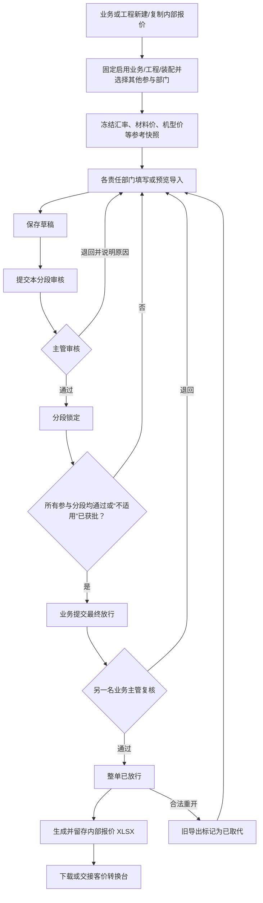

# 业务部“内部报价台”模块设计与实施基线

> 文档状态：前端及后端 P1–P4、整体联调 L1–L5.3 已验收；L5.4 已完成并等待用户确认

> 2026-07-18 最新格式决定：所有客户的内部报价填入和内部受控输出统一采用现有 `Huaxing Demo` 基础格式；客户名称只决定最终报客价输出模板。该决定覆盖下文按客户显示专属内部补充字段的旧界面方案，历史 P4 专属字段仅保留兼容读取。

> 2026-07-18 表头补充：业务部或工程部建单时填写“客人目标价”；支持带币种的自由文本，客人未提供时填写“无”。该字段不参与成本公式，但随报价复制、版本对比、最终放行、内部 Excel 和客价 artifact 交接冻结。迁移 `20260718_0025` 为历史报价安全回填“无”。

> 2026-07-18 报价基数补充：内部报价台首页在“新建内部报价”旁提供“调整报价基数”。业务跟客拥有只读查看权限，只有业务主管拥有修改权限；工程主管的报价参考同步权限不包含基数维护。基数按厂区/车间保存初始材料价和初始机型价，每次保存生成 revision。新建报价冻结最新基数，历史报价继续使用原参考快照；迁移 `20260718_0026` 新增报价基数表。
>
> 编制日期：2026-07-16
>
> 目标项目：Royal Regent Nexus
>
> 参考系统：`D:\华登集团\rr2\RR-Portal\apps\业务部\内部报价系统`

## 1. 本次结论

在业务部模块中心新增独立模块 **“内部报价台”**，用于完成：

`业务/工程建单 → 固定三部门及选定的可选部门协作核价 → 参与分段主管审核 → 业务最终放行 → 受控导出内部报价 Excel`。

“内部报价台”不是现有“客价转换台”的改名，也不替代客户报价转换能力：

| 模块 | 负责内容 | 输出 |
| --- | --- | --- |
| 内部报价台 | 跨部门归集模具、材料、加工、人工、包装、运费、减税等内部成本 | 已审批的内部报价成本快照、内部报价 Excel |
| 客价转换台 | 按客户模板和客户规则，把内部报价转换成报客价 | 客户报价 Excel、版本对比 |

第一阶段两者通过受控 Excel 文件衔接；后续可通过 `internal_quote_export_id` 直接交接，但客户规则、折扣、返点和客户模板仍只在“客价转换台”维护。

本文件现作为分阶段实施基线。用户已确认前端并批准后端按阶段实施；当前已完成 P1–P4 后端范围，不恢复已下线的旧模块，不清空或重建历史数据。

## 2. 调研范围与当前项目现状

### 2.1 已核对的 rr2 内容

- 报价单、八部门分段、用户客户范围和审计数据库结构。
- 建单、复制、编辑表头、删除、分段保存/提交、审核、驳回、重开、导出接口。
- 模具、电子、喷油、车缝、生产排拉 Excel 解析逻辑。
- 模具图片上传和工作簿嵌入图片提取逻辑。
- 材料价、机型价参考表和报价单内冻结副本。
- 前端八部门工作台、汇总、运费、减税和出货价计算。
- 内部报价 Excel 导出器及其活公式、明细分 Sheet 和审核门槛。

### 2.2 当前 Royal Regent Nexus 真实状态

- 前端采用 Vue 3 + Vite + TypeScript + Pinia + Vue Router。
- 后端采用 FastAPI + SQLAlchemy + Alembic，目标数据库为 PostgreSQL。
- 登录、厂区、部门和权限统一走集中 IAM，不允许复制 rr2 的独立账号、部门 PIN 或 cookie-session。
- 业务部目前已有独立的“客价转换台”，路径为 `/modules/sales-business/customer-price-conversion`。
- 新“内部报价台”前端已验收；后端已提供 P1 列表、新建、详情、复制、表头修改、八段协作状态机、版本记录、时间线/浏览记录和归档 API，P2 八段输入契约、参考快照、Decimal 权威计算、金额汇总和依赖失效 API，P3 八类 Excel 预览/确认导入、附件和受控 XLSX 留存 API，以及 P4 双人最终放行、系统通知、版本对比和客价转换台 artifact 交接 API。
- 历史 Alembic `0016–0019` 仍保留，已定义内部报价单、分段、审计、导入批次、附件、导出文件和参与标志；已部署数据库中可能已有表和历史报价数据。
- 因此新建设必须使用 **0019 之后的正向迁移** 做兼容，不得改写历史迁移，也不得假设数据库是空库。

## 3. 模块定位与入口

### 3.1 业务部模块卡

| 属性 | 设计值 |
| --- | --- |
| 模块名称 | 内部报价台 |
| 模块 ID | `internal-quote-desk` |
| 所属模块中心 | `sales-business` |
| 路由 | `/modules/sales-business/internal-quote-desk` |
| 负责人 | 业务部 / 各核价责任部门 |
| 摘要 | 业务/工程建单、八部门成本协作、主管审核、受控导出 |
| 状态 | 前端及后端 P1–P4、L1–L5.3 已验收；L5.4 待用户确认 |

该模块与“客价转换台”在业务部模块中心并列展示，不再放入旧的“报价中心”二级容器。

### 3.2 页面结构

```text
内部报价台首页
├─ 统计周期：当前自然周 / 当前自然月 / 当前自然年
├─ 指标：总报价数、进行中报价数、已完成报价数、已取消报价数
├─ 状态环形图：进行中 / 已完成 / 已取消占比
├─ 客户报价数量：按客户横向条形图，从高到低排列
├─ 客户报价速度：建单至最终放行平均时长横向点图，并显示完成样本数
├─ 进行中报价进度：必参与分段审核完成度横向条形图
├─ 全局搜索：报价号、产品、客户、版本、创建人
├─ 筛选：状态、客户、创建日期、责任分段
├─ 报价列表
└─ 新建内部报价

报价协作页
├─ 报价单头与整体进度
├─ 本单已参与责任分段导航及后续追加入口
├─ 当前分段表单 / Excel 导入预览 / 附件
├─ 右侧成本摘要、依赖数据、评论、业务操作时间线和浏览记录
└─ 底部固定操作：保存草稿、提交审核、审核、退回、重开

报价汇总页
├─ 成本与币种总览
├─ 部门成本分布和历史版本对比
├─ 出货场景、模具分摊、减税明细
├─ 分段审批状态与异常警告
├─ 最终放行
└─ 受控导出和历史导出文件
```

页面复用 `SalesModuleWorkbench.vue` 的业务部全屏框架、全局厂区上下文、账号菜单和现有青绿色企业视觉。不得引入原型中的外部 CDN、Material Symbols、远程字体或第二套全局侧栏。

首页统计由厂区权限范围内的服务端完整报价集合生成，不能用当前列表筛选结果或浏览器缓存拼装。周期按报价 `created_at` 归入当前自然周、月或年；最终放行或已导出计为“已完成”，归档计为“已取消”，其余状态（包括退回待补充）计为“进行中”。客户报价速度只使用已完成样本，公式为 `最终放行时间 - 建单时间`；历史完成记录缺少最终放行时间时兼容使用最后更新时间。速度图采用横向点图，点越靠左代表平均完成时长越短，并同时展示样本数，避免普通柱形图把“耗时更长”误读为表现更好。

## 4. 业务角色与权限边界

### 4.1 角色职责

| 角色 | 默认职责 |
| --- | --- |
| 业务经办 | 新建/复制报价、维护单头、填写业务分段、查看全单、提交最终放行、导出 |
| 业务主管 | 审核业务分段、最终放行、重开、归档；不得审核本人提交的最终报价 |
| 工程经办/主管 | 新建/复制报价、填写和审核工程分段，查看与其工作相关的全单成本；建单时指定业务负责人 |
| 电子、啤机、喷油、搪胶、车缝、装配经办 | 仅填写本人获授权的责任分段 |
| 各责任分段主管 | 审核、退回或重开本责任分段；不得自审 |
| 系统/权限管理员 | 配置权限、责任分段映射和参考数据，不替代业务审批人 |

rr2 默认允许业务/工程修改其他部门分段。目标系统改为最小权限：业务和工程可跨分段查看，但默认只能修改自己的分段；确需代填时由 IAM 显式授予对应分段权限，并记录代填审计。

### 4.2 建议权限族

基础权限：

```text
internal_quote:read
internal_quote:create
internal_quote:clone
internal_quote:summary_read
internal_quote:final_submit
internal_quote:final_approve
internal_quote:export
internal_quote:archive
internal_quote:baseline_read
internal_quote:baseline_manage
internal_quote:reference_manage
```

其中 `internal_quote:create`、`internal_quote:clone` 默认授予业务部和工程部符合角色的账号；后端仍需结合 `factory_id`、部门范围和角色校验，不能只依赖前端按钮显隐。

分段权限按八个 `section_code` 分别注册编辑和审核能力，例如：

```text
internal_quote:sales_edit / internal_quote:sales_review
internal_quote:engineering_edit / internal_quote:engineering_review
internal_quote:electronic_edit / internal_quote:electronic_review
...
internal_quote:assembly_edit / internal_quote:assembly_review
```

所有权限同时受 `factory_id` 和当前 IAM 部门范围约束。前端按钮隐藏只改善体验，FastAPI 服务端必须再次校验。

### 4.3 厂区、客户和责任分段可见范围

1. 报价单、分段、审核、附件、导入批次、评论和导出文件全部带 `factory_id`。
2. 业务用户默认查看其已授权厂区的全部报价；若以后启用客户级授权，再与客户范围取交集。
3. 非业务责任部门只查看被启用且自己有责任权限的报价任务，不因知道报价 ID 而获得访问权。
4. 集团或跨厂区查看必须使用现有显式授权；高敏成本默认不因跨厂区只读授权而自动开放。
5. 华兴使用统一车间 `huaxing-workshop / 华兴`，不得重新拆回“新车间/老车间”。

## 5. 业务流程



### 5.1 新建报价

业务或工程经办创建时填写：

- 厂区和车间；车间来自当前厂区目录，不在页面内另设厂区切换器。
- 报价号/货号、产品名称、客户、出货数量、版本标签。
- 业务负责人、预计完成日期、备注。
- 业务部、工程部、装配部固定参与；电子部、啤机部、喷油部、搪胶部、车缝部由建单人按本次报价范围选择。
- 未选择的可选部门不接收填写任务，不计入协作进度、成本汇总或最终放行门槛；业务部或工程部可在协作过程中追加，追加操作受报价头 revision 保护并留存审计/通知。
- 参与部门只允许追加，不在协作过程中移除；若报价已最终放行，追加部门会使既有放行、导出和交接 artifact 失效，待新增分段完成后重新放行。

工程部建单/复制时同样记录创建人及发起部门，并必须指定业务负责人，以保证整单复核和最终放行仍由业务部承接。

唯一约束建议沿用现有历史结构：

`factory_id + workshop_code + quote_no + version_label`。

不同版本必须新增报价版本，不覆盖历史版本。

### 5.2 复制报价

- 业务部、工程部均可发起复制。
- 复制单头、分段明细、参考快照和可复用附件索引。
- 必须输入新的版本标签或报价号。
- 所有审批、最终放行和导出状态清零。
- 复制后重新计算并生成新的公式快照，不继承旧审批结论。

### 5.3 “不适用”处理

数据库仍保留八类分段槽位，未参与分段以 `is_required=false` 标识且不可填写。只有已参与但业务上确实不适用的分段，才使用“不适用”申请：不得用空白或全零冒充完成，须填写原因并由该责任分段主管或业务主管批准。获批后计入完成进度，并在导出中显示“不适用 + 原因 + 批准人”。

## 6. 状态机

### 6.1 分段状态

| 状态 | 含义 | 是否可编辑 |
| --- | --- | --- |
| `draft` | 草稿或修改中 | 是 |
| `pending_review` | 已提交主管审核 | 否 |
| `approved` | 审核通过 | 否 |
| `rejected` | 已退回，等待修订 | 是 |
| `na_pending` | 申请不适用，待审核 | 否 |
| `not_applicable` | 不适用已批准 | 否 |

允许的主路径：

```text
draft/rejected → pending_review → approved
draft/rejected → na_pending → not_applicable
pending_review/na_pending → rejected
approved/not_applicable → reopened(draft)
```

### 6.2 整单状态

| 状态 | 说明 |
| --- | --- |
| `drafting` | 仍有草稿或退回分段 |
| `section_reviewing` | 至少一段待审核，但未全部完成 |
| `ready_for_final_review` | 所有参与分段均已通过或不适用获批 |
| `final_reviewing` | 已提交业务最终放行 |
| `fully_approved` | 业务最终放行完成，可受控导出 |
| `exported` | 至少存在一个当前有效导出文件 |
| `reopened` | 放行后有分段被重开，需重新审批 |
| `archived` | 历史版本，只读 |

整单状态必须由服务端根据分段和最终审批事件推导，不能相信前端计数。

### 6.3 重开与依赖失效

- 只有具备审核/最终放行权限的用户可重开，并必须填写原因。
- 重开任一分段后，整单离开 `fully_approved/exported`。
- 旧导出文件保留，但状态改为 `superseded`，显示取代时间和原因。
- 工程模具摘要是啤机、喷油和装配的上游依赖。工程数据变更后，服务端比较上游 revision/hash；若下游已引用旧版本，则下游审批自动失效并进入 `rejected` 或 `draft`，不得保留陈旧的已通过状态。

## 7. 八类责任分段（按参与启用）

| 分段代码 | 中文名称 | 主要内容 | 关键依赖 |
| --- | --- | --- | --- |
| `sales` | 业务部 | 单头、汇率、目标价、包装材料、产品/彩盒尺寸、纸箱、平卡、运费方案和最终汇总 | 汇总全部责任分段；运费读取主纸箱 CUFT/每箱数量 |
| `engineering` | 工程部 | 模具明细、生产模具费用、五金和辅助材料；不填写包装材料、纸箱和平卡 | 输出模具摘要给啤机/喷油/装配 |
| `electronic` | 电子部 | 电子零件/子项、规格、用量、RMB 单价、税点、备注，以及邦定、贴片、人工、测试、包装、利润和自动税项 | 电子正式分段优先于旧工程电子备用数据；HKD 使用本报价冻结汇率 |
| `molding` | 啤机部 | 注塑、材料价、机型价、啤价、吹气 | 引用工程模具、材料和机型参考快照 |
| `painting` | 喷油部 | 图片/附件引用、名称、位置、夹模、移印、散枪、边模、油色、浸油、抹油、擦PP水和备注 | 可引用工程模具/产品位置 |
| `slush` | 搪胶 | 产品编号、胶件名称、材料、料重、日产量 24H、用量、HKD 单价和备注 | 行总价及 HKD/RMB 独立汇总；正式金额由服务端重算 |
| `sewing` | 车缝 | 产品组、车衣/车发、布料名称、部位、工艺、裁片数、用量/码、物料价、码点和备注 | 按产品组汇总；裁片数和电绣仅作记录 |
| `assembly` | 装配部 | 组装人工、包装/混装人工、排拉工序、人数、小组、生产量 | 可导入生产排拉工序表 |

### 7.1 分段之间的数据来源规则

1. 工程模具摘要可被啤机同步；同步后记录来源工程 revision，不做无来源的静默复制。
2. 电子汇总优先读取电子部分段；只有迁移旧数据时才允许回退工程分段中的电子备用明细。
3. 汇总页可预览未审批草稿，但必须明确标识“草稿金额”；最终放行只读取已审批或不适用的 revision。
4. 所有跨分段自动取值都可手工覆盖，但覆盖必须保存 `override_value、override_reason、overridden_by、overridden_at`。
5. 手工覆盖不直接改写原分段数据，只改变当前汇总计算快照。

## 8. 核心计算规则

### 8.1 货币与精度

- 业务单头保存人民币兑港币 `fx_rmb_hkd` 和港币兑美元 `fx_hkd_usd` 快照。
- 模具费用另有人民币兑美元快照，rr2 默认值为 `7.75`。
- rr2 默认 `RMB→HKD = 0.85`、`HKD→USD = 7.8`；这里只作为初始参考版本，不代表永久系统默认。
- 数据层金额使用 Decimal，不用二进制浮点作为最终权威。
- 每个金额必须带币种；所有换算记录汇率快照和公式版本。
- 前端可实时预览，保存、提交、审核和导出时以后端重算结果为准。

### 8.2 工程材料明细

当输入人民币单价时：

```text
单价_HKD = 单价_RMB ÷ fx_rmb_hkd
行金额_HKD = 数量 × 单价_HKD
```

五金和辅助材料不额外计算损耗。工程部界面分成两个独立板块：

- 五金与辅助材料使用完全相同的字段：零件名称、规格、类别、用量、RMB 单价、自动 HKD 单价、自动金额 HKD、税点和备注。
- 两个板块共用类别列表：`吸塑、胶袋、彩盒/内卡、电池、利宝、电镀、其他外购`。
- 历史五金数据中的配件用处、单位、材质、表面处理、供应商和联系人/电话继续保留为兼容数据，但不再提供录入控件，也不再由 Excel 导入写入。

两类材料的税点都仅作记录，不重复加到成本。包装材料改由业务分段维护，字段为零件名称、规格、类别、用量、RMB 单价、自动换算 HKD 单价、自动计算成品金额、税点和备注；类别固定为：

`吸塑、彩盒/内卡、利宝/说明书、其他外购`。

包装材料 `HKD 单价 = RMB 单价 ÷ 冻结 RMB→HKD 汇率`，`成品金额 HKD = 用量 × HKD 单价`。税点保留在明细与受控输出中，本次不额外叠加到成本金额。

### 8.2.1 电子部明细与报价公式

电子部按 Huaxing Demo 统一录入字段维护父项/子项：零件名称、规格、用量、单价 RMB、自动单价 HKD、自动金额 HKD、税点和备注。新增行税点默认 `13%`，可逐行调整；历史只含 HKD 的电子分段继续按旧契约读取，首次编辑人民币字段时整段按冻结汇率迁移到 RMB 口径。

```text
零件行金额_RMB = 用量 × 单价_RMB
零件进项抵扣_RMB = 零件行金额_RMB × 税点 ÷ (100 + 税点)
成本合计_不含税_RMB = Σ零件行金额_RMB + 邦定 + 贴片 + 人工 + 测试 + 包装运输
含利润价_RMB = 成本合计_不含税_RMB × (1 + 利润率)
抵税差额_RMB = 含利润价_RMB × 13% - Σ零件进项抵扣_RMB
应交税负_RMB = 抵税差额_RMB × 10%
含税报价_RMB = 含利润价_RMB + 抵税差额_RMB + 应交税负_RMB
含税报价_HKD = 含税报价_RMB ÷ 冻结 fx_rmb_hkd
```

前端金额只作即时预览；保存后由服务端按相同 Decimal 公式生成权威计算快照。受控电子明细输出同时保留 RMB/HKD 单价、HKD 行金额、税点、来源和电子汇总公式结果。

### 8.3 生产模具费用与分摊

工程模具分成两个独立板块。`模具资料` 保存并输出模具名称、模号、模胚类型、模具结构、材质、颜色、出模数、套数、净重、周期、模具尺寸、图片附件说明、整套模具价格 RMB 和备注；模价 HKD 及小计按冻结 `fx_rmb_hkd` 自动换算。套数是模具资料，不再与整套模具价格相乘。实际图片继续通过工程分段附件上传并由服务端校验。

`生产模具费用与分摊` 独立记录模具费用、超声模费用、喷油模具及可新增费用行。新报价默认模费分摊 `20000` 套、手板费分摊 `50000` 套、测试费分摊 `2000` 套，生产模具 RMB→USD 汇率默认 `7.75`，全部可按本报价调整：

```text
生产模具总价_RMB = Σ生产模具费用行_RMB
每件生产模费_RMB = 生产模具总价_RMB ÷ 模费分摊套数
每件生产模费_USD = (生产模具总价_RMB ÷ fx_rmb_usd - 客户模费补贴_USD) ÷ 模费分摊套数
每件手板费_USD = 手板费总额_USD ÷ 手板费分摊套数
每件手板费_RMB = 每件手板费_USD × fx_rmb_usd
每件测试费_USD = 测试费总额_USD ÷ 测试费分摊套数
每件测试费_RMB = 每件测试费_USD × fx_rmb_usd
每件模具相关分摊_USD = 每件生产模费_USD + 每件手板费_USD + 每件测试费_USD
```

有对应费用时分摊套数必须大于 0；客户模费补贴不得超过生产模具总价折算的 USD。三项每件 USD 分摊由服务端合并为既有 `mold_amortization_usd`，继续只在最终出货报价的 USD 层追加，避免和工程 HKD 材料小计重复计算。历史报价没有 `production_mold_costs` 时，服务端继续使用原模具明细总价作为生产模费；合法重开并按新表保存后才转为显式费用行，不做数据库批量改写。

### 8.4 纸箱、平卡和 CUFT

纸箱与平卡由业务分段填写，工程分段不再维护。rr2 箱价纸价系数默认 `2.75`，业务可按报价实际值调整；平卡纸价系数默认跟随箱价系数，只有业务主动调整时才保存独立值。产品尺寸和彩盒尺寸使用 `cm`，纸箱和平卡公式尺寸使用 `inch`：

```text
纸箱价 = (长 + 宽 + 2) × (宽 + 高 + 1) × 2 × 纸价系数 ÷ 1000
平卡价 = (长 + 1) × (宽 + 1) × 2 × 平卡纸价系数 ÷ 1000
单件纸箱成本 = Σ[(纸箱价 + Σ平卡价) ÷ 每箱数量]
CUFT = 长 × 宽 × 高 ÷ 1728
```

前端按相同公式即时显示 CUFT、箱价、平卡价和单件纸箱成本，保存、提交、审核及导出仍以后端 Decimal 重算为准。多纸箱、多平卡逐项计算后相加。产品/彩盒尺寸、纸箱长宽高、每箱数量和单位必须校验。

### 8.5 电子成本

```text
零件成本 = Σ(用量 × 单价) + Σ子项(用量 × 单价)
税前成本 = 零件成本 + 邦定 + SMT/贴片 + 人工 + 测试维修 + 包装运输
含利润价 = 税前成本 × (1 + 利润率%)
应交税负 = 抵税差额 × 10%
含税核价 = 含利润价 + 抵税差额 + 应交税负
```

rr2 默认电子利润率为 `10%`。若需拆成 `IC` 和 `PACB电子` 两行，按各自在电子明细成本中的占比分摊含税核价，拆分后合计必须与含税核价一致。

### 8.6 注塑与啤价

材料价快照以 `HKD/Lb` 保存：

```text
材料单价_HKD/g = 材料价_HKD/Lb ÷ 454
含损耗重量_g = 啤净重_g × (1 + 注塑材料损耗%)
原料单价_HKD = 含损耗重量_g × 材料单价_HKD/g
啤价_HKD/啤 = 机型台班价 ÷ 套数 ÷ 目标数
成品金额_HKD = 原料单价_HKD + 啤价_HKD/啤
```

rr2 注塑材料损耗默认 `3%`。材料自动套价必须同时精确匹配“材质 + 料型”；机型支持区间匹配，例如 `4A-6A`。匹配失败必须产生警告，不得默认为 0 后继续最终审批。

### 8.7 吹气

```text
产品料价_HKD = 预估料重_g × 材料价_HKD/Lb ÷ 454
小计_HKD = 产品料价 + 吹气人工 + 披锋
合计_HKD = 小计 × 利润倍率
```

rr2 新增行的利润倍率默认 `1.05`。

### 8.8 喷油/二次加工

每行包含图片/附件引用、名称、位置、备注，以及八类工序：`夹模、移印、散枪、边模、油色、浸油、抹油、擦PP水`。每类工序分别填写数量和港币单价；前端可即时显示行报价和工序合计，但正式金额只使用保存后的服务端权威快照。

```text
行报价_HKD = Σ(工序数量 × 工序单价_HKD)
喷油合计_HKD = Σ行报价_HKD
```

rr2 页面虽然保留“二次加工损耗”字段，但实际汇总固定不计损耗。目标模块不展示无效损耗字段，除非业务另行确认新公式。

### 8.9 搪胶

```text
行金额_HKD = 用量_PC × 单价_HKD
搪胶合计_HKD = Σ行金额_HKD
搪胶合计_RMB = 搪胶合计_HKD × 冻结RMB→HKD汇率
```

产品编号、胶件名称、材料、料重和日产量 24H 用于业务追溯，不直接改变公式。前端即时预览不是权威金额；保存后由服务端按冻结汇率重算并固化 line breakdown。历史三字段 `item / quantity / unit_price_hkd` 数据继续兼容，新增字段缺省为空或 `0`。

### 8.10 车缝

```text
价钱_RMB = 用量/码 × 物料价_RMB
总价钱_RMB = 价钱_RMB × 码点（码点为空或 0 时按 1）
产品组金额_RMB = Σ总价钱_RMB + 兼容组人工
车缝合计_HKD = 车缝合计_RMB ÷ 报价冻结的 RMB→HKD 汇率
```

裁片数和工艺“电绣”是业务记录字段，不参与金额公式；界面按产品组统计电绣行数。历史数据中的组人工继续兼容，但如果布料名称或部位中已经存在“人工”行，则不再追加产品组人工，避免双算。产品组分类为“车衣”或“车发”，减税汇总分别归类。前端仅作即时预览，保存后由服务端按上述公式重新计算并固化明细。

### 8.11 装配和包装/混装人工

装配人工基数默认 `260 HKD/人`，并允许装配部按实际情况调整：

```text
单工序人工_HKD/PCS = 基数 × 人数 × 小组数 ÷ 该组生产量
产品组人工_HKD/PCS = Σ单工序人工
装配合计 = Σ组装产品组人工
包装/混装合计 = Σ包装产品组人工
```

rr2 页面另显示“标准工时 11H”，但当前公式没有使用标准工时。目标系统必须在实施前二选一：删除纯展示字段，或由业务确认标准工时应如何进入公式。

### 8.12 成本列与出厂价

汇总成本列统一为 HKD：

```text
注塑+吹气
+ 二次加工
+ 电子五金
+ 辅助材料
+ 包装材料
+ 组装人工
+ 包装/混装人工
+ 印尼运费
+ 搪胶
+ 车缝
+ 纸箱
= 出厂价_HKD
```

```text
出货底价_HKD = 出厂价_HKD + 附加税_HKD
```

模具分摊在出货场景的 USD 层追加，避免在 HKD 成本和 USD 最终价中重复计算。

### 8.13 运费和出货场景

运费计算归业务分段维护。当前页面只填写正整数柜/车容量和各路线“运费 + 吊柜费”；主纸箱 CUFT 和每箱数量直接读取业务纸箱板块的第一条主纸箱，不重复录入。rr2 初始容量和费用参数：

| 参数 | 默认值 |
| --- | ---: |
| 10 吨车容量 | 1166 CUFT |
| 5 吨车容量 | 750 CUFT |
| 40 柜容量 | 1980 CUFT |
| 20 柜容量 | 883 CUFT |
| HK 40 柜 / 20 柜 | 8000 / 7100 HKD |
| YT 40 柜 / 20 柜 | 7200 / 6000 HKD |
| HK 10 吨 / YT 10 吨 | 14900 / 11500 HKD |
| HK 5 吨 / YT 5 吨 | 12500 / 11000 HKD |

```text
总箱数 = max(round(运输容量_CUFT ÷ 单箱_CUFT), 1)
运吊柜单价_HKD/PCS = 运输费用 ÷ 总箱数 ÷ 每箱数量
```

服务端为 `HK/YT × 40柜/20柜/10吨车/5吨车` 生成八个可追溯的备选方案，保存主纸箱、容量、费用、总箱数和 HKD/PCS 公式结果。八个结果互为备选，不能相加进入业务小计或整单成本；只有后续报客价流程明确选定某个运输方案时，才把该方案的 HKD/PCS 纳入客价。

客户自提时，业务可把运费计算切换为“客户自提”。关闭状态保留柜/车容量和费用原值，但前端不显示计算表，服务端不生成 `freight_reference` 计算行，也不把运费纳入成本或后续报客参考；重新开启后沿用原值恢复计算。历史 payload 未保存开关时按“启用”兼容。

rr2 旧版还提供运费/吊柜占比 `48%/52%`、码点 `1.2`、找数 `0.98` 和出货场景加价。本项目不恢复业务分段已移除的重复手工场景字段，但在汇总页按八个运费参考方案自动生成“出货价算价”表：`出货底价 + 运费 + 吊柜费 → 含运价 → ×码点 → ÷找数 → HKD/USD → +模具分摊 USD`。业务选择“客户自提”时整张出货价算价表不渲染。

### 8.14 减税与利润

```text
减税额 = 分类金额 × 分类减税率
合计减税 = Σ减税额
减税后成本 = 总成本 - 合计减税
减税后码数 = 货价 ÷ 减税后成本
毛利 = 货价 - 不含人工成本
利润 = 货价 - 总成本
```

rr2 当前有效默认减税口径包括：纸箱 `10%`、含税 1% 类 `0.99%`、搪胶 `3%`、车发/车衣 `11.5%`、吸塑 `6%`、运费含税 9% 类 `8.26%`、含税 13% 类 `11.5%`。

汇总页按 rr2 原顺序展示四张表：

1. `出厂货价核`：货价、进口料、国内料、吹气、搪胶、车发、车衣、五金、电子、马达、吸塑、胶袋。
2. `包装 / 外购`：彩盒/内咭、未减税前码数、减税后码数、电池、利宝、电镀、其他外购、纸箱、运费、吊柜费、杂项。
3. `人工 & 成本汇总`：啤工、喷油工、油漆、装配工、不含人工成本、人工比例、毛利、毛利率、利润、利润率、总成本；喷油总额按 `70%` 喷油工、`30%` 油漆拆分。
4. `减税明细`：含税13%类成本、人工类13%、纸箱类、含税1%、搪胶类3%、车发类13%、车衣类13%、吸塑类6%、运费类9%、含税13%类，以及合计减税、减税后成本。

显示名称与 rr2 一致，但服务端内部仍使用唯一分类代码，避免同名字段双算。其中“含税13%类成本”和“人工类13%”保持 rr2 的参考列性质：显示金额，不显示税率，也不计入合计减税；真正的 13% 类减税只由末列“含税13%类”按冻结参考税率计算。前端不另建权威公式，所有表格金额由保存后的分段计算快照归类生成。

## 9. 参考价和计算快照

### 9.1 快照原则

- 新建报价时冻结一份参考数据快照，后续全局价格更新不改变历史报价。
- 用户可主动“同步最新参考表到本报价”，但必须产生新 revision、重算和审批失效。
- 每次分段保存都生成 `formula_version、input_hash、reference_snapshot_id、line_breakdown、currency_totals、warnings`。
- 审批和导出绑定具体 revision 与快照 ID，保证可复现。

### 9.2 rr2 初始材料价参考

| 材质 | 料型 | HKD/Lb |
| --- | --- | ---: |
| ABS | 750SW | 8.50 |
| ABS | 抽粒料 | 4.60 |
| 透明ABS | TR558/920 | 12.50 |
| HIPS | HI425 | 7.80 |
| GP | MW-1 | 7.80 |
| 1#PP | JM350/K8009 | 6.80 |
| 1#PP | 7032 E3 | 6.80 |
| 透明PP | 5090T | 7.80 |
| POM | F3003/M9044 | 16.50 |
| POM | PM820/DM220 | 21.50 |
| PVC | 普通透明 | 9.00 |
| PVC | 普通本白 | 8.00 |
| LDPE | G812 | 7.80 |
| HDPE | HMA016 | 8.00 |
| TPR | 本白橡胶料 | 15.00 |
| TPR | 透明橡胶料 | 17.00 |
| K料 | KR-03NW | 15.00 |
| PC料 | 2605 | 12.50 |

### 9.3 rr2 初始机型价参考

| 机型 | 普通机 | HKD/台班 |
| --- | --- | ---: |
| 4A-6A | 80T | 940 |
| 7A-9A | 60-80T | 1050 |
| 10A-12A | 120T | 1160 |
| 14A-16A | 150T | 1490 |
| 20A | 200T | 1920 |
| 24A | 260T | 1920 |
| 30A-32A | 320T | 2220 |
| 44A | 490T | 2500 |
| 46A-49.9A | 待维护 | 2800 |
| 60A-65A | 500T | 3090 |
| 80A | 待维护 | 3590 |
| 81.3A | 待维护 | 3600 |
| 105A | 800T | 4500 |

以上仅作为 `rr2-2026-v1` 导入基线，正式启用前由业务/啤机确认版本和生效日期。

## 10. Excel 导入、附件与受控导出

### 10.1 导入类型

| 导入类型 | 目标分段 | 主要识别内容 |
| --- | --- | --- |
| 模具报价单/合同 | 工程 | 模号、名称、模胚、结构、材质、颜色、穴数、套数、重量、周期、机型、目标数、模价、图片 |
| 五金报价单（`五金1.xlsx`） | 工程 | 只映射统一字段中模板实际存在的零件名称、规格、用量、RMB 单价和备注；模板未提供类别与税点时分别默认 `其他外购` 和 `0`。配件用处、单位、材质、表面处理、供应商、联系人/电话、总价和图片均不映射；原表或图片可作为分段附件留存 |
| 电子报价单（`电子报价单.xlsx`） | 电子 | 读取零件名称、规格、用量、RMB 单价、合计和备注；合并名称后的明细作为子项，税点缺省为 `13%`。精确读取邦定、贴片、人工、测试、包装及利润汇总标签；规格中的 `SMT0603/1206` 不得误判为贴片汇总。抵税差额、税负和含税报价由服务端按模板公式重算 |
| 啤机报价单 | 啤机 | 分别识别注塑和吹气输入字段；源表派生料价、啤价和成品金额不写入权威数据，保存后按冻结材料价和机型价重算 |
| 喷油报价单（`喷油报价单.xlsx`） | 喷油 | 读取图片单元格文本引用、名称、位置、八类工序数量/单价和备注。源表总报价及合计只作核对，保存后由服务端重新计算；嵌入图片不直接抽取，原表或图片可作为分段附件留存 |
| 搪胶报价单 | 搪胶 | 兼容产品编号/产品编码/货号、胶件名称、材料/材质、料重、日产量 24H、用量、HKD 单价和备注；源表总价及合计只作核对，保存后按用量 × 单价 HKD 重算 |
| 车缝报价单 | 车缝 | 兼容产品组、车衣/车发、布料名称/物料名称、部位、工艺、裁片数、用量/码、物料价、码点和备注；源表价钱、总价钱及合计只作核对，保存后由服务端重算。当前仅完成截图结构工作簿验收，待实际车缝报价单逐文件联调 |
| 生产排拉工序表 | 装配 | 客户、货号、目标数、组装/包装分组、工序、人数、备注 |

统一流程：

```text
上传 → 文件校验 → 解析预览 → 显示警告/差异 → 用户选择追加或替换 → revision 校验 → 确认写入
```

预览阶段不得改正式报价。重复确认同一批次必须拒绝。

首期支持 `.xlsx/.xlsm`；旧二进制 `.xls` 需转换或单独接入解析库。图片仅接受真实 PNG/JPEG/WebP 文件头，不能只信 MIME 或扩展名。

### 10.2 附件

- Excel、PDF、Word 和常用图片白名单。
- 单文件建议不超过 10MB；总量上限可配置。
- 保存原文件名、类型、大小、SHA-256、上传人、时间和所属分段。
- 相同 SHA-256 可提示重复，但不跨厂区泄露文件存在性。

### 10.3 受控导出

P3 受控导出用于形成“全部参与分段已审批”的内部成本快照，导出前同时满足：

1. 所有 `is_required=true` 的参与分段均为 `approved/not_applicable`。
2. 所有必需分段的计算成功、仍为当前 revision 且没有阻断级警告。
3. 当前用户具备厂区、报价和 `internal_quote:export` 权限。
4. 当前 revision 集合与导出清单一致。

P3 文件固定记录 `release_stage=p3_section_approved`，导出清单记录 `p4_final_release_required=true`。它不是客户可用报价，也不代表最终业务放行；最终业务放行、禁止自审和客价转换台 artifact 交接仍由 P4 实现。

导出工作簿至少包含：

- `报价明细`：模具、注塑、吹气、喷油、搪胶、五金、辅助、包装、纸箱、人工、出货场景、减税和最终汇总。
- `电子明细`。
- `车缝明细`。
- `装配明细`。
- `审批与版本`：参与分段 revision、审核人/时间、P3 放行阶段、公式版本、参考快照和文件标识，并明确提示仍需 P4 最终业务放行。

每次导出保存完整文件、模板版本、公式版本、参考快照、表头 revision、SHA-256、导出人、导出时间、分段 revision 集合和可复现清单。当前 revision 或快照变化后旧导出保留下载但标记“已被后续版本取代”。

## 11. 数据模型与历史迁移策略

### 11.1 复用现有历史表

| 现有表 | 处理方式 |
| --- | --- |
| `internal_quotes` | 保留数据，扩展最终审批、负责人、预计日期和模块版本字段 |
| `internal_quote_sections` | 保留八分段 payload、calculation、revision 和 `is_required` |
| `internal_quote_audit_logs` | 继续作为统一时间线 |
| `internal_quote_import_batches` | 继续保存预览和确认批次 |
| `internal_quote_attachments` | 继续保存分段附件 |
| `internal_quote_export_files` | 继续保存导出文件和 revision 集合 |

### 11.2 建议新增表

| 表 | 用途 |
| --- | --- |
| `internal_quote_section_revisions` | 不可变保存每次分段 payload、计算快照、依赖 revision 和变更原因 |
| `internal_quote_reviews` | 结构化保存分段审核、最终放行、不适用和重开决定 |
| `internal_quote_comments` | 协作页评论、提及、分段定位和附件引用 |
| `internal_quote_reference_sets` | 厂区级材料价、机型价、汇率、运费和减税参数版本 |
| `internal_quote_section_assignments` | 报价分段负责人、审核人和可见任务分配 |
| `internal_quote_final_reviews` | 不可变保存最终提交版本、双人复核决定和放行清单 hash |
| `internal_quote_artifact_handoffs` | 保存最终放行文件向客价转换台的可用、已消费和已撤销状态 |

### 11.3 迁移规则

- 不修改 `0016–0019`。
- 新增当前 head 之后的正向迁移，先探测历史表和字段，再补充新结构。
- 已有报价默认标记 `legacy_rr2_compatible`，原八分段全部保留。
- 历史空字符串、旧状态和 JSON 字段采用幂等转换；转换失败的报价进入只读“迁移待处理”，不得丢弃。
- 迁移必须验证：空库升级、已有 0019 数据库升级、回滚本次迁移、再升级、PostgreSQL 离线 SQL。

## 12. API 设计

沿用历史资源名 `/api/internal-quotes`，避免为同一业务建立第二套 URL：

```text
GET    /api/internal-quotes
POST   /api/internal-quotes
GET    /api/internal-quotes/calculation-contracts
GET    /api/internal-quotes/{quote_id}
PATCH  /api/internal-quotes/{quote_id}/header
POST   /api/internal-quotes/{quote_id}/clone
POST   /api/internal-quotes/{quote_id}/archive
GET    /api/internal-quotes/{quote_id}/reference-snapshot
POST   /api/internal-quotes/{quote_id}/reference-snapshot/sync

PUT    /api/internal-quotes/{quote_id}/sections/{section_code}
POST   /api/internal-quotes/{quote_id}/sections/{section_code}/submit
POST   /api/internal-quotes/{quote_id}/sections/{section_code}/review
POST   /api/internal-quotes/{quote_id}/sections/{section_code}/request-na
POST   /api/internal-quotes/{quote_id}/sections/{section_code}/reopen
GET    /api/internal-quotes/{quote_id}/sections/{section_code}/revisions

GET    /api/internal-quotes/{quote_id}/summary
POST   /api/internal-quotes/{quote_id}/final-submit
POST   /api/internal-quotes/{quote_id}/final-review
GET    /api/internal-quotes/{quote_id}/final-reviews
GET    /api/internal-quotes/{quote_id}/version-candidates
GET    /api/internal-quotes/{quote_id}/compare/{base_quote_id}
GET    /api/internal-quotes/{quote_id}/timeline

POST   /api/internal-quotes/{quote_id}/imports/{import_type}/preview
POST   /api/internal-quotes/{quote_id}/imports/{batch_id}/confirm
GET    /api/internal-quotes/{quote_id}/imports

POST   /api/internal-quotes/{quote_id}/attachments
GET    /api/internal-quotes/{quote_id}/attachments
GET    /api/internal-quotes/{quote_id}/attachments/{attachment_id}/download

GET    /api/internal-quotes/{quote_id}/comments
POST   /api/internal-quotes/{quote_id}/comments

POST   /api/internal-quotes/{quote_id}/exports
GET    /api/internal-quotes/{quote_id}/exports
GET    /api/internal-quotes/{quote_id}/exports/{export_id}/download

GET    /api/customer-price/internal-quote-artifacts
POST   /api/customer-price/internal-quote-artifacts/{handoff_id}/consume
GET    /api/customer-price/internal-quote-artifacts/{handoff_id}/download
```

所有分段写接口必须携带 `revision`。不匹配时返回 `409` 和最新 revision 摘要，禁止 rr2 那种“提示冲突但仍覆盖”的行为。

## 13. 项目文件组织

### 13.1 前端

```text
src/views/InternalQuoteDeskView.vue
src/components/modules/sales/internal-quote/
  InternalQuoteHome.vue
  InternalQuoteCreateDialog.vue
  InternalQuoteCollaboration.vue
  InternalQuoteSectionRail.vue
  InternalQuoteSectionEditor.vue
  InternalQuoteSummary.vue
  InternalQuoteTimeline.vue
  InternalQuoteImportPreview.vue
  InternalQuoteExportHistory.vue
src/api/internalQuote.ts
src/types/internalQuote.ts
src/lib/internalQuoteCalculatorPreview.ts
```

避免重新创建一个超大单文件组件。前端计算器只提供即时预览，并用共享测试向量验证与服务端公式一致。

### 13.2 后端

```text
backend/app/models/internal_quote.py
backend/app/schemas/internal_quote.py
backend/app/api/internal_quote.py
backend/app/services/internal_quote.py
backend/app/services/internal_quote_calculator.py
backend/app/services/internal_quote_import.py
backend/app/services/internal_quote_excel.py
backend/app/services/internal_quote_artifacts.py
backend/app/services/internal_quote_release.py
backend/tests/test_internal_quote_api.py
backend/tests/test_internal_quote_calculator.py
backend/tests/test_internal_quote_import.py
backend/tests/test_internal_quote_p4_api.py
```

后端服务负责状态机、权限、Decimal 计算、快照、依赖失效和导出，是最终权威。

## 14. 校验、通知和审计

### 14.1 必须阻断的校验

- 数量、分摊数、生产量、目标数、套数不得为负，作为除数时必须大于 0。
- 找数不得为 0；汇率必须大于 0。
- 金额币种、单位和参考价匹配必须明确。
- 参考价未匹配、公式错误、依赖 revision 过期属于阻断级警告。
- 退回、重开、手工覆盖、不适用必须填写原因。
- 提交人和审核人不得相同；最终提交人和最终放行人不得相同。
- 已审批、待审核、已归档分段不得直接修改。

### 14.2 通知

复用现有系统通知：

- 建单后只通知本单已参与的责任分段负责人。
- 后续追加参与部门时通知新增部门；未选择部门不产生待办。
- 提交后通知本分段主管。
- 退回后通知提交人并带原因。
- 所有参与分段完成后通知业务负责人提交最终放行。
- 最终放行后自动生成 P4 受控文件，通知业务经办和具备客价导入权限的人员。
- 重开、参考快照更新或上游依赖变化后通知受影响部门。

### 14.3 审计事件

至少记录：`create、clone、edit_header、save_draft、submit、approve、reject、request_na、approve_na、reopen、override、import_preview、import_confirm、upload、download_attachment、final_submit、final_approve、final_reject、export、download_export、handoff_download、handoff_consume、archive、view`。

审计包含 actor、厂区、报价、分段、旧/新 revision、原因、IP/请求标识和时间。模块暂时保留“浏览记录”展示板块，浏览事件按报价、用户和短时间窗口去重，避免同一用户刷新页面产生重复记录；浏览记录与业务操作时间线分开展示。

## 15. 不可直接照搬的 rr2 行为

1. rr2 注释写“五部门”，实际运行是八部门；目标系统只保留一份八分段配置。
2. rr2 用独立用户表、部门 PIN 和 SQLite；目标系统必须用集中 IAM、FastAPI、PostgreSQL/Alembic。
3. rr2 把整段数据存在单个 `payload_json`，页面和导出器重复计算；目标系统保留灵活 JSON，但所有正式金额由统一服务端计算快照产生。
4. rr2 并发冲突只提示、不阻止覆盖；目标系统使用强制 revision 乐观锁。
5. rr2 业务/工程默认可修改所有部门；目标系统采用分段最小权限。
6. rr2 喷油损耗字段存在但不参与计算；目标系统不展示无效字段。
7. rr2 装配标准工时存在但不参与公式；启用前必须确认去留。
8. rr2 减税区存在重复“含税13%类”和只读参考列混用；目标系统按唯一分类代码规范化。
9. rr2 部分变量名标 RMB、实际持有 HKD；目标系统金额字段必须显式带币种。
10. rr2 导出只写日志，整单状态未可靠切换为 `exported`；目标系统以留存导出记录推导状态。
11. rr2 上游工程数据变化不会自动使下游审批失效；目标系统增加依赖 revision/hash。
12. rr2 可硬删除报价；目标系统默认归档，物理删除仅限无业务数据的管理员纠错场景。

## 16. 分阶段实施

| 阶段 | 范围 | 完成标准 |
| --- | --- | --- |
| P0：业务确认与前端验证 | 确认本文、公式争议、责任分段映射和最终放行人 | 已完成：前端已验收并批准进入后端 |
| P1：安全骨架 | 模块卡、路由、历史迁移兼容、IAM、列表/新建/详情、八段状态机、revision、审计 | 已完成：无金额八段协作闭环及回归通过 |
| P2：表单与计算 | 八段专用表单、参考快照、后端计算、汇总、依赖失效 | 后端范围已完成：八段契约、冻结/同步快照、Decimal 计算、汇总和依赖失效均有回归；前端真实 API 联调留待整体集成 |
| P3：导入与文件 | 八类 Excel 预览导入、图片/附件、受控 XLSX、导出留存 | 后端范围已完成：预览不落正式数据、追加/替换确认、附件校验下载、P3 受控快照及历史文件留存均有回归；五金、电子和喷油真实业务样表已验收，其余正式业务样表继续逐份联调 |
| P4：商业放行与衔接 | 最终业务放行、通知、版本对比、客价转换台 artifact 交接 | 后端范围已完成：双人终审、不可变放行清单、P4 受控文件、通知、版本对比和一次性交接均有回归；前端真实 API 联调留待整体集成 |

## 17. 验收与验证

### 17.1 核心验收场景

1. 业务或工程在华兴新建报价，业务/工程/装配固定参与，可选择其余五部门，并冻结参考快照。
2. 八类责任用户只能编辑自己获授权的分段。
3. 保存旧 revision 返回 409，不能覆盖他人修改。
4. 提交人不能审核本人提交内容。
5. 任一参与分段未完成时不能最终放行或导出；未选择分段不构成阻断。
6. 工程模具变化后，引用旧工程 revision 的啤机/喷油/装配审批失效。
7. Excel 预览不改变正式分段；确认后只更新目标分段。
8. 材料或机型匹配失败时不能最终放行。
9. 重开已导出报价后，旧文件仍可下载但显示已取代。
10. 客价转换台不重复实现内部成本公式，内部报价台不重复实现客户模板规则。

### 17.2 工程验证

- 后端：权限、厂区隔离、状态机、并发、公式、导入、导出和审计 pytest。
- 前端：API 契约、路由权限、关键交互、计算预览 Vitest。
- `vue-tsc`、生产构建和差异检查。
- Alembic 空库升级、已有 0019 数据升级、回滚/再升级和 PostgreSQL 离线 SQL。
- XLSX 结构、公式错误扫描、关键 Sheet 和真实样表视觉核验。
- 手工浏览器验收：桌面、窄屏、长表格、键盘焦点、加载/错误/空状态。

## 18. 已确认基线与整体联调事项

已确认：模块新建在业务部且固定命名为“内部报价台”；业务部和工程部均可新建/复制；工程建单时必须指定业务负责人；“浏览记录”保留并与业务操作时间线分开展示；前端已验收，后端已完成 P1 安全骨架、P2 权威计算、P3 导入与文件及 P4 商业放行与衔接阶段。

以下内容继续作为整体联调的默认实施基线，业务可在联调前逐项修改：

1. **建单人**：业务部和工程部均可新建/复制；其他部门通过任务进入协作。工程建单时必须指定业务负责人。
2. **责任分段**：固定保留八类数据槽位；业务/工程/装配必需，其余五类按项目选择，后期可追加；参与后不适用必须申请并审核。
3. **最终放行**：所有参与分段完成后，由另一名业务主管最终放行，禁止自审。
4. **跨部门代填**：业务/工程默认只读其他分段；代填必须显式授权并留痕。
5. **装配标准工时**：建议先删除未参与公式的 `11H` 字段；如需参与，请提供正式公式。
6. **喷油损耗**：按 rr2 实际计算不计损耗，建议不保留无效输入。
7. **减税规则**：按唯一分类代码重建，正式启用前由业务/会计确认税率和参与范围。
8. **客户范围**：业务默认查看授权厂区全部客户；是否再细分跟客客户范围由业务决定。
9. **历史数据**：保留 `0016–0019` 已有报价并向前兼容，不清空、不重建数据库。
10. **客价衔接**：只有 `p4_final_approved` 文件进入客价转换台；同一最终放行 revision 只产生一个 artifact，消费或撤销状态均保留审计。

## 19. 当前执行边界

前端页面阶段已按四份 HTML 原型和本文流程完成并验收。后端 P1 已新增 `20260716_0020` 正向迁移及正式数据库/API/IAM 状态骨架，保留 `0016–0019` 历史结构和记录；浏览记录继续保留并与业务操作时间线分开返回。

后端 P2 新增 `20260716_0021` 正向迁移，冻结报价级参考快照并保存公式版本、输入 hash、依赖 hash、计算状态、阻断警告和不可变 revision 计算元数据。八类分段均具备 `rr2-2026-v1` Decimal 计算契约，实际只重算本单参与分段；材料/机型无法匹配时阻断提交，工程变化会使已参与的啤机、喷油、装配失效，任一参与成本段变化会使已计算业务汇总失效。业务主管和工程主管可在 IAM 厂区/部门范围内同步最新参考快照，同步会生成新快照、重算并使既有审批失效。

后端 P3 新增 `20260716_0022` 正向兼容迁移，复用 `0018` 已有导入批次、附件和导出文件表，只补充源文件大小、预览版本、确认 revision、模板/公式/参考快照版本、放行阶段和导出清单等元数据。模具、五金、电子、啤机、喷油、搪胶、车缝、生产排拉八类 `.xlsx/.xlsm` 支持文件校验、解析预览、差异摘要、追加/替换和 revision 确认写入；五金“替换”只替换工程材料中的五金行，不删除辅助材料。旧二进制 `.xls` 可作为附件留存但不直接解析。Excel、PDF、Word、PNG/JPEG/WebP 附件按扩展名、文件头、大小和 SHA-256 校验并留存。受控 XLSX 固定生成 `报价明细`、`电子明细`、`车缝明细`、`装配明细`、`审批与版本` 五个工作表，保存完整文件及可复现清单，后续 revision 变化会把旧文件标为已取代。

后端 P4 新增 `20260716_0023` 正向兼容迁移，增加最终放行状态、不可变最终审核记录和客价 artifact 交接记录。所有参与分段完成后由业务经办/主管提交最终放行，提交清单固定报价表头 revision、参与分段 revision、计算 hash、公式版本和参考快照；必须由另一名业务主管审核，禁止自审。审核通过自动生成 `internal-quote-p4-v1` / `p4_final_approved` 受控 XLSX，并向客价转换台发布唯一 artifact；P3 快照不会出现在客价导入列表，同一放行 revision 重复导出只复用原文件。artifact 下载、消费、重复消费拒绝、重开/参考变化/追加参与部门撤销及通知均留存审计。版本对比仅允许同报价号或复制版本链，金额总计采用与汇总页相同的权威出厂成本口径。

P4 后端已经用户验收，整体联调 L1 已完成。内部报价台已移除会话级 mock 报价数据，列表、新建、复制、详情、业务负责人候选、参考快照、权威汇总、业务时间线/浏览记录、附件记录和导出记录均读取 P1–P4 真实 API；列表接口默认不装载八段明细，前端在模块内显式请求 `include_sections=true`。新建与复制使用稳定的业务负责人用户 ID，不再用显示姓名充当身份。

整体联调 L2 已完成八段专用表单及真实写流程：业务、工程、电子、啤机、喷油、搪胶、车缝和装配分别按 P2 权威 payload 契约编辑；保存、提交、审核、退回、不适用申请、重开和参考快照同步均携带 revision 并由 IAM 厂区/部门权限控制。服务端返回 `409` 时保留本地未提交表单，不自动覆盖，用户需显式读取最新 revision 后再处理。界面已接通模具、五金、电子、啤机、喷油、搪胶、车缝、生产排拉八类 Excel 预览/确认导入，确认时使用预览目标 revision；附件上传/下载、P3/P4 受控导出、最终提交与双人放行、历史版本候选和版本对比也均调用真实 API。正式金额始终读取服务端计算快照，前端不另建权威公式。

当前边界：后端尚无评论写接口，因此协作时间线继续只读展示，不伪造本地评论成功；客价转换台对 `p4_final_approved` artifact 的列表、下载和一次性消费已在 L3 接通；真实业务 Excel 样表仍需逐份验收。若用户修改任何公式、审批人、分段数量、权限或客户范围，应先更新本文和项目记忆，再实施对应代码。

整体联调 L3 已完成客价转换台 artifact 前端衔接。客价转换台新增“内部报价交接池”，按当前厂区和 `customer_price:import_internal_quote` 权限读取 `available / consumed / revoked` 三态记录，支持客户、状态和关键词筛选。待接收记录可先下载核对，也可一次性“接收并下载”；消费引用使用稳定 handoff ID，后端 `409` 原因原样展示并重新读取当前状态。文件下载同时校验响应放行阶段必须为 `p4_final_approved`、响应 SHA-256 与交接记录一致，并在浏览器支持 Web Crypto 时复核文件内容 SHA-256。已消费文件仍可重新下载，已撤销文件不提供下载或消费入口并显示撤销原因；匹配到已配置客户时，领取后自动切换客价转换台客户选项。

L3 不改变客户特有转换规则：标准 P4 受控工作簿当前用于交接留痕、下载和核对，不会绕过 BuzzBee、迪士尼、Dickie、彩星各自既有的输入解析契约，也不会在客价转换台重复内部成本公式。若要让标准 P4 工作簿直接驱动每个客户模板，需在后续阶段为各客户定义并验收独立映射；真实业务 Excel 样表仍需逐份验收。后端评论写接口仍未实现，协作时间线评论继续只读。

整体联调 L4 已增加标准 P4 到客户转换器的安全适配层。新最终放行文件使用 `internal-quote-p4-v2`，在原五个展示/审批工作表之外增加 `结构化数据`：按 `internal-quote-structured-data-v1` 保存冻结参考快照及八段完整 payload/calculation JSON，并按 30,000 字符分片、显式文本单元格写入，避免 Excel 单元格上限、公式注入和展示明细反推丢字段。P3 仍为 `internal-quote-p3-v1`；已经交接的 P4 v1 文件保持不可变，不能静默重写，必须在内部报价台重开、修改并重新完成最终放行后才会获得 v2。

客价交接改为“下载并校验 SHA-256 → 解析 P4 v2/校验八段状态、revision、计算 hash、公式版本和参考快照 → 执行客户映射预检 → 后端一次性 consume → 提交转换预览并下载受控源文件”。因此客户映射失败不会先占用 artifact。BuzzBee 已支持标准 P4 直转，继续使用既有客户材料价、机型价、成本分类码点和 P+O 规则；未匹配材料、无效 A 码/套数/目标数、计算行不一致，或存在只有内部成本而缺少两档价格/FSC/MOQ 的彩盒时均阻断。迪士尼因缺 Item Number、模号/穴数/每啤件数、Cycle Time、装饰工序和 3K/5K/10K MOQ 分档而阻断；Dickie 因缺原“总表”产品/模具行、英文备注/法规条款和公式版式而阻断；彩星因缺 Tool Plan 的 Cycle Time、每啤件数、客户模价/模具对应及塑胶/毛绒模板分组而阻断。三者继续使用原专用 Excel 导入，不填 0、不推算、不跨用其他客户规则。

L4 不新增数据库表或迁移，也不改变 P4 双人放行、artifact 唯一性、撤销和审计规则。后端 handoff manifest 现在显式携带 `template_version`；客价转换台仍保留下载核对、已接收重下和已撤销不可操作的 L3 行为。真实 BuzzBee P4 业务文件及迪士尼、Dickie、彩星未来新增专属字段后的直转仍需逐份业务验收。

整体联调 L5.1 已完成真实 BuzzBee 样表验收。业务分段 payload 新增受控扩展 `customer_quote_fields.buzzbee.color_box_tiers`，固定承载两档整盒彩盒报客价、FSC 价与 MOQ；BuzzBee 报价才显示该编辑区。P4 预检在存在彩盒内部成本或任一客户分档时要求恰好两档完整数据，并校验 FSC 与彩盒价 `× 1.03` 一致，输出仍使用公式缓存和单元格公式双重保证。标准 P4 材料名通过显式客户别名映射进入 BuzzBee 料价表，例如 `LDPE → PE料`、`1#PP → PP料`、`透明ABS → C-ABS料`，不允许模糊跨料种推断；真实样本使用的 `18A` 已作为独立权威机价档加入参考快照。电子分段按权威 component 明细进入客户外购行，不再只输出单一汇总行。

L5.1 验收来源为 `露营火堆套装枪报价2026-3-15（内部价钱）.xlsx`，SHA-256 `fea91ba491edf361bec06d608e04ca9b7fc13986bdbf54f537ee8d821cd40637`。验收逐行读取 12 条注塑、4 条吹气、14 条工程外购、2 条电子、6 条喷油/油漆和 3 条装配数据，经八段 revision 审批、双人 P4 最终放行、受控文件 SHA 校验、客户映射预检、一次性 consume、重复 consume 409、转换预览和报客价输出完整通过。最终 P4 六个工作表及 BuzzBee 报客工作表均已用 artifact-tool 渲染核对，公式错误扫描为 0；彩盒输出公式为 `6.7/2 → ×1.03` 和 `5.75/2 → ×1.03`。Dickie、彩星的 L4 阻断保持不变，分别等待 L5.3、L5.4 的专属字段阶段。

L5.1 已由用户确认验收，现作为后续客户专属直转阶段的稳定基线。

整体联调 L5.2 已完成真实迪士尼样表验收实现，当前等待用户确认。业务分段新增迪士尼 Item Number、报价日期、revision、最低起订量、3K/5K/10K 三档美元客价、运输费、Model Cost 和 Setup Charge；工程分段新增模具编号、零件、材质、穴数、每啤出数及美元模具费，并为产品/包装采购件保留迪士尼描述、区域、美元单价和 Included；啤机分段新增模具编号、美元树脂单价、Cycle Time 与美元人工费率；喷油分段新增 Decoration 工序、每次单价和次数。上述客户专属字段随八段 payload、revision 和 P4 v2 结构化数据冻结，不进入内部成本权威公式，避免客户字段反向改变内部核价。

L5.2 真实来源为 `本厂 -1000142435 印第安纳・琼斯 回力玩具车 Indiana Jones Pul-back Ride Vehicle报价20260603（内部报价）.xlsx`，SHA-256 `2ac445180b5a6da8a170038357e9a6370664225ecc2d48514d6a372749552365`。验收逐行比对 7 条塑胶、5 条产品采购件、5 条包装采购件、3 条人工和 1 条 Decoration，经八段 revision 审批、双人 P4 最终放行、受控文件 SHA 校验、客户映射预检、一次性 consume、重复 consume 409、转换预览和迪士尼报客价输出完整通过；最终 MOQ 为 `3K = USD 3.42`、`5K = USD 3.15`、`10K = USD 2.93`，Tooling 为 `USD 32,400`、Model 为 `USD 6,200`、Setup Charge 为 `USD 1,500`。P4 六个工作表公式错误扫描为 0，源文件、客户模板、P4 和客户输出已逐工作表渲染核对。迪士尼客户模板未使用的空白占位区原有 `#DIV/0!` 缓存值继续保留，与既有手工转换基线一致；本次实际填充区和最终总价均正常，不把模板占位错误误报为本次映射错误。

L5.2 未新增数据库迁移，也未放宽跨客户边界；迪士尼仅在完整 P4 客户字段预检通过后允许直转，原手工导入路径继续保留。L5.2 已由用户确认验收，现作为 L5.3 的稳定基线。

整体联调 L5.3 已完成 Dickie 真实样表验收并由用户确认。业务分段新增 Client、报价日期、Attn、Revision、From、英文 Project Name、First Shot/Finish Time、最多 8 行产品包装/三档港币客价、1–8 项英文法规/商业条款、一项编号 0 的汇率调价条款及 4 项 Plastic Quotation；工程分段新增英文产品名、Mold #、英文 Parts、Resin、Mold Size、Mold Material、Cav./Up、港币模价和英文 Remark。字段随普通分段 revision 和 P4 v2 冻结，但不反向参与内部成本权威公式。

L5.3 真实来源为 `Quotation of Simba Dickie toys - Royal Regent (R0) (20260515)-Quotation of the Disney Cable car and our breakdown （15-May-2026） - 副本.xlsx`，SHA-256 `9aea7b7a65442a56b08ad2823679632d650b397f6c91a9d3f53e23e2fa19b497`。源文件逐项对账包含 8 行产品、9 条英文条款、4 项材料价和 38 套模具，总模费 `HK$1,972,000`。M38 的产品英文名与 Parts 在源文件中为无缓存公式，通过同一受控 Dickie 客户模板只读回填为 `20 307 3002 / Olaf Cable Sledge` 与 `Doll Head Front Shell / Rear Shell`，不作模糊推断。验收完成工程/业务有效分段、其余六段双人确认不适用、P4 最终放行、文件 SHA 校验、前置客户映射、一次性 consume、重复 consume `409`、转换预览和客户工作簿输出。

Dickie 的 L4 统一阻断现已替换为严格专属预检：产品必须 1–8 行，英文条款必须含 0 及 1–8，材料价必须正好 4 项，模具必须 1–38 行且 Mold # 唯一，所有客户必填数值必须大于 0，英文栏不得含中文。输出显式写入产品三档价格、38 套模具和总模费公式缓存，强制 Excel 重算；P4 快速路径只解析总表/Quotation，使 20 MB 模板转换由约 2 分钟降至约 4.5 秒，原专用 Excel 手工导入仍保留完整跨表公式解析。既有 Dickie/Baby sitter 转换回归 18 项全部通过。

P4 六个工作表及最终客户工作簿 14 个工作表已全部渲染巡检，P4 公式错误扫描为 0，客户 `Quotation` 与 `总表` 的本次填充区公式错误扫描也为 0。其余内部明细页在 artifact-tool 中仍显示模板原有的跨表公式 `#NAME?/#VALUE!` 缓存，这是渲染器不计算 Excel 跨表公式及固定模板历史缓存造成的既有边界；客户页采用本次显式 P4 值，不依赖这些缓存。L5.3 未新增数据库迁移，也未放宽彩星边界；用户已确认 L5.3，现作为彩星 L5.4 的稳定基线。

整体联调 L5.4 已完成彩星塑胶与毛绒两套真实样表验收实现，当前等待用户确认。工程模具新增 Tool Plan Ref、内部模价及客户模价；啤机分段新增最多 51 行显式 Tool Plan，逐行保存唯一 Ref、`IN/BL/CP/DC/RC` 工艺、Tool No.、Tooling Cost、Description、SKU、Cav.、Up、净重、Material Code/Material/Color、M/C Size、Cycle Time、Material Cost 和 Process Cost；业务分段保存塑胶/毛绒类型、报价日期、装箱资料及 `special/electronic/purchase/packing/fabric/spraying/tampo/assembly/packout/rooting/sewing/special_offer` 显式客户分组。客户专属字段随普通 revision 与 P4 v2 冻结，不参与内部成本公式；Tool Plan 在后端以零金额客户专用明细校验和审计，避免被误判为“无计算明细”。

L5.4 塑胶来源为 `68963发声亮灯剑报价（按图报价）－2026-6-27.xlsx`，SHA-256 `2cc858561c79793d8e14a206a84bc2842dd1314122b58040adf45868a3272fd9`；毛绒来源为 `40636－1款5寸公仔套装报价（按图报价）－2026-6－2（内部）.xlsx`，SHA-256 `aae1a35e3f366fe31920c530fec50c6d11f56e123a9995c8d91c0b8dce1f7d13`。两条流程分别完成工程、啤机、业务分段审批，其余五段双人确认不适用，随后完成 P4 最终双人放行、文件 SHA 校验、严格客户预检、一次性 consume、重复 consume `409`、转换预览和客户工作簿输出。塑胶 BL 剑身及毛绒 RC 公仔头等非注塑工艺均按显式工艺/周期/材料码落入 Tool Plan；工程客户模价必须与 Tool Plan 同 Ref 模价一致，缺项、重复 Ref、非正数或跨客户推断均在 consume 前阻断，不补 0。

彩星原塑胶、毛绒客户模板的 7 个业务工作表及各自 6 个 P4 工作表全部保留并完成 artifact-tool 渲染，共检查 26 个工作表，公式错误扫描为 0。塑胶模板原有 `[1]Summary` 外部链接已改为本工作簿引用，塑胶 Tooling Cost 与毛绒装箱尺寸的模板日期格式已改为正确数字显示。全量前端回归通过 `54` 个文件 / `233` 项测试，另有 `4` 个文件 / `5` 项真实样表测试按环境变量预期跳过；L5.4 真实双流程单独启用通过。后端全量回归通过 `194` 项、预期跳过 `3` 项；生产类型检查和构建通过，仅有既有第三方 `@vueuse/core` 注释警告。L5.4 未新增数据库迁移、未放宽跨客户权限，原彩星专用 Excel 手工导入路径继续保留。L5.4 已由用户确认验收，现作为登录态四客户全量回归的稳定基线。

整体联调 L5.5 已在真实登录态下完成四类客户五条 P4 v2 交接记录的浏览器端到端验收。操作账号为 `系统管理员`，交接池中的 BuzzBee、迪士尼、Dickie、彩星塑胶和彩星毛绒均完成“服务端待接收记录 → 下载并校验受控文件 → 客户专属预检 → 一次性 consume → 转换预览 → 输出报客价 Excel”，最终服务端状态均为已接收，页面控制台错误日志为 0。用于浏览器复验的本地记录编号为 `IQ-L5-5-BUZZBEE`、`IQ-L5-5-DISNEY`、`IQ-L5-5-DICKIE`、`IQ-L5-5-CAIXING-PLASTIC` 和 `IQ-L5-5-CAIXING-PLUSH`，它们复用 L5.1–L5.4 已完成真实放行和 SHA 校验的 P4 文件，仅作为登录态 UI 验收夹具，不改变生产放行规则。

五条预览分别为：BuzzBee `1 Sheet / 35 条`，输出 `R0 RR ITEM 露营火堆套装（2026-7-17）.xlsx`；迪士尼 `1 Sheet / 26 条`，输出 `Quotation of 1000142435 Indiana Jones Pul-back Ride Vehicle - Royal Regent (R0) (20260603).xlsx`；Dickie `1 Sheet / 46 条`，输出 `IQ-L5-3-DICKIE-Customer-Quotation.xlsx`；彩星塑胶 `1 Sheet / 29 条`，输出 `RR 68963_发声亮灯剑_塑胶_R0_20260627.xlsx`；彩星毛绒 `1 Sheet / 35 条`，输出 `RR 40636_－1款5寸公仔套装_毛绒_R0_20260602.xlsx`。验收过程中发现 Dickie 原输出文件名可能与 P4 受控源文件同名，存在本地下载覆盖风险；现已把 P4 快速路径文件名固定为去除 `-P4-v2` 后追加 `-Customer-Quotation.xlsx`，并增加回归测试，原 Dickie 手工导入文件名行为保持不变。

L5.5 最终全量前端回归通过 `54` 个文件 / `234` 项测试，另有 `4` 个文件 / `5` 项真实样表测试按环境变量预期跳过；生产类型检查与构建通过，仅有既有第三方 `@vueuse/core` 注释警告。后端未因 L5.5 修改，沿用本轮已完成的全量回归结果：`194` 项通过、`3` 项预期跳过。L5.5 未新增数据库迁移、未放宽 IAM 或跨客户边界，也未移除任何客户专用手工导入路径。L5.5 已由用户确认验收，作为发布候选准备的冻结基线。

L6.1 已完成发布候选准备与上线风险审计，完整清单见 `docs/business/internal-quote-l6-release-readiness.md`。Alembic 迁移链确认只有 `20260716_0023` 一个 head，4 项迁移发布回归与 4 项权限发布回归均通过；生产 Docker 配置已静态核对，但当前工作站未安装 Docker，因此镜像/Compose 运行验证保留到单独授权的生产同构演练。L5.5 的五条本地验收记录不属于迁移或种子数据，不会进入生产。

发布候选必须从远程最新 `main` 新建分支，按文件清单选择性提交，不能在已合并的旧 `nbbj4` 分支上继续交付，也不能使用 `git add .` 混入 `outputs/`、`tools/` 或其他模块未跟踪文件。未跟踪的 `public/templates/disney-customer-quote-template.xlsx` 仅 165 字节且不是有效客户模板；运行时只允许使用四个已跟踪的 `.bin` 模板。L6.1 不删除用户工作区文件、不提交、不推送、不部署，当前等待用户确认后再进入 L6.2 Git 发布候选交付。

## 啤机部统一字段与报价单导入（2026-07-19）

啤机部按 Huaxing Demo 内部协作样式拆分为“注塑部分”和“吹气部分”。注塑记录模具名称、模号、材质、料型、颜色、啤净重、统一料损耗率、机台、出模数、套数、机型 A 码、目标数、周期、成品用量和备注；含损耗重量、冻结材料价、原料单价、啤价及成品金额由服务端权威快照显示。吹气记录货名、日产量/22H、用料、料型、预估料重、吹工、披锋、利润倍率、成品用量、出数、模价 RMB 和备注；产品料价、小计与合计同样由服务端重算。模价 RMB 仅作业务记录，不重复计入吹气单位成本。

权威公式继续使用 `rr2-2026-v1`：注塑单位成本为 `啤净重 × (1 + 损耗%) × 冻结材料价 HKD/lb ÷ 454 + 冻结机型台班价 ÷ 套数 ÷ 目标数`；吹气单位成本为 `(预估料重 × 冻结材料价 HKD/lb ÷ 454 + 吹工 + 披锋) × 利润倍率`，再按成品用量进入分段小计。材料必须按“材质 + 料型”精确匹配，注塑机型必须使用 A 码匹配冻结机型价；导入工作簿中的料价、原料单价、啤价、产品料价、小计和合计不会覆盖冻结参考快照。

P3 预览导入新增 `molding` 类型及“啤机报价单 Excel 导入”入口，兼容同一工作表内的注塑和吹气双表头，支持追加或替换两个明细区。由于当前桌面映射目录只有 `啤机.jpg`、没有独立啤机 Excel 样表，本阶段使用 rr2 表头构造端到端工作簿验收；后续收到真实报价单后仍需逐工作表核对合并单元格、表头行和实际数据区。

## 实时整单成本试算契约（2026-07-19）

协作页可把当前分段尚未保存的 payload 提交到 `POST /api/internal-quotes/{quote_id}/sections/{section_code}/preview`。服务端必须复用正式分段计算器和报价冻结快照，并用当前分段试算结果临时覆盖整单成本上下文；其余分段只读取最近一次有效服务端计算。该请求只读，不得 flush/commit，不生成 revision、审计、通知或依赖失效，也不得改变审批状态。

前端以 450 ms 防抖调用并使用请求序号丢弃过期响应。实时金额必须明确标注“未保存”，同时显示最近保存基线、变化额和可识别币种的客人目标价差；字段不完整或请求失败时回退显示最近保存金额。正式汇总、审批、导出和最终放行不得读取浏览器中的临时试算状态。

右侧调价器中的“码数”沿用 rr2 汇总 `货价 = 整单成本 × 码数` 的定义，默认读取报价已保存/冻结参考中的码数。码数在右侧按 `0.01` 精度即时调整，只影响当前浏览器调价试算，不直接写入业务分段或绕过 revision/审批。预览价、目标价、差值和接近度必须同时显示；接近度分五档由浅到深，未超目标使用青绿系，超过目标使用橙红系。运费、吊柜费、找数及最终场景仍属于出货计算价，不与这个单一的码数调价器混算。

## 分段表单板块导航与完成提示（2026-07-19）

各部门 Huaxing Demo 表单的一级板块使用高对比度抬头，圆点导航与明细共用同一网格单元，不再占用独立侧栏。导航仅保留约 11 px 的绿色/橙色圆点及 16 px 点击热区，无外围长椭圆、磨砂底板或边框；当明细区域进入视口后，圆点组固定在视口垂直中部并随页面滚动，离开明细范围后自然结束。悬停或键盘聚焦才显示板块名称、`必须 / 可选 / 自动 / 至少选一`、当前状态和完成标准，点击后平滑定位到板块。已就绪（完成、可选留空、自动计算）统一绿色，未完成（必填未开始或填写不完整）统一橙色；当前定位圆点通过轻微放大和小型外圈区分。导航不得通过独立列或大量隐式行挤压、撑高表单，以保证填报宽度和服务端权威计算快照位置不受影响。

汇总页的“减税明细 / 成本汇总”必须始终输出 rr2 截图定义的固定四表字段，不能按参与部门、金额是否为零或旧接口数组是否为空删列。四表分别固定为 12、11、11、10 个业务字段；第四表直接以十个税类字段起始，不增加“项目”列，后接“合计减税”和“减税后成本”。空的业务金额单元格保留为空；适用税率仍显示；不可计算的前两类减税额显示破折号；合计字段始终输出四位小数。

汇总页上方的“权威成本分布”同时提供两种互补口径。部门口径固定展示业务、工程、电子、啤机、喷油、搪胶、车缝、装配八个责任分段的服务端计算总额，未参与或尚未形成有效计算的部门仍显示为 `0.0000`，并使用独立部门占比饼图；成本项目口径保留包装材料、纸箱、人工、加工等原有服务端组成清单及第二个饼图。两组不得使用浏览器公式重算金额。

协作页的“专注填报 / 显示两侧栏”除页头入口外，还提供右下角固定悬浮图标按钮。按钮随视口移动、不占正文宽度，任意滚动位置都能切换相同的 `focusEntryMode`；图标、键盘标签、标题与悬停提示必须明确表达点击后的动作，移动端缩为 36 px。

板块圆点导航依赖明细区域内的 `position: sticky` 跟随滚轮，因此明细编辑器外层不得使用会建立非滚动容器的 `overflow: hidden`。外层改用 `overflow: clip` 保留圆角裁切但不截断 sticky 定位；圆点在明细区域进入后停靠于视口垂直中部，并在该明细区域结束时自然停止跟随。

完成提示按当前 payload 即时计算，但只作为操作引导，不改变服务端校验、revision、审批、依赖失效或不适用流程。可选板块为空时视为就绪，一旦开始填写就必须补齐该板块核心名称、数量和价格字段；自动计算板块始终标为自动。业务部必须完成包装尺寸与纸箱资料，并在运费完整填写和客户自提之间明确选择；啤机部注塑与吹气至少完成一类；电子、喷油、搪胶、车缝和装配必须至少有一组完整业务行；工程的五金、辅助材料、模具和费用分摊均可选，但开始填后要满足各自核心字段。确无本部门成本仍通过现有不适用申请处理，不能用前端绿色状态绕过服务端。

协作页默认进入“专注填报”：左侧分段栏和右侧成本/活动栏暂时收起，中间编辑器使用整页宽度；顶部必须保留“显示两侧栏”开关，业务人员需要查看实时成本、审批进度或活动记录时可立即恢复。桌面专注模式下，宽表格取消固定的超宽最小值，改用满宽固定列、可换行表头和随单元格收缩的输入框，避免左右拖动。该模式只改变显示，不得改变实时试算、保存、revision、权限或审核规则。
