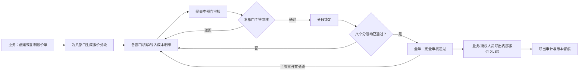

# 内部报价明细协同模块设计说明

> 状态：业务已确认，P1–P2 已实现，P3 导入/附件/导出留存核心已实现；真实样表与嵌入图片仍待业务验收，P4 待实施
> 日期：2026-07-15
> 目标项目：Royal Regent Nexus（Vue 3 + FastAPI + PostgreSQL/Alembic + 集中 IAM）

## 1. 结论与边界

`D:\华登集团\rr2\RR-Portal\apps\业务部\内部报价系统` 的核心不是“给客户套折扣的报价计算器”，而是一套**跨部门内部成本核价单**：业务部建单，八个责任部门分别录入成本，主管逐段审核；全部部门通过后，才允许生成受控的内部报价 Excel。

Royal Regent Nexus 原有的“内部报价”页面只覆盖“客户规则 + 行项价格 + 返点 + 税费 + 双端复算”的轻量报价快照。业务确认后，业务部模块中心的原入口已由本协同模块替换；旧计算服务和组件暂时保留在代码中作为兼容能力，但不再从该入口展示。

| 能力 | 现有内部报价 | 本次设计的内部报价明细协同模块 |
| --- | --- | --- |
| 核心用途 | 客户定价规则实时测算 | 跨部门成本归集、核价、审核与导出 |
| 数据粒度 | 报价行项 | 一张报价单 + 八个部门成本分段 + 版本/附件/审核记录 |
| 审核 | 无流程状态 | 部门主管逐段审核、退回、重开、全单放行 |
| 访问控制 | 业务部权限 | 厂区 + 部门 + 客户范围 + 操作权限 |
| 输出 | 保存计算快照 | 完整内部报价明细 XLSX（含成本、汇总、减税、审核留痕） |

本模块必须接入当前项目的集中登录、IAM、厂区隔离、审计和 Alembic 迁移；**不复制**原系统的 Express、SQLite、cookie-session 和独立用户表。

## 2. 调研依据

已阅读并交叉核对以下实现：

- 原系统：`apps/业务部/内部报价系统` 的数据库结构、认证与客户范围、报价/分段/审核/导出/上传接口、Excel 解析器、XLSX 导出器及前端工作台。
- 当前系统：`src/views/InternalPricingView.vue`、`src/components/modules/sales/InternalPricingPanel.vue`、`src/api/pricing.ts`、`src/lib/pricing/*`、`backend/app/api|services|models|schemas/pricing.py`、现有路由、IAM 与审批工作台。

以下内容是从源码还原的业务规则；“待确认”项不会在后续开发中被默认为既定规则。

## 3. 原系统业务流程



### 3.1 报价单头

业务部创建时填写：货号/报价单号、产品名称、客户、数量、版本标签。原系统也支持复制已有报价单：复制各部门明细，但新单的所有分段均回到未提交状态，避免沿用旧审核结论。

目标模块应保留“新建、从历史版本复制、编辑表头、归档”四种入口；复制必须创建新版本，不能覆盖原报价单。

### 3.2 八个责任分段

| 分段 | 原系统填写内容 | 与其他分段关系 |
| --- | --- | --- |
| 业务部 | 汇率、利润/码点、运输情景、附加税、减税明细、最终汇总 | 汇总所有已提交成本；维护报价单头 |
| 工程/业务 | 模具、电子、五金、辅料、包装材料、纸箱、模具费用 | 模具摘要供啤机、喷油、装配引用 |
| 电子部 | 电子料明细、测试/维修、包装运输、利润和税项 | 电子部明细优先于工程分段中的电子备用明细 |
| 啤机部 | 注塑料、材料损耗、机台/啤价、吹气 | 可从工程模具明细带入重量、材质、机型等字段 |
| 喷油部 | 夹模、移印、散枪、边模、油色、浸油、抹油等工序 | 支持导入喷油核价表及图片 |
| 搪胶 | 单价 × 数量成本行 | 作为独立成本项进入汇总 |
| 车缝 | 物料、用量、物料价、码点、人工、产品分组 | 支持按产品组导入车缝报价单 |
| 装配部 | 旧版人工行，以及按生产排拉工序计算的组装/包装人工 | 生产排拉 Excel 可识别组装与包装/混装分组 |

原库注释仍写“五个部门”，而初始化与接口实际已扩展为八个部门；目标实现只能以八分段作为唯一配置来源，不能保留两套固定数量。

### 3.3 分段状态和整单状态

原系统分段状态为 `empty → filled → approved`，主管可将 `approved` 重开为 `filled`，也可将其驳回为 `rejected`；已通过的分段不能直接修改。整单仅在所有部门均通过时从 `drafting` 变为 `fully_approved`。

目标模块采用下列状态，且由后端统一校验：

| 对象 | 状态 | 说明 |
| --- | --- | --- |
| 分段 | `draft` | 可保存草稿，不进入审核队列 |
| 分段 | `pending_review` | 已提交，等待本部门审批人 |
| 分段 | `approved` | 已审核，业务数据锁定 |
| 分段 | `rejected` | 已退回；必须填写原因，责任部门修订后重新提交 |
| 整单 | `drafting` | 尚有草稿、待审或被退回分段 |
| 整单 | `fully_approved` | 所有必需分段均已通过 |
| 整单 | `exported` | 曾生成受控导出文件；不表示永久锁死 |
| 整单 | `reopened` | 已放行后被合法重开，须再次完成全量审核 |
| 整单 | `archived` | 历史版本，只读保留 |

整单状态应从分段状态推导，不能依赖前端计数。任何“重开”都必须使整单离开 `fully_approved/exported`，并记录重开人、原因、受影响分段和旧导出版本。

## 4. 成本与报价逻辑

### 4.1 必须继承的主要公式

下列是旧系统实际执行的关键口径，后续实现需写成可测试的后端领域服务；前端仅负责实时预览。

| 领域 | 旧系统口径 |
| --- | --- |
| 注塑材料 | `重量(g) × (1 + 材料损耗%) × 材料单价 + 啤价`；默认损耗为 3% |
| 吹气 | `(重量(g) × 磅价 ÷ 454 + 吹气人工 + 披锋) × 利润倍率` |
| 喷油 | 各工序数量 × 单价之和；旧页面显示损耗参数，但汇总未使用该参数 |
| 搪胶 | `单价(HKD) × 数量` |
| 车缝 | `Σ(用量 × 物料价 × 码点) + 人工`；若明细内已有“人工”行，不重复追加组人工 |
| 排拉人工 | `基数(HKD/人) × 工序人数 × 该组团队数 ÷ 该组生产量`；组装和包装/混装分别汇总 |
| 纸箱 | 多纸箱/多平卡逐项计算后按各箱数量分摊 |
| 模具分摊 | `模具总价 ÷ 分摊数量`；美元口径另扣客户模费补贴后再分摊 |
| 多币种 | 原系统以 `RMB→HKD`、`HKD→USD` 快照在报价单内计算；不应读取可变的当天汇率 |
| 出厂价 | 各成本列（注塑/吹气、加工、电子五金、辅料、包装、人工、运费、搪胶、车缝、纸箱）的同币种合计 |
| 减税 | 分类成本 × 对应减税率求和；减税后成本 = 总成本 − 总减税；减税后码数 = 货价 ÷ 减税后成本 |

### 4.2 需在重构时修正的建模方式

旧系统以一个 `payload_json` 保存一个部门的全部字段，页面与导出器各自重复计算，且个别变量名/标签混用 RMB 与 HKD。目标模块应保留灵活的部门明细 JSON 以适配 Excel 模板，但同时建立统一的计算快照：

1. 金额字段必须带 `currency`，转换结果必须带 `fx_snapshot` 和来源时间。
2. 部门明细保存后，由后端生成不可手改的 `section_calculation_snapshot`。
3. 总价、模具分摊、减税、运费与利润统一由 `InternalQuoteCalculator` 计算；导出、审批页和 API 均读取同一结果。
4. 手工覆盖值必须单独保存为 `override_value + override_reason + overridden_by`，不得直接覆写系统推导值。
5. 旧系统“喷油损耗字段未进入汇总”和“导出只写日志、不把整单改为 exported”属于待修正问题，不能照搬。

### 4.3 与现有轻量定价引擎的关系

当前 `src/lib/pricing` / `backend/app/services/pricing.py` 的顺序仍可复用在最终对外报价层：

`行级加价 → 百分比折扣 → 固定减免 → 小计 → 阶梯返点 → 税费`。

协同成本核价形成“内部成本/出货底价”后，再由现有客户规则引擎计算客户报价。两者之间使用明确的输入输出契约，不能把八部门成本逻辑塞进当前的 `PricingLine`。

## 5. 权限、客户与厂区边界

### 5.1 P1 实际 IAM 权限

因用户明确要求“替换原模块”，P1 沿用现有 `internal_pricing:*` 权限家族与路由授权，避免现有业务账号失去入口；新增操作权限如下：

| 权限 | 范围 | 用途 |
| --- | --- | --- |
| `internal_pricing:read` | 厂区 + 业务部 | 查看报价单、八分段及审计记录 |
| `internal_pricing:create` | 厂区 + 业务部 | 按厂区/车间新建报价单 |
| `internal_pricing:edit` | 厂区 + 业务部 | 保存或提交成本分段 |
| `internal_pricing:review` | 厂区 + 业务部 | 通过、退回、重开分段；提交人与审核人不得相同 |
| `internal_pricing:export` | 厂区 + 业务部 | 八段全部通过后导出 XLSX |

权限已登记到集中 IAM 权限目录、角色模板、权限标签和 `permission_scope_policy`。`车间业务跟客` 默认具备读、建、填报和导出权限；`车间业务主管` 额外具备审核权限。启动时的一次性授权种子会把新增操作权限补到既有两个销售角色，并刷新受影响用户的授权版本。后端以 `ensure_permission_in_scope()` 按 `factory_id + sales-business` 决策；前端路由和按钮只负责体验，不作为安全边界。

### 5.2 客户范围

旧系统以 `user_customers` 过滤报价单，空范围用户不能查看任何客户报价，管理员可看全部；未填写客户的报价单仅管理员可见。目标系统应保留这一原则，新增厂区绑定的客户授权表：

`internal_quote_user_customers(user_id, factory_id, customer_id)`。

报价单、分段、附件、审核、导出和审计记录都必须带 `factory_id`；跨厂区查看沿用当前项目“显式跨厂区只读授权、成本默认脱敏”的规则。客户范围与厂区范围必须同时满足。

## 6. 数据模型建议

| 表 | 关键字段 | 目的 |
| --- | --- | --- |
| `internal_quotes` | `id, factory_id, quote_code, customer_id, product_no, product_name, qty, revision_no, status, created_by, created_at` | 报价单头与版本 |
| `internal_quote_sections` | `id, quote_id, department, status, payload_json, calc_snapshot_json, revision, submitted_by/at, reviewed_by/at, review_comment` | 八个部门的当前工作版本 |
| `internal_quote_section_revisions` | `section_id, revision, payload_json, calc_snapshot_json, changed_by, change_reason, created_at` | 不可变历史，支持差异查看与追溯 |
| `internal_quote_reviews` | `quote_id, section_id, action, decision, comment, actor_id, created_at` | 审核/驳回/重开事件 |
| `internal_quote_import_batches` | `quote_id, import_type, target_department, source_file_name, source_sha256, preview_json, status, created/confirmed_by` | Excel 解析预览与确认批次；预览不修改报价 |
| `internal_quote_attachments` | `quote_id, factory_id, department, file_name, content_type, size_bytes, sha256, content, uploaded_by/at` | 报价附件与内容校验 |
| `internal_quote_export_files` | `quote_id, factory_id, file_name, section_revisions_json, sha256, status, content, exported_by/at, superseded_at` | 受控导出文件留存与复现 |
| `internal_quote_reference_sets` | `factory_id, type, version, data_json, active_from, active_to` | 材料、机台、运费、汇率等可版本化参考数据 |
| `internal_quote_user_customers` | `user_id, factory_id, customer_id` | 客户可见范围 |

建议唯一约束为 `(factory_id, customer_id, product_no, revision_no)`；`quote_code` 作为系统不可变编号。原系统的全局 `quote_no UNIQUE` 会错误阻止不同客户或厂区使用相同货号，不应直接沿用。

## 7. API 与页面接入

### 7.1 后端

新增 `backend/app/models|schemas|services|api/internal_quote.py`，由 `backend/app/main.py` 注册路由；所有写操作使用事务和后端计算。建议接口如下：

```text
GET    /api/internal-quotes?factory_id=&customer_id=&status=&keyword=
POST   /api/internal-quotes
GET    /api/internal-quotes/{quote_id}
PATCH  /api/internal-quotes/{quote_id}/header
POST   /api/internal-quotes/{quote_id}/clone
POST   /api/internal-quotes/{quote_id}/archive

PUT    /api/internal-quotes/{quote_id}/sections/{department}          # 保存草稿，带 revision
POST   /api/internal-quotes/{quote_id}/sections/{department}/submit
POST   /api/internal-quotes/{quote_id}/sections/{department}/review  # approve/reject
POST   /api/internal-quotes/{quote_id}/sections/{department}/reopen
GET    /api/internal-quotes/{quote_id}/timeline

POST   /api/internal-quotes/{quote_id}/imports/{type}/preview
GET    /api/internal-quotes/{quote_id}/imports
POST   /api/internal-quotes/{quote_id}/imports/{batch_id}/confirm
POST   /api/internal-quotes/{quote_id}/attachments
GET    /api/internal-quotes/{quote_id}/attachments
GET    /api/internal-quotes/{quote_id}/attachments/{attachment_id}/download
GET    /api/internal-quotes/{quote_id}/export
GET    /api/internal-quotes/{quote_id}/exports
GET    /api/internal-quotes/{quote_id}/exports/{export_id}/download
```

保存分段需采用乐观锁：客户端提交 `revision`，服务端不匹配时返回 `409` 和最新版本摘要。原系统只有“有人改过”的提示，仍会覆盖数据，目标模块必须阻止静默覆盖。

Excel 导入统一采用“上传 → 解析预览 → 用户确认合并 → 保存分段”的模式，不允许解析完成即写入正式报价单；这与当前啤办 Excel 预览流程一致。

### 7.2 前端

保留路径 `/modules/sales-business/internal-pricing`，并直接用协同明细工作台替换旧轻量报价页面：

```text
src/views/InternalPricingView.vue                         # 业务部内部报价明细入口
src/components/modules/sales/InternalQuotePanel.vue       # 车间筛选、单头、八分段、审批、时间线、导出
src/api/internalQuote.ts
src/types/internalQuote.ts
```

页面沿用 `SalesModuleWorkbench.vue` 的业务部视觉和厂区上下文。列表、详情、审批和导出均读取真实 API；`enterpriseMock.ts` 仅保存模块卡说明，不承载报价业务数据。

## 8. Excel 导入与受控导出

需兼容并逐步验证下列原系统模板类型：

- 模具报价单/合同：识别模号、名称、材质、颜色、穴数、重量、周期、机型、模具费用及嵌入图片。
- 电子报价单：识别零件、规格、用量、单价、子项，以及测试、贴片、人工、税项等汇总值。
- 车缝报价单：识别产品分组、物料、人工与码点。
- 生产排拉工序表：识别工序名称、人数、产能，并区分组装与包装/混装。
- 喷油核价表：识别七类工序、单价、位置、备注和嵌入图片。

导出前的硬门槛：全部必需分段状态为 `approved`、没有未处理的并发冲突、所有成本快照计算成功、当前用户同时具备客户/厂区/导出权限。导出后保存文件校验和、模板版本、分段版本集合和导出人；若后续重开，原导出仍可下载但必须标注“已被后续版本取代”。

P3 当前实现采用 `xlsx/xlsm → 自适应表头识别 → 预览批次 → 用户确认追加或替换 → revision 乐观锁保存`。五类解析器分别写入工程、电子、车缝、装配和喷油分段；预览批次只保存解析 JSON、源文件名和 SHA-256，不保存源 Excel，也不会改变分段 revision。附件允许 Excel、PDF、Word 和常见图片，单个不超过 10MB，按当前部门归档并以数据库 BLOB 留存。每次受控导出保存完整 XLSX、SHA-256、导出人、时间和八分段 revision 集合；再次导出或审核重开时，旧文件转为 `superseded`，但仍可下载追溯。

当前兼容边界：旧版二进制 `.xls` 尚未接入；模具/喷油工作簿中的嵌入图片尚未自动抽取，现阶段应通过附件独立上传；五类解析器已用合成模板覆盖字段映射，但仍需用业务部正式样表确认合并单元格、复杂多表头和币种列口径。

## 9. 分阶段实施建议

| 阶段 | 范围 | 完成标准 |
| --- | --- | --- |
| P0：规则确认 | 确认八部门是否均为必需、审批人、客户/货号唯一范围、币种、税与减税口径、正式 Excel 模板 | 业务签字的字段/公式清单 |
| P1：工作流骨架 | 表头、厂区/车间维度、八分段、保存/提交/审核/重开、审计、列表、受控导出 | **已实现**；一张单可完成全流程，无静默越权或覆盖 |
| P2：成本与参考数据 | 各部门表单、统一计算服务、汇率与材料/机台快照、实时总计 | **核心已实现**；前后端计算用例一致，金额可溯源 |
| P3：导入导出 | 五类 Excel 预览导入、附件、受控 XLSX 模板导出 | **核心已实现**；待真实样表、复杂表头和嵌入图片验收 |
| P4：集成与治理 | 轻量客户报价衔接、版本对比、审批工作台、经营报表、归档策略 | 内部成本可安全送入报客价流程 |

每阶段必须覆盖：后端权限/状态机/并发/厂区客户隔离测试，前端 API 契约测试、关键计算单测、XLSX 模板回归和完整构建验证。

## 10. 已识别风险与待业务确认

1. 八个部门是否对所有产品都必填；若不是，需要配置“按产品类别/客户启用的必需分段”，不能把部门数硬编码成 8。
2. 最终核价与导出人是谁：业务主管、工程主管，还是财务/总经理加签；原系统仅做部门主管审核。
3. 喷油损耗参数在原页面存在却没有参与汇总；P2 按原系统“全面取消损耗”的实际逻辑处理，喷油仅汇总工序数量与单价，不再展示该损耗输入。
4. 原系统同一字段存在人民币/港币显示与变量混用。正式模板须确认每一列的币种、四舍五入位置和精度。
5. 模具费用、减税率、印尼运费及客户补贴属于高敏感金额。它们必须有版本、覆盖理由和审计，且不能因跨厂区查看而泄露。
6. 客户主数据当前尚未作为 Nexus 的独立后端主数据维护；P1 前需确认客户来源，或先以报价单客户主数据表落地。

## 11. 当前阶段交付

P1 已创建内部报价单、八分段和审计表，接入 FastAPI、集中 IAM、Alembic 与 Vue 工作台，并替换业务部原内部报价入口。车间为必填维度：华兴仅使用统一车间“华兴”，不区分新/老车间；华康 A、华康 B、华登使用各自车间目录。唯一约束、列表筛选、详情、审计和导出文件名均保留车间信息。

P2 已把通用成本行升级为配置化部门表单和统一服务端计算器，并保留 P1 通用行兼容路径。新报价会冻结 `rr2-2026-v1` 参考快照（人民币/港币 0.85、港币/美元 7.8、18 项材料价和 13 档机型台班价）；每次分段计算保存公式版本、逐行公式与金额、HKD/RMB/USD 合计、警告和完整参考快照。前端使用同一规则实时预览，服务端仍是最终金额权威。

已落地的专用公式包括：工程模具摊销、电子零件及邦定/SMT/人工/测试/包装/利润/税差、注塑料价与啤价、吹气人工/水口/利润倍数、喷油与搪胶工序、车缝材料加成及人工防重算、装配台班人数与产量。

P3 已新增五类 Excel 预览解析器、确认追加/替换、导入批次审计、按分段附件、附件下载、受控导出文件留存、SHA-256 和旧版本取代标记。工作台在工程、电子、喷油、车缝和装配分段内直接显示导入预览，并在报价详情下方展示附件与导出历史。客户级授权、不可变分段差异版本、参考主数据维护和下游报客价集成仍属于 P4。

## 12. P1 验收摘要

- 新建报价必须选择当前厂区下的合法车间，并自动生成业务、工程、电子、啤机、喷油、搪胶、车缝、装配八个分段。
- 分段支持草稿、提交、审核通过、退回和重开；待审核和已通过数据由后端锁定。
- 保存使用 `revision` 乐观锁；版本冲突返回 `409`，不会静默覆盖。
- 提交人与审核人必须为不同账号；八段全部通过后，整单才进入 `fully_approved`。
- 只有 `fully_approved/exported` 报价可生成受控 XLSX，导出后整单标记为 `exported` 并写入审计。
- 已验证华兴统一车间目录、历史新/老车间数据合并及同号同版本碰撞保留、八段全流程、部门公式服务器复算、权限拒绝、异人复核、XLSX 内容，以及 Alembic 升级/回滚/再升级。

## 13. P2 验收摘要

- 八个分段显示各自专用字段；新增成本行会按当前部门初始化参数，旧通用成本行仍按原公式复算。
- 参考快照随报价分段保存，后续默认参考表变化不会改写历史报价；材料或机型匹配失败会返回计算警告。
- 前端实时预览与后端权威计算分别有同公式单测；保存后以服务器返回的逐行金额、折合币种与公式版本为准。
- 0017 将华兴 `new-workshop` / `old-workshop` 统一迁移到 `huaxing-workshop / 华兴`；若历史数据在合并后违反唯一约束，保留首个版本并为后续记录生成 `-合并N` 版本标签，避免数据丢失。

## 14. P3 核心验收摘要

- 模具、电子、车缝、装配、喷油五类 `xlsx/xlsm` 均先生成可核对的行项、参数、警告和源文件 SHA-256；预览前后正式分段 revision 与 payload 保持不变。
- 用户确认时可选择“追加”或“替换”，服务端按目标分段当前 revision 乐观锁保存；同一预览批次不能重复确认。
- 附件按报价和部门归档，下载响应携带 SHA-256；格式白名单与 10MB 上限由后端校验。
- 受控导出保存 XLSX 二进制、SHA-256 和全部分段 revision；重开分段后旧导出自动标记为历史版并保留下载能力。
- Alembic `20260716_0018` 创建导入批次、附件和导出留存三张表；已验证迁移单头、PostgreSQL 离线 SQL，以及 SQLite `upgrade → downgrade 0017 → upgrade`。
- 五类解析、导入确认、附件与导出留存后端专项 12 条用例通过；完整前端 44 个测试文件、177 条用例及生产构建通过。真实业务样表和嵌入图片抽取单列为下一次业务验收项。
