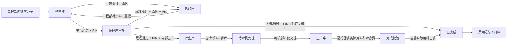

# 啤办单模块业务流程说明

本文档用于梳理 Royal Regent Nexus 当前啤办单模块的业务闭环。它以当前代码实现为准，覆盖前端页面、业务规则、后端 API、状态流转、角色分工、字段口径、费用逻辑和常见异常。

最后更新：2026-07-03

## 1. 模块定位

啤办单模块是工程部发起试啤 / 试模 / 试色需求，并推动主管、经理、仓库、啤机部完成审核、领料、生产回填、费用核算和归档的业务模块。

当前模块不是单纯的进度页，而是一个啤办单闭环：

```text
工程开单
  -> 主管审核
  -> 经理终审
  -> 内部生产路径：仓库领料 -> 啤机生产 -> 完成归档
  -> 外厂 / 模厂路径：经理终审后直接完成
```

模块当前主入口：

```text
/modules/molding-sample?factory=huakang-a&order_id=BP-62437
```

URL 中的两个参数含义：

| 参数 | 含义 | 示例 |
|---|---|---|
| `factory` | 当前厂区 | `huakang-a` |
| `order_id` | 当前打开的啤办单编号 | `BP-62437` |

页面布局上，左侧是`单据列表`，右侧是`当前单据`。当有多张单据时，应通过左侧列表筛选并点击切换，URL 会带上对应的 `order_id`。

## 2. 一句话业务规则

工程部负责开单和补资料；主管负责第一道业务审核；经理负责终审、价格口径和敏感权限；仓库负责领料与库存扣减；啤机部负责内部生产回填；系统根据状态、路径和费用完整性判断能否完成归档。

## 3. 端到端流程图



## 4. 角色分工

| 角色 | 主要职责 | 当前页面入口 | 关键限制 |
|---|---|---|---|
| 工程部 | 新建单据、维护单头、维护工程明细、提交审核、处理驳回 | 基础资料、明细资料、提交 / 保存 / 处理驳回、审核轨迹 | 进入锁定状态后普通工程部不能改删单据 |
| 主管 | 审核待审核单、通过、驳回、填写审核意见 | 待审核单、通过、驳回、审核意见 | 必须是单据指定主管，正式动作需要 PIN |
| 经理 | 终审、外厂路径确认、价格口径、汇率、PIN 管理、敏感审计 | 终审、价格口径、敏感操作审计、PIN 管理 | 终审、改价、重置主管 PIN 等敏感动作需要经理 PIN |
| 仓库 | 生成领料单、维护库存批次、出库、查看库存流水 | 待领料、批次选择、出库登记、库存流水 | 出库必须选择同原料且库存足够的批次 |
| 啤机部 | 开始处理、回填实际用料、填写啤办费、标记完成 | 待生产单、开始处理、实际用料、完成校验 | 内部生产单必须每条明细都有实际用料才可完成 |
| 汇总 | 查看材料费、啤办费、总费用、归档状态 | 费用汇总、归档单据、材料成本、生产成本 | 费用缺料价、缺实际用料、缺啤办费时不能视为完整归档 |

正式界面不让普通用户自由切换角色。当前页面显示的是基于当前登录身份的可用入口；角色 Tab 只保留在管理员调试入口或演示模式。

## 5. 单据状态

当前系统支持 6 个啤办单状态：

| 状态 | 业务含义 | 当前处理人 | 可进入的下一状态 |
|---|---|---|---|
| `待审核` | 工程部已开单，等待主管审核 | 指定主管 | `待经理审核`、`已驳回` |
| `待经理审核` | 主管已通过，等待经理终审 | 经理 | 内部单：`待生产`；外厂 / 模厂单：`已完成`；也可 `已驳回` |
| `待生产` | 经理已通过内部生产单，等待啤机部处理 | 啤机部 / 仓库 | `生产中` |
| `生产中` | 啤机部正在生产并回填数据 | 啤机部 | `已完成` |
| `已完成` | 单据业务流程已完成 | 汇总 / 归档 | 费用资料齐全后可归档 |
| `已驳回` | 被主管或经理驳回 | 工程部 | `待审核` |

状态流转规则：

| 动作 | 前置状态 | 操作角色 | 后置状态 | 规则 |
|---|---|---|---|---|
| 主管通过 | `待审核` | 指定主管 | `待经理审核` | 需要主管 PIN |
| 主管驳回 | `待审核` | 指定主管 | `已驳回` | 需要主管 PIN，并记录驳回原因 |
| 经理通过 | `待经理审核` | 经理 | 内部单：`待生产`；外厂 / 模厂单：`已完成` | 需要经理 PIN |
| 经理驳回 | `待经理审核` | 经理 | `已驳回` | 需要经理 PIN，并记录驳回原因 |
| 工程重提 | `已驳回` | 工程部 | `待审核` | 清空驳回原因，重新进入主管审核 |
| 开始处理 | `待生产` | 啤机部 | `生产中` | 只适用于内部生产单 |
| 标记完成 | `生产中` | 啤机部 | `已完成` | 内部单必须所有明细有 `actual_weight_kg > 0` |

## 6. 内部生产与外厂 / 模厂路径

单据路径由 `发至` 和 `车间` 判断：

| 条件 | 路径 |
|---|---|
| `send_to = 发至湖南` | 外厂路径 |
| `send_to = 发至模厂` | 外厂 / 模厂路径 |
| `workshop = 模厂` | 外厂 / 模厂路径 |
| 以上都不满足 | 内部生产路径 |

两种路径的差异：

| 项目 | 内部生产 | 外厂 / 模厂 |
|---|---|---|
| 经理通过后状态 | `待生产` | `已完成` |
| 是否需要仓库领料 | 是 | 通常不走内部领料 |
| 是否需要啤机部回填 | 是 | 不要求内部啤机部逐行回填 |
| 是否计算内部啤办费 | 是 | 不适用 |
| 完成卡点 | 每条明细必须有实际用料 | 经理终审完成即可 |
| 材料用量口径 | 优先实际用料 kg | 优先领料 kg，其次预计需料 kg |

## 7. 开单流程

### 7.1 新建方式

当前支持两种开单方式：

| 方式 | 入口 | 适用场景 |
|---|---|---|
| 人工新建 | 页面顶部`新建啤办单` | 工程部手填新单 |
| Excel 导入 | 页面顶部`导入 Excel` | 使用标准啤办单模板批量导入 |

人工新建成功后，系统会保存到后端，并自动切换 URL：

```text
/modules/molding-sample?factory=<厂区>&order_id=<新单据编号>
```

如果当前处于离线演示模式，人工表单可以打开填写，但不能保存正式业务数据。

### 7.2 单头字段

| 页面字段 | 后端字段 | 是否关键 | 说明 |
|---|---|---|---|
| 单据编号 | `order.id` | 必填 | 如 `BP-62437` |
| 产品编号 | `order.order_number` | 必填 | 如 `62437` |
| 文件编号 / 订单编号 | `order.doc_number` | 必填 | 如 `W-G026-00` |
| 客户名称 | `order.client_name` | 必填 | 如 `BuzzBee` |
| 产品名称 | `order.product_name` | 必填 | 如 `链条枪` |
| 落单日期 / 开单日期 | `order.date` | 必填 | 业务开单日期 |
| 阶段 | `order.stage` | 建议填写 | `T0`、`EP`、`FEP`、`PP` |
| 用途 | `order.order_type` | 默认 | `啤办`、`试模`、`试色` |
| 车间 | `order.workshop` | 必填 | 当前人工入口为手输 |
| 发至 | `order.send_to` | 可空 | 手输；`内部`保存为空字符串 |
| 主管 | `order.supervisor` | 必填 | 指定主管 |
| 落单人 | `order.eng_name` | 必填 | 工程开单人 |
| 注意事项 | `order.reason` | 可选 | 样办、颜色、刮花等注意事项 |

### 7.3 明细字段

| 页面字段 | 后端字段 | 维护角色 | 说明 |
|---|---|---|---|
| 客模具编号 | `item.mold_id` | 工程部 | 客户或模具编号 |
| 模具名称 | `item.mold_name` | 工程部 | 模具 / 部件名称 |
| 机型 | `item.machine_type` | 工程部 | 人工新建默认 `待工程确认` |
| 所需用料 | `item.material` | 工程部 | 如 `HIPS 425` |
| 所需颜色 + PMS | `item.color` | 工程部 | 人工入口会合并为 `颜色 / PMS xxxx` |
| 色粉编号 | `item.pigment_no` | 工程部 | 色粉编号 |
| 啤 / 套 | `item.quantity` | 工程部 | 如 `1/1` |
| 啤数 | `item.shoot_qty` | 工程部 | 必须大于 0 |
| 整啤毛重 g | `item.gross_weight_g` | 工程部 | 可选数字 |
| 所需用量 kg | `item.required_material_kg` | 工程部 | 可选数字，仓库领料参考 |
| 需办日期 | `item.completion_time` / `item.mold_return_time` | 工程部 | 人工入口两个字段同值 |
| 备注 | `item.notes` | 工程部 | 可选 |
| 领料单号 | `item.receipt_no` | 仓库 / 系统回填 | 领料后回写 |
| 领料 kg | `item.collected_weight_kg` | 仓库 / 啤机部 | 外厂费用可参考 |
| 实际用料 kg | `item.actual_weight_kg` | 啤机部 | 内部完成硬卡点 |
| 料费 HKD | `item.actual_amount_hkd` | 系统计算 / 可回填 | 材料费 |
| 啤办费 RMB | `item.injection_cost` | 啤机部 | 内部生产费用 |
| 啤办费 HKD | `item.injection_cost_hkd` | 系统计算 | 按汇率换算 |
| 汇率 | `item.exchange_rate_at_save` | 系统记录 | 保存啤办费时的 RMB -> HKD 汇率 |

## 8. 审核流程

### 8.1 主管审核

主管只处理 `待审核` 的单据。

通过时：

```text
待审核 -> 待经理审核
```

驳回时：

```text
待审核 -> 已驳回
```

驳回必须写明原因，工程部后续根据驳回原因补资料并重提。

后端校验：

| 校验 | 规则 |
|---|---|
| 状态 | 必须是 `待审核` |
| 角色 | 必须是 `主管` |
| 人员 | 必须等于单据上的 `supervisor` |
| PIN | 必须有效，默认 PIN 必须先修改 |

### 8.2 经理终审

经理只处理 `待经理审核` 的单据。

通过时：

| 单据路径 | 后置状态 |
|---|---|
| 内部生产 | `待生产` |
| 外厂 / 模厂 | `已完成` |

驳回时：

```text
待经理审核 -> 已驳回
```

经理还负责：

- 维护原料价格表。
- 维护 RMB -> HKD 汇率。
- 重置主管 PIN。
- 查看敏感操作审计。

## 9. 驳回与重提

驳回会记录在单据的 `reject_reason` 和审核轨迹中。

工程部处理驳回时：

1. 查看驳回原因。
2. 修改单头或明细资料。
3. 点击重提。
4. 状态回到 `待审核`。
5. 驳回原因清空，重新走主管审核。

规则：

| 动作 | 允许角色 | 前置状态 | 后置状态 |
|---|---|---|---|
| 工程重提 | 工程部 | `已驳回` | `待审核` |

## 10. 仓库领料流程

内部生产单进入 `待生产` 后，仓库可以围绕明细的原料和预计用量生成领料单。

### 10.1 领料单

领料单字段：

| 字段 | 含义 |
|---|---|
| `req_number` | 领料单号，格式 `LL-YYYYMMDD-001` |
| `order_id` | 啤办单编号 |
| `order_number` | 产品编号 |
| `material` | 原料 |
| `requested_weight_kg` | 申请重量 |
| `applicant` | 申请人 |
| `notes` | 明细备注，当前用于区分重复明细 |
| `status` | `待出库` 或 `已出库` |
| `inventory_batch_id` | 出库批次 |
| `inventory_batch_no` | 出库批次号 |

重复控制：

如果同一张单、同一原料、同一备注已经生成领料单，后端会拒绝重复生成。

### 10.2 库存批次

仓库可以创建库存批次：

| 字段 | 含义 |
|---|---|
| 原料 | 批次所属原料 |
| 批次号 | 仓库批次编号 |
| 位置 | 存放位置 |
| 初始重量 kg | 初始库存 |
| 可用重量 kg | 当前可出库库存 |

创建批次后系统会写一条库存流水：

```text
新增批次
```

### 10.3 出库扣减

领料单从 `待出库` 改为 `已出库` 时：

1. 必须选择库存批次。
2. 批次原料必须等于领料单原料。
3. 批次可用重量必须大于或等于申请重量。
4. 系统扣减批次可用重量。
5. 系统写库存流水：`出库扣减`。
6. 领料单记录批次 ID、批次号和出库时间。

如果库存不足，后端返回错误，领料单不会出库。

### 10.4 撤回或删除

如果已出库领料单被退回 `待出库`：

- 系统恢复库存。
- 系统写库存流水：`撤回出库`。

如果删除已出库领料单：

- 系统恢复库存。
- 系统写库存流水：`删除领料单恢复`。

## 11. 啤机部生产流程

内部生产单经理通过后进入 `待生产`。啤机部处理流程：

```text
待生产 -> 开始处理 -> 生产中 -> 回填实际用料 / 啤办费 -> 标记完成 -> 已完成
```

啤机部可维护的核心数据：

| 字段 | 说明 |
|---|---|
| `actual_weight_kg` | 实际用料 kg，内部完成硬卡点 |
| `injection_cost` | 啤办费 RMB |
| `actual_amount_hkd` | 料费 HKD，可由系统按料价计算 |
| `receipt_no` | 领料单号 |
| `collected_weight_kg` | 领料重量 kg |

内部生产完成条件：

```text
每一条明细 actual_weight_kg > 0
```

如果有任一明细缺实际用料，系统不允许标记完成，并会显示缺失的明细 ID。

## 12. 费用计算口径

费用分为材料费和啤办费。

### 12.1 材料费

材料费公式：

```text
材料费 HKD = 用料 kg * 2.20462 * 原料单价 HKD/lb
```

用料 kg 的取值：

| 路径 | 用料 kg 取值 |
|---|---|
| 内部生产 | `actual_weight_kg` |
| 外厂 / 模厂 | 优先 `collected_weight_kg`，否则 `required_material_kg` |

原料单价由经理维护。系统会对原料名做归一化匹配，例如：

- 去掉空格、横线、括号、下划线。
- 全角数字转半角数字。
- `度` 统一为 `°`。
- 混合料如 `30% ABS抽粒 + 70% ABS 750W` 会按最高比例部分匹配价格。

### 12.2 啤办费

内部生产单有啤办费：

```text
啤办费 HKD = 啤办费 RMB * RMB -> HKD 汇率
```

外厂 / 模厂单的内部啤办费为 `0` 或不适用。

### 12.3 归档费用完整性

已完成单据进入汇总时，系统会检查：

| 检查项 | 说明 |
|---|---|
| 缺料价 | 有实际 / 参考用料，但匹配不到原料价格 |
| 缺实际用料 | 内部生产单缺 `actual_weight_kg` |
| 缺啤办费 | 内部生产单缺 `injection_cost` / `injection_cost_hkd` |

只有当单据已完成且费用资料齐全，才可视为归档就绪。

## 13. PIN 与敏感操作

当前系统种子用户：

| 用户 | 角色 | 默认 PIN |
|---|---|---|
| 李主管 | 主管 | `1234` |
| 王经理 | 经理 | `1234` |

默认 PIN 不能直接执行敏感动作，必须先修改。

PIN 规则：

| 规则 | 当前实现 |
|---|---|
| PIN 哈希 | PBKDF2-HMAC-SHA256 |
| 默认 PIN | `1234` |
| 首次使用 | 必须修改默认 PIN |
| 失败次数 | 5 次失败后锁定 |
| 锁定时间 | 15 分钟 |
| 主管 PIN | 用于主管审核 / 驳回 |
| 经理 PIN | 用于经理终审、改价、重置主管 PIN、锁定单据改删 |

敏感审计会记录：

- 经理更新价格口径。
- 修改 PIN。
- 经理重置主管 PIN。

审计列表当前返回最新 200 条。

## 14. 编辑和删除规则

锁定状态：

```text
待经理审核、待生产、生产中、已完成
```

编辑 / 删除规则：

| 单据状态 | 工程部 | 指定主管 | 经理 |
|---|---|---|---|
| 未锁定，如 `待审核`、`已驳回` | 可改删 | 可改，需 PIN | 可改，需 PIN |
| 锁定状态 | 不可改删 | 指定主管可改，需 PIN | 可改，需 PIN |

后端更新整张单据时会：

1. 校验 `order_id` 一致。
2. 保留当前状态和创建时间。
3. 更新单头。
4. 删除旧明细并按新 payload 重建明细。
5. 写一条`修改啤办单`审核记录。

## 15. 单据列表与多单查看

当前页面的多单逻辑：

| 区域 | 功能 |
|---|---|
| 左侧 `单据列表` | 展示多张啤办单，支持筛选 |
| 右侧 `当前单据` | 展示当前 `order_id` 对应的单据 |
| 快捷导航 | 可回到单据列表或跳到单头、角色工作台、明细、审核轨迹 |
| URL | 用 `factory + order_id` 精确打开一张单 |

列表筛选条件：

| 筛选项 | 说明 |
|---|---|
| 状态 | 待审核、待经理审核、待生产、生产中、已完成、已驳回 |
| 厂区 | 华康 A、华康 B、华登、华兴 |
| 关键词 | 客户、产品编号、订单编号、单据编号、产品名称 |
| 工程师 | 按开单人筛选 |
| 主管 | 按指定主管筛选 |
| 日期范围 | 按开单日期筛选 |
| 异常项 | 缺实际用料、缺啤办费、缺料价、库存不足、逾期 |

## 16. API 参考

前端 Axios base URL 是 `/api`，所以下表同时列出前端调用路径和后端完整路径。

| 业务 | 前端路径 | 后端完整路径 | 方法 |
|---|---|---|---|
| 查询单据列表 | `/injection` | `/api/injection` | GET |
| 查询单张单据 | `/injection/{order_id}` | `/api/injection/{order_id}` | GET |
| 新建单据 | `/injection` | `/api/injection` | POST |
| 编辑单据 | `/injection/{order_id}` | `/api/injection/{order_id}` | PUT |
| 删除单据 | `/injection/{order_id}` | `/api/injection/{order_id}` | DELETE |
| 导出 Excel | `/injection/{order_id}/export-excel` | `/api/injection/{order_id}/export-excel` | GET |
| 导入 Excel | `/injection/import-excel` | `/api/injection/import-excel` | POST |
| 状态流转 | `/injection/{order_id}/status` | `/api/injection/{order_id}/status` | PATCH |
| 明细回填 | `/injection/{order_id}/items` | `/api/injection/{order_id}/items` | PATCH |
| 查询价格 | `/material-prices` | `/api/material-prices` | GET |
| 经理更新价格 | `/manager-update-prices` | `/api/manager-update-prices` | POST |
| 查询角色 | `/roles` | `/api/roles` | GET |
| 校验 PIN | `/verify-pin` | `/api/verify-pin` | POST |
| 修改 PIN | `/change-pin` | `/api/change-pin` | POST |
| 重置主管 PIN | `/reset-supervisor-pin` | `/api/reset-supervisor-pin` | POST |
| 查询敏感审计 | `/sensitive-audit-logs` | `/api/sensitive-audit-logs` | GET |
| 查询领料单 | `/requisitions` | `/api/requisitions` | GET |
| 新增领料单 | `/requisitions` | `/api/requisitions` | POST |
| 更新领料状态 | `/requisitions/{id}/status` | `/api/requisitions/{id}/status` | PATCH |
| 删除领料单 | `/requisitions/{id}` | `/api/requisitions/{id}` | DELETE |
| 查询库存批次 | `/inventory-batches` | `/api/inventory-batches` | GET |
| 新增库存批次 | `/inventory-batches` | `/api/inventory-batches` | POST |
| 查询库存流水 | `/inventory-movements` | `/api/inventory-movements` | GET |
| 查询已完成费用汇总 | `/injection-total-costs` | `/api/injection-total-costs` | GET |

## 17. 常见异常

| 异常 | 后端行为 | 业务处理 |
|---|---|---|
| 单据编号重复 | 返回 409 | 换单据编号或打开已有单据 |
| 单据不存在 | 返回 404 | 检查 URL 的 `order_id` |
| 主管不是指定主管 | 返回 403 | 改用单据绑定主管账号 |
| 经理 / 主管 PIN 错误 | 返回 401 | 重新输入或修改 PIN |
| 默认 PIN 未修改 | 返回 403 | 先修改默认 PIN |
| PIN 多次失败 | 返回 429 | 15 分钟后重试 |
| 工程部改锁定单 | 返回 403 | 由主管或经理带 PIN 修改 |
| 领料重量 <= 0 | 返回 400 | 填写正确申请重量 |
| 重复生成领料单 | 返回 409 | 使用已有领料单 |
| 库存批次不存在 | 返回 404 | 先建批次或重新选择 |
| 批次原料不匹配 | 返回 400 | 选择同原料批次 |
| 库存不足 | 返回 400 | 补库存或调整领料重量 |
| 内部单实际用料缺失 | 返回 400 | 啤机部补齐明细实际用料 |

## 18. 当前实现边界

已经实现或已在当前模块中体现：

- 单据列表按 `factory + order_id` 精确打开单据。
- 人工新建啤办单入口。
- 标准 Excel 导入 / 导出。
- 单头和明细字段映射。
- 主管 / 经理审核和驳回。
- 内部生产与外厂 / 模厂路径分叉。
- PIN 校验、默认 PIN 修改、失败锁定。
- 经理价格表和汇率维护。
- 仓库领料单、库存批次、出库扣减、库存流水。
- 啤机部实际用料和啤办费回填。
- 材料费、啤办费、总费用汇总。
- 审核轨迹和敏感审计记录。

仍需要后续接入或强化：

- 真实登录用户和组织权限，目前页面仍有当前用户 facade。
- 更完整的明细行新增、删除、复制、排序后端细粒度接口。
- ERP / 仓库真实库存同步。
- 历史自由格式 Excel 的自动识别映射。
- 审核 SLA、逾期提醒和系统通知。
- 完整归档、反归档、打印模板和正式报表。
- 生产环境下隐藏演示 / 调试入口。

## 19. 建议的业务使用顺序

### 工程部

1. 从工程模块进入啤办单模块。
2. 在左侧单据列表查看已有单，或点击`新建啤办单`。
3. 填写单头：单据编号、产品编号、文件编号、客户、产品名称、落单日期、车间、主管、落单人。
4. 填写明细：客模具编号、模具名称、用料、颜色、啤数、需办日期等。
5. 保存并提交主管审核。
6. 如果被驳回，查看驳回原因，补资料后重提。

### 主管

1. 查看`我的待办`中的待审核单。
2. 核对单头、明细、用料、颜色、交期和注意事项。
3. 输入 PIN。
4. 通过或驳回。

### 经理

1. 查看待经理审核单。
2. 判断内部生产还是外厂 / 模厂路径。
3. 输入 PIN 后终审。
4. 必要时维护原料价格和汇率。
5. 处理主管 PIN 重置和敏感审计。

### 仓库

1. 对内部生产单生成领料单。
2. 维护库存批次。
3. 选择同原料且库存足够的批次出库。
4. 确认库存流水和领料状态。

### 啤机部

1. 对 `待生产` 单点击开始处理。
2. 在 `生产中` 回填每条明细的实际用料 kg。
3. 填写啤办费 RMB。
4. 所有明细满足完成条件后标记完成。

### 汇总 / 管理

1. 查看已完成单据费用汇总。
2. 检查是否缺料价、缺实际用料、缺啤办费。
3. 费用完整后归档。

## 20. 代码索引

| 内容 | 文件 |
|---|---|
| 啤办单页面 | `src/views/MoldingSampleView.vue` |
| 前端业务规则 | `src/lib/moldingSampleBusiness.ts` |
| 人工新建映射 | `src/lib/moldingSampleManualCreate.ts` |
| 前端类型 | `src/types/moldingSample.ts` |
| 前端 API client | `src/api/moldingSample.ts` |
| Mock 数据 | `src/data/moldingSampleWorkflowMock.ts` |
| 后端 API 路由 | `backend/app/api/molding_sample.py` |
| 后端业务规则 | `backend/app/services/molding_sample.py` |
| 后端数据模型 | `backend/app/models/molding_sample.py` |
| 后端请求 / 响应 schema | `backend/app/schemas/molding_sample.py` |
| Excel 导入导出 | `backend/app/services/molding_sample_excel.py` |
| 后端 API 测试 | `backend/tests/test_molding_sample_api.py` |
