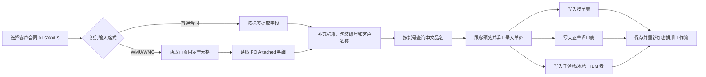
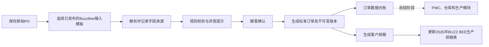

# 试点客户PO模板与映射规则清单

> 文档版本：V1.6
> 文档状态：BuzzBee / 彩星试点规则与已实现映射
> 适用模块：客户订单中心
> 试点客户：BuzzBee、彩星
> 更新日期：2026-07-29
> 规则来源：BuzzBee 旧系统 `D:\360安全云盘同步版\成果文件\李悦\自动入PO系统`；彩星现行业务资料 `C:\Users\Aalyaan\Desktop\彩星排期`；对应真实样本目录见各客户章节
> 当前阶段：BuzzBee 与彩星均已接入华兴厂区客户选择、批量预览及客户排期导出；下游持久化和 PMC 交互尚未实现

## 1. 文档目的

本文档用于收集 BuzzBee 现有“自动入PO系统”及彩星 Playmates PO 现行业务步骤的输入识别、字段提取和排期表写入逻辑，并将这些规则整理为“客户订单中心”试点客户模板与映射清单。

本文档同时明确：

1. 哪些规则属于客户 PO 原始数据解析，应迁移到客户订单中心；
2. 哪些规则只是旧排期工作簿的输出格式，应作为兼容导出规则；
3. 哪些规则涉及库存和生产，不应继续由客户订单中心负责；
4. 旧系统存在哪些缺口，必须在新模块试点时补齐。

## 2. 试点结论

BuzzBee 现有系统已经形成一套可复用的基础逻辑，主要包括：

- 普通合同格式解析；
- WMU、WMC 格式识别；
- 一个文件拆分多张 Walmart PO 明细；
- 合同号、客户、货号、数量、装箱数、验货日期、走货日期等字段提取；
- 包装编号和产品标准识别；
- 货号对应中文品名；
- 子弹枪、水枪分类；
- 写入接单表、正单评审表和 ITEM 表。

但旧系统不能直接作为客户订单中心的新标准，原因如下：

- 旧系统直接修改客户年度排期工作簿，没有形成独立的标准订单主数据；
- 没有模板编号和模板版本；
- 没有业务级重复 PO 判断；
- 没有不可覆盖的 PO 版本历史；
- 没有完整的字段来源追溯；
- 缺少套装产品的正式写入逻辑；
- 库存、备料和样板数量被混入 ITEM 表写入，超出了客户订单中心的职责；
- 部分校验只在界面标红或弹出提示，不会阻止错误数据写入；
- 一键写入不是事务操作，可能出现部分工作表成功、部分工作表失败。

因此，BuzzBee 试点应采用以下总体方案：

> 保留经真实样本验证的 PO 解析与字段映射规则，将解析结果先沉淀为客户订单中心的标准订单数据；经跟客确认并生成不可变版本后，输出客户排期，并按厂区模板更新厂区总排期。PMC、仓库和生产排产调用留待后续阶段。原 BuzzBee 年度排期工作簿是版本化兼容输出，不作为客户订单主数据。

## 3. 规则来源与可信度

### 3.1 已检查的主要文件

| 来源 | 用途 | 本文档采用方式 |
| --- | --- | --- |
| `contract_reader.py` | 普通合同、WMU、WMC 输入解析 | 输入映射的主要依据 |
| `main.py` | 文件导入、预览、价格录入、批量写入、加解密 | 现行业务流程和校验行为依据 |
| `price_db.py` | 货号与中文品名映射 | 中文品名规则依据 |
| `order_writer.py` | 写入“接单表” | 接单表兼容输出依据 |
| `review_writer.py` | 写入“正单评审表” | 评审表兼容输出依据 |
| `item_writer.py` | 写入子弹枪、水枪 ITEM 表 | ITEM 表兼容输出及旧库存逻辑依据 |
| `系统逻辑说明_参考范本.md` | 旧系统说明 | 辅助理解，不覆盖运行代码 |
| `自动入PO系统_逻辑参考范本.docx` | 旧系统说明 | 辅助理解，不覆盖运行代码 |
| `2026年 BUZZ BEE 生产排期表.xls.xlsx` | 实际目标排期工作簿 | 核对工作表、列位、公式和边界行 |
| `新建 XLSX 工作表.xlsx` | 货号中文品名资料库 | 核对品名表结构和示例数据 |
| `AAFES SC# 52335 - 11580 WH（普通PO）.xls` | 普通合同真实样本 | 核对标签字段、内嵌 P/O#、包装和排期结果 |
| `WM- 67771-53138 (WH)（WMC样本）.xlsx` | WMC 首页内嵌 PO 样本 | 核对加拿大市场、双语 PO 号、日期和包装 |
| `WMU 40027 ... 53041 ...（WMU样本）.xlsx` | 印尼 WMU 附表参考样本 | 核对首页固定字段和 `PO Attached` 明细；不纳入当前 BuzzBee 排期映射 |
| `2026年 BUZZ BEE 生产排期表(印尼).xls.xlsx` | 印尼年度排期 | 独立范围参考；不纳入当前 BuzzBee 排期映射 |

### 3.2 规则取值优先级

当说明文档、代码和实际工作簿不一致时，本文档按以下顺序判断现行逻辑：

1. 实际运行源代码；
2. 实际 BuzzBee 排期工作簿；
3. 参考说明文档。

### 3.3 当前样本覆盖与限制

当前 BuzzBee 排期映射以 `2026年 BUZZ BEE 生产排期表.xls.xlsx` 为唯一目标，首批可直接用于该目标的真实资料包括：

- 普通合同 1 份：AAFES，合同号 `52335`，产品 `11580`；
- WMC 1 份：合同号 `53138`，P/O# `0009382481`，产品 `67771`；
- 当前目标年度排期 1 份；

另有 WMU `53041 / 0994128316 / 40027` 样本及印尼年度排期，两者只作为印尼独立范围参考，不进入当前映射、预览、导出或验收批次。

当前两个 PO 样本均能在目标年度排期中找到人工录入结果，因此已经可以作为第一批开发夹具。但它们仍不足以代表全部变体：

- 每种输入结构目前只有 1 份，尚未覆盖标签移动、空值、修订版和一文件多行等异常；
- WMC 样本没有 `PO Attached`，证明 WMC 首页内嵌格式必须单独建模板；
- 当前目标年度排期含历史人工数据和公式错误，只能用于比对，不能作为标准订单权威来源；
- WMU 附表格式等到印尼排期独立立项时再进入正式验收；
- 正式上线前每种模板仍建议补充 3 至 5 份正常样本及至少 2 份异常样本。

## 4. 现有业务流程



新客户订单中心不应直接复制上述最后三步。推荐的新流程为：



## 5. BuzzBee 输入模板家族

当前 BuzzBee 排期不应只配置一个笼统模板。针对唯一目标排期，首批真实样本确认两套当前输入模板；印尼 WMU 模板暂列后续范围：

| 建议模板编号 | 模板名称 | 识别对象 | 当前状态 |
| --- | --- | --- | --- |
| `BUZZBEE_STANDARD_CONTRACT_V1` | BuzzBee 普通合同模板 | 标签式 XLS/XLSX；P/O# 可能出现在右侧唛头区 | AAFES `52335` 样本已验证 |
| `BUZZBEE_WALMART_WMU_ATTACHED_V1` | BuzzBee WMU 附表模板 | 首页固定字段加 `PO Attached` 明细 | 印尼范围参考，不进入当前映射 |
| `BUZZBEE_WALMART_WMC_INLINE_V1` | BuzzBee WMC 首页内嵌模板 | 首页同时包含合同、PO、数量、日期和包装 | WMC `53138` 样本已验证 |

如需继续生成原年度排期表，应另建输出模板：

| 建议模板编号 | 模板名称 | 用途 |
| --- | --- | --- |
| `BUZZBEE_PRODUCTION_SCHEDULE_V1` | BuzzBee 当前排期导出模板 | 只投影到 `2026年 BUZZ BEE 生产排期表.xls.xlsx` |

`2026年 BUZZ BEE 生产排期表(印尼).xls.xlsx` 不属于上述输出模板，不参与当前流程01或流程02。

输入解析模板和输出工作簿模板必须分别管理、分别发布版本，不能共用一个版本号。

## 6. 普通合同输入识别规则

### 6.1 扫描范围

- 默认读取第一个工作表；
- 扫描工作表全部已使用单元格；
- 标签可按以下三种形式匹配：
  - 与标签完全相等；
  - 以“标签 + 空格”开头；
  - 以“标签 + 冒号”开头；
- 找到标签后，取同一行标签右侧第一个非空单元格作为字段值。

### 6.2 字段映射

| 客户文件标签 | 旧系统字段 | 客户订单中心建议字段 | 转换规则 | 建议校验级别 |
| --- | --- | --- | --- | --- |
| `Contract No.` | `contract_no` | `sales_contract_no` | 去除整数形式编号末尾的 `.0` | 必填 |
| `Date of Loading` | `date_of_loading` | `requested_loading_date` | 转为统一日期 | 必填 |
| `Inspection Date` | `inspection_date` | `inspection_date` | 转为统一日期 | 可空，存在时必须有效 |
| `Our Item#` | `item_no` | `customer_item_no` / `factory_item_no` | 去除整数形式编号末尾的 `.0` | 必填 |
| `Goods` | `goods_en` | `product_name_en` | 保留原文本 | 必填 |
| `Quantity` | `quantity` | `order_quantity` | 去逗号后转为整数 | 必填且大于 0 |
| `Export Carton Packing` | `carton_packing` | `units_per_export_carton` | 去逗号后转为整数 | 必填且大于 0 |
| `Shipping Carton Packing` | `carton_packing` | `units_per_export_carton` | 与上一标签二选一 | 必填且大于 0 |
| `PO NUMBER` / `PO NO.` | 旧系统未稳定提取 | `customer_po_no` | 扫描唛头区标签后的完整编号，按文本保存 | 有值时必填 |

### 6.3 客户名称识别

旧系统在找到 `Contract No.` 后，使用以下启发式逻辑识别客户名称：

1. 检查合同号所在行、上一行和下一行；
2. 优先取这些行中红色字体的非空单元格；
3. 如果没有红色字体，取合同号所在行最右侧的非空、非纯数字文本。

该规则依赖颜色和排版，不够稳定。新系统建议：

- 上传时先由客户档案或用户选择确定 `customer_id = BuzzBee`；
- 从文件中识别到的名称只保存为 `source_customer_text`；
- 不允许仅凭字体颜色自动改变订单客户归属；
- 若文件内客户名称与上传时客户不一致，应形成异常提示并由跟客确认。

### 6.4 日期转换

旧系统对 XLSX 日期支持：

- Excel 日期单元格；
- Python 日期或日期时间；
- 数值型 Excel 日期序号；
- 可识别的日期文本。

输出格式为 `DD-MMM-YYYY`，例如 `15-JUL-2026`。

已发现的旧系统差异：

- XLSX 分支会转换走货日期和验货日期；
- XLS 分支明确转换了走货日期，但验货日期可能保留原始文本或序号。

新系统必须对 XLSX 和 XLS 使用同一套日期规范，并同时保存：

- `source_value`：客户文件原值；
- `normalized_value`：标准日期；
- `source_sheet`、`source_cell`：来源位置；
- `parse_warning`：无法确定时的异常说明。

### 6.5 产品标准识别

旧系统在工作表文本中按关键词识别标准：

| 关键词示例 | 标准化结果 |
| --- | --- |
| `US`、`American` | 美国标准 |
| `Europe`、`European` | 欧洲标准 |
| `Canadian` | 加拿大标准 |
| `Australian` | 澳洲标准 |
| `GB`、`China` | 国标 |

新系统建议将其保存为标准代码和显示名称，例如：

| 标准代码 | 显示名称 |
| --- | --- |
| `US` | 美国标准 |
| `EU` | 欧洲标准 |
| `CA` | 加拿大标准 |
| `AU` | 澳洲标准 |
| `CN` | 国标 |

未匹配到标准时不得默认猜测，应标记为待确认。

### 6.6 包装编号识别

旧系统扫描工作表文本，并提取符合以下特征的第一个编号：

```text
5位数字-2位数字-2位数字-字母及可选数字
```

可识别示例：

- `11760-11-25-EN`
- `40190-05-25-EN8`

现有规则只提取编号主体，不会完整保留编号后的附注，例如：

- `(r1)`；
- `PDQ`；
- `+ White color PDQ`。

新系统应同时保存：

- `packaging_reference_no`：标准包装编号；
- `packaging_requirement_raw`：客户原始包装要求全文；
- `packaging_requirement_note`：编号以外的补充要求。

### 6.7 AAFES 普通合同样本结论

`AAFES SC# 52335 - 11580 WH（普通PO）.xls` 验证了以下实际来源：

| 统一字段 | 来源 |
| --- | --- |
| P/O# | 唛头区 `PO NUMBER: 0092504153` |
| Contract No. | `Contract No.` 右侧 `52335` |
| 产品编号 | `Our Item#` 右侧 `11580` |
| 产品名称原文 | `Goods` 右侧 `OCEAN OUTLAW` |
| 数量 | `Quantity` 右侧 `180` |
| 装箱数 | `Shipping Carton Packing` 右侧 `6` |
| 包装 | `REF#11580-10-25-EN` |
| 文件装船日期 | `Date of Loading` 为 `2026-02-02` |

当前目标排期对应行的 P/O#、合同、产品、数量和装箱数一致，但存在三项不能照抄的人工结果：

- “正单评审表”的 P/O# 为空，而“接单表”已保存 `0092504153`；新系统必须统一保存；
- “正单评审表”的箱数为 `80`，与 `180 ÷ 6 = 30` 不一致；标准箱数必须重新计算；
- 排期“客要求走货期”为 `2026-01-28`，比文件 `Date of Loading` 早 5 天；是否属于 LCL 交付提前规则必须由业务确认，不能静默转换。

## 7. WMU/WMC 输入识别规则

### 7.1 模板识别

旧系统将以下情况识别为 Walmart 格式：

- 第一个工作表 `N6` 为 `WMU`；或
- 工作簿存在名为 `PO Attached` 的工作表。

客户类型读取顺序：

1. 优先读取第一个工作表 `N6` 的 `WMU` 或 `WMC`；
2. 无法读取时，文件名包含 `WMC` 则按 WMC；
3. 其余情况默认 WMU。

风险：

- 单独依赖 `N6` 的识别逻辑对 WMC 不完全对称；
- 默认 WMU 可能把未知格式误分类为美国单。

新系统应同时校验 `N6`、工作表名称、文件名和关键字段，不允许在证据不足时静默默认 WMU。

真实 WMC 样本进一步证明旧识别规则不完整：

- 市场代码位于 `P4 = WMC`，不是 `N6`；
- 工作簿没有 `PO Attached`；
- P/O# 位于首页双语唛头文字 `PO / BON DE COMMANDE: 0009382481`；
- 若继续沿用旧识别逻辑，该文件会落入普通合同分支并遗漏 P/O# 和 WMC 市场证据。

因此，WMU 附表与 WMC 首页内嵌格式不得共用同一个解析模板。

### 7.2 首页固定字段

| 位置 | 旧系统含义 | 客户订单中心建议字段 | 规则 |
| --- | --- | --- | --- |
| `N6` | WMU/WMC | `market_code` | WMU 对应美国；WMC 对应加拿大 |
| `E14` | 货号 | `customer_item_no` / `factory_item_no` | 去除 `.0` |
| `E17` | 英文品名 | `product_name_en` | 保留原文 |
| `E25` | 装箱数 | `units_per_export_carton` | 转为整数 |
| 全工作簿扫描 | 包装编号 | `packaging_reference_no` | 使用包装编号规则 |

旧系统在 `E25` 为空时默认装箱数为 `4`。该默认值没有客户主数据或合同依据，新系统不得直接沿用。推荐处理：

- 若产品主数据存在已审核装箱数，可作为建议值显示；
- 仍需跟客确认；
- 未确认前不得确认订单或生成正式排期。

上表是 WMU 附表样本的位置。WMC 首页内嵌样本使用另一套位置：

| 位置或标签 | 含义 | 客户订单中心字段 |
| --- | --- | --- |
| `P4` | WMC 市场代码 | `market_code = WMC` |
| `N4` | 合同号 `53138` | `sales_contract_no` |
| 首页 `PO / BON DE COMMANDE` | P/O# `0009382481` | `customer_po_no` |
| `F12` | 产品编号 `67771` | `customer_item_no` |
| `C14` | 产品名称 `AF DOUBLE FIRE` | `product_name_en` |
| `F16` | 数量 `3000` | `order_quantity` |
| `F22` | 装箱数 `5` | `units_per_carton` |
| `M10` 附近红字 | 验货要求 `17 SEPT. 26` | `customer_q_requirement` |
| `F8` | Date of Loading `2026-09-17` | `customer_requested_ship_date` |
| `A48` | 包装编号 `67771-05-26-WMC` | `packaging_reference_no` |

### 7.3 `PO Attached` 明细拆分

旧系统在 `PO Attached` 工作表中：

1. 查找 A 列包含 `S/C` 的表头行；
2. 若找不到，默认第 6 行为表头；
3. 从表头下一行开始读取；
4. A 列为数字的行视为有效明细；
5. 一个合同文件可拆分为多条标准订单明细。

| `PO Attached` 列 | 旧系统字段 | 客户订单中心建议字段 |
| --- | --- | --- |
| A | `contract_no` | `sales_contract_no` |
| B | `po_no` | `customer_po_no` |
| D | `date_of_loading` | `requested_loading_date` |
| F | `quantity` | `order_quantity` |
| H | `inspection_date` | `inspection_date` |

首页的货号、品名、装箱数、标准和包装编号会应用到拆分出的每一条明细。

### 7.4 WMU/WMC 标准

| 市场代码 | 旧系统客户名称 | 标准化标准 |
| --- | --- | --- |
| `WMU` | WMU | 美国标准 |
| `WMC` | WMC | 加拿大标准 |

新系统中 `WMU/WMC` 应保存为市场或渠道代码，不应替代 BuzzBee 客户主档。

### 7.5 印尼 WMU 附表参考样本

WMU `53041` 样本首页提供产品级公共字段，`PO Attached` 第 7 行提供交付明细：

| 统一字段 | 来源 | 样本值 |
| --- | --- | --- |
| 市场 | 首页 `N6` | `WMU` |
| 产品编号 | 首页 `E14` | `40027` |
| 产品名称 | 首页 `E17` | `AF TRIPLE BLAST` |
| 装箱数 | 首页 `E25` | `6` |
| 包装 | 首页 `A52` | `40027-03-26-WM` |
| Contract No. | `PO Attached!A7` | `53041` |
| P/O# | `PO Attached!B7` | `0994128316` |
| 客要求走货期 | `PO Attached!D7` | `2026-07-21` |
| 数量 | `PO Attached!F7` | `2268` |
| 箱数校验 | `PO Attached!G7` | `378` |
| 客Q日期 | `PO Attached!H7` | `2026-06-30` |

印尼排期对应行与数量、装箱数、箱数、客Q和走货期一致。P/O# 必须按文本保存，不能因其为纯数字外观而丢失前导零。该结论只记录未来印尼范围的输入结构，不将此样本写入当前 BuzzBee 排期。

## 8. 中文品名映射

### 8.1 现有资料库结构

旧系统通过 `新建 XLSX 工作表.xlsx` 查询货号中文品名。主要识别方式为：

1. 在工作簿各工作表前 5 行查找 A 列包含 `item` 的表头；
2. B 列作为中文产品名称；
3. 数据行 A 列可包含一个或多个以 `/` 分隔的货号；
4. 每个拆分后的货号映射到同一个中文品名。

示例：

| 资料库货号文本 | 中文品名 | 展开后的映射 |
| --- | --- | --- |
| `64559/64553/64551` | 小四弹枪 | 64559、64553、64551 均映射为“小四弹枪” |
| `62449/62453/62460/62481` | 卡装小三弹枪 | 四个货号均映射为“卡装小三弹枪” |
| `67779/67771/67763/67783` | 双管枪 | 四个货号均映射为“双管枪” |
| `45849/45841/45803` | 链条枪 | 三个货号均映射为“链条枪” |
| `19400` | 中水枪 | 19400 映射为“中水枪” |

### 8.2 新系统要求

中文品名不应继续依赖某台电脑上的固定文件路径。建议将其迁移为可维护的产品映射主数据，并保存：

- 客户；
- 客户货号；
- 工厂货号；
- 中文品名；
- 英文品名；
- 产品类别；
- 生效日期；
- 失效日期；
- 规则版本；
- 修改人和审核人。

若同一货号出现多个中文名称，不得简单取最后一次读取结果，应形成冲突异常。

## 9. 标准订单字段清单

客户订单中心第一版统一业务字段以[《客户订单中心统一字段字典》](./customer-order-center-unified-field-dictionary.md)为准。下表补充 BuzzBee 解析所需的来源、版本和追溯字段。

BuzzBee 试点解析完成后，至少应形成以下标准字段：

| 分类 | 标准字段 | 来源 | 是否必须 |
| --- | --- | --- | --- |
| 来源 | 原始文件编号 | 系统生成 | 是 |
| 来源 | 原始文件哈希 | 系统生成 | 是 |
| 来源 | 输入模板编号和版本 | 模板中心 | 是 |
| 来源 | 来源工作表、行、单元格 | 解析过程 | 是 |
| 客户 | 客户编号 | 上传上下文/客户主档 | 是 |
| 客户 | 市场代码 | WMU/WMC 或客户文件 | 条件必填 |
| 订单 | 销售合同号 | `Contract No.` 或 `PO Attached!A` | 是 |
| 订单 | 客户 PO 号 | 普通合同唛头、`PO Attached!B` 或 WMC 首页双语 PO 标签 | 有来源时必填，WMU/WMC 必填 |
| 产品 | 客户货号 | `Our Item#` 或首页 `E14` | 是 |
| 产品 | 工厂货号 | 产品映射主数据 | 有映射时必填 |
| 产品 | 中文品名 | 产品映射主数据 | 建议必填 |
| 产品 | 英文品名 | `Goods` 或首页 `E17` | 是 |
| 数量 | 订单数量 | `Quantity` 或 `PO Attached!F` | 是 |
| 包装 | 每箱装箱数 | 合同字段或首页 `E25` | 是 |
| 包装 | 箱数 | `订单数量 ÷ 每箱装箱数` | 派生字段 |
| 包装 | 包装编号 | 全文识别 | 条件必填 |
| 包装 | 包装要求原文 | 原始文件 | 建议保留 |
| 合规 | 产品标准 | 关键词识别/市场规则 | 是 |
| 日期 | 客户要求走货日期 | `Date of Loading`、`PO Attached!D` 或经确认的客户交付规则 | 是 |
| 日期 | 验货日期 | `Inspection Date`、WMC 首页红字或 `PO Attached!H` | 可空 |
| 商务 | 单价原值 | 人工录入或未来客户文件 | 按业务决定 |
| 商务 | 单价表达式 | 旧系统人工录入 | 仅兼容输出使用 |
| 状态 | 解析、校验、确认、发布状态 | 系统流程 | 是 |
| 版本 | PO 版本号 | 系统生成 | 是 |

箱数在旧系统中按向上取整显示，但接单表使用公式 `数量 ÷ 装箱数`。新系统必须先确认业务口径：

- 订单数量必须整箱时，不能整除应作为异常；
- 允许尾箱时，应分别保存精确箱数和实际箱数；
- 不应在不同页面分别使用“直接相除”和“向上取整”而不说明。

## 10. 产品分类规则

旧系统按中文品名和英文品名判断子弹枪或水枪，规则顺序为“先子弹枪，再水枪，最后默认子弹枪”。

### 10.1 子弹枪关键词

中文关键词：

- 子弹；
- 镖弹；
- 飞镖；
- 软弹；
- 泡沫弹。

英文关键词：

- `DART`；
- `BULLET`；
- `FOAM`；
- `ACCU-BLAST`；
- `REFILL`。

### 10.2 水枪关键词

中文关键词：

- 水枪；
- 水炮；
- 喷水；
- 水。

英文关键词：

- `SQUIRT`；
- `WATER`；
- `SOAKER`；
- `SPLASH`；
- `SURGE`；
- `STREAM`。

### 10.3 已发现问题

- 中文单字“水”范围过宽，容易误判；
- 未识别产品默认归为子弹枪，容易掩盖新产品；
- 实际排期表存在“套装ITEM表”和“套装合计”，但旧代码没有套装写入分支；
- 同时命中两类关键词时，子弹枪优先；
- 分类来源是产品名称文本，不是正式产品主数据。

新系统应优先读取产品主数据中的 `product_category`。关键词只能用于给出分类建议；无法确认时进入异常队列，不得默认子弹枪。

## 11. BuzzBee 旧排期工作簿结构

当前目标工作簿包含以下 9 个工作表：

| 序号 | 工作表 | 旧系统是否写入 |
| --- | --- | --- |
| 1 | 模具其他 | 否 |
| 2 | 其它款 | 否 |
| 3 | 价格表 | 否 |
| 4 | 出货发票 | 否 |
| 5 | 接单表 | 是 |
| 6 | 正单评审表 | 是 |
| 7 | 子弹枪ITEM表 | 按产品分类写入 |
| 8 | 水枪ITEM表 | 按产品分类写入 |
| 9 | 套装ITEM表 | 否，旧代码未实现 |

以下第 12 至 14 节属于“旧表兼容输出规则”，不属于客户订单中心的标准订单存储结构。

印尼实际工作簿是另一套 6 工作表结构，但不属于当前 BuzzBee 映射目标：

| 序号 | 工作表 |
| --- | --- |
| 1 | 价格明细（印尼） |
| 2 | 其它款（印尼） |
| 3 | 出货发票（印尼） |
| 4 | 接单表（印尼） |
| 5 | 正单评审表（印尼） |
| 6 | 子弹枪ITEM表（印尼） |

该对比只用于证明印尼不能误用当前输出模板：

- 华兴“接单表”业务列位从 B 至 S，含国家标准、2%折扣单价和金额；
- 印尼“接单表（印尼）”业务列位从 A 至 N，不含箱数和国家标准列；
- 华兴“正单评审表”有独立行Q和客Q；
- 印尼“正单评审表（印尼）”只有客Q列，没有独立行Q列；
- 华兴有水枪和套装 ITEM 表，印尼样本只有子弹枪 ITEM 表。

因此，本阶段只发布当前 BuzzBee 排期输出模板。印尼如后续启动，必须另行立项、版本化和验收，不能在当前流程中同时输出。

## 12. “接单表”兼容输出映射

### 12.1 插入位置

- 在 M 列找到第一个包含“合计”的单元格；
- 在该合计行上方插入一行；
- 实际工作簿当前合计行为第 504 行，但运行时应按标记查找，不应固定行号。

### 12.2 列映射

| 列 | 写入内容 | 规则 |
| --- | --- | --- |
| B | 入单日期 | 使用执行写入当天日期，不是客户走货日期 |
| D | 销售合同号 | `contract_no` |
| E | 客户/市场名称 | 旧系统写 `customer_name` |
| F | 货号 | `item_no` |
| G | 中文品名 | 中文品名资料库 |
| H | 英文品名 | `goods_en` |
| I | 数量 | `quantity` |
| J | 每箱装箱数 | `carton_packing` |
| K | 箱数 | 公式 `=I行/J行` |
| L | 标准 | 美国、加拿大、欧洲、澳洲或国标 |
| M | 单价 | 数值或用户输入的算术表达式公式 |
| N | 美国折后单价 | 美国标准时公式 `=M行*0.98` |
| O | 金额 | 公式 `=I行*M行` |
| P | 美国折后金额 | 美国标准时公式 `=O行*0.98` |
| Q | 包装编号 | `packaging_ref` |
| S | 客户要求走货日期 | `date_of_loading` |

旧系统允许单价输入简单的 `+ - * /` 算术表达式。同一批次内，相同货号会同步相同单价。新系统若保留该能力，应同时保存：

- 用户输入原文；
- 计算后的数值；
- 币种；
- 录入人；
- 录入时间；
- 适用订单行。

不得只保存 Excel 公式。

## 13. “正单评审表”兼容输出映射

### 13.1 插入位置

- 先查找包含“取消单、转单、已走货”的历史区边界；
- 子弹枪在 Q 列“子弹枪合计”上方插入；
- 水枪在 Q 列“水枪合计”上方插入；
- 实际工作簿当前还存在“套装合计”，但旧代码不会写入套装区。

### 13.2 列映射

| 列 | 写入内容 | 规则 |
| --- | --- | --- |
| A | 入单日期 | 执行写入当天 |
| B | 客户 PO 号 | WMU/WMC 的 `po_no`，普通合同通常为空 |
| C | 销售合同号 | `contract_no` |
| D | 客户/市场名称 | `customer_name` |
| E | 货号 | `item_no` |
| F | 中文品名 | `goods_zh` |
| G | 英文品名 | `goods_en` |
| H | 数量 | `quantity` |
| I | 每箱装箱数 | `carton_packing` |
| J | 箱数 | 公式 `=H行/I行` |
| K | 验货/走货日期 | 有验货日期时写验货日期，否则写走货日期 |
| L | 验货日期 | 仅有验货日期时写入 |
| M | 标准 | 标准化结果 |
| N | 空 | 旧系统不写 |
| O | 空 | 旧系统不写 |
| P | 固定状态 | 固定写“已上” |
| Q | 单价 | 数值或算术表达式公式 |
| R | 美国折后单价 | 美国标准时公式 `=Q行*0.98` |
| S | 金额 | 公式 `=Q行*H行` |
| T | 美国折后金额 | 美国标准时公式 `=S行*0.98` |
| U | 包装编号 | `packaging_ref` |
| V | 客户要求走货日期 | `date_of_loading` |

固定写入“已上”属于旧表状态定义。迁移时必须由业务确认该状态的正式含义，不能直接映射为客户订单中心的“已确认”或“已发布”。

## 14. ITEM 表兼容逻辑

### 14.1 工作表选择

- 子弹枪写入“子弹枪ITEM表”；
- 水枪写入“水枪ITEM表”；
- 未识别产品默认写入“子弹枪ITEM表”；
- 套装没有写入逻辑。

### 14.2 活动区和货号匹配

- 遇到包含“取消单、转单、已走货”的行即视为历史区边界；
- 活动区中 E 列为货号；
- E 列等于新货号，或以“新货号 + `-`”开头，视为同一货号；
- 备料行通过 M 列包含“备料单”识别。

实际工作簿存在模板不一致：

- 子弹枪活动区通常在 M 列标记“样板单、备料单”；
- 水枪表部分历史/活动数据在 L 列标记“样板单、备料单”；
- 旧代码只检查 M 列，可能漏掉水枪备料行。

### 14.3 ITEM 行字段

| 列 | 写入内容 |
| --- | --- |
| A | 入单日期 |
| B | OQF 编号 |
| C | 销售合同号 |
| D | 客户/市场名称 |
| E | 货号 |
| F | 中文品名 |
| G | 英文品名 |
| H | 数量或备料公式 |
| I | 每箱装箱数 |
| J | 空 |
| K | 包装编号 |
| L | 固定写“系统” |
| M | 客户要求走货日期，或“样板单、备料单” |
| N | 空 |
| O | 客户要求走货日期 |
| P | 空 |

注意：ITEM 表 C 列写销售合同号。即使 WMU/WMC 文件存在 Walmart PO 号，旧代码也不会把该 PO 号写入 ITEM 表。

### 14.4 旧备料计算

当系统找到现有备料行时：

| 条件 | 旧系统动作 |
| --- | --- |
| 订单数量小于或等于现有备料 | 在备料公式后扣减本单数量 |
| 订单数量大于现有备料，但不超过“现有备料 + 3000” | 在公式后补 `+3000`，再扣减本单数量 |
| 订单数量超过“现有备料 + 3000” | 追加本单数量并扣除原备料和本单数量，使结果归零 |

当系统找不到现有货号和备料行时：

1. 生成 OQF 编号，格式近似 `年-月-日-货号`；
2. 新增订单行；
3. 新增数量为 50 的样板单；
4. 新增备料单，公式为 `订单数量 + 50 - 订单数量`，净余 50。

### 14.5 新模块边界决定

上述备料、样板、库存扣减和补 3000 的规则不迁移到客户订单中心，原因是：

- 它们属于 PMC、仓库或生产准备逻辑；
- 公式依赖旧工作簿当前状态，无法形成可靠的库存流水；
- 同一 PO 版本变化时可能重复扣减；
- 客户订单中心不应维护或推导库存。

处理原则：

- 客户订单中心只发布已确认的客户成品需求；
- PMC 决定备料、库存满足和生产需求；
- 如业务仍要求生成旧 ITEM 表，可在兼容导出中复现展示格式；
- 兼容导出不得反向成为库存权威数据；
- 如需继续执行库存运算，必须迁移到 PMC/仓库模块，并以库存流水和版本幂等机制重新设计。

### 14.6 当前基础试用已实现的 ITEM 兼容输出

当前 BuzzBee 基础试用按以下边界输出：

- 每个已确认 PO 明细除写入“接单表”和“正单评审表”外，同时新增一条 ITEM 订单行；
- 水枪进入“水枪ITEM表”，其他当前已识别枪类进入“子弹枪ITEM表”；“套装ITEM表”仍未启用；
- 只在“取消单、转单、已走货”之前的活动区匹配货号；
- E 列等于 PO 产品编号或以“产品编号 + `-`”开头时视为同一货号，并复用活动区已有的 ITEM 货号后缀及 OQF 编号；
- 同一批多份 PO 按用户选择顺序保留在同一货号组内；
- 存在同货号“备料单”时，在该行 H 列原公式或数量后直接减去本合同数量；同批多份 PO 每份各扣减一次，结果允许为负数以暴露备料不足；
- 不执行旧程序“余量不足时自动补 3000”的逻辑，也不新增样板单或备料单。

当前订单行列位为：

| 列 | 当前写入内容 |
| --- | --- |
| A | 用户确认的来单日期 |
| B | 活动区已有 OQF 编号；新货号按“来单日期-货号”生成 |
| C | Contract No. |
| D | 客户/市场代码 |
| E | 活动区已有 ITEM 货号后缀，或新货号 |
| F | 中文名称 |
| G | 产品名称 |
| H | 数量 |
| I | 装箱数 |
| J | 空 |
| K | 包装 |
| L | 固定写“系统” |
| M | 行Q |
| N | 客Q，允许日期或完整文字 |
| O | 客要求走货期 |
| P | 空 |
| Q | 客人 P/O#；普通客没有 P/O# 时保持空白 |

该列位修正了旧程序未写 Q 列、且未区分 M/N/O 三类交付与验货信息的问题。备料单 H 列扣减只用于维持当前客户年度排期的兼容结果，不写入客户订单中心的库存主数据，也不是库存或生产权威数据。

## 15. 现有校验与操作行为

| 项目 | 旧系统行为 | 新系统要求 |
| --- | --- | --- |
| 必填字段 | 缺失字段在预览界面标红 | 阻止确认并给出字段级错误 |
| 中文品名 | 可缺失 | 应提示产品映射缺失；是否阻止发布由业务确认 |
| 箱数 | 界面按向上取整显示 | 明确整箱、尾箱和精确箱数口径 |
| 单价 | 可为空，确认提示后仍可继续 | 明确单价是否属于订单确认必填项 |
| 单价表达式 | 允许简单算术 | 保存原文、结果和币种，不直接信任公式 |
| 重复导入 | 只防止同一次界面选择重复文件路径 | 增加文件哈希、业务键和版本判断 |
| 批量写入 | 每条记录、每个工作表独立执行 | 确认动作必须原子化或具备明确补偿 |
| 原始文件 | 由用户选择，旧系统不形成统一档案 | 保存不可变原件和文件哈希 |
| 字段来源 | 不保存单元格级来源 | 保存工作表、行列、原值和模板版本 |
| PO 变更 | 没有正式版本模型 | 生成新版本，不覆盖旧版本 |
| 审计 | 主要依赖界面日志 | 保存操作人、时间、原因和前后版本 |
| 工作簿密码 | 代码中固定使用 `2026` | 不得硬编码，交由安全配置管理 |

旧系统的“一键写入”可能出现接单表成功、评审表失败、ITEM 表成功等部分完成状态。新系统确认订单时必须先完成全部校验，再一次性生成标准订单版本；兼容文件生成失败不得破坏已确认的订单主数据。

## 16. 重复判断与版本规则建议

旧系统没有业务级重复判断。BuzzBee 试点至少需要两层判断。

### 16.1 文件级幂等

建议键：

```text
客户编号 + 原始文件SHA-256 + 输入模板版本
```

同一文件再次上传时，应提示已经导入过，并允许用户查看原导入批次，不应再次生成新订单。

### 16.2 业务级疑似重复

WMU/WMC 建议比较：

```text
客户编号 + 销售合同号 + 客户PO号 + 货号 + 客户要求走货日期
```

普通合同没有客户 PO 号时，建议比较：

```text
客户编号 + 销售合同号 + 货号 + 客户要求走货日期
```

数量、验货日期、包装要求或单价发生变化时，系统不得简单覆盖，应提示用户判断：

- 重复文件；
- 同一订单的修订版；
- 同一合同下新增交付批次；
- 客户拆单或合单。

最终行级业务键仍需用真实样本验证，特别是同一合同、同一货号、同一走货日是否可能存在多行。

### 16.3 版本原则

- 已确认订单不可原地覆盖；
- 变更后生成 `V2、V3……`；
- 每个版本保留对应原始文件、字段来源和确认人；
- 下游发布必须带订单版本号；
- PMC 必须能判断当前使用的是哪个版本；
- 旧版本只读保留，并标记已被哪个版本取代。

## 17. 试点校验规则清单

### 17.1 阻断性错误

- 无法确定客户；
- 无法确定输入模板；
- 销售合同号为空；
- 货号为空；
- 订单数量为空、非数字或小于等于 0；
- 每箱装箱数为空、非数字或小于等于 0；
- 客户要求走货日期无效；
- WMU/WMC 明细缺少客户 PO 号；
- 同一文件内出现无法解释的重复业务键；
- 文件与已确认订单疑似重复但未处理；
- 用户试图使用未发布或已停用的模板版本。

### 17.2 警告并要求确认

- 中文品名未映射；
- 产品类别只能通过关键词推断；
- 产品标准由关键词推断且文件没有明确字段；
- 包装编号未识别或存在编号外附注；
- 数量不能被装箱数整除；
- 验货日期为空；
- 验货日期晚于客户要求走货日期；
- 文件内客户文字与所选客户档案不一致；
- 同一货号在中文品名库中存在多个名称；
- 普通合同没有客户 PO 号；
- 单价为空或与同货号历史价格差异过大。

### 17.3 自动计算

- 精确箱数；
- 尾箱提示；
- 标准化日期；
- 产品标准建议；
- 产品类别建议；
- 文件哈希；
- 疑似重复结果；
- 订单版本号；
- 字段来源链。

## 18. 实际工作簿已发现的质量问题

本次检查实际排期工作簿时发现：

- 华兴“接单表”合计区至少有 7 个 `#REF!`；
- 华兴“正单评审表”存在 `#DIV/0!`；
- 华兴子弹枪、水枪 ITEM 表存在大量 `#NAME?`，扫描前 100 条即已截断；
- 印尼“正单评审表（印尼）”合计区存在 `#REF!`；
- 普通 PO、WMC 和 WMU 三个输入样本未发现公式错误；
- 部分 `#NAME?` 可能与旧 VLOOKUP、全列引用或计算引擎兼容性有关，需在 Microsoft Excel 中再次核实；
- 水枪表“样板单、备料单”标记列位不统一；
- 套装表存在但旧程序未写入；
- 部分排期表状态、公式和行边界依赖人工维护。
- 普通 PO `52335` 在华兴“接单表”的箱数为 `30`，但“正单评审表”对应行箱数为 `80`；
- 同一普通 PO 的 P/O# 在“接单表”存在，在“正单评审表”为空；
- 普通 PO 文件 `Date of Loading = 2026-02-02`，现有排期“客要求走货期 = 2026-01-28”，存在 5 天差异；
- 这些差异证明标准字段必须以原始 PO、确认规则和统一计算为准，不能选择任一旧表单元格作为自动权威值。

这些问题属于现有工作簿质量问题，不能作为新映射规则照搬。若继续提供旧表兼容导出，必须：

1. 锁定一份经业务确认的干净模板；
2. 设置模板编号和版本；
3. 发布前进行 Excel 公式错误扫描；
4. 不在历史业务文件上反复插行并把其当作主数据库；
5. 明确哪些公式由模板负责，哪些数值由标准订单直接写入。

## 19. 模板配置建议

每个 BuzzBee 输入模板至少应包含：

| 配置类别 | 配置内容 |
| --- | --- |
| 基本信息 | 模板编号、名称、客户、格式、版本、状态 |
| 识别规则 | 工作表名、关键单元格、标签、表头特征 |
| 字段规则 | 来源位置、目标字段、类型和转换方式 |
| 行拆分规则 | 一文件一行或一文件多行 |
| 数据补充 | 中文品名、产品类别、标准、市场代码 |
| 校验规则 | 必填、格式、范围、跨字段校验 |
| 重复规则 | 文件级和业务级判断 |
| 来源追溯 | 文件、工作表、单元格、原值 |
| 样本集 | 正常、异常和历史版本样本 |
| 发布信息 | 测试结果、发布人、发布时间、停用时间 |

输出模板应独立配置：

- 目标工作簿版本；
- 工作表名称；
- 插入边界；
- 列映射；
- 公式规则；
- 样式继承规则；
- 汇总公式；
- 公式错误检测；
- 是否允许覆盖现有文件；
- 生成文件与订单版本的关联关系。

## 20. 待业务确认事项

BuzzBee 试点进入开发前，需要跟客和模板管理员优先确认；PMC、仓库和生产相关事项留到后续交互阶段：

1. 当前普通合同、WMU、WMC 各已有 1 份，仍需各补充至 3 至 5 份真实样本；
2. 确认 BuzzBee 是否还有 PDF、CSV、邮件正文或其他 PO 格式；
3. 确认 `Contract No.` 和 Walmart `PO No.` 的正式业务名称与唯一性；
4. 确认同一合同、货号和走货日期是否可能出现多条明细；
5. 确认订单数量不能整箱时的处理方式；
6. 确认验货日期是否为发布 PMC 的必填字段；
7. 确认单价是否属于客户订单中心必填数据；
8. 确认 2% 折扣只适用于美国标准，还是只适用于特定客户/渠道；
9. 确认 WMU、WMC 是市场、客户代码还是交付渠道；
10. 确认套装产品的正式分类和现有排期写入位置；
11. 确认中文品名资料库的业务负责人和维护方式；
12. 确认空白装箱数是否有可靠的产品默认值，不能直接使用固定值 4；
13. 确认包装编号后缀和备注是否需要原样传给 PMC；
14. 确认是否仍需输出原 BuzzBee 年度排期表；
15. 确认现有排期表中的“已上、备料单、样板单、取消单、转单、已走货”的正式定义和所属模块。
16. 确认 AAFES 等 LCL 订单是否存在“Date of Loading 减 5 天”转换；如存在，应命名为独立交付节点，不能覆盖客户原日期；
17. 确认“来单日期”由跟客录入、文件制单日还是系统接收日决定；现有三个样本口径并不完全一致；
18. 当前流程01只输出 `2026年 BUZZ BEE 生产排期表.xls.xlsx`；印尼排期后续独立立项，不作为当前待选项。

## 21. 试点实施顺序建议

### 第一阶段：样本确认

- 收齐真实 PO 样本；
- 给每种样本标注预期结果；
- 确认字段、日期、数量和订单拆分口径；
- 确认套装及未知产品处理；
- 形成模板测试样本集。

### 第二阶段：输入模板和预览

- 建立当前两套 BuzzBee 输入模板；印尼 WMU 模板暂不启用；
- 保存原始文件；
- 解析标准字段和来源位置；
- 展示字段级异常；
- 由跟客修正或确认。

### 第三阶段：标准订单和版本

- 生成标准订单头、明细和交付需求；
- 增加文件级幂等和业务级疑似重复；
- 支持 PO 变更和不可变版本；
- 保存到订单数据台账；
- 生成版本化客户排期。

### 第四阶段：厂区排期输出

- 只建立 `2026年 BUZZ BEE 生产排期表.xls.xlsx` 对应的输出模板；
- 接单表和评审表可按已确认标准订单生成；
- ITEM 表中的库存运算移交 PMC/仓库；
- 导出失败不得影响客户订单主数据；
- 逐步停止把年度 Excel 当作唯一订单数据库。

## 22. 试点验收标准

BuzzBee 试点至少满足以下条件后，才能作为其他客户模板的参考：

- 普通合同、WMU、WMC 的真实样本均通过；
- 每个标准字段都能追溯到原始文件位置和原值；
- 一个 Walmart 文件可正确拆分多条 PO 明细；
- 日期、数量、装箱数和包装编号转换结果经跟客确认；
- 中文品名和产品类别不再依赖静默默认；
- 套装及未知产品有明确处理路径；
- 同一文件重复上传不会重复建单；
- 疑似重复订单会被拦截或人工确认；
- PO 变更生成新版本，不覆盖历史；
- 已确认版本能够稳定保存到订单数据台账并生成客户排期；
- 客户订单中心的标准订单数据不计算库存；旧排期兼容导出可按已确认合同数量扣减 ITEM 备料行，但该结果明确为非权威数据；
- 如启用兼容导出，接单表和评审表映射结果与旧表一致；
- 如启用 ITEM 表导出，其库存数据明确标识为非权威数据，直至 PMC/仓库模块接管；
- 输出模板通过公式、格式和边界行检查；
- 模板规则修改必须生成新版本并重新验收。

## 23. 规则迁移总表

| 旧系统能力 | 处理决定 | 归属 |
| --- | --- | --- |
| 原始 PO 文件读取 | 保留并增强 | 客户订单中心 |
| 普通合同标签映射 | 保留，模板化和版本化 | 客户订单中心 |
| WMU 附表固定位置映射 | 保留，独立模板和严格识别 | 客户订单中心 |
| WMC 首页内嵌映射 | 新增独立模板，禁止落入普通合同静默处理 | 客户订单中心 |
| `PO Attached` 多行拆分 | 保留 | 客户订单中心 |
| 客户名称颜色识别 | 仅作提示，不作为客户归属依据 | 客户订单中心 |
| 标准关键词识别 | 保留为建议规则 | 客户订单中心 |
| 包装编号正则提取 | 保留并增加原文、备注 | 客户订单中心 |
| 中文品名 Excel 查询 | 迁移为产品映射主数据 | 客户订单中心/产品主数据 |
| 手工单价和算术表达式 | 待确认；如保留需结构化保存 | 客户订单中心商务字段 |
| 写入接单表 | 可选兼容导出 | 输出模板 |
| 写入正单评审表 | 可选兼容导出 | 输出模板 |
| 产品关键词分类 | 改为建议，产品主数据优先 | 产品主数据/模板规则 |
| 写入子弹枪、水枪 ITEM 表 | 仅在兼容期保留 | 输出模板 |
| 默认未知产品为子弹枪 | 取消 | 异常处理 |
| 套装产品 | 补充正式规则 | 待业务确认 |
| 样板单、备料单公式 | 不迁移到客户订单中心 | PMC/仓库 |
| 库存扣减和补 3000 | 不迁移为客户订单中心库存能力；兼容导出只按合同数量扣减备料行，不自动补 3000 | 兼容输出；正式能力归 PMC/仓库 |
| 文件密码硬编码 | 取消 | 安全配置 |
| 仅按文件路径防重 | 取消，改为哈希和业务键 | 客户订单中心 |
| 直接修改年度 Excel | 降级为可选导出 | 输出模板 |

## 24. 彩星 Playmates PDF 试点规则

### 24.1 规则来源与模板边界

彩星现行规则以 `C:\Users\Aalyaan\Desktop\彩星排期` 为准，资料包括：

- `做排期表步骤.docx`：跟客实际制作步骤和字段来源；
- `1932232.pdf`：包含套装及单品的 Playmates PO 样例；
- `日期码示例.png`：人工日期码对照示例；
- `2026年彩星生产排期表.xls`：已有人工作业结果的真实年度排期；
- 输入模板编号：`CAIXING_PLAYMATES_PO_PDF_V2`；
- 输出模板编号：`CAIXING_PRODUCTION_SCHEDULE_REVIEW_ORDER_ITEM_V2`。

旧版“当前活动表固定 24 列追加”逻辑已废止。客户订单中心现在只接受具备“正单评审表、接单表、ITEM表”三张业务表及对应表头、分区标记的彩星排期；其他工作表保持原样，不承载自动入排期逻辑。

### 24.2 业务流程

1. 用户选择华兴厂区和彩星客户，批量上传 Playmates 文本型 PDF PO，并上传当前彩星年度排期；
2. 用户填写来单日期。该日期表示“客户确认下单的邮件日期”，不直接用 PDF `DATE` 覆盖；
3. 系统提取 P/O#、S/C NO、客名/国家、父产品、子产品、数量、原始单价、交期、ASSORTMENT 和 REMARKS；
4. 套装 PO 先生成一条大货号父行，再按 `ASSORTMENT` 生成多条小货号明细；单品 PO 同样生成大货号父行和一条明细行，以匹配现有排期结构；
5. 系统预览按“大货号在上、小货号在下”的顺序显示 17 个统一字段、来源、阻断项和可跳过项；大货号数量为所属小货号数量之和；
6. 用户确认后，同步把相同订单写入“正单评审表、接单表、ITEM表”的 2026 正单区；
7. 输出保留上传排期原文件名、真实 `.xls`/`.xlsx` 格式、其他工作表以及原有加密状态。

### 24.3 输入字段和计算规则

| 目标字段 | 来源或计算 | 规则 |
| --- | --- | --- |
| 来单日期 | 页面登记 | 客户确认下单邮件日期，写入三张表；PDF `DATE` 只保留为来源信息 |
| P/O# | 首页 PO 号 | 识别 `OE/OL/OG/OH/OK-` 等 Playmates 编号 |
| Contract No. | `OUR CONF NO:` | 清除内部空格，如 `SL -1926604` 规范为 `SL-1926604` |
| 客名/国家 | `CUSTOMER:` | 去括号附注和尾部 Playmates 字样 |
| 产品编号 | 产品明细 | 数字和字母后缀之间插入一个空格，如 `57811E8` → `57811 E8` |
| 产品名称 | `DESCRIPTION` | 保留英文名称 |
| 数量 | `ORDER QTY.` | 保存数值 |
| 装箱数 | `ASSORTMENT` 或产品编号 | 套装取各子产品在 `ASSORTMENT` 后的数量；单品取产品编号 `E` 后数字 |
| 箱数 | 数量 ÷ 装箱数 | 不静默取整；产生小数时必须确认 |
| 客要求走货期 | `DELIVERY DATE` | 写入三张表相应日期列 |
| PO 原始单价 | `UNIT PRICE HKD` | 零价有效；缺失允许显式跳过后由跟客补充 |
| 排期单价 | 原始单价 × 0.955 | 对应扣除 0.5% 保险及 4% 关税的现有彩星口径 |
| 金额HK | 数量 × 排期单价 | 使用调整后单价，不直接写 PO 原金额 |
| 包装 | `PO REMARKS` | `US STANDARD ... PACKAGING` → “美版彩盒”；EU 包装 → “EU盒包装” |
| 国家标准 | `PO REMARKS` | 出现 `US STANDARD`/`USA STANDARD` → “美国标准”；出现 `EU STANDARD`/`EUROPEAN STANDARD` → “欧洲标准”。ASTM/EN 玩具安全合规文字不参与该字段分类 |
| 日期码 | 人工字段 | 自动导入留空；生产提出后由跟客按 `RR6 + 三位日期码` 填写 |
| 行Q、客Q、备注、生产车间、上系统 | 人工字段 | 自动导入不猜测、不代填 |

### 24.4 三张表写入规则

#### 正单评审表

- 插入位置：2026 正单区最后一行与首个年度正单“合计”行之间；
- 父行填写大货号编号、英文名称、总装箱数，数量使用小货号数量合计公式；例如 `57810 E8` 位于 `57811/57812/57813 E8` 上方，总数量为三条小货号数量之和，总装箱数为 8；
- 子行填写来单日期、S/C NO、PO.NO、客名、产品编号、产品名称、数量、装箱、箱数、剩余未走数量、交期、包装、国家标准、调整后单价和金额；
- 日期码、行Q、客Q、走货数量、生产车间及上系统保持为空；
- 箱数公式为 `数量 / 装箱`，剩余未走数量公式为 `数量 - 走货数量`。

#### 接单表

- 插入位置：“以下是2026年预备单”分区之前；
- 每组先写大货号、英文名称、总数量及总装箱数，再写小货号明细；
- 明细写入调整后单价和金额公式；
- 根据产品编号的数字主体匹配右侧产品列，并在对应列重复填写该明细数量；
- 同一产品编号在表头重复出现时按现有人工样例使用从左到右第一个匹配列。

#### ITEM表

- 插入位置：“以下是2026年预备单”分区之前；
- 每组先写大货号、英文名称及总数量，再写小货号明细；
- 明细写入包装要求及客要求走货期；
- 根据产品编号的数字主体匹配右侧产品列，并在对应列重复填写该明细数量。

### 24.5 预览、阻断和跳过

以下字段缺失时阻断：P/O#、产品编号、产品名称、数量、客要求走货期。S/C NO、客名/国家、装箱数、单价及三张表右侧产品列缺失时，允许跟客显式选择“跳过并稍后补充”；系统不把空值伪造成已齐全。

包装或国家标准未从 REMARKS 识别时显示警告。相同 P/O#、S/C NO、产品编号已经存在时显示重复警告，但不自动覆盖原行。中文名称在彩星排期没有可靠来源，保持为空。

### 24.6 文件保持和未实现范围

- 接受 `.xlsx` 及真正的 Excel 97-2003 `.xls` 客户排期；
- `.xls` 在 Windows 本地通过 Microsoft Excel、在生产容器通过 LibreOffice 往返转换；
- 插行后删除失效的计算链并要求 Excel 全量重算，避免旧单元格地址导致工作簿无法打开；
- 彩星仍处于测试阶段，自动新增的大货号和小货号行统一使用 Excel 黄色底色；原排期旧行保持原色；
- 保持上传排期原文件名，不把 `.xls` 内容伪装为 `.xlsx`；
- 原排期使用 `2026` 打开密码时，输出继续保留该密码；
- 不自动维护日期码、生产车间、上系统、走货数量或已走货订单迁移；
- 不写入厂区总排期数据库，不向 PMC、仓库或生产排产模块发布数据。

---

**最终定位：**

BuzzBee 是“客户订单中心”的首个客户模板试点。试点的核心成果不应是一段继续向年度 Excel 插行的程序，而应是：

1. 一套有编号、有版本、有样本、有验收记录的 BuzzBee PO 输入模板；
2. 一份可以追溯到原始文件的标准客户订单；
3. 一套可靠的重复识别和 PO 版本机制；
4. 一条生成客户排期并按厂区更新总排期的数据链；
5. 一个只对应当前 `2026年 BUZZ BEE 生产排期表.xls.xlsx`、但不承担主数据职责的输出模板；
6. 印尼排期以及 PMC、仓库和生产模块均留待后续独立范围。
