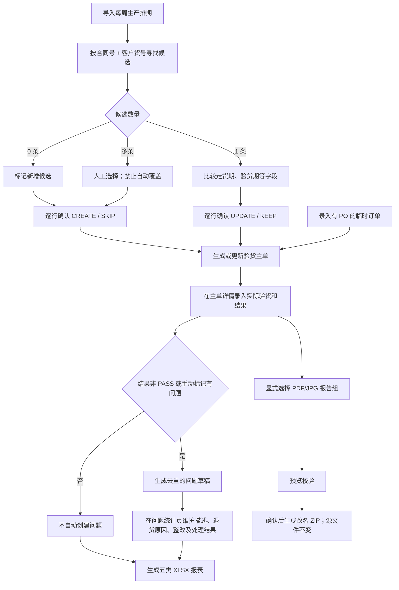
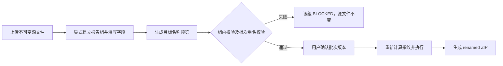

# QC 部完整业务流程与实施说明

> 文档版本：V2.0
> 业务确认来源：《1.docx》（2026-08-12）
> 原始流程来源：《QC完整业务流程.docx》
> 更新日期：2026-08-12
> 当前状态：代码、数据库迁移、接口和前端页面已进入仓库；需要执行迁移并重启服务后方可使用，本文不宣称已经部署到任何环境

## 1. 目的与范围

本文档是 QC 验货业务的当前实施基线，覆盖：

- 每周生产排期导入、候选匹配、变化预览和逐项确认；
- 临时验货单录入及验货主单维护；
- 验货结果录入、问题草稿自动生成和问题闭环；
- 客户、每周、华兴明细、华兴聚合及集团汇总五类 XLSX 报表；
- 验货报告 PDF/JPG/JPEG 显式分组、预览、批量改名及 ZIP 下载；
- 厂区隔离、集团汇总授权、审计、并发版本和幂等控制。

QC 验货运营中心是独立 QC 业务模块，不并入 QA 部“来料与成品检验”的业务数据模型。模块入口放在部门工作区公共模块区域，正式路由为：

```text
/modules/qc/inspection-operations
```

后端接口统一前缀为：

```text
/api/qc-inspections
```

## 2. 当前实施状态与上线边界

| 项目 | 当前状态 |
| --- | --- |
| 前端入口及工作台 | 已进入仓库，包含排期、临时订单、主单详情、问题统计、报表中心、报告改名页面 |
| 后端 API | 已进入仓库，统一位于 `/api/qc-inspections` |
| 数据库模型及迁移 | 已进入仓库，迁移版本 `20260812_0067` |
| 权限和厂区范围策略 | 已进入仓库，共 12 个 QC 权限代码 |
| 五类报表 | 当前只生成和下载 XLSX；PDF、CSV 和定时生成不在本轮实现范围 |
| 报告批量改名 | 已实现上传、预览、确认执行和 ZIP 下载；源文件保持不变 |
| 部署状态 | 未声明已部署；使用前必须执行数据库迁移并重启后端、前端服务 |

实施代码存在不等于已经上线。上线前至少应完成：迁移目标库、重启服务、确认岗位授权、按厂区做端到端验收，并用真实排期与报告样本核对结果。

## 3. 参与方与权限边界

### 3.1 业务角色

| 参与方 | 主要职责 |
| --- | --- |
| 业务部 | 每周提供更新版生产排期表 |
| QC 检验员 | 查看排期、录入结果、维护问题、维护临时订单、确认排期变化、预览及执行报告改名、导出本厂报表 |
| QC 主管、QC 经理 | 拥有检验员全部权限，并维护客户配置、读取本厂审计、管理本厂正式汇总 |
| 集团授权人员 | 通过独立跨厂权限读取或生成集团汇总；该权限不随 QC 经理岗位自动获得 |
| 系统 | 生成验货单号、候选匹配、记录确认、生成问题草稿、生成报表、校验改名、保存审计和幂等结果 |

### 3.2 12 个权限代码

| 权限代码 | 用途 | QC 检验员 | QC 主管/经理 | 集团授权人员 |
| --- | --- | :---: | :---: | :---: |
| `qc_inspection:read` | 读取本厂 QC 验货资料 | ✓ | ✓ | 按单独授权 |
| `qc_inspection:schedule_write` | 导入及确认排期 | ✓ | ✓ | — |
| `qc_inspection:order_write` | 维护临时验货单 | ✓ | ✓ | — |
| `qc_inspection:result_write` | 在验货主单详情录入结果 | ✓ | ✓ | — |
| `qc_inspection:problem_write` | 创建、编辑、处理和关闭问题 | ✓ | ✓ | — |
| `qc_inspection:report_export` | 生成及下载本厂报表 | ✓ | ✓ | — |
| `qc_inspection:report_rename_preview` | 预览验货报告改名 | ✓ | ✓ | — |
| `qc_inspection:report_rename_execute` | 执行批量改名并下载 ZIP | ✓ | ✓ | — |
| `qc_inspection:customer_manage` | 维护客户及彩星配置 | — | ✓ | — |
| `qc_inspection:audit_read` | 读取本厂 QC 审计 | — | ✓ | — |
| `qc_inspection:factory_summary` | 管理本厂正式汇总 | — | ✓ | — |
| `qc_inspection:group_summary` | 跨厂集团汇总 | — | — | 独立授权 |

普通 QC 权限只在当前部门、当前厂区生效，不能借公共入口读取其他厂区。`qc_inspection:group_summary` 必须绑定全部厂区/全局范围；集团汇总必须使用显式全局厂区参数，不能由本厂权限隐式升级。

## 4. 核心业务对象

迁移 `20260812_0067` 建立以下核心对象：

| 对象 | 数据表 | 作用 |
| --- | --- | --- |
| 客户配置 | `qc_customer_configs` | 客户、彩星标识、默认验货机构及跟客配置 |
| 排期导入批次 | `qc_schedule_import_batches` | 保存来源文件、周次、预览及确认状态 |
| 排期导入行 | `qc_schedule_import_rows` | 保存逐行候选匹配和变化结果 |
| 验货主单 | `qc_inspection_orders` | 承载排期、实际验货和结果；每单有系统唯一验货单号 |
| 验货问题 | `qc_inspection_problems` | 问题详情唯一维护入口，支持一张主单对应多条问题 |
| 排期变更决定 | `qc_schedule_change_decisions` | 记录每一行更新、保留、新建或跳过决定 |
| 报表快照 | `qc_inspection_reports` | 保存五类 XLSX 产物、来源快照和修订号 |
| 改名批次/报告组/源文件 | `qc_report_rename_batches`、`qc_report_rename_groups`、`qc_report_rename_source_files` | 保存预览、显式分组、不可变源文件、执行结果和 ZIP |
| 审计事件 | `qc_inspection_audit_events` | 记录重要操作、前后值、操作者和来源 |
| 幂等记录 | `qc_inspection_idempotency_records` | 防止相同请求重复创建或重复执行 |

所有业务对象均记录明确厂区。业务编号（验货单号、PO、合同号、货号、报告号等）按文本处理，避免丢失前导零。

## 5. 端到端流程



## 6. 阶段一：排期与临时订单

### 6.1 唯一标识和候选匹配

- 每一次验货由系统生成正式唯一的 `inspection_no`，唯一范围为厂区；
- “合同号 + 客户货号”只用于查找候选，不是数据库唯一键；
- 候选唯一时才进入字段差异比较；
- 没有候选时作为新增候选；
- 多个候选时必须人工选择或跳过，不得自动覆盖任一主单；
- 每次 `UPDATE`、`KEEP`、`CREATE`、`SKIP` 决定都保存来源行、目标单据、原因和操作者。

### 6.2 排期导入

支持 `.xls`、`.xlsx` 和 `.xlsm` 排期文件。流程为：

1. 选择当前厂区和周次，上传新排期；
2. 系统解析表头及数据，生成逐行预览；
3. QC 查看合同号、客户货号、原值、新值和候选主单；
4. QC 对每一行确认更新、保留、新建或跳过；
5. 服务端再次校验厂区、批次版本和主单版本后执行；
6. 保存导入批次、逐行决定和审计记录。

### 6.3 临时订单

临时订单必须填写 PO；没有 PO 时服务端拒绝保存。主要字段包括：

- 周次、客户、销售合同号；
- 客户货号、客户 PO；
- 产品名称、数量、出口国英文代码；
- 走货期、计划验货期；
- 验货机构、跟客人员及备注。

订单来源明确区分 `SCHEDULE_IMPORT` 和 `MANUAL`。修改使用版本号和请求号，避免并发覆盖及重复提交。

## 7. 阶段二：验货执行与问题闭环

### 7.1 验货结果

实际验货日期、验货结果、验货机构及手动“有问题”标记统一在验货主单详情录入。结果枚举为：

```text
PENDING / PASS / FAIL / REJECTED / CONDITIONAL_PASS / CANCELLED
```

### 7.2 问题首次触发和去重

初始 `PENDING` 只表示尚未提交验货结果，不触发问题。提交验货结果后，满足任一条件即生成待处理问题草稿：

- 结果为 `FAIL`、`REJECTED`、`CONDITIONAL_PASS` 或 `CANCELLED`；或
- QC 手动勾选“有问题”，即使结果为 `PASS` 也应生成问题草稿。

`PASS` 且未勾选“有问题”时不自动创建问题。自动草稿按主单和触发来源建立稳定去重键，重复保存同一结果不会重复生成问题。

### 7.3 问题唯一维护入口

问题描述、退货原因、整改措施和处理结果只在“验货问题统计”页面编辑。验货主单和报表读取其汇总结果，不提供第二个可编辑入口。

问题状态为：

```text
DRAFT / OPEN / IN_PROGRESS / RESOLVED / CLOSED / CANCELLED
```

一张验货主单允许存在多条问题，不再以“合同号 + 货号”强制建立 1:1 问题关系。

## 8. 阶段三：五类 XLSX 报表

### 8.1 当前报表类型

| 报表类型代码 | 业务含义 | 数据范围 |
| --- | --- | --- |
| `CUSTOMER_SUMMARY` | 客户验货汇总，按客户分 Sheet | 指定厂区 |
| `WEEKLY_STATISTICS` | 每周验货情况统计 | 指定厂区 |
| `HUAXING_CUSTOMER_WEEKLY_DETAIL` | 华兴各客户每周明细 | 仅华兴 |
| `HUAXING_WEEKLY_AGGREGATE` | 华兴每周聚合 | 仅华兴 |
| `GROUP_SUMMARY` | 集团验货汇总 | 全部厂区，需独立集团权限 |

当前报表主格式是 XLSX。用户可随时手动生成；周末可生成并保留正式周快照。每次生成都保存周次、厂区、报表类型、正式快照标识、修订号、来源快照、文件摘要和审计记录。

PDF、CSV、定时任务和直接写入共享目录未在本轮实现；后续若需要，应单独设计权限、失败重试和归档策略。

### 8.2 现有 Excel 版式的已知限制

生成器按五类现有 Excel 样板的物理列、主要表头、列宽/行高、汇总口径和打印范围，为当前选定业务周生成新的 XLSX。它不会修改原始 `.xls`，也不会把历史模板中的其他月份或周次工作表复制进本次周快照。客户验货汇总按当前厂区的有效客户配置动态建立 Sheet；即使某个有效客户本周没有完成验货，也保留该客户的空白版式，同时为本周已有数据但尚未配置的客户建立 Sheet，避免漏报。样板中的 12 个历史客户名不是代码硬编码清单。

验货主单已经提供装箱、箱数、报告状态和生产部门的正式字段及录入入口；问题记录已经提供第一责任人、第二责任人的正式字段及录入入口。生成报表时只能读取这些权威字段，不得从备注或问题描述猜测。历史记录未补录时，相应单元格保持为空。

现有“华兴各客每周验货汇总”中的“客人未退货由工厂自行返工 & 客人 AOD 单数”目前没有权威业务字段，因此该栏保持为空，也不能由 `CONDITIONAL_PASS` 或问题文本推断。正式验收时仍需业务确认是否新增独立字段和录入责任人。

## 9. 验货报告 PDF/JPG/JPEG 批量改名

### 9.1 已确认命名规则

| 报告类型 | 基础文件名 |
| --- | --- |
| 非彩星 | `出口国_客户货号_PO_实际验货日期` |
| 彩星 | `报告号_客户货号_PO_数量_实际验货日期` |

字段口径固定如下：

- 分隔符：半角下划线 `_`；
- 日期：实际验货日期，格式 `YYYYMMDD`；
- 货号：客户货号；
- 非彩星出口国：2 或 3 位英文国家代码，输出为大写，例如 `US`、`DE`；
- PO：保留原始业务文本和前导零；仅把不适用于文件名的字符规范化；
- 彩星数量：只包含数字，不带单位；
- PDF 扩展名输出为 `.pdf`；`.jpg` 和 `.jpeg` 输入均作为 JPEG 校验，输出为 `.jpg`；
- 文件系统非法字符、控制字符和空白统一转换为 `_`，连续下划线折叠；
- Windows 保留名称、超长目标名、伪造或损坏的 PDF/JPEG 均阻断该报告组。

示例：

```text
非彩星：US_ITEM001_000123_20260812.pdf
         US_ITEM001_000123_20260812.jpg

彩星：RPT009_ITEM001_000123_6000_20260812.pdf
       RPT009_ITEM001_000123_6000_20260812_01.jpg
       RPT009_ITEM001_000123_6000_20260812_02.jpg
```

单张 JPG 不加序号；多张 JPG 按显式序号稳定排序并追加 `_01`、`_02`……。

### 9.2 显式报告组和配对规则

系统不从源文件名猜测配对。用户或上游业务记录必须显式提供报告组，每组包含：

- 恰好一个有效 PDF；
- 一张或多张有效 JPG/JPEG；
- 彩星标识；
- 同一组命名字段；
- 多图时每张图片提供大于等于 1 且不重复的显式顺序；系统按该顺序输出连续的 `_01`、`_02`……序号。

PDF 或 JPG 任一方缺失、存在多个 PDF、图片顺序不明确、字段缺失或格式不合法时，整个报告组保持不变。

单批最多处理 39 个报告组、每组最多 25 个文件、单文件最多 25 MB、批次总量最多 250 MB。生产部署还必须在反向代理/网关设置不高于 250 MB 的请求体硬上限；应用内校验负责业务拒绝，但不能替代上传入口的流量与临时磁盘保护。

### 9.3 处理流程与原子性



- 报告组是最小原子单位：组内全部成功，或全部保持原状；
- 一个报告组失败不阻断其他无关报告组；
- 目标文件名采用大小写不敏感碰撞检查；同批次多个报告组产生相同目标名时，所有冲突组均停止；
- 不覆盖任何已存在或同批次同名目标；
- 预览和执行都按相同规则重新计算，指纹不一致时拒绝执行；
- 上传源文件作为不可变输入保存，系统只生成新的 ZIP 产物，不在原目录中直接改名；
- 最终交付方式是下载 ZIP；共享目录原地改名不在本轮范围；
- 每批次保存原文件名、目标文件名、内容摘要、组状态、异常、规则版本、操作者、时间及执行审计；
- 相同 `request_id` 和相同内容返回已有结果，内容冲突时拒绝，以防重复执行。

## 10. 共通数据安全与异常处理

| 场景 | 处理要求 |
| --- | --- |
| 排期候选为多条 | 人工选择或跳过，不自动覆盖 |
| 排期变化未确认 | 保留原值，不进入更新结果 |
| 临时订单缺少 PO | 阻止保存 |
| 并发版本已变化 | 拒绝旧版本写入，要求刷新后重试 |
| 相同请求重复提交 | 返回幂等结果；请求号相同但内容不同则冲突 |
| 问题触发重复 | 使用稳定来源键去重 |
| 下游报表生成失败 | 保留正式业务数据和既有报表，记录失败范围 |
| 改名组缺少 PDF/JPG、格式损坏或字段异常 | 整组不输出，其他有效组继续 |
| 批次目标重名 | 所有冲突组停止，不覆盖 |
| 跨厂读取或生成 | 服务端按权限和显式厂区拒绝越权 |

前端隐藏按钮不构成安全控制。所有关键权限、厂区范围、版本、必填字段和业务状态均由后端再次校验。

## 11. 主要接口与页面

### 11.1 前端页面

| 页面 | 路由 |
| --- | --- |
| 验货排期 | `/modules/qc/inspection-operations` |
| 临时订单录入 | `/modules/qc/inspection-operations/orders/new` |
| 验货主单详情 | `/modules/qc/inspection-operations/orders/:orderId` |
| 验货问题统计 | `/modules/qc/inspection-operations/problems` |
| QC 报表中心 | `/modules/qc/inspection-operations/reports` |
| 验货报告批量改名 | `/modules/qc/inspection-operations/report-renaming` |

### 11.2 后端能力

`/api/qc-inspections` 下提供：工作台、主单查询/新建/修改、问题查询/新建/修改、排期导入预览/确认、报表查询/生成/下载、客户配置、审计事件、改名预览/执行/下载。

写操作使用 `request_id`；修改操作同时使用 `expected_revision` 和原因，服务端保存审计前后值。

## 12. 上线与验收清单

### 12.1 上线前动作

1. 对目标数据库执行迁移至 `20260812_0067`；
2. 重启后端服务，使新路由和数据模型加载；
3. 重新启动或发布前端；
4. 为 QC 检验员、主管、经理和集团授权人员核对权限及厂区范围；
5. 用华兴和另一厂区各做一次权限隔离验证；
6. 用真实 `.xls/.xlsx` 排期文件验证表头和候选匹配；
7. 用真实 PDF、单图 JPG、多图 JPEG、缺配对和重名样本验证改名；
8. 对五类 XLSX 的 Sheet、表头、公式/聚合、权威字段映射和保留空缺栏做业务签字验收。

### 12.2 业务验收标准

- 每张验货主单都有厂区内唯一的系统验货单号；
- 合同号 + 客户货号只用于候选匹配，多候选不自动覆盖；
- 临时订单无 PO 不能保存；
- 验货结果只在主单详情录入；初始 `PENDING` 不触发问题，已提交的非 PASS 结果（包括 `CANCELLED`）或手动“有问题”（包括 PASS）会生成且只生成一份对应草稿；
- 问题描述、退货原因、整改措施和处理结果只在问题页维护；
- 五类报表按明确厂区范围生成 XLSX，集团汇总不能被普通本厂用户读取；
- 报告改名严格区分彩星和非彩星，使用 `_`、实际验货日 `YYYYMMDD`、客户货号、英文国家代码、原 PO、纯数字数量及 `_01` 多图序号；
- PDF/JPG 缺配对、内容损坏、字段异常或目标重名不会产生部分改名；
- 原始上传文件不变，下载物为新生成 ZIP；
- 所有批量和写操作均可由审计与幂等记录追溯。

## 13. 仍未确定或受当前模型限制的事项

以下事项不影响单 PO、单客户货号报告的当前实现，但在扩大使用范围前仍需业务确认：

1. 一份报告包含多个 PO、多个客户货号或多组数量时，字段排列顺序、组内连接符、长度上限及唯一性策略；当前实现要求每个显式报告组只提供一个 PO、一个客户货号和一个数量值，不会自行拼接。
2. “客人未退货由工厂自行返工 & 客人 AOD 单数”尚无权威字段，当前生成器保留为空且不猜测。是否新增独立字段、由谁录入、历史数据如何补齐，需要另行确认。
3. PDF、CSV、定时生成、共享目录直接改名及回退原目录文件不在本轮实现范围，如需增加应形成独立需求和安全方案。
