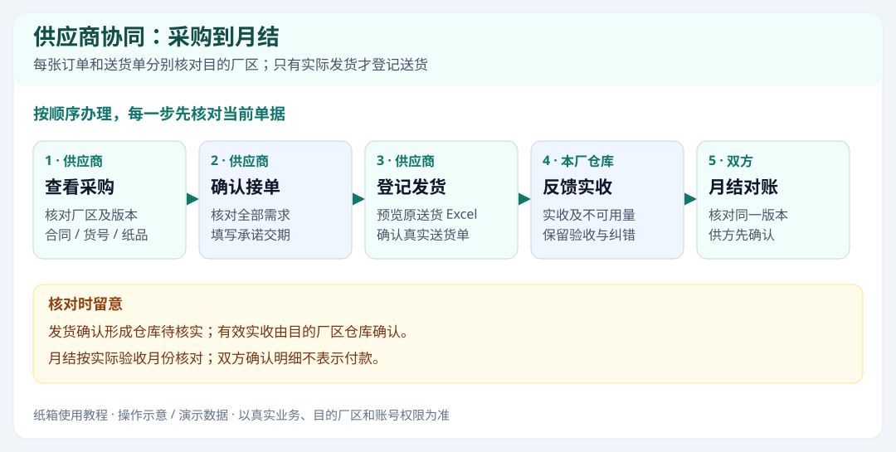
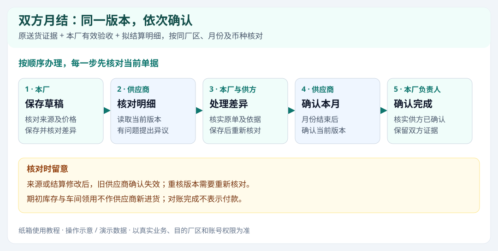

# 纸箱供应商协同使用教程

从纸箱供应商协同页面右上角的“使用教程”打开，可查找步骤、进入对应供应商页面，并使用“打印 / 保存 PDF”。先核对采购与目的厂区，再接单、登记真实发货、跟进仓库反馈；双方核对同一份月结版本。内部仓管操作见[纸箱模块使用教程](纸箱模块使用教程.md)。

配图为操作示意及演示数据，实际办理以目的厂区、账号权限和真实业务为准。

## 01 先认清厂区和操作分工

**首次启用 · 位置：纸箱供应商协同 → 页面顶部 / 订单管理**

供应商协同集中展示本供应商服务厂区的已发行采购、送货和仓库反馈。每张订单、送货单都按自己的目的厂区办理。

1. 登录供应商账号，确认页面名称为“纸箱供应商协同”，查看服务厂区数量；在订单行核对实际送往的厂区。
2. 选择厂区、客户和状态筛选，按合同、PO、货号搜索；日期可选择下单、计划交期或承诺交期，并按处理顺序、交期或下单日期排序。清空筛选保留排序，恢复默认排序另行操作。
3. 需要的采购未出现时，联系本厂仓管确认是否已锁定并发行；显示“变更待发行”时，等待本厂发行新版本后再按新需求接单。
4. 按下面顺序操作：核对采购 → 确认接单及交期 → 登记真实发货 → 查看仓库反馈 → 月底核对双方月结。

| 工作 | 办理人 |
| --- | --- |
| 发行采购、变更需求 | 本厂仓管 |
| 确认接单、承诺交期、登记送货 | 供应商 |
| 实收、不可用数量及验收纠错 | 本厂仓库 |
| 月结草稿及差异处理 | 本厂与供应商核实 |
| 确认当前月结明细 | 供应商先确认，本厂随后确认对账完成 |

**完成后检查：** 能区分本次订单的目的厂区和当前采购版本，知道接单、发货与仓库验收各由谁完成。

**操作时留意：**

- 厂区筛选只改变列表范围，不改变订单或送货单归属；同一合同、货号在不同厂区的资料分别核对。
- 供应商确认发货形成待收记录；仓库按实际验收确认入库。发货、入库、月结确认和付款是不同步骤。
- 能查看不一定能操作。缺少接单、发货或月结确认按钮时，联系负责人核实对应权限。

## 02 核对采购并确认接单

**每天工作 · 位置：订单管理 → 明细 / 确认接单 / 批量接单**

接单确认的是已发行采购版本和承诺送货日期。先核对纸品，再确认；已接过的旧版本不能代替新变更。

1. 优先查看“待接单”，点击“明细”核对客户、合同、客户 PO、货号、纸质、规格、单位及各纸品需求。
2. 填写真实可履行的承诺送货日期，核对本次有需求的全部纸品后确认接单；不把本厂计划日期直接当作自己的承诺。
3. 批量处理时勾选订单，检查“查看已选”，避免筛选隐藏的订单漏看，再核对各订单的承诺日期并确认。
4. 筛选或排序不会取消已勾选订单；留意“筛选隐藏”的数量，并在提交前查看全部已选订单。
5. 刷新后检查接单状态和待送数量；部分到货的订单按剩余未送需求继续安排下一批。

**完成后检查：** 本厂能看到当前版本的供应商接单情况及承诺日期，双方使用同一份已发行需求。

**操作时留意：**

- 跨厂区批量接单按厂区分别提交。提示部分成功时，先检查已成功的厂区，只处理仍未完成的订单。
- 已完成、已取消订单只能查看；交期提醒用于跟进，不会自动登记接单或发货。
- 客户 PO 缺失时由本厂核实原订单，不用合同号代填。

## 03 查看采购单，导出东康导入模板

**每天工作 · 位置：采购单与送货单 → 筛选 / 明细 / 导出东康导入模板**

采购单与送货单保留各自原始版本及明细。下载采购文件、导出东康模板和确认发货分别办理。

1. 按厂区、单据类型、状态、日期和单据号筛选，点“明细”核对原采购版本及所含订单；仓库同次批量下单可能显示为一张合并采购单。
2. 要导入东康系统时，只选择同一厂区的采购单，点击“导出东康导入模板”。核对客户单号、客户料号、纸品规格、单位、数量和交期后再导入东康。
3. 首次采购、追加、减单和交期变更分别看原单。东康导入模板按该采购版本的正增加量输出，不把当前累计需求重复导入。
4. 需要留档对照时，使用“预览并导出”查看所选单据；各厂区、各订单和来源单据保持分组。

**完成后检查：** 取得正确采购版本的原文件或受支持的东康导入文件，能够追溯来源单据。

**操作时留意：**

- 减单、仅改交期、规格不完整等不能导出东康导入模板时，按提示核实并使用原采购文件，不改成增加量强行导入。
- 导出或重新下载不会确认接单，也不会创建送货单。已成功导出但后续刷新失败时，不重复发货。
- 合并采购单保留原订单及纸品明细；不要按同一天日期自行把旧单拼成新的采购批次。

## 04 导入原送货单，确认真实发货

**每天工作 · 位置：订单管理 → 导入送货单；发货与仓库反馈**

使用东康原系统的 .xls / .xlsx 送货明细，先预览，再确认所选送货单。确认发货后等待目的厂区仓库核实。

1. 在订单管理点击“导入送货单”，在“导入东康送货单”窗口选择本次真实发货的原始 Excel，不用 PDF 或照片替代原明细。
2. 逐张核对目的厂区、原送货单号和送货日期，再核对原表行的合同、货号、纸质、规格、单位、发货数量和原送货单价。
3. 仓库已手工入库时，预览发现可匹配原收料后，选择“后补凭证，仅关联已有入库”，提交原文件并等待仓库关联。已收齐订单也可补凭证；这一步不新增在途、库存或应付。确为新一批送货才选择新发货。
4. 先解决提示的问题：未接单、变更未发行、需求不足、日期冲突或纸品存在多个匹配，都须核实后重新预览。
5. 完整但没有对应订单的纸品，只有预览允许“无单待仓库核实”时才随原单确认；由仓库按实物分类，不会自动变成采购订单。
6. 勾选已核对且可确认的送货单，点击“确认 … 张送货单发货”。再到“发货与仓库反馈”核对原送货单及目的厂区。

**完成后检查：** 原送货单进入目的厂区的待收队列，保留发货数量和原送货价格；仓库随后核实实际到货。

**操作时留意：**

- 原表“客户”对应送往厂区，“客户单号”对应合同，“客户料号”对应货号；不要把客户 PO 当作合同。
- 同一实际送货只登记一次。已从供应商协同确认的原单，由仓库直接核实，避免再从内部送货单导入重复登记。
- 遇到已用送货单号或网络超时，先查询发货记录及单据，再决定是否重试；不另编一个单号重复发货。

## 05 跟进实收、拒收和冲销反馈

**每天工作 · 位置：发货与仓库反馈 → 送货单明细 / 验收历史**

供应商看发货事实，仓库反馈实际验收。短收、破损、拒收和整单未到要逐行核实，不能只看“已核实”字样。

1. 按厂区、客户、原送货单号、收货状态及订单关联查找；日期可选择送货或实际验收，并选择新旧排序。查看实收、不可用数量和差异原因，未确认时联系对应厂区仓库核实实物。
2. 核对有效数量：例如发货 100、实收 98、不可用 3，则有效验收为 95；按双方认可的依据处理短收、损坏及拒收。
3. 后补凭证先显示“后补凭证待关联”，仓库完成后显示“已关联原入库”，实收与差异沿用原验收记录；原验收月份不会改成补文件月份。
4. 整单未收到或送错货时，核对仓库反馈并协商真实后续安排，不能直接把原记录当作已入库。
5. 收料已冲销、待更正时，查看验收历史，联系仓库从原送货单重新核实；旧验收不再计入当前实收。

**完成后检查：** 双方能够按原送货单核实当前有效验收，保留旧反馈及纠错过程。

**操作时留意：**

- 仓库已核实但全部拒收时，有效入库可能为零；不要仅凭状态推断应结数量。
- 冲销是纠正原收料，不等于重新发了一批货。供应商不要再次登记同一实际送货。
- 待收提醒是否读过不影响仓库待核实队列；只有业务核实结果才决定是否完成。

## 06 同一份月结，先核对再确认

**需要时处理 · 位置：月结对账 → 厂区 / 月份 / 币种 / 版本**

本厂先保存协同草稿，供应商核对同一版本。进货按实际验收日期归月，确认明细表示对账完成步骤，不表示付款。

同一版本依次确认；图为操作示意，对账完成不代表付款。

1. 选择目的厂区、月份和币种，点“查询 / 刷新”。没有草稿时联系本厂核实月份并保存协同草稿，无需供应商重新录一份相同账单。
2. 核对版本号和月结编号。逐行对照“供应商原送货”“本厂有效验收”“拟结算数量 / 单价 / 金额”和核对依据。
3. 短收、破损、拒收或价格不一致时，填写“核对反馈”，注明具体单据、纸品及原因，点击“提出对账异议”；反馈至少四字。
4. 退货核对双方认可的退货单价及贷项单号、日期；待验收、整行未收到、拒收或跨月验收核对未计本期明细。
5. 待本厂处理差异并保存后，重新读取当前版本，逐行复核。月份结束且页面无阻断问题时，点击“确认本月结算明细”。
6. 供应商确认后，等待本厂授权人员“确认对账完成”；历史版本只读留档，后续重核版本仍需重新核对确认。

**完成后检查：** 本厂与供应商确认同一版本、同一月份和币种的进退货结算明细，保留确认或异议证据。

**操作时留意：**

- 9 月发货、10 月实际验收的进货计入 10 月；本月尚未结束时可以核对或提出异议，不能最终确认。
- 本厂更新来源或保存修改会使旧确认失效；只能确认当前版本。按钮不可用时先检查月份、版本、差异和权限。
- 关键字、仅看差异、未关联来源和版本阶段筛选只缩小查看范围。合计和最终确认始终针对完整版本，不能只确认筛选后看到的几行。
- 期初库存及车间领用不加入本期供应商进货。上线前的未结账款按双方核实的旧账另行衔接，不能把旧库存重复记成新进货。
- 运费、折扣、税差等额外项目要联系本厂核实，当前不能忽略差额或改数量凑平；对账确认不表示已经付款。

## 07 查看正确的箱唛资料

**需要时处理 · 位置：箱唛资料库 → 厂区 / 资料预览**

仓库原文件按合同号共享，PDF、Excel 和图片可以分别查询；手工箱唛可查看仓库上传的照片，使用前核对本次订单与实际需要。

1. 点击页面右上角“箱唛资料库”，默认汇总全部已开通的服务厂区，也可选择单个厂区。按合同、客户、货号、文件名或格式查询，按上传时间、合同或客户排序；同合同 PDF、Excel、图片集中展示，可预览 PDF 和图片、下载原文件。核对所属厂区。
2. 资料不存在时，联系仓库确认文件已上传、合同已关联且对应订单已下单；不借用另一厂区或另一合同的文件。
3. PDF、Excel、图片不需要成对上传。预览和下载后仍须核对实际内容；箱唛变动时先刷新并联系仓库确认本次应使用的文件。
4. 仓库可将同一份手工箱唛的多张照片组成组，点击“查看照片组”一起查看，仍可分别下载各张原照片；分组不会增加其他订单或厂区的资料权限。

**完成后检查：** 取得对应厂区、已下单订单合同的仓库原文件。

**操作时留意：**

- 供应商只查看和下载自己的已下单订单资料，不能上传、改关联或查看未关联文件；共享原文件不代表已完成内容核对。
- 箱唛查看及下载不会确认接单或发货。

## 08 失败或超时，先查原单和日志

**需要时处理 · 位置：当前页面提示；采购单与送货单 / 操作日志**

先看具体原因和已完成阶段，再决定修正资料、刷新或重试。保留厂区、单据号及原文件方便核实。

1. 读完提示，记录目的厂区、原单号、操作时间、文件及出错行。确认是本次业务未完成，还是已完成但刷新或下载失败。
2. 导入失败时，按提示修正原表对应行，再重新预览；权限或版本问题联系本厂负责人核实。
3. 接单、发货已成功但刷新失败，只刷新查询；导出或下载失败时核实原单再下载，不再次确认发货。
4. 网络超时先查采购单与送货单、发货反馈及操作日志；结果仍不明确时联系负责人核实，再决定是否重试。
5. 操作日志可按厂区、关键字、事件类型和日期查询，选择新旧顺序后翻页查较早记录；页面只显示本供应商被授权的业务记录。

**完成后检查：** 能说明问题对应的厂区、原单、时间、行号及失败原因，避免重复发货或重复确认。

**操作时留意：**

- 保留原始 Excel 和提示原文用于核实；“预览成功”不等于发货已经确认。
- 超时不自动表示成功或失败。先查业务记录，不能另编单号重复提交。

## 09 反馈问题，查看功能变更

**需要时处理 · 位置：页面右上角 → 反馈与变更**

文字、截图及编号批注一起提交给管理员；在我的反馈中查看处理结果。

1. 打开“反馈与变更”，先选择问题对应的服务厂区，再填写标题、操作步骤和问题说明。
2. 需要图片时选择截图、Ctrl+V 粘贴，或截取当前标签页；框选问题位置并填写编号批注。最多 3 张，每张 5 MB。
3. 提交后进入“我的反馈”，查看待处理、已修改或暂时无法修改，以及管理员的回复。
4. 切到“功能变动”，查看管理员明确发布给本厂区东康供应商的更新说明。可按关键字和日期查询历史说明。

**完成后检查：** 管理员收到所属厂区的反馈，供应商能查看自己的回复和对应的更新说明。

**操作时留意：**

- 文字和图片仅提交人和有权限的管理员可见；其他供应商账号无法读取你的反馈。
- 切换厂区、账号或关闭窗口会清空未提交内容；先完成提交。问题反馈不代替送货、验收或月结异议。

## 每天收尾检查

勾选仅用于自查，不会修改业务记录。

- [ ] 待接订单已核对目的厂区、当前采购版本和承诺日期。
- [ ] 真实发货已登记原送货单号，未通过其他入口重复登记。
- [ ] 仓库短收、拒收、未到或冲销反馈已有明确跟进。
- [ ] 当期月结已核对当前版本；异议和待处理差异已说明。
- [ ] 失败或超时已先查原单和记录，未盲目重复提交。
