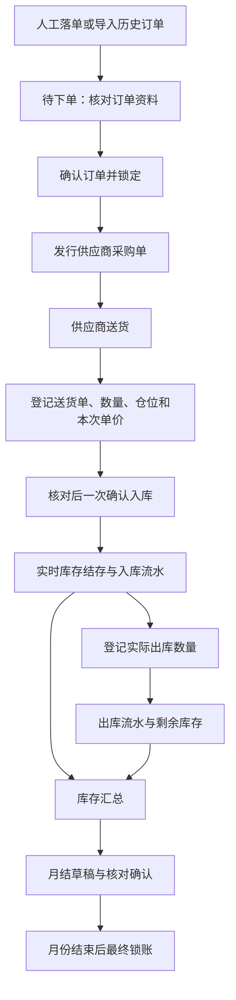

# 纸箱模块业务逻辑说明书

> 适用模块：PMC／仓管 → 纸箱采购协同  
> 整理日期：2026-09-08  
> 依据：当前仓库中的网页、接口、业务服务及项目约定。本文说明已经实现的规则；尚未完善或需要进一步确定的流程在第十五节单列。本文不代表生产环境已经部署或完成所有现场验收。

## 一、模块用途与业务边界

纸箱模块用于管理客户订单对应的外箱、滑板纸、卡纸等纸品，从落单、订单确认、供应商采购单发行，到收料、入库、出库、盘点、库存汇总和月结对账。

日常业务围绕三个问题展开：

1. **还需要采购多少？** 看订单需求、已收数量及待收数量。
2. **仓库现在还有多少？** 看正式库存流水形成的实时结存。
3. **这些数量怎样形成、价值多少？** 数量看库存汇总及订单流水；金额看月结对账。

订单数量、收料数量、库存数量和库存金额分别记录，不能互相替代。订单完成意味着应收纸品已经收齐，不意味着库存已全部出库。

供应商采购单的“发行”是形成可下载的独立采购文件；系统内确认订单不会自动向供应商发送邮件或消息，也不等于供应商已经接单。

## 二、页面分工

| 页面 | 主要用途 | 对库存的影响 |
| --- | --- | --- |
| 纸箱采购协同看板 | 查看业务协同情况、客户计划导入结果及待处理事项 | 看板浏览不改变库存；进入具体业务后按对应规则处理 |
| 纸箱订单管理 | 新建订单、确认锁定、发行采购单、追加、减单、查看订单明细 | 普通落单、追加和减单不直接改变库存；专门的退货处理涉及出库 |
| 每周核对与交期提醒 | 核对客户计划与正式订单，按验货安排提醒纸品到货 | 导入和提醒本身不产生库存 |
| 收料反馈平台 | 手工登记或导入送货资料，保存收料单，再确认入库 | 只有确认入库才增加库存 |
| 库存台账与交易流水 | 查看结存、登记出库、调仓、盘点、数量调整、期初库存管理 | 出库和调整形成流水；调仓改变各仓分布，总量不变 |
| 库存汇总 | 按订单及纸品查看期初、入库、出库、调整、结存，查看单个订单流水 | 只读统计，不重复记账 |
| 库存月结与对账报表 | 按客户、月份和币种核对数量与金额，核实缺价，最终锁账 | 生成对账快照，不新增数量流水；锁账限制相应期间后续记账 |
| 异常中心 | 处理缺单、数量差异、匹配不明确等问题 | 异常状态处理本身不等于完成落单或库存更正 |
| 统一操作日志 | 追溯操作人、时间、动作、原因和前后变化 | 留存证据，不作为第二套库存账 |
| 基础资料 | 客户、合同、货号及整套包装、交期规则、车间、仓位和维护授权 | 辅助新业务录入，不改旧单、不直接改变库存 |

主入口为 `/modules/pmc-warehouse/carton-procurement`。所有正式业务按工厂隔离。页面显示的工厂必须与操作人实际权限一致，后端会再次校验。

后端无法连接时，页面可能显示明确标注的只读演示数据。只有正式台账连接成功后才能进行真实业务操作，不能把演示数字当作已保存的库存。

## 三、订单与库存的对应关系

### 3.1 一张订单可以包含多种纸品

一张正式订单对应客户、合同号和一个货号，其下可以包含多行纸品，例如外箱和滑板纸。每行分别保存纸品类型、纸质、规格、单位、每箱装产品数及价格资料。

合同号、货号是日常识别信息；系统内部仍保留独立订单和明细标识。两张订单即使显示相同合同号、货号，也不会仅凭显示文字合并成同一笔库存。

### 3.2 产品数量与纸品需求数量

当前每行纸品需求采用以下规则：

```text
该行纸品需求数量 = 向上取整（订单产品数量 ÷ 该行每箱装产品数）
```

例如订单产品数量为 101 件，外箱每箱装 10 件，则外箱需求为 11 个。调整产品数量后，系统重新计算各纸品行的需求，不能直接把产品数量当作外箱数量。

这是当前系统采用的换算方式。每箱装产品数必须按真实包装方式填写；其他包装用量方式若不能用这个公式表达，需要另行确认，不能靠手改库存弥补。

订单列表中的纸品合计用于概览，各纸品明细保留自己的单位。正式库存汇总会分单位统计，不把“个”和“张”混成一个数量。

### 3.3 库存分别结存

正式订单库存按实际订单明细归属。没有正式订单的库存按客户、合同、货号、纸品类型、纸质、规格和单位等信息区分；成本核算还区分币种。

实物结存进一步按“仓库＋仓位”拆分。同一订单纸品可以同时放在多个仓位，每个仓位单独记录数量；订单及金额汇总仍保留原库存身份，不因为分仓重复计算。改变客户、合同或纸品属性，不是普通调仓。

## 四、业务主流程



以上是正常业务顺序。系统收料资格以“订单已确认锁定或部分收料”为准，未把采购文件是否已发行作为额外的收料门槛。使用时仍应按实际采购流程向供应商交付采购文件。

## 五、落单、确认、追加与减单

### 5.1 新建订单

填写客户、合同号、货号、产品资料、产品数量、下单日期、客户交期和纸品明细。客户从当前工厂的有效客户资料中选择。

输入货号可以引用历史资料，带出历史品名、纸品规格、装箱数及价格等信息；新合同号、数量和日期仍需按本次业务填写。历史资料是录入辅助，引用后仍要核对。

下单时允许价格暂不明确。实际送货时可以按送货单在收料页面填写本次入库单价。

### 5.2 两种交期

| 日期 | 含义 |
| --- | --- |
| 客户交期 | 客户要求的交付日期 |
| 计划交期 | 给纸品采购和到货使用的计划日期 |

新订单采用“客户覆盖规则 → 工厂默认规则 → 三个自然日”的采购提前量：

```text
计划交期 = 客户交期减本单采购提前量，但不得早于下单日期
```

例如使用默认三天提前量时，9 月 7 日下单、客户交期 9 月 15 日，计划交期为 9 月 12 日。紧急订单达不到本单提前量时，页面会提示缓冲不足。历史订单缺少客户交期时保留原计划交期，不自动推测补填。修改默认值只影响新单；修改或追加旧单仍沿用该单保存的提前量。

客户交期可设置“下单后若干自然日”的建议值，也可按客户关闭建议；落单人必须主动采纳，系统不会把建议自动当作客户实际要求。

### 5.3 订单状态

| 网页状态 | 业务含义 | 后续主要操作 |
| --- | --- | --- |
| 待下单 | 订单已保存，尚未进行正式确认锁定 | 核对、修改、追加或取消，随后确认锁定 |
| 已确认锁定 | 已确定采购需求，普通结构修改受限 | 发行采购单、收料；有权限人员可追加或减单 |
| 部分收料 | 已确认入库，但尚有纸品未收齐 | 继续收料；按权限追加或减少未收需求 |
| 已完成 | 每行应收纸品已满足需求 | 仍可正常出库；主管追加后可重新进入部分收料 |
| 已取消 | 订单不再按原需求继续执行 | 保留历史记录，不能当作普通待收订单继续收料 |

“确认订单并锁定”锁定的是订单资料；“最终锁账”锁定的是已结束月份的库存账，两者不是同一件事。

### 5.4 供应商采购单

供应商执行文件使用独立编号和发行时的快照。首单为 `P00`，追加为 `A01…`，减单为 `R01…`，仅交期等调整为 `C01…`。

追加、减单文件中的本次执行数量，按当前纸品需求与上次已发行需求的差额计算，不把累计需求再次当作本次新增采购量。重新下载已发行文件时，使用原发行内容。

批量发行中，有新变化的订单生成新文件；没有新变化的所选订单可复用最近一次已发行快照，并提示确认，避免误认为又产生了一笔新采购。内部“累计对账表”用于核对累计需求，不能作为新的供应商执行单。

### 5.5 追加、减单与退货

| 动作 | 改变什么 | 必须保留什么 |
| --- | --- | --- |
| 追加 | 增加订单产品数量，重新计算纸品需求 | 原收料、库存及采购单发行历史 |
| 减单 | 减少尚未收取、也未被待确认收料占用的需求 | 已入库数量及待确认收料占用数量 |
| 退货处理 | 对已收订单关联的现有库存登记退货出库 | 原入库证据和退货产生的出库流水 |

主管可对已确认锁定、部分收料或已完成订单追加。已完成订单追加后恢复为部分收料，只接收增加后仍未满足的需求。

减单只适用于已确认锁定或部分收料订单。系统保护已收数量和全部待确认收料有效数量，不允许把需求减到这些数量以下。已完成后追加的订单还保护追加前已完成的产品数量，不能利用装箱向上取整的余量减少旧需求。

部分收料订单减掉全部剩余未收需求后，可以转为已完成；完全未收的订单需求减至零时转为已取消。已完成订单不能直接减单。

追加、减单及其他更正会留原因和前后变化。退货不是减单的替代操作，具体能否退货还受当前库存及关联收料状态限制。

## 六、收料登记与正式入库

### 6.1 两种录入方式

- **人工登记：** 在待收订单列表选择一张或多张订单，进入收料弹窗，逐行核对。
- **导入送货资料：** 切换导入模式，识别文件或送货单图片，再人工核对匹配结果。

导入识别不等于收料成功，更不等于已经入库。缺单或匹配不明确的行必须明确处理，不能自动归入相似订单。

### 6.2 收料字段与计算

| 字段 | 业务含义 |
| --- | --- |
| 送货单号、送货日期 | 本次供应商送货凭证及凭证日期 |
| 合同、货号、纸品、规格 | 明确本行归属和实物身份 |
| 送货数量 | 送货单列出的数量 |
| 实收 | 实际清点接收的总数量，扣除项需在后面分别登记 |
| 破损 | 本次实收中因破损不能入账为可用库存的数量 |
| 拒收 | 本次实收反馈中明确不接受的数量 |
| 其他不可用 | 未归入破损、拒收，但本次不能进入可用库存的数量；应说明原因 |
| 有效收料 | 最终确认进入库存、满足订单需求的数量 |
| 单价／单位 | 本次入库价格及对应计价单位 |
| 仓库／仓位及分配数量 | 从本厂仓位目录选择；可以分仓，分配合计必须等于有效收料 |

```text
有效收料 = 实收 − 破损 − 拒收 − 其他不可用
```

实收不能大于送货数量，三个扣除项合计不能大于实收，数量不能为负。同一件不良品只计入一个扣除项，不能重复扣除。

例如送货 100 个，实收 98 个，其中破损 2 个、拒收 1 个、其他不可用 0 个，则有效入库为 95 个，而不是 100 个或 98 个。

### 6.3 核对后直接入库

人工录入和导入后人工复核的收料，统一点击一次“确认入库”。系统在同一个事务内检查订单状态、可收余量、单价格式、仓位分配和期间限制，保存收料凭据、生成有效数量大于零的入库流水，并更新订单进度；任何一步失败都不留下半张单或部分入库。

新网页不再生成需要二次确认的收料单。请求标识保护网络重试和并发重复点击，相同请求只入库一次；提交成功后锁定原表单，再刷新台账。原有待确认单仍可从历史台账继续确认或作废，不自动入库、不删除，也不能通过新流程绕过其已占用数量。旧版 API 的暂存模式保留兼容。

部分收齐时订单保持部分收料；所有纸品行均满足需求后变为已完成。有效数量为零的行保留收料证据，不生成零数量入库流水。

一行有效入库 100 个，可以分配一仓 A-01 放 70、二仓 B-01 放 30。收料历史保留当时各仓名称和数量；确认时仍只生成一条 100 个的正式入库流水，同时生成对应的仓位分账，不能记成两次入库。仓位不能重复，分配数量必须为正且合计准确。

### 6.4 可收余量与历史待确认单

每个正式订单明细均执行：

```text
已入库有效数量 + 历史待确认有效数量 + 本次新增有效数量 ≤ 该行订单需求数量
```

例如需求 100 个，已入库 60 个，历史待确认单占用 25 个，则本次最多再入库 15 个。继续确认历史单时，它的 25 个只计一次。

直接入库和历史单确认都检查这条规则，并在并发操作时保护同一工厂的相关业务。作废历史待确认单释放占用；冲销已入库单据后重新计算已收数量。旧数据若已经超占，不会被系统偷偷截短，必须先明确处理多余待确认单。

### 6.5 入库价格

正式订单收料默认带出订单已有单价，允许按本次送货单修改，最多六位小数；单位和币种沿用订单资料。本次保存的价格进入本张收料单，确认后进入本次入库流水，不反改原订单或过去收料单的价格。

留空或填 0 表示待核价，不代表已确认免费。可以先完成数量入库，但后续月结核对确认和最终锁账会受缺价限制。免费物料必须通过明确的核价确认留下依据。

### 6.6 没有正式订单的收料

送货导入中缺少正式订单的行，可由人工明确接受为非正式／打板收料。必须选择有效客户并补全物料、数量、单位和价格等资料。

这类收料同样先保存、再确认，确认后形成无正式订单关联的独立库存。系统不会为了让它入库而自动创建虚假的正式订单。

## 七、实时库存、出库与调仓

### 7.1 实时结存

实时库存由完整库存流水计算。待确认收料、未发行的采购变化和仅保存的盘点单均不直接改变结存。

库存列表将客户与合同号分列，支持筛选、表头全选以及逐行出库、调仓。全选针对当前筛选结果，批量操作前仍应核对所选明细。

### 7.2 单笔和多选出库

单笔出库选择准确的订单纸品及实际仓位，填写数量、来源单据号、用途和原因。用途固定为正常领用／发货、退供应商、损耗／报损、借出及其他，原因选项随用途联动。仓内转移统一使用调仓，不能同时登记成普通出库。

多选出库会展开逐行数量表。每行默认带出当前结存，但可分别修改本次出库量，并查看出库后的剩余量。例如两行库存分别为 20、30 个，本次可分别填写 5、12 个，不必整行全部出库。

每行数量必须大于零、最多四位小数，且不超过提交时所选仓位的实际结存；其他仓位有货不能替代本仓检查。批量出库整体校验：任意一行不合法，整批不扣库存。

### 7.3 重试与重复提交

系统为一次出库操作保留请求标识。相同操作在超时等情况下重试，会返回首次成功结果，不再扣第二次库存；同一标识换成不同内容会被拒绝。提交成功后的刷新失败会单独提示，避免把“库存没刷新”当成“出库没成功”。

这项保护针对同一次操作的重复请求。用户重新发起一笔新业务，或由另一位操作人另行登记，不能仅凭单据号相同就自动判定重复，因为同一单据可以分行、分批出库。实际交货仍需按凭证核对，不能把请求重试保护理解为所有业务重复都能自动识别。

### 7.4 调仓

调仓可把所选仓位的一部分或全部库存转到本厂另一个仓位。填写调仓数量，来源扣减与目标增加同时完成。来源仓位余额或版本已变化时需要刷新核对；重复提交同一请求只生效一次。

例如 A-01 有 20 个，调 12 个到 B-02，A 剩 8、B 增 12，总库存仍为 20。调仓不计采购入库、领用出库或盘盈盘亏，不改变库存金额；记录来源、目标、数量、时间和经手人。入库时间仍按该库存身份最近一次正式入库时间筛选，不因调仓刷新日期。

仓位目录使用固定身份，仓库名与仓位编号可在“仓位维护”或收料选择框旁新增；同厂重名自动复用。当前只支持同厂调仓，不支持跨厂调拨。旧系统的仓位文字不能证明各处实物数量，升级后先归到“待核仓位”，核实后分批调至实际位置；原流水文字与金额保持不变。

### 7.5 独立领用状态

采购进度和领用状态各自计算。订单已收齐，并不等于已经领完；正常领用／发货表示实物已从本库存交出，不代表车间已经消耗。

| 领用状态 | 判定含义 |
| --- | --- |
| 未入库 | 没有尚有效的入库、库存或领用事实 |
| 未领用 | 有库存，尚无有效的正常领用／发货数量 |
| 部分领用 | 已有正常领用／发货，仍有库存 |
| 当前已领完 | 当前已入库部分已正常领完；采购仍可处于部分收料 |
| 库存已结清 | 库存为零，但包含退货、报损、借出、盘亏等减少，不能全部称为领完 |
| 领用待核实 | 旧出库用途不明确或相关数量存在异常，不能猜测领用进度 |

仅明确用途为正常领用／发货的净出库计入领用；冲销扣回原用途的影响，调仓和盘点不计领用。后续再入库时，“当前已领完”可回到“部分领用”。多纸品订单逐行判定后汇总，不相加不同计量单位。状态由流水派生，不能手工勾选强行完成。

库存汇总增加“当前领用状态”和可展开的“当前仓位分布”。两项始终反映当前状况，选择历史日期时也不冒充当期快照；表内期初、收发、调整与结存仍按所选期间计算。

## 八、错单处理与数量调整

| 当前情况 | 当前处理入口 | 对原记录的处理 |
| --- | --- | --- |
| 收料已保存、尚未确认 | 收料历史 → 作废；需要时重新登记 | 保留原单并释放待确认占用，不产生库存冲销 |
| 已确认入库，需要撤回整张收料 | 收料历史 → 冲销 | 保留原单，追加对应反向流水 |
| 收料已冲销，需要更正重做 | 收料历史 → 重新登记 | 复制资料形成新草稿，使用明确的更正登记编号和关联说明 |
| 已发生出库或数量调整，需要撤回 | 库存流水中的冲销操作，按权限及流水状态开放 | 追加与原流水相反的记录，不直接改旧数量 |
| 少量临时数量纠错 | 更多操作 → 库存数量调整 | 留下有原因的增减调整流水 |
| 定期实物清点发现差异 | 库存盘点 | 填实盘、提交、复核后登记盘盈盘亏 |
| 仓位填写或存放位置变化 | 调仓 | 改当前仓位并保留位置变更记录，数量不变 |

收料冲销是**整张收料单处理**，不是只改当前显示的一行。系统检查该单所有相关入库流水、库存余额及计价结果；任意一项不允许，整单不冲销。

冲销或调整不能造成负库存。收料整单冲销同时检查原入库期间和本次冲销期间是否锁账；一般库存流水冲销当前检查本次记账期间。来源记录不一致、重复冲销、金额计算异常等情况也会阻止处理。物料已经出库时，原入库可能无法直接冲销，必须先核对相关后续业务，不能用虚增库存绕过限制。

“冲销”保留旧凭证及反向证据；“删除记录”会失去历史，两者不能混用。

## 九、库存盘点

### 9.1 盘点流程

```text
选择客户／仓位及库存明细
→ 创建盘点草稿
→ 填写实盘数量和差异原因
→ 确认账面截止依据并提交
→ 另一位有权限的主管复核
→ 差额入账，保留盘点单
```

单张盘点单最多包含 500 条库存明细。同一库存身份的同一仓位不能同时处于多张未结束盘点单中；不同仓位可以分别盘点。

| 状态 | 含义 |
| --- | --- |
| 草稿 | 创建人填写、保存，尚未产生库存变化 |
| 已提交 | 已确定本次账面依据、实盘数量及差额，等待复核 |
| 已入账 | 复核通过，非零差额已形成调整流水 |
| 已取消 | 本次盘点终止，保留记录 |

实盘留空与实盘为零不同。有差异的行需要填写原因。提交期间若账面发生收发或调仓，必须刷新并重新核对计数依据，不能把旧实盘数字直接套到新账面上。

盘点绑定创建时选定的实际仓位。货物移走后，原盘点单不会自动改成目标仓位；需要退回重盘原仓或取消后重建。升级前按整笔库存创建的未完成旧盘点单保留证据，但不能直接按新分仓规则过账，需取消重建。

### 9.2 复核按差额处理

提交时固定：

```text
盘点差额 = 提交依据下的实盘数量 − 账面数量
复核后结存 = 复核时当前结存 + 已提交的盘点差额
```

例如提交时账面 100 个、实盘 98 个，差额为 -2 个。提交后正常出库 10 个，复核时账面为 90 个，则复核后为 88 个。系统不会把结存覆盖回 98 个，从而丢掉中间那次出库。

创建人或提交人不能复核自己的盘点单，复核人需同时具备库存操作和主管调整权限。提交后仓位发生变化、差额会造成负库存、计价异常或期间已锁账等情况，会阻止复核。

零差额保留盘点证据，不生成零数量流水。退回重盘时保留上次提交证据。当前盘点通过网页填写，没有批量 Excel 实盘数量导入。

## 十、库存汇总与订单流水

### 10.1 订单收发汇总

库存汇总已承接原来的入库总览与出库总表，统一按订单和纸品明细核对：

```text
结存 = 期初 + 入库净数量 − 出库净数量 + 调整净数量
```

| 项目 | 含义 |
| --- | --- |
| 期初 | 筛选开始日期之前的库存结存 |
| 入库 | 所选期间正式入库，包含入库冲销的反向影响 |
| 出库 | 所选期间正式出库，包含出库冲销的反向影响 |
| 调整 | 所选期间盘盈、盘亏、期初补录等带正负号的调整 |
| 结存 | 根据以上项目计算的期间末结存；不筛日期时反映累计结存 |

入库 12 个、出库 6 个、没有期初及调整时，结存为 6 个。若筛选某段期间而期初已有 10 个，本期入库 12、出库 6，则期末为 16 个。

不同订单、不同纸品及单位分别列示。未发生流水的有效订单可以显示零收发，无单库存会明确标识，不伪装成正式订单。

### 10.2 冲销怎样进入汇总

入库冲销以负数影响“入库净数量”，出库冲销以负数影响“出库净数量”，均归入实际冲销发生的日期。原交易日期的证据保留，不能同时删除原交易又计一次冲销。

例如 9 月 7 日入库 10 个，9 月 8 日全部冲销：7 日入库净数为 10，8 日入库净数为 -10；两天合计为 0。

### 10.3 筛选与明细

汇总支持客户、记录日期和顶部关键字筛选，并提供入库明细、出库明细、调整明细。关键字先确定匹配的库存身份，再保留这些库存完整的相关历史计算余额，不只把含关键字的某一笔出库单拿来算结存。

统计从后端完整流水计算，不受库存页面只显示最新 500 条流水的限制。不同单位分别汇总，数量页不另算一套库存金额。

### 10.4 只看当前订单的流水

每行“订单流水”点击后打开该订单的业务变化弹窗，可滚动和筛选；鼠标悬停不自动打开。点击关闭、遮罩或按 Escape 可关闭。没有另设一个全订单流水页面。

精简流水保留落单／历史导入、追加、减单、取消／退货、实际入库、出库、数量调整、冲销和调仓。收料保存、确认锁定、采购单发行等过程操作仍在统一操作日志中，避免订单流水被重复步骤淹没。

流水区分订单产品数量变化与纸品库存数量变化。缺少原始数量证据的旧记录会显示未知，不用现在的数量冒充当时的落单数量。

订单流水查看的是选中订单本身的历史，不局限于外层汇总当前选择的日期；切换工厂或外层筛选会关闭预览。

## 十一、库存金额与单价核实

### 11.1 移动加权平均成本

数量相同不代表金额相同。系统按工厂、客户、实际库存身份、单位和币种分别核算成本，正向入库使用该次入库价格，出库和减少库存按当时移动平均成本计价。

```text
平均成本 = 当前库存金额 ÷ 当前库存数量
出库金额 = 本次出库数量 × 出库前平均成本
```

例如同一库存先入 100 个、单价 2 元，再入 100 个、单价 4 元：

- 数量为 200 个，库存金额为 600 元，平均成本为 3 元／个。
- 随后出库 50 个，出库金额为 150 元，剩余 150 个、450 元。
- 全部出清时扣掉准确的剩余金额，避免显示单价舍入后留下一点残余金额。

冲销恢复原交易对应的计价影响，不能随意按今天的新单价重算成另一笔金额。同一秒旧流水若缺少可确认的先后顺序并影响计价，系统会提示异常，不猜一个顺序强行关账。

### 11.2 缺价与错价分别处理

| 情况 | 当前规则 |
| --- | --- |
| 入库时不知道价格，填空或 0 | 可先入库，形成待核价问题 |
| 确认实际为免费物料 | 核实单价时明确勾选免费并填写原因 |
| 原始正向入库／期初记录为 0，尚未核实过 | 月结页面问题区可执行“核实单价” |
| 非零单价填错，或已核实后再次发现错价 | 当前没有专门的直接改价流程；改进方案暂缓，等待实际业务流程确定 |

核实缺价会保留原流水和核价依据，重新计算相关未锁账月结并退回草稿，要求重新核对。影响已锁期间的核价不允许直接执行。

缺价库存即使已经出完，也不能因为期末数量为零就忽略价格问题。当前整单冲销后重新登记可以处理部分错单，但受到库存已消耗、计价及锁账限制，不能把它描述为任何时候都能顺畅修改价格。

## 十二、月结：核对确认与最终锁账

### 12.1 月结状态与业务影响

月结按工厂、客户、月份、币种形成对账快照。快照是对已有流水的核对结果，不再重复产生一遍入库、出库。

| 状态／动作 | 作用 | 是否停止日常收发 |
| --- | --- | --- |
| 生成草稿 | 汇集该期间数量、金额及问题 | 否 |
| 提交核对 | 进入待核对状态 | 否 |
| 核对确认 | 确认当前这份对账快照 | 否 |
| 最终锁账 | 月份结束、资料完整后封存该客户的本期账 | 限制对应客户、期间新增或冲销数量流水 |
| 解锁重核 | 保留原快照证据，退回草稿重新处理 | 按解锁后的期间状态恢复相应业务操作 |

未结束的月份不能最终锁账。日常核对可随时进行，不需要为核对数字而停止整个月收发货。

### 12.2 最终锁账前检查

必须没有未处理缺价或计价异常，快照必须与最新库存流水一致。核对后又发生收发，旧快照可能过期，应重新生成并核对。

最终锁账需要月结权限和主管调整权限，并进行单独确认。锁定后不能通过普通出库或冲销绕过限制，也不会自动解锁。

### 12.3 锁账后发现问题

有权限人员填写至少四个有效字符的原因，执行“解锁重核”。系统保留原锁账快照、人员、时间和解锁原因，状态回到草稿，原库存流水不因解锁而改变。

同客户、同币种如果有更晚的已锁月份，需要先从后面的月份解锁，再处理前期。更正后重新生成草稿、核对，再按条件最终锁账。

月结快照按币种分别核算；当前数量流水的锁期检查按工厂、客户和记账月份判断，不应理解为换一个币种就可以绕过该客户已锁期间。

## 十三、日期与搜索口径

### 13.1 页面日期不完全相同

| 日期名称 | 当前含义 | 主要使用位置 |
| --- | --- | --- |
| 下单日期 | 订单业务日期 | 订单筛选、订单汇总展示 |
| 客户交期 | 客户要求的交付日期 | 订单及采购资料 |
| 计划交期 | 按规则提前后的纸品计划到货日期 | 交期提醒、待收订单日期筛选 |
| 送货日期 | 送货凭证填写的日期 | 收料历史筛选 |
| 入库时间筛选 | 每笔库存完整入库历史中的最近一次入库时间 | 实时库存列表 |
| 库存记录日期 | 流水实际记账时间，按上海时区划分日期 | 收发汇总、库存流水及月结归属 |
| 操作时间 | 谁在什么时间做了动作 | 操作日志及业务证据 |

**“入库时间”当前实际筛的是最近一次入库时间，并非首次入库时间或最近任意变动时间。** 后续出库、调仓和调整不会刷新这个入库时间。只有期初调整、没有入库记录的库存，在启用入库日期筛选后不会命中。

### 13.2 跨月补录示例

送货单日期为 9 月 30 日，但 10 月 2 日才在系统确认入库：当前收料历史可按 9 月 30 日送货日期找到它，实际入库流水及收发汇总归入 10 月 2 日，月结归属为 10 月。

目前没有在普通入库、出库页面独立选择“实际业务发生日期”来替代记账时间的完整流程。是否允许跨月补录、怎样审批、怎样影响已锁月结，需要另行确定，本文不将其写成已上线功能。

### 13.3 搜索与筛选

顶部搜索承担合同、货号、单据、纸品等关键字查找，各页按本页业务对象匹配。订单、收料历史、库存结存和库存流水不再各放一个重复关键字框。

客户、状态、交期、送货日期及流水类型等筛选保留在对应表格区域。日期范围包含起止两天；部分页面的“清空筛选”也会清除共享顶部关键字，因此清空后统计范围会一并恢复。

## 十四、辅助业务与权限

### 14.1 客户计划、验货计划与异常

客户计划核对和验货交期提醒是两条独立流程：

- 客户计划与正式订单比较，找出缺单、数量差异，再由人工进入落单、追加或减单处理。
- 验货计划根据首次验货日期减去设定提前天数，生成纸品到货提醒。这里的提前天数与订单基础资料中的采购提前量是两套规则。

支持客户自己的文件格式及表头映射，不能假设所有客户使用同一模板。送货图片使用本地识别，解析或匹配失败时需人工核对；识别内容不是已经审核的正式业务数据。

异常中心保留问题、责任归属、状态及解决说明。将异常改为已解决，并不自动生成订单或补上库存，必须确认对应业务动作确已完成。

### 14.2 历史与期初导入

历史订单导入进入正式订单资料体系；期初库存导入用于系统启用、迁移或补录已有库存，通过独立库存调整记录形成余额。

期初库存入口位于“更多操作 → 期初库存管理”，不是日常送货入库入口。同一批实物不能既当期初库存导入，又重复登记一遍正常收料入库。

### 14.3 权限与责任

| 能力 | 后端权限依据 | 说明 |
| --- | --- | --- |
| 查看纸箱模块 | `carton_procurement:read` | 受工厂范围限制 |
| 普通订单操作、采购文件 | `carton_procurement:order_write` | 已锁订单的结构和状态仍有业务限制 |
| 主管追加、减单等 | `carton_procurement:order_adjust` | 不能绕过已收数量保护 |
| 登记与确认收料 | `carton_procurement:receipt_write` | 收料冲销还需库存操作权限 |
| 出库、调仓、数量调整、盘点操作 | `carton_procurement:inventory_write` | 盘点复核还需主管权限，且不能自审 |
| 月结与缺价核实 | `carton_procurement:closing_manage` | 最终锁账、解锁还需主管权限 |
| 文件导入 | `carton_procurement:import` | 导入后仍需按对应业务审核 |
| 客户维护 | `carton_procurement:customer_manage` | 已被订单引用的客户不能直接删除，可停用 |
| 异常处理 | `carton_procurement:exception_manage` | 保留处理状态和说明 |

具体账号能做什么以实际分配权限为准，不能只看职位名称。按钮显示或隐藏不是唯一安全边界，后端仍校验权限、工厂、单据版本、库存及锁期。

## 十五、当前限制与待确认事项

| 事项 | 当前情况 | 使用时的边界 |
| --- | --- | --- |
| 非零错价、已核价后的再次纠正 | 缺少专门的顺畅改价路径；已明确暂缓改进 | 等实际流程确定后再设计，不把缺价补录当成任意改价 |
| 独立业务日期与跨月补录 | 普通收发按实际记账时间归期 | 送货日期不会自动改变月结归属 |
| 长期库存流水查找 | 库存页只取最新 500 条，尚无完整分页入口 | 老流水普通页面查找、冲销入口受限；余额和汇总仍按完整流水计算 |
| 大量历史汇总 | 匹配明细一次返回，尚未提供分页或导出 | 大数据量性能尚未建立充分验证 |
| 旧库存实际仓位分布 | 新版支持分仓；旧数据初始归待核仓位 | 需现场核实并分批调仓，不自动猜测旧分布 |
| 旧出库用途及车间消耗 | 旧用途不明确时显示待核实；正常领用表示交出仓库 | 不等于车间实际用完；当前未做用途补认或车间消耗台账 |
| Excel 实盘数量导入 | 尚未实现 | 当前使用网页盘点填写和复核 |
| 历史旧流水的证据缺失 | 部分旧数量快照或同秒操作顺序无法还原 | 显示未知或计价异常，不虚构原始数量及顺序 |
| 前期未锁、后期已锁时的回溯影响 | 一般记账检查针对直接记账月份，未全面覆盖所有后续锁期依赖 | 涉及历史导入或回溯调整时，仍需核对后期锁账影响 |
| 不同冲销入口的锁期检查 | 收料整单冲销检查原期间及当前期间；一般库存流水冲销检查当前期间 | 不能理解为所有冲销入口对原期间都有完全相同的限制 |

当前普通“落单 → 收料确认 → 入库 → 出库 → 数量汇总 → 金额核对”已有连贯的数据链；重复出库请求和多张待确认收料超占也有后端保护。但不能据此宣称所有历史纠错、跨月回溯及长期大数据使用场景均已闭环。

## 十六、业务核对示例

下表用于理解和后续验收，数值是示例，不是本次实际操作生产数据的记录。

| 场景 | 操作示例 | 预期结果 |
| --- | --- | --- |
| 包装换算 | 产品 101 件，每箱 10 件 | 外箱需求 11 个 |
| 未确认订单收料 | 待下单订单尝试登记入库 | 必须先确认锁定 |
| 保存收料 | 保存有效收料 5 个，未确认 | 库存不变，占用可收余量 5 个 |
| 部分入库 | 需求 11 个，确认 5 个 | 库存增加 5 个，订单部分收料 |
| 多张待确认保护 | 已收 5、待确认 4，再保存 3 | 需求为 11 时拒绝；最多再保存 2 |
| 多选部分出库 | 两行库存 20、30，出库 5、12 | 分别剩余 15、18 |
| 同次请求重试 | 已成功出库 5 个后重发同一请求 | 不再重复扣 5 个 |
| 批量失败 | 两行中一行超过库存 | 整批不扣库存 |
| 调仓 | 20 个从 A-01 移至 B-02 | 数量不变，保留仓位变更记录 |
| 盘点后继续出库 | 提交差额 -2 后正常出库 10 | 复核只再调整 -2，不覆盖出库结果 |
| 冲销入库 | 在允许条件下冲销已入库 5 个的收料单 | 原记录保留，反向流水扣回 5 个 |
| 缺价关账 | 未核价入库已全部出库 | 缺价仍阻止核对确认和最终锁账 |
| 当月日常核对 | 当月对账核对确认后继续出库 | 核对确认不阻止正常出库；快照变化后重新核对 |
| 当月最终锁账 | 月份尚未结束尝试最终锁账 | 拒绝最终锁账 |
| 跨月录入 | 9 月 30 日送货、10 月 2 日确认 | 当前入库归 10 月，送货日期仍为 9 月 30 日 |

## 十七、基础资料与防错

基础资料按工厂隔离，分为“基础设置”和“货号与包装”两页。基础设置顶部集中展示唯一的本厂通用交期；客户列表复用原有客户档案，直接新增、修改资料或设置规则，并显示实际采用的交期和编号格式。关联合同在客户行下展开，车间和按仓库分组的仓位在同页维护，仓库维护授权收在“权限设置”。货号与包装保留独立查找和多套纸品配置。本厂默认不作为客户显示，客户名单即使尚无独立规则也会展示；客户维护不再另开一份清单。切换工厂关闭原客户表单，过期加载与保存响应不会写入新厂页面。

正式历史订单及已接受的历史导入会自动整理出合同、货号和整套纸品；普通未确认订单、识别预览不会自动成为资料。完全一致的配置去重并保留来源，不同配置分别展示，计量单位、尺寸单位和装箱数一并保留。

落单时先选择客户，再输入货号并选用整套配置。物品名与纸品一次带出；合同号、产品数量和客户交期仍由本次订单填写。系统不把历史价格作为基础资料价格。与历史不同或出现多套配置时，提醒核对但允许保留本单填写。

编号格式可设置前缀、长度和字符范围，分别选择不检查、提醒或强制检查。合同对应新货号、合同号曾在其他客户出现，是独立的对应关系提醒。高级维护停用的合同不能用于新订单。原订单日常日期和备注调整不会被新格式规则误伤。

修改资料、推荐配置、启停用和默认规则需要本厂高级维护权限，并记录原因和前后内容。普通落单者可以改变本单配置，但不能覆盖原资料。自动整理不会覆盖主管修订，也不会把停用配置重新加入成启用副本。

车间是领用去向，仓位是库存存放位置，分别维护。出库可统一指定车间，多选时每行可覆盖；流水保存当时名称，冲销继承原去向。车间更名不会改掉原流水，也不代表已经建立车间实际耗用台账。

仓位可更名和停用，稳定 ID 不变。停用后禁止新增入库和调入，可继续出库、调出或符合库存限制的冲销。有库存要换位置时仍须调仓。仓库负责人可以被授予指定仓库的维护权限，但须已有本厂库存权限；跨仓库更名检查两边权限。普通收发接口不能利用自由文本偷偷新建仓位。

目前资料和来源全量返回，未验证大规模历史数据性能；跨年度重复合同未独立建批次。实际编号格式、车间名称和仓库负责人需要现场有权限人员配置。

### 编号自动识别与操作原因

合同号、货号分别设置。可以粘贴完整编号样例（每行一个）并点击“识别格式”；没有填写样例时，根据本厂本客户正式历史订单识别。填写样例优先，不混入历史编号。一条样例也可以生成候选格式，没有样例也没有历史则不执行分段检查。识别结果可以手动修改，保存后固定；新订单、刷新资料、修改交期或备注都不会自动扩大格式，需主动重新识别或修改后保存。

例如 `SC700149169/600` 与 `SC700143393/1600` 合并为 `SC{9}/{3,4}`，即 SC＋9 位数字＋斜杠＋3 或 4 位数字，后缀 2 位、5 位不匹配。`{3,5}` 只允许 3 或 5 位，不包含 4 位；每行可写一种格式。多个数字段同时变化时保留实际观察到的组合，不自行拼出未出现的组合。界面显示中文格式解释，默认软提醒，不替换输入；高级维护人员可以设置强制检查，修改强制检查需自行填写具体说明。原有人工前缀、长度和字符规则继续兼容。旧的自动识别规则尚未保存固定格式时，需要打开规则识别并保存一次。

常用操作默认填写可修改的原因：新增或修正基础资料、调整默认交期、车间仓位维护和启停用、修改未锁定订单、取消未入库订单、追加减单、正常出库、收料作废与冲销、库存流水冲销、取消盘点。

关键或少用操作保留自行说明：仓库维护授权、启用或关闭强制格式检查、已入库订单退单、月结解锁、补价或免费物料依据、直接调整库存、盘点差异、退回重盘，以及其他出库用途。取消盘点默认原因与退回重盘原因分开。默认文案不替代原有权限、确认、数量校验和前后变化审计。

## 十八、维护依据

本文以业务含义组织，以下文件用于开发核对和后续维护：

| 内容 | 代码位置 |
| --- | --- |
| 网页入口、订单、收料、库存、月结交互 | `src/views/CartonProcurementView.vue` |
| 收料明细预览 | `src/components/CartonReceiptDetail.vue` |
| 库存汇总、单订单流水 | `src/components/CartonInventorySummary.vue`、`src/components/CartonOrderTimeline.vue` |
| 盘点工作区 | `src/components/CartonStocktakeWorkspace.vue` |
| 基础资料、落单辅助及维护权限 | `src/components/CartonMasterWorkspace.vue`、`src/components/CartonMasterOrderAssist.vue`、`backend/app/services/carton_master.py` |
| 接口与权限 | `backend/app/api/carton_procurement.py` |
| 订单、收料、库存及月结业务规则 | `backend/app/services/carton_procurement.py` |
| 库存金额计算 | `backend/app/services/carton_inventory_valuation.py` |
| 完整流水汇总与订单追溯 | `backend/app/services/carton_inventory_report.py`、`backend/app/services/carton_order_timeline.py` |
| 盘点单与复核规则 | `backend/app/services/carton_stocktake.py` |
| 出库请求重试保护 | `src/api/cartonInventoryRequest.ts` 及后端对应库存接口 |

后续若改变价格纠正、记账日期、锁账、数量换算或库存归属规则，应同步更新对应章节及验收示例，避免说明书与网页产生两套口径。
