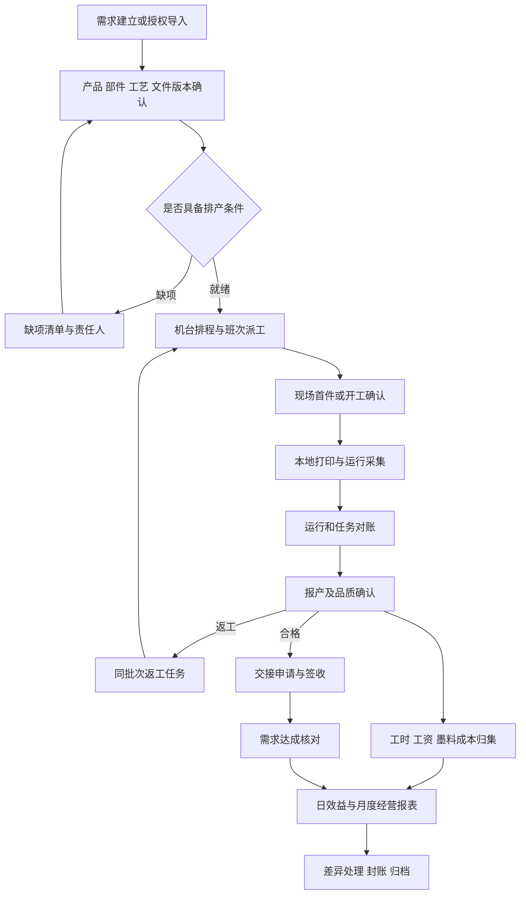
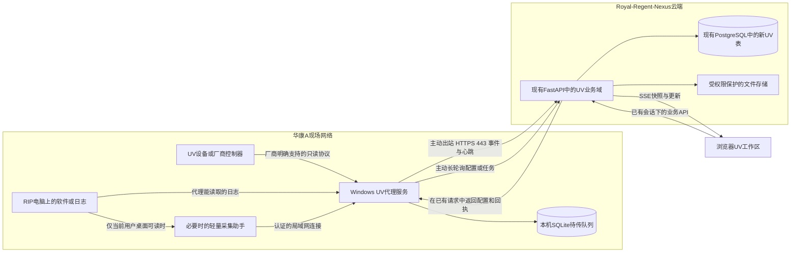

# Royal-Regent-Nexus · 华康A UV打印部
## 业务逆向、产品设计、云端—本地代理架构与 Codex 开发闭环

**文档日期：2026-09-23**  
**交付性质：开发规格，不是已实现功能报告。**  
**目标项目：`D:\RR\royal-regent-nexus`**  
**业务范围：仅 `huakang-a`，生产部下的 UV 打印管理。**  
**设计方向：业务可追溯、现场可操作、连接可信；布局大胆，不靠装饰性大屏掩盖业务。**

> 给 Codex：先阅读第 0、1、3、7、8、13、14 章，再开始实现。本文是目标规格；“源码已核实”“新设计”“现场待核实”不能混为一谈。不要恢复已移除的旧 UV 实现，不要迁移参考分厂的数据，不要把模拟机当真机，不要在完成几个页面后宣布整个模块交付。

---

## 阅读导航

| 章节 | 解决的问题 |
|---|---|
| 0–1 | 当前项目是什么状态；参考项目到底做了什么 |
| 2–4 | 新模块定位、数据真相、端到端业务与计算口径 |
| 5–6 | 大胆布局、具体页面、动效、响应式与可视化编码 |
| 7–9 | 本地代理、实时链路、接入能力、数据库与 API |
| 10–12 | 厂区权限、导入导出、测试、容量与异常闭环 |
| 13–15 | 实施顺序、验收、上线回退、待核实事项 |
| 附录 A–C | 源码证据、官方技术依据、可直接使用的启动提示词 |

# 0. 执行边界：先保护现状，再建立新的 UV 业务域

## 0.1 已核实的项目快照

通过 Remote Desktop Commander 对用户授权电脑进行只读、定点读取：

- Git HEAD：`9b6155fe83bc75c786f51bb54332b6479f0376fc`。
- 分支：`chore/remove-uv-printing-20260922`。
- `src/data/enterpriseMock.ts:1034–1048` 只保留 `uv-printing` 占位卡，`detailPage: false`、`factoryIds: ['huakang-a']`，无指标、待办和子功能。[S01]
- 已查看的 `src/router/index.ts`、`backend/app/main.py`、权限目录中，不存在可恢复使用的 UV 运行入口。当前记忆文档也明确要求全新重建。[S02–S05]
- 历史数据库与 Alembic 迁移没有随运行代码一起删除。`20260922_0120` 退役 13 个旧 `uv_printing:*` 权限，前驱为 `20260922_0119`；不能因此推断本地或生产数据库已经迁移到该版本。[S06]
- `backend/alembic/env.py:50–54` 会保护已退役的、无运行模型对应的 `uv_*` 历史表，避免自动迁移误删。[S07]

本次读取时发现已有未提交修改：

```text
PROJECT_MEMORY.md
docs/spray-production/ACCEPTANCE.md
docs/spray-production/IMPLEMENTATION_STATUS.md
docs/spray-production/RUNBOOK.md
src/features/spray-production/contracts.ts
src/features/spray-production/pages/ImportsPage.vue
src/features/spray-production/workspace.ts
```

**Codex 开始时必须重查实际状态。不得清理、覆盖或顺手格式化这些修改。不得执行 `git reset --hard`、`git clean`、未经要求的 commit/push/PR。当前文档编制没有修改本地项目、运行数据库迁移或访问真实打印设备。**

## 0.2 已核实技术基线

沿用当前 Vue 3 + TypeScript + Vite + Pinia + Vue Router，以及 FastAPI + SQLAlchemy + Alembic。生产数据目标仍使用项目 PostgreSQL；本地测试数据库策略沿用项目，但并发与迁移最终必须在一次性 PostgreSQL 环境验证。[S08–S11]

当前前端已有：Tailwind CSS 4、Reka UI、shadcn-vue、`@lucide/vue`、TanStack Vue Table / Vue Virtual。图标从 **`@lucide/vue`** 引入，先确认实际导出名，不要套用另一个包的导入路径。不得为本模块引入 React、Vant、PocketBase 或第二套云端 .NET 后端。

**真实存在的验证脚本：**

```text
npm run typecheck:app
npm run typecheck:test
npm run test:unit
npm run build
```

不存在通用 `npm run lint` 或 `npm test` 的事实依据；不要把未定义脚本写成已通过。

## 0.3 新域命名：避免复活退役契约

以下均为本方案拟新增，不是当前仓库已有文件或接口：

| 对象 | 约定 |
|---|---|
| 页面入口 | `/modules/production/uv-printing`，内部有独立子路由 |
| 新前端功能目录 | `src/features/uv-operations/` |
| API | `/api/uv-operations` |
| 代理 API | `/api/internal/uv-agent` |
| Python 模型 | `UvOps*` |
| 新数据库表 | `uv_ops_*` |
| 新权限 | `uv_ops:*` |
| 边缘程序 | `edge/uv-printing-agent/` |
| 实施文档 | `docs/uv-operations/` |

旧 `uv_printing:*` 权限不自动恢复、复制授权或兼容放行；旧 `uv_*` 数据不自动灌入新域。新迁移必须在执行时确认真实 Alembic head，不能根据本文日期硬写 `down_revision`。

**迁移过滤的特殊注意：** `uv_ops_*` 也以 `uv_` 开头。新模型必须显式进入运行 metadata 与 Alembic metadata，测试证明新表能被识别；不能通过删除历史保护过滤器来“修好迁移”。未来删除新域表应使用明确审核过的迁移，而非期待该过滤器自动生成 DROP。

## 0.4 本次材料的使用边界

参考 ZIP 约 304 MiB，目录记录 61,004 项。仅按白名单提取 218 个代码/类型/迁移/说明文件，约 1.23 MiB；没有打开其生产数据库，没有将员工、客户、订单、价格、机器编号或 IP 地址作为本厂初始数据。[S12]

不要遍历 `node_modules`、`.git`、`.venv`、`__pycache__`、构建输出、备份目录、数据库目录。不要读取真实 `.env`、密钥、代理配置中的凭据。目录定位先用浅层列表或明确源码路径；工具缺少 `rg` 时使用 PowerShell `Select-String` 或严格剪枝的脚本，不能因此改成全盘搜索。

# 1. 参考项目的真实业务：继承需求，不照抄实现

## 1.1 代码揭示的业务地图

参考项目主要是 **Vue + PocketBase 的车间管理界面，加若干 Windows RIP 软件采集适配器**。它另有初步 .NET / MQTT / Redis 后端旁路，但 README 明确表示没有替换原 PocketBase 前端；不能把这条旁路理解为成熟的统一业务后端。[L01–L03]

| 业务环节 | 参考项目中的证据 | 新模块应继承的能力 |
|---|---|---|
| 机台档案与状态 | machines 页面、运行状态、心跳 | 机台能力、停机原因、真实状态与连接质量 |
| 产品与计价 | 产品档案、按品牌价格、面积价格 | 产品/部件/版本，机台工艺参数和版本化价格 |
| 打印采集 | `print_jobs`、多种 monitor | 运行开始/结束、任务原名、时长、面积、墨量证据 |
| 日常生产 | production_records、人工补录 | 人工报产和设备采集分层，对账后确认 |
| 白夜班派工 | shift_assignments、多员工分配 | 机台—时段—员工的真实参与关系 |
| 品质与入仓 | shift_quality、stock_in_records | 良品/不良/待判、交接签收，避免重复计产 |
| 效益与达标 | Excel 型效益表、production_standard hook | 目标、实际、工时、良品、差异解释 |
| 员工工资 | WageDetail + wage.ts | 可追溯计件/计时核算，不与加工产值混用 |
| 油墨 | 采购/领用、供应商、软硬墨、颜色 | 墨料 SKU / 批次 / 单位 / 台账 / 预警 |
| 费用与经营报表 | expense、daily_ops、monthly_settings、ReportCenterV2 | 日月经营结余、工资比例、部门费用和报表封账 |
| 报价测算 | PricingView + calcPricing | 板节拍、每板件数、人工/油墨成本、加成/毛利率 |

**参考系统实际更偏“生产记录与经营核算”，不是完整的订单排产 MES。** 新增“需求池、文件版本、可视化排程、任务分配、闭环核数”是本方案的设计扩展，不能声称从参考项目原封不动提取到了完整订单流。

## 1.2 参考业务的主要数据路径

```text
产品 / 机台 / 价格档案
      ├─ 人工生产记录 ─────────────────────┐
      ├─ RIP 软件 / 日志采集 → 打印记录 ───┤
      ├─ 机台 + 日期 + 白夜班 → 员工分配 ──┤
      ├─ 品质数量 / 入仓数量 ──────────────┤
      └─ 导入效益表 → 达标表辅助匹配 ──────┤
                                           ↓
                            产量、产值、工时、工资、报表
                                           ↑
         油墨进出 + 日常费用 + 月度房租水电及管理工资
```

几条来源在原实现中并没有统一“确认生产事实”的事务边界。**新系统要保留这些输入能力，但只允许一个确认台账成为产量、工资和经营报表的共同计算依据。**

## 1.3 必须修正，而不是继承的实现细节

| 已读源码中的现象 | 可能造成的问题 | 新规格 |
|---|---|---|
| 产品按三个品牌存三个价格字段 | 换机器品牌就改表、混淆设备和计价维度 | 机台能力档案 + 工艺/计价方案版本，品牌只是描述 |
| 产品名称从任务名截取，模糊匹配产品 | 同名前缀、连字符、重印可能绑定错单 | 原始名保留；稳定 ID / 文件哈希 / 任务令牌优先；模糊匹配只给候选 |
| 同机同产品 60 秒内记录定时删除去重 | 正常连续短板可能被删掉 | 设备源事件身份 + 数据库唯一约束，不按时间窗删除生产记录 |
| 上报失败后仍将任务加入内存已上报集合 | 断网时记录可能无法再次提交 | 本地持久化 outbox；仅云端持久化确认后标记成功 |
| 窗口消失或任务名变化视为前一任务完成 | 退出软件、崩溃、取消可被误报完成 | 标记证据不足/待核实，不自动产生完成产量 |
| CPU 忙碌/进程运行推断打印 | 软件在计算或挂起也显示打印中 | 进程可用性与真实运行状态分开；推断带来源标记 |
| 墨量采集会前置窗口并模拟鼠标点击 | 干扰操作员、在不同界面点错 | 默认仅非侵入读取；首版不移植抢焦点/坐标点击逻辑 |
| 墨库存前端区分供应商、软硬材质，hook 只按颜色核减 | 不同墨料库存互相抵扣 | 按独立墨料 SKU / 批次 / 库位锁定并扣账 |
| 报表 `x || 默认值` | 合法零值被覆盖 | 未知用 `null`；零保持零；服务端公式单一实现 |
| 星期日或备注“休息”使日数据清零 | 实际加班产出可能被隐藏 | 工作日历只控制计划；实际生产永不因周日自动删除 |
| 机器数、长工时等写死默认 | 换厂后指标失真 | 资产有效期、班次、工作日历和费用方案配置化 |
| `成本 × 1.4` 标为“40%利润” | 加成率与毛利率混淆 | 明确成本加成 40%；目标毛利率 40% 应除以 0.6 |
| 人均工资直接 floor、计价和工资字段语义交叉 | 金额尾差丢失、把产值当工资 | 分开价格与工资方案；最小币种单位确定性分配尾差 |
| `fenToRmb` 与 HKD 报表并存 | 币种混加 | 货币代码必填，汇率版本快照，不能默认为同币种 |
| 若干查询只取首 200/500/2000/5000 条 | 大日期范围统计可能截断 | 服务端聚合、游标分页、导出完整性计数 |
| 日报先写表头、再逐行修改明细 | 半保存、并发覆盖、合计不一致 | 事务提交、版本冲突、稳定行 ID，不按行号作为业务身份 |

以上是源码行为及风险分析，不是对参考分厂实际损失的断言。[L04–L17]

# 2. 产品定位与交付范围

## 2.1 新模块要让用户随时回答的五个问题

1. **现在各台机在印什么？** 哪个产品、哪个文件版本、哪个订单/需求，状态来源可靠吗？
2. **接下来做什么？** 哪些任务可排、缺文件、缺料、缺首件确认，预计是否赶得上？
3. **这一班实际做了多少？** 采集次数、折算件数、确认良品、返工和交接能否对上？
4. **人、墨、时间花到哪里去了？** 一个班、一个任务、一个产品都能追溯。
5. **经营结果是否完整可信？** 有哪些缺价、未确认报产、未核工资、未补费用？

## 2.2 三层结构

- **现场运行层：** 机台、采集、运行记录、任务匹配、班次操作。强调实时和少点击。
- **业务确认层：** 需求、工艺/文件、排程、报产、品质、交接、材料动作。强调数量守恒和来源。
- **经营核算层：** 计价、工资、成本、效益、报表与封账。强调版本、完整性和可解释性。

不要把所有表单、财务指标和机台卡片堆在同一页；上下文联动，而不是页面拥挤。

## 2.3 本次软件完整交付的范围

**必须完成：** 基础档案、需求/任务、文件版本、人工与规则辅助排程、实时采集框架和模拟适配器、至少一类经过样本验证的只读日志适配器、运行核对、班次与品质、交接、墨料台账、费用和工资核算、效益日报/月报、导入导出、权限、异常、测试与部署手册。

**取决于现场证据：** 某型号的真实状态/进度/墨量采集，具体 RIP 集成，硬件 SDK 的任务投递/暂停/取消。未取得型号和样本前先交付通用接入能力及“未配置”状态，不编造一个“万能 UV 驱动”。

**不作为首版强制范围：** 自研 RIP、颜色管理引擎、自动生成生产 PRN、任意打印机远程开机/启停、自动鼠标点按、全厂 ERP 改造、自动银行发薪、完整财务总账、复制外厂历史数据、AI 自主控制设备。

**积极设计不等于堆技术：** 云端仍是现有模块化单体，配一个本地代理；不要默认引入 Kafka、RabbitMQ、独立 Redis、Kubernetes、插件市场或一套新账号系统。

# 3. 数据真相与业务闭环

## 3.1 先定义 8 个不能混同的概念

| 概念 | 含义 | 不等于 |
|---|---|---|
| Demand 需求 | 某产品/部件/工艺需要完成多少、何时要 | 一次打印 |
| Task 印制任务 | 可分配、可追踪的执行批次，绑定文件与工艺版本 | 整个客户订单 |
| FileVersion 文件版本 | 经确认的画稿/预览/生产文件及哈希 | 同名本地文件 |
| Run 设备运行 | 一次设备或 RIP 可辨识的作业执行 | 合格产量 |
| OperationPass 工序遍次 | 同一实体件的底层/白墨/彩墨/光油等步骤 | 新增一件成品 |
| OutputBatch 生产批次 | 实体件的追踪范围，连接工序、品质与交接 | 设备日志条数 |
| ProductionEntry 确认报产 | 经核对的数量与归属事实 | 未确认遥测 |
| Handover 交接 | 合格实体件移交给下游/仓库并签收 | 再次生产或再次计产 |

运行日志是证据，确认台账是业务真相。每一条报表数字必须能反查到确认台账及来源。

## 3.2 从需求到结算的目标流程



这是本方案新增闭环的流程图；不是原参考代码已完整实现的流程。

## 3.3 需求建立

输入：需求编号、来源、来源单行稳定 ID、客户显示快照、产品/部件、工艺路线版本、计划件数、交期、优先级、样品/大货、备注与附件。

- 允许本模块人工需求，不把尚未存在的 ERP 集成作为上线阻塞。
- 接入现有订单中心时，先核查其授权与数据契约；只引用获准的订单行与数量，不扩大客户价格权限，不直接修改订单中心原始数据。
- 同一来源行允许拆成多个 UV 任务，但总分配量/超额原因可见。
- 交期变更保留修订。已开工任务不能因为来源表更新就悄悄换文件或换数量。
- 取消需求：先列出未开工、进行中、已报产和已交接部分；只能取消未履行部分，历史不删除。

完成标准：需求进入“待准备”或“可排产”，缺失项能直接跳转补齐。

## 3.4 产品、工艺、文件与首件

**产品档案：** 产品 ID、部件/印刷面、名称、货号、尺寸、基材、图片、实际使用状态。客户名称是展示快照，名称不是唯一键。

**工艺版本：** 软/硬墨适配、底涂需求、白墨/彩墨/光油层、印刷面数、质量参数、标准板节拍、每板件数、治具版本、工序依赖。只给业务用户能理解的字段；厂商特定参数收在适配器配置，不污染通用订单表。

**文件至少分三种身份：**

1. 画稿/客户资料：用于需求确认，不等于可打印文件。
2. 网页预览：系统可安全展示的 PNG/JPEG/受支持 PDF 预览，不代表色彩打样准确性。
3. 生产文件：RIP 生成或厂商接受的格式，绑定适配器及版本；浏览器不能通过“图片转 PRN”假装具备 RIP 能力。

文件保存原始名、大小、MIME/文件签名、SHA-256、版本号、上传者、确认者、确认时间、适用工艺、状态。预览与生产文件存在明确关联，缺预览时显示文件类型，不显示虚构打印效果。

首件策略由工艺配置：新文件/新工艺/关键换料默认要求首件确认；重复稳定任务可由既有规则免重复确认。避免每次普通开工都增加多级审批。首件证据绑定具体版本，不能拿旧版首件授权新版。

## 3.5 排程与派工

主流程：需求池筛选 → 选择任务 → 查看可用机台及理由 → 放入排程草案 → 检查冲突 → 一次提交 → 班次接收。

**硬约束：** 工艺能力、尺寸/治具、墨料兼容性、已知维护时段、资源占用、必要首件或生产文件状态。未知关键能力显示“待核实”，不自动视为兼容。

**软目标：** 急单/交期优先、减少同墨/同治具/同工艺切换、考虑标准节拍、均衡工作量。给出“为什么推荐这台机”，不要做不透明的万能评分。

首版规则推荐建议顺序：

```text
先满足硬约束
→ 按优先级、最晚开工时间、交期排序
→ 在可用窗口中寻找最早可完工位置
→ 相近候选比较换型时间和已排负荷
→ 输出建议及原因，用户确认后提交
```

- 已开工、已锁定、人工确认不动的任务不得被自动重排。
- 拖拽是预览，不自动向打印机发命令；提交后才持久化计划。
- 拖动展示“预计完工变化”“影响后续任务”，取消完整恢复。
- 一个机台默认一个执行资源；双平台/双工位设备可建立子资源，但仅在厂商确认可以并行时允许并发。共享喷头/小车时仍按共享资源约束串行。
- 暂停/实际超时只产生风险提醒和重排建议，不自动挤走别人已接收的任务。
- 没有标准节拍时允许人工填估时，标注人工估计；不要显示精确到秒的虚假 ETA。
- 一人看多台机允许，但人时分摊总和不得超过其实际参与时间；现场岗位资格是约束，职位名称不能替代资格。

## 3.6 打印运行与任务匹配

默认由现场操作员在原 RIP 软件完成真正打印，新系统负责派工、文件版本核对、实时观察与记录回传。

匹配优先级：

```text
任务专用令牌 + 生产文件哈希
> 厂商稳定作业 ID 与已确认映射
> 已批准的机台/文件版本别名
> 产品/文件名/时间窗口候选
> 人工选择
```

候选匹配不能直接产生确认报产。未绑定 Run 放入“待关联收件箱”；支持批量选择相同规则的记录，并预览影响后确认。操作员扫描任务二维码可以快速确认，而非让所有工作都靠输入货号。

运行信息保留：原始任务名、来源作业 ID、采集器与版本、事件时间/接收时间、开始结束证据、进度来源、数量原始值和单位、估算墨量/实测墨量类别、错误原文摘要。

**拼版/多产品同板：** 一个 Run 可以对应多个任务，不能强制一对一，也不能把整次 Run 的数量和成本完整复制给每个任务。新增 RunAllocation，绑定已确认拼版/治具版本中的产品槽位组、工序和实体批次；按完整板和尾板槽位分别确认各产品件数。同一槽位/遍次的实体分配不能重复消耗，分配成本与工时的份额合计必须为 100%。不知道实际拼版时仅给关联候选，不自动拆分产量。

人工补录必须标为人工，不伪造设备上报。后续到达的设备记录进入对账，不新增同一产量。相同文件真正打印两次，保留两个 Run；同一个 Run 重发十次，只存一次。

## 3.7 报产、品质、返工与交接

**报产工作台以任务 + 实体批次 + 工序 + 班次为核对范围。** 同屏显示采集件数建议、操作员确认数、品质结果、上游/下游约束。

首版允许“录入并确认”一个操作完成，不强制两人审批；高差异、封账后修正等例外需要理由与权限。

核数项：投入实体件、确认本工序处理件、合格、不良待返工、报废、待判/在制。不得重复归入多个互斥分类。工序加工量与最终合格件量分别展示。

- 若初检 120 件中 114 合格、6 待返工，最终合格为 114，不是 120。
- 6 件返工后又合格 5、报废 1，最终合格变为 119、累计报废 1；加工尝试量可以是 126，但不能称生产了 126 个新产品。
- 同一件印白墨、彩墨、光油三遍，只在工序加工量出现三次，最终成品只计一件。
- 拆批、合批有来源数量关系，不生成无来源“新件”；返工关联原批次和缺陷原因。

**交接不是全局仓库改造。** 本模块建立待交接数量、交接单、收方、签收/拒收及差异原因。已有仓库模块具备兼容接口时使用适配服务；否则由获得权限的收方在本模块签收，不直接向别的模块数据库写行。

交接库存约束：已确认可交数量 − 已签收 − 已预留待交接 ≥ 本次新增交接量。拒收释放预留；已签收撤回走冲销/退回流程，而不是删除单据。部分签收有明细级数量。

## 3.8 班次交接与关闭

班次是有明确起止时刻的 ShiftInstance，不仅是“日期 + 白/夜”文字。

关闭班次前汇总：未匹配运行、进行中任务、待判品质、未完成交接、未归属工时、异常停机、缺失数据区间。允许有在制任务交给下一班，但必须形成交接记录；不强迫进行中的物理打印停机。

关闭后该班已确认台账冻结；补录通过带原因的调整记录或有权限的重开动作完成。延迟采集进入差异收件箱，不直接改掉已经确认的班次工资或报表。

## 3.9 经营核算与月结

经营报表从确认产值、核准工资、材料消耗、部门费用和调整项投影生成。原始单据保留，汇总可重算，封账快照不可被当前价目表覆盖。

月结前必须列出：缺价数量、未确认产量、未核工资、未入账墨料成本、未录费用、汇率缺失、未处理迟到事件。可导出带“未完整”水印的草稿，但不能把缺成本当零显示乐观利润。

“设备投资、可回收费用、房租水电、管理工资”的参考表口径保留为 **部门经营结余报表**。这不是法定利润表；设备投资支出不能无说明等同当期折旧成本。

# 4. 数量、时间、金额和报表公式：服务端统一实现

## 4.1 单位词典与精度

- 长宽厚：`mm`；面积：`m²`；墨量：`ml`；时间：整数秒；最终实体件：整数 `pcs`；板数：整数 `board`。
- 原始设备“次数/数量/面积”必须带 `source_unit`，不能仅靠字段名 print_count 猜成件数。
- 单价/成本率使用定点 Decimal，例如 `Numeric(18,6)`；库存量和面积按业务精度使用 Numeric；金额结算为币种最小单位，API 用十进制字符串避免 JS 浮点误差。
- 数值未知是 `null`；真实零是 `0`。缺数据、未计算、不支持、未授权是不同状态。
- 业务时间区固定配置为 `Asia/Shanghai`；数据库保存 UTC。不要跟随浏览器时区或操作员电脑系统时区改变业务日。

## 4.2 板、遍、件的换算

```text
理论件数 = 完整板数 × 对应治具版本每板件数 + 尾板实际件数
处理件数 = 按本工序确认的实体件数量
最终合格件数 = 最终工序通过且去除报废/冲销后的实体件数量
```

“每板件数”必须是运行/任务版本快照。计数器重置、重复扫描、不同通道多遍不能直接增产。

面积计价有两种互斥来源：设备确认面积，或产品尺寸换算面积。记录 `area_source`，不可相加重复收费。

```text
单件矩形面积 m² = 长 mm × 宽 mm ÷ 1,000,000
尺寸估算面积 = 单件矩形面积 × 确认计价件数 × 计价印刷面数
```

只有价格方案声明按“矩形覆盖面积”计价时才能使用该公式。异形件、局部图案按另有确认的计价面积，不冒充设备实测。

## 4.3 产值口径

```text
件价产值 = 确认计价件数 × 生效件单价
面积产值 = 确认计价面积 × 生效面积单价
正式产值 = 当前任务选定的唯一计价方式计算结果
```

件价和面积价可以并列作为比较，但不可两者相加当总产值。计价对象是过程加工费还是最终合格件，由方案明确；默认最终合格件计价。返工默认不自动新增对外/内部结算产值，额外收费须有单独确认依据。

价目表变更只影响新任务；历史重算必须显式选择范围、展示差异、有权限且账期允许。报价单、加工产值、计件工资三套概念分别建模，不共用一个 `unit_price`。

## 4.4 工时与班次

```text
参与工时 = 实际参与时间区间与班次时间区间的交集 − 休息区间
机台忙碌时长 = 已确认运行区间的并集长度
```

- 跨夜记录拆分时间贡献，不能把整段时长全归开始日或结束日。
- 只有开始结束时间、没有细分产量计数时，件数不能按工时比例伪装为精确班次产量；需现场分配件数，或采用明确声明的完成班归属政策。
- 一人跨机看守：记录参与权重/分配分钟，总工时不得重复超过实际可用时长。
- 休息日允许生产；没有填写日常运营数据不等于休假，空记录不是休息证明。
- 机器利用率只用已知工作窗口与已知状态时段；未采集区间显示覆盖率，不自动算作停机。

## 4.5 工资

可选、不可无条件叠加的工资方案：计件、计时，或经确认的基础计时 + 奖励。每位员工/班次/任务固定方案版本与规则来源。

```text
计件工资池 = 可计工资件数 × 生效工资单价
个人分配权重 = 已确认参与工时 × 约定岗位系数
个人理论分配 = 工资池 × 个人权重 ÷ 总权重
```

金额尾差按最小币种单位进行“先取整，余数按小数余量由大到小、稳定员工 ID 打破并列”的分配，保证个人合计严格等于工资池。总权重为零时待补，不平分给未知人员。

报废/返工是否计工资、夜班补贴、无产值工资、师傅/管工工资都是单独规则，默认不得推断。部门管理工资进入部门核算，不能又在个人工资表和费用表各扣一次。

这里只产出工资核算/导出，不连接银行，不自动发薪。员工档案仅引用身份资料；银行账户等与该模块无关的信息不收集。

## 4.6 报价测算

继承参考“工时—板节拍—每板数量—人工/墨料成本”思路，并把成本时间基准写清楚。[L09]

```text
理论可生产板数 = 净可用工时 ÷ 单板标准工时
理论日产能 = 理论可生产板数 × 每板件数
离散可完成板数 = floor(理论可生产板数)
离散可完成件数 = 离散可完成板数 × 每板件数
理论单件成本 = 同一期间的人工成本与墨料成本之和 ÷ 理论日产能
成本加成定价 = 成本 × (1 + 加成率)
目标毛利率定价 = 成本 ÷ (1 − 目标毛利率)
```

报价页显示理论/离散两种产能，别把 9.7 板显示成现场可以完成 9.7 个完整板。零节拍、缺净工时、未设成本、目标毛利率 ≥ 100% 时明确不能计算，不输出价格 0。

成本为 10 的示例：加成 40% 得 14；目标毛利率 40% 得 16.666667，二者不能共用“利润率”标签。这是数学示例，不是本厂价格。

## 4.7 墨料库存与成本

墨料 SKU 至少区分：供应商/厂家、产品系列或料号、软/硬墨等兼容类型、颜色、包装容量。批次与有效期可选启用，但对已建立批次的流水必须完整引用。

将三个概念分开：

1. **仓库领用**：从仓库库位转移到机台/线边库位；属于库存转移，不天然等于已消耗。
2. **工艺消耗**：确认使用、清洗损耗、报废或盘点调整；才形成库存减少与成本。
3. **设备估算墨量**：作为核对/报价证据；没有验证为可入账的计量源前，不自动再扣一次库存。

不具备机台余墨测量时，可采用明确的“领用即费用化”管理口径，但同一方案下不得再按遥测墨量重复计费。报表披露此口径与库存边界。

首版计价采用移动加权平均，或沿用已有兼容且验证过的存货计价服务；不要同时实现多种自动切换的库存算法。入库带税/币种/成本口径，退回、冲销、盘点分别形成新流水；不修改历史余额。

库存校验在 PostgreSQL 事务内锁定对应 SKU/批次/库位，不依赖浏览器余额。两人同时领最后一瓶时只能有一笔成功。人工超额调整需要明确差异流程，不能默默负库存。

## 4.8 经营报表、分摊与封账

保留三种视角，但不混为一个“利润”：

- **任务直接贡献：** 确认加工产值 − 直接工资 − 已确认墨料/直接材料成本 − 明确归属的直接费用。
- **部门经营结余：** 确认产值 − 部门约定扣减项目 + 有依据的可回收调整项。
- **投资/采购支出明细：** 作为单独管理口径，不把购买设备本金冒称生产毛利成本。

房租、水电、管理工资按月度方案分配至指定有效日期集合，余数补齐至最后一个有效日，保证日合计等于月总额。不依据固定 21/26 天，不因为周日自动少分一天。缺少分摊规则时“待配置”。

```text
工资比例 = 核准工资合计 ÷ 确认产值
经营结余率 = 经营结余 ÷ 确认产值
```

分母为零时返回 null，展示“无可计算基数”。汇总比例用总分子/总分母，不把日比例简单平均。所有币种转换明确“1 原币 = x 报表币”，保留汇率版本与日期；不能把 CNY 与 HKD 直接求和。

月度快照绑定 `ledger_revision`、定价版本、工资规则、费用方案、汇率与数据完整性。封账事务锁定账期，对账检查与冻结必须原子；收到迟到数据只产生差异待办。

# 5. 前端设计总纲：UV 印制工场，而不是 CRUD 拼贴

## 5.1 设计主张

将模块设计为 **“UV 印制工场 / UV Print Studio”**：用户一进来看到正在发生的生产，而不是四张大数字卡片加一个普通表格。

保留 Nexus 的深青绿主色、浅雾青背景、中文企业字体和布局质量要求。[S09] 大胆来自 **非对称构图、机台横向运行带、任务预览与排程的空间关系、上下文联动和操作反馈**，不是大面积荧光紫、黑色太空舱或满屏玻璃卡片。

三个视觉记忆点：

- **机台运行带：** 左侧机器身份，中段正在印制的任务与可读预览，右侧真实进度/状态及下一单；每台机是一条有时间感的生产带。
- **印制任务档案（Job Passport）：** 点击产品/任务，在右侧展开同一份资料：需求、文件版本、工艺、运行、品质、交接、成本。无需在多个弹窗中迷路。
- **班次核数条：** 底部轻量固定条显示待确认、未匹配、交接缺项；点击跳转到具体问题。它不是装饰状态栏。

## 5.2 信息架构

一级导航仅 6 组；次级内容在各自页面展开：

| 一级 | 子页面 | 第一眼要回答的问题 |
|---|---|---|
| 现场 | 运行总览、机台详情、待关联运行 | 当前何处需要处理？ |
| 任务与排程 | 需求池、印制任务、时间排程 | 下一单怎么安排？ |
| 班次与品质 | 派工、报产核对、品质、交接 | 这一班真实完成多少？ |
| 材料与设备 | 墨料、流水、机台/治具、维护 | 是否具备持续生产条件？ |
| 效益与核算 | 报价、员工工资、费用、日报/月报 | 达标没有，数对不对？ |
| 基础设置 | 产品/工艺/价格、班次、代理连接 | 规则和连接如何维护？ |

路线示例：`/uv-printing/live`、`/planning`、`/tasks`、`/shifts`、`/materials`、`/analytics`；真实完整 URL 均位于前述模块根路由下，使用嵌套路由而非重复字符串散落全仓库。

## 5.3 总体布局与品牌继承

建议独立 `fullPage` 生产工作区，借鉴已有独立生产页面的路由模式，但不复制其业务逻辑。必须保留 Nexus 品牌、返回华康A生产部、当前厂区、账号与通知入口、权限失效退场路径。

桌面：顶部 64–72px，左侧模块导航 76px 图标轨/展开 208px，中部主要证据视区，右侧 344–392px 可停靠详情。**默认主视区占主要宽度，未选择对象时不要空占一个大详情栏。**

基准网格：4px；面板 12–16px 圆角；按钮 8–10px；边界优先于厚重阴影。正文 14px，辅助 12px；高密度数字使用 `tabular-nums`。重要按钮清晰可辨，不铺满浅灰细线框。

现有 `PageHeader`、`SectionPanel`、`StatusPill`、Button 等可复用；弹窗/抽屉/输入/select 的统一程度要实查，不能假定所有 shadcn 组件已经安装。必要时用现有 Reka primitives 做局部可访问组件。

局部命名空间 `.uv-workspace`，token 引用全局变量，不修改全站色盘。若增加紫灰等 UV 识别点，只用于文件层/工艺层的低饱和小面积强调，不与错误红/警告橙/确认绿冲突。

# 6. 页面级蓝图与交互规格

以下线框为布局规格，不是已经实现或浏览器实测的截图。Codex 应先用合成数据实现桌面/手机视觉骨架并截图自检，再把同一套组件接真实接口；不能只交付图片或纯静态原型。

## 6.1 现场总览：主角是“正在生产的机台”

```text
┌ Nexus / 华康A / UV印制工场   白班 · 业务日期    搜索  连接状态  账号 ┐
├──────┬────────────────────────────────────────────────────────────┤
│ 现场 │ 今日现场             [全部] [运行] [待处理]    网格/运行带 │
│ 任务 │ 待确认  · 待关联 · 交期风险     最近更新 / 数据覆盖说明      │
│ 班次 ├───────────────────────────────┬────────────────────────────┤
│ 材料 │ UV-01  设备身份               │ 已选任务档案               │
│ 效益 │ [实际图稿预览]  当前任务      │ 订单/产品/文件版本         │
│ 设置 │ 已知进度 / 无进度证据         │ 工艺及治具                 │
│      │ 下一单 → 切换准备项           │ 本次运行证据               │
│      ├───────────────────────────────┤ 品质与交接                 │
│      │ UV-02  信号过期，最后可见状态 │ [查看任务] [确认报产]      │
│      │ UV-03  空闲，下一任务待首件   │                            │
│      ├───────────────────────────────┴────────────────────────────┤
│      │ 待处理队列：未匹配运行 / 缺文件 / 待核数 / 待签收          │
├──────┴────────────────────────────────────────────────────────────┤
│ 班次核数条    待核对 · 待判 · 未交接         [进入本班次工作台]    │
└───────────────────────────────────────────────────────────────────┘
```

合成机号只为线框说明；上线从本厂真实资产读取，不播种这些示例。

每条机台带：机器名称/能力摘要、连接质量、工作状态、任务产品与文件版本、当前操作者、开始时间、已确认计数、来源/时间、下一单。无能力读取进度时显示“正在运行，设备不提供进度”，不显示随机百分比。

真正的操作：选择机器联动详情；点击下一单进入计划预览；点击异常打开故障或证据详情；点击报产跳到当前任务核对。没有数据时显示“尚未配置机台/尚未采集”，提供相应入口，不伪造在线。

机台状态双轴：`连接健康（新鲜/过期/离线/未配置）` + `工作状态（空闲/运行/暂停/故障/未知）`。过期数据保留最后状态但加明确时间标签，不能仍用鲜绿“实时运行”。

## 6.2 时间排程：需求池 + 资源时间轴 + 影响预览

```text
┌ 待排需求 240px ┬ 排程主视区：资源行 × 时间刻度 ────────────────┐
│ 交期/工艺筛选  │ 班次  日  3日    撤销草案  [提交计划变更]      │
│ 任务缩略图     │ 08:00    10:00    12:00    14:00              │
│ 可排/缺项标记  │ 机台01   [当前运行====] [下一任务-----]        │
│ 交期风险       │ 机台02   [维护] [人工估时······]               │
│ 拖入或按钮分配 │ 机台03         [计划任务------]               │
├────────────────┴───────────────────────────────────────────────┤
│ 草案影响：移动原因、预计延误变化、未满足约束、涉及的任务          │
└────────────────────────────────────────────────────────────────┘
```

时间轴采用 DOM/SVG + 受控虚拟滚动，横向滚动仅在时间轴内部。任务宽度编码预计占用时长；实际区间与计划区间上下对照，不用条宽编码产量。未知时长用定宽待估标记放在旁边，不伪装为真实时间长度。

拖拽时显示影子位置和冲突理由；键盘/手机有“选择机台 → 起始时刻 → 预览 → 提交”替代。支持锁定、拆批、相邻同工艺合并建议；合并只影响排程编组，不抹掉任务和数量身份。

**不得自动拉伸进度条以迎合计划。** 实际超时可越过计划终点，明确提示影响，而不是让统计看起来都准时。

## 6.3 任务档案：从文件到交付的一条证据链

桌面右侧停靠抽屉与完整详情页共用组件；不做“弹窗套弹窗”。

顶部：产品预览 + 任务号 + 状态 + 交期；中部紧凑路径“准备—排程—执行—核数—交接”；下方五个分段页签：资料、运行、品质、交接、核算。

亮点交互：

- 新旧预览滑动比较仅比较图像，旁边显示文件哈希/工艺差异；不宣称可判断实际色差。
- 运行时间线中的事件点击后展开来源、时间和关联记录；异常不只有一个红点。
- 点击“已确认合格量”进入该数字的明细，默认筛选自动保留。
- 当前运行、补录、冲销、迟到事件视觉上可区分，状态不靠颜色单独传达。
- 深链接包含任务 ID/活动页签/允许公开的筛选，不把客户敏感信息和令牌写 URL。

## 6.4 班次工作台：一边看证据，一边核数

上方是一条班次胶囊导航与员工参与条；主区左侧机器/任务分组，右侧核对表。表头紧凑固定，底部合计条随选中范围变动。

每行：任务、实体批次、工序、采集次数及单位、建议件数、确认处理件、良品/返工/报废/待判、参与人时、差异状态。修改数字时在行内显示影响，不跳整个表格。回车下一格、Tab 顺序明确；黏贴多行时先校验再批量应用。

“确认本行”可一步完成普通报产；“批量确认”只允许全部满足条件且预览清晰的行。差异大的行留在工作清单中，不用多层 modal 惩罚正常操作。

班次底部抽屉展示“为什么还不能关闭”，每一项都可直接定位处理。存在进行中的打印可明确交给下一班，而非强制结单。

## 6.5 墨料与设备：让库存和可用性可见

墨料主页面按真实 SKU 分组，左侧是过滤和颜色索引，中部库存条与库存流水，下方近期消耗与预警。颜色本身只是墨色身份，余额仍用数值/单位表达。白墨用有边框色块，黑墨不能使标签看不见。

核心按钮：入库、转移领用、消耗确认、退回、盘点。编辑只对草稿开放，正式流水用冲销。缺成本标签与低库存标签分开。

机台详情包括能力、维护日历、实际故障、适配器/版本和数据覆盖。不画没有布局来源的“工厂数字孪生地图”。可用简洁设备 SVG 作为识别图标，不让它暗示厂商型号或实时机械位置。

## 6.6 效益与核算：先告诉用户“数齐不齐”

顶部是一条数据完整性横幅，其次是目标—实际的水平对比与差异解释，不是满屏圆环图。

- 达标：按任务/工序显示目标、合格加工量、计划工时、实际人时和异常原因。
- 工资：员工明细表 + 所属班次/任务证据，下钻可见分配权重与尾差。
- 报价：左侧节拍/件数/成本输入，右侧单价构成与加成率/毛利率切换；结果附单位、缺项、版本。
- 报表：日报/月报/明细三视角；总额与明细可对账；缺成本时显示“已知成本下的暂算结果”，不显示“已获利润”。

简单比较用条形/点图，时间变化用折线；不使用 3D 饼图、双轴模糊比例、装饰性雷达。未观测区间留白/虚线并说明，不插值伪造生产。

## 6.7 代理连接向导：用户应该看懂“卡在哪里”

```text
创建代理身份 → 在现场电脑安装 → 一次性配对 → 增加设备/采集源
→ 读取能力与示例 → 显示原始值及单位 → 确认匹配映射
→ 只读观察 → 完成对照验证 → 启用正式采集
```

连接页显示分段链路：云端 API、代理进程、采集器、RIP/设备；每段显示状态、最后检查时间、错误摘要。云在线不代表机器在线。

提供脱敏诊断包导出、本地队列数量、最旧待传事件、磁盘余量、采集暂停原因、日志轮转情况。不要让非技术操作员面对一段未经处理的 traceback。

未提供硬件信息时可完成前三步与模拟器演练；不显示“全部连接成功”。

## 6.8 手机不是压缩桌面

- 390px/320px：先显示当前机台/待处理，再显示筛选；底部 4 个主入口“现场、任务、班次、更多”。
- 机台运行带变单列重点信息卡，详情为全屏页面；底部保留一个主要动作，触控目标至少 44px。
- 排程默认按时间排序的任务清单；横屏可进入简化时间轴，不要求用户在狭小画布精确拖动。
- 工资/报表表格保留合理的局部横向滚动，但必须有摘要与列固定；不能让整个网页横向溢出。
- 输入法弹出时提交按钮和被编辑字段不被遮挡；扫码绑定任务后返回原上下文。

## 6.9 动效与交互状态表

| 动作 | 具体动效 | 行为约束 |
|---|---|---|
| 分段页签切换 | 胶囊指示器滑动 180–220ms | 位置来自真实元素尺寸；键盘可切换 |
| 首屏进入 | 首屏机台带错峰 25–40ms，整体 ≤ 320ms | 只做首屏；实时刷新不重复全屏进场 |
| 详情停靠 | opacity + transform 220–260ms | 关闭回到触发点；非模态不锁主区焦点 |
| 分组展开 | 180–240ms 高度过渡 | 动态内容正确测量；虚拟列表不能无限强制重排 |
| 保存确认 | 行内 check/数值交叉淡入 120–160ms | 服务端成功后才确认，失败不显示绿色完成 |
| 任务拖动 | transform 跟手，释放回弹 180–240ms | 拖动期间不请求提交；提供按钮替代 |
| 机台状态变更 | 一次轻微背景提示 160–240ms | 不持续闪烁、不因心跳反复提示 |
| 悬停按钮 | 细微深浅/边缘高光 120–160ms | 位移 ≤ 2px；不缩放生产文本 |

可局部采用 `cubic-bezier(0.16, 1, 0.3, 1)` 表现柔顺停靠，但它是缓动曲线，不是物理弹簧模拟。继承现有动效 token 优先，不为动效再引入大型动画库。

CSS 示例仅表达语义，变量名按项目现有 token 对齐：

```css
.uv-workspace {
  --uv-ease-out: cubic-bezier(0.16, 1, 0.3, 1);
  --uv-motion-fast: 140ms;
  --uv-motion-panel: 240ms;
}
.uv-passport-enter-active,
.uv-passport-leave-active {
  transition: opacity var(--uv-motion-panel),
              transform var(--uv-motion-panel) var(--uv-ease-out);
}
.uv-passport-enter-from,
.uv-passport-leave-to {
  opacity: 0;
  transform: translateX(12px);
}
@media (prefers-reduced-motion: reduce) {
  .uv-workspace *, .uv-workspace *::before, .uv-workspace *::after {
    animation: none !important;
    transition: none !important;
    scroll-behavior: auto !important;
  }
}
```

表格文字对比、键盘焦点、模态焦点约束、ARIA 状态播报必须保留。持续遥测不逐条读屏播报；只播报用户操作结果和重要故障。非必要动效可关闭。[T05]

## 6.10 页面必须具备的真实状态

每个主要视图实现：首次加载、空数据、正常、部分数据、数据过期、无权限、连接错误、后台刷新、保存中、版本冲突、保存成功、保存失败。各状态给下一步，不用一张通用“网络错误”图遮住整页。

筛选/排序/页签/选中任务可恢复；切换账号或厂区必须中止请求、关闭 SSE、清空受保护缓存。后到的旧响应不得写回新会话。搜索和导出范围清晰；不因重新渲染丢掉输入焦点。

# 7. 在线项目连接现场打印机：推荐架构

## 7.1 结论：现场电脑主动连云，不让云直接钻进内网

首版推荐 **出站 HTTPS 实时批量上报 + HTTPS 长轮询领取配置/任务 + 浏览器 SSE**。这已经能够实现生产管理所需的近实时，不需要一上来就新增 MQTT Broker、VPN 和独立消息集群。



图中协议表示本方案推荐的职责分离，不表示本厂 UV 机已经支持某个厂家接口。

- 公网只暴露现有 HTTPS 入口；无需把打印机端口、Windows 远程桌面、共享文件夹、USB、串口暴露到公网。
- 代理可以在 NAT 后主动连接云端；用户浏览器只访问 Nexus，不直接读取机台局域网地址。
- 实时状态变化立即进入待传队列并触发短批量上报；空闲时只发心跳。长轮询用于领取配置/有限任务，断开可重连。
- 未来确实有双向低延迟需求，可加入 WSS 作为唤醒/通知通道；数据库命令与回执仍是最终依据，不能新增第二条独立记账路径。[T06]
- SSE 是服务端到浏览器的单向流，业务写操作仍走普通 API；不把 SSE 当作浏览器向设备发送命令的通道。[T01]

## 7.2 “一台电脑做代理”的能力边界

| 现场条件 | 一台代理能否集中采集 | 实施办法 |
|---|---|---|
| 所有设备提供可访问的 LAN API/SDK | 有可能，取决于厂商和网络权限 | 代理配置多个机器适配器 |
| 多台 RIP 电脑提供只读共享日志 | 可以读取获授权日志，不等于能控制设备 | 精确配置共享路径、凭据和轮转策略 |
| 设备 USB/串口接在代理这台电脑 | 取决于驱动与是否允许并行读取 | 厂商确认后接入；不能抢占原控制端口 |
| 设备接在别的电脑，只有本机 UI 可读 | 不能由中心电脑直接读取其用户桌面 | 该电脑安装轻量只读助手，再汇总到代理 |
| 只有封闭软件，无日志/API/UI数据接口 | 不能保证自动采集全部字段 | 手工报产/导出记录导入，标记能力限制 |

**不要承诺“一台中心电脑就能读到每台电脑的窗口”。** 轻量助手不需要第二套业务数据库或界面，只负责指定软件/日志的采集与转发。没有这个需求时不安装它。

## 7.3 代理进程模型

建议 Python 实现，便于复用“日志解析与 Windows 接口”的技术思路，但重新实现云端认证、持久化队列、事件身份与适配器接口。不要原样搬运参考 `agent.py`。

```text
Windows Service（后台服务）
  ├─ 配置与设备绑定
  ├─ 非侵入日志/API适配器
  ├─ 本地SQLite outbox / 源游标 / 运行检查点
  ├─ HTTPS上报与回执重试
  ├─ 心跳、诊断、脱敏日志
  └─ 可选 Desktop Helper 的受限本机IPC

Desktop Helper（仅当确需当前用户界面读取）
  ├─ 在实际登录用户会话运行
  ├─ 只读取指定进程/窗口的可访问字段
  └─ 返回证据，不持有业务用户会话，不执行任意点击/脚本
```

Windows 服务不能被假定可以直接操作当前用户桌面。微软建议将需要用户交互的部分与服务分离；必须验证登录、锁屏、注销、RDP 断开等情形。[T02]

默认不使用 LocalSystem 读取整台电脑；配置明确的服务账号与最小目录权限。服务开机运行、异常退出受控重启；升级前排空或保留队列、备份配置、确认版本兼容。

宿主 Python / SQLite / HTTP 客户端版本在实现时锁定。厂商只提供特定位数 DLL 时，才增加对应位数的隔离桥接进程；这不构成替换云端 FastAPI 的理由。

## 7.4 适配器能力合同

每台设备绑定适配器类型及版本，服务端保存能力快照。能力不是一个笼统 `connected: true`。

```ts
interface UvAdapterCapabilities {
  observeAvailability: boolean
  observeRuntimeState: boolean
  observeProgress: boolean
  observeNativeJobId: boolean
  observeCompletedJobs: boolean
  observePieceCount: boolean
  countUnit: 'pcs' | 'board' | 'pass' | 'unknown'
  observeInkUsage: boolean
  inkEvidence: 'measured' | 'rip_estimate' | 'none'
  stageProductionFile: boolean
  submitNativeJob: boolean
  pauseNativeJob: boolean
  cancelNativeJob: boolean
  needsInteractiveSession: boolean
  evidenceLevel: 'vendor_api' | 'vendor_log' | 'ui_readonly' | 'inferred' | 'manual'
}
```

实现接口需支持：`probe()`、`capabilities()`、`read_snapshot()`、`read_events_since(cursor)`、`health()`。副作用操作另定义受能力限制的接口，不用一个 `execute(command: string)` 暴露任意执行能力。

首版适配器交付：

- `simulator`：确定性生成状态/运行/断网/重复/跨班测试，永远带 `data_mode=simulated`。
- `generic_csv_log`：只读取配置明确、格式版本匹配的 CSV/文本日志，配一组匿名合成 fixture；未知格式失败可诊断，不猜列名直接上线。
- `manual`：无自动采集时仍能跑通管理闭环，明确不是实时硬件接入。
- 厂商适配器：有文档/匿名样本/现场验证后逐个实现。参考中的 PrintExp、Hoson、PrintMon、Sljet、QYVision 只证明存在不同采集方式，不证明本厂匹配任何一个。[L03–L06]

## 7.5 证据等级与状态可信度

UI 原始文本、进度百分比、CPU、日志文件更新时间的可信度不同，API 必须给 `source`、`observed_at`、`received_at`、`quality`、`adapter_version`。

明确完成证据：厂商完成事件、可验证的完成日志，或带原因的人工结束。任务名变化、窗口关闭、CPU 降低、TCP 断连不是完成证明。

进度 100% 也不天然等于合格成品完成；可能是 RIP 数据发送完成。适配器必须说明百分比代表渲染、传输还是设备执行。实测前显示“RIP进度”，不改名为“产品完成率”。

只检测进程时可表示 `rip_process_present`，工作状态仍可为 unknown。所有断连状态都显示最后可见时间，不把前一个状态无限保持成实时。

## 7.6 断网、重启和重复事件

本地 outbox 是必要的业务可靠性，不是可选优化：

1. 采集到事件后，在本机 SQLite 的一个事务中写入事件与源游标。
2. 事件有持久化 `event_id`、`stream_id`、单调 `sequence`，进程重启不重置序号。
3. 代理批量提交，服务端验权、校验和入库；**提交事务成功后**才返回已持久化回执。
4. 代理仅将明确回执的事件标记 delivered，再按保留策略清理。
5. HTTP 超时不代表服务端失败：原 ID 重试；服务端识别重复并返回同一业务结果。
6. 服务器重启、代理重启、网络断开都不能把已进入本地持久队列的关键事件静默丢掉。

**保证边界：** 软件只能对已经可靠采集并落入队列的事件提供补传保证。机器没输出日志、源文件先被删、电脑断电尚未来得及采集、磁盘故障等必须显示缺口；不能宣称绝对不丢数据。

SQLite 使用代理电脑的本地磁盘，不放 SMB/网络共享；WAL 模式下按可靠性目标选择 `synchronous=FULL`、受控单写入路径与 checkpoint。备份使用正确的备份机制，不能只拷贝 `.db` 丢掉 WAL。[T03]

2026-09-23 查阅官方 SQLite 文档时，文档列出 WAL-reset 修复版本及回移版本。打包时检查**实际嵌入的 SQLite 运行库版本**并使用包含该修复的版本，不能仅看 Python 版本号；最终以发布时官方公告核实。[T03]

### 日志源游标

游标至少包含：采集源 ID、文件身份/轮转代次、字节偏移、最后完整记录指纹、解析格式版本。使用缓冲处理半行、编码、文件截断/替换、午夜轮转与反复同名任务。不要把整份文件全文每秒重读。

去重身份可以由稳定厂商作业 ID 或“文件代次 + 记录偏移 + 记录类型”组成；不能单独用产品名、完成秒数或文件内容哈希删除近邻记录。两条完全相同内容在不同偏移可能代表真实重复打印。

恢复代理数据目录备份时，必须防止已使用 sequence 被重用：检测恢复/重注册并分配新的 stream generation，保留来源身份做交叉核对。换电脑不继承旧电脑未核实的命令执行权。

### 待传队列与背压

设容量、最长待传年龄和磁盘水位；建议默认设计目标为按测试负载承受至少 72 小时离线关键事件，最终按真实每小时事件数及字节量验收，不硬承诺任意机台规模。

相同机台的非关键重复状态快照可在进入关键事件日志前合并；开工、结束、故障、计数器切换和报产证据不可合并丢弃。磁盘告急先减采样/停接新派发，保留关键事件并明确报警，绝不显示“同步正常”。

损坏或未知格式事件保留原始摘要与原因进入隔离队列；允许继续传输其他有效事件。隔离不等于已计产。回执分别列出 persisted、duplicate、rejected/quarantined；累计 ack 只能跨过已持久化的连续序号，不能用最大值跳过缺口。

## 7.7 时序、旧数据和多代理

- `observed_at` 表示事件发生/观察时间，`received_at` 是云端接收时间；业务日按已确认时间规则处理，不按晚到的接收日归属。
- 旧事件可补入历史，但不能覆盖更新的实时快照；按 stream sequence、源优先级和配置版本裁决。
- 普通历史补传不因当前代理租约过期就丢弃；接收为历史证据并标记原绑定时期，不能成为当前控制权证明。
- 首版每个采集源只分配一个主采集器；备用代理需显式切换。优先解决唯一绑定与检测重复，不默认做复杂自动高可用。
- 若以后启用有副作用的设备命令，云端提供每设备/资源的租约与 epoch，代理操作前校验。**云端租约不能物理阻止厂商软件或失联旧进程继续执行。** 没有设备端任务 ID/去重/查询保证时不做自动接管与重发。

## 7.8 文件投递与物理控制是不同能力

本次核心是在线管理 + 实时采集。可选文件投递只做到：

```text
云端确认文件版本
→ 代理领取限定任务
→ 下载临时文件并校验大小与SHA-256
→ 落到固定spool目录并原子改名
→ 返回 FILE_STAGED
→ 操作员在RIP确认并开始
→ 采集器回传实际运行证据
```

`FILE_STAGED` 不等于 `PRINT_STARTED`，`PRINT_STARTED` 不等于 `GOOD_OUTPUT_CONFIRMED`。

如果厂商支持投递任务：必须能说明原生任务 ID、接收确认、查询结果、取消含义、断线后结果未知如何处理。命令状态最低要求：

```text
queued → claimed → preflight → dispatched → acknowledged
                         └→ rejected
                               dispatched → outcome_unknown
```

- 只在任务还未 dispatched 且确认没有副作用时允许安全重试。
- dispatched 后超时进入 `outcome_unknown`；查原生队列/运行证据或人工核实，不自动发送第二次。
- `acknowledged` 仅表示被接受，后续 Run 状态另行驱动。
- 停止/取消受控于设备能力；“发送取消”不能立即显示“已停止”。
- 现场物理安全与原机台联锁不由网页替代；没有现场授权不得为了测试自动启动真实打印。

# 8. 云端数据模型与一致性

## 8.1 设计原则

沿用现有数据库和应用服务，不建立另一个 PocketBase。通用实体字段包括：`id`、`factory_id`、`created_at/by`、`updated_at/by`、`version`；业务记录按需增加状态与来源。所有新域 factory 必须为 `huakang-a`。

金额和数量以服务端为准。前端公式用于即时预览，响应回写服务端标准结果。JSON 可存适配器原始 payload 与展示配置，**不得把完整业务报表只存成一张可随意覆盖的二维字符串数组**。

以下是领域实体清单，不要求机械地“一行一个微服务”或“一字段一表”；Codex 可在不损害关系/约束的前提下合并相近实体，并在 ADR 说明。

## 8.2 主要实体

| 实体组 | 最小关键内容与约束 |
|---|---|
| FactorySettings | 固定 A、业务时区、配置版本；无有效配置时不自动填外厂参数 |
| Machine / Resource | 编号唯一、品牌型号描述、能力、维护、启用有效期；资源并行规则 |
| Agent / SourceBinding | 单独代理身份、允许设备、适配器与版本、绑定有效期、撤销状态 |
| Product / ProcessVersion | 稳定产品/部件 ID、版本化工艺、墨/治具、面/层/遍次关系 |
| FixtureVersion | 每板件数、兼容机台、尺寸与有效期 |
| FileAsset / FileVersion | 角色、哈希、权限、确认版本、存储对象身份 |
| Demand / DemandLine | 来源行、目标数量、交期、修订、分配与完成量 |
| PrintTask / TaskAllocation | 需求行、批次、文件/工艺/价格/工资版本快照、计划量 |
| ScheduleBlock | 资源、计划时间、锁定状态、计划版本、估时来源 |
| ShiftDefinition / ShiftInstance | 模板与具体UTC区间、业务日、工作日历、关闭状态 |
| WorkerParticipation | 员工引用、班次/任务/资源、参与区间、分配权重 |
| Run / RunEvent / RunAllocation | 源作业身份、结束证据、事件序号、原始单位、拼版槽位/任务的非重叠分配 |
| OutputBatch / BatchRelation | 实体批次、拆合/返工来源、流转数量关系 |
| ProductionEntry / QualityEntry | 确认处理量、合格/返工/报废/待判、工序、班次、来源及冲销 |
| Handover / HandoverLine | 批次、预留量、签收量、收方身份、差异、退回关系 |
| InkSku / InkLot / StockLedger | 明确墨料身份、库位与批次、出入/转移/消耗、成本快照 |
| PricePolicy / WagePolicy | 独立的计价、工资规则版本，适用条件、生效日期 |
| ExpenseEntry / AllocationPolicy | 直接/部门费用、币种、分配日期集合、冲销及附件 |
| WageAccrual / WageAllocation | 工资池、个人分配、尾差来源、核准状态 |
| PeriodClose / ReportSnapshot | 账期状态、快照版本、完整性、重开原因 |
| OperationReceipt / AuditEvent | 用户操作幂等回执、变更前后摘要、当前授权验证 |
| AgentEventInbox / SourceCursor | 原始采集事件、去重键、处理状态、回执与解析版本 |
| Command / CommandReceipt | 仅在启用文件投递/控制时使用，执行令牌与未知结果 |

尽量复用项目现有员工/用户/附件基础设施；复用之前验证其权限、厂区和保存语义。不要仅因表名相近就直接引用别的部门业务台账。

## 8.3 关键唯一性与约束

```text
machine: UNIQUE(factory_id, machine_code)
source_binding: 一个有效主绑定对应一个machine/resource/source
agent_event: UNIQUE(agent_id, stream_id, sequence)
agent_event: UNIQUE(agent_id, event_id)
run: 已验证原生作业身份按(machine_id, source_id, native_job_identity)唯一
operation_receipt: UNIQUE(factory_id, actor_id, operation_id)
shift_instance: 同一定义/业务日/实例身份不可重复
stock_ledger: 同一业务动作的同一行不可重复入账
wage_allocation: 同一工资池与员工不可重复分配
```

- 子实体 factory 与父实体一致，复合约束或数据库约束加服务端验证，不能只依赖列表过滤。
- 生产/品质数量非负且满足所选核数模型；冲销通过显式冲销行，不让用户填任意负数越过数量关系。
- 文件哈希相同不等于作业相同；同一文件多次执行允许多个 Run。
- 不能设“同产品 + 同日”唯一来阻止合法多订单、多班次、多批次生产。
- 归档不用物理删除已被引用的产品、文件版本和工艺版本。

## 8.4 原子操作边界

| 动作 | 必须同一数据库事务完成 |
|---|---|
| 确认报产 | 验权、幂等、锁定任务/批次、数量校验、报产/品质、相关投影、审计、回执 |
| 签收交接 | 锁交接及批次数量、检查可签量、签收记录、预留调整、审计 |
| 材料出入 | 锁SKU/批次/库位、余额校验、转移两端或消耗台账、成本、回执 |
| 提交排程 | 相关资源时间区间校验、版本比较、计划变更、冲突结果、审计 |
| 确认工资 | 源报产/工时版本验证、工资池、确定性分配、合计校验、审计 |
| 封账 | 锁账期、完整性校验、快照生成、状态冻结、回执 |
| 采集入库 | 设备绑定校验、事件去重、原始事件、游标/处理状态、回执可恢复信息 |

外部文件下载、打印机网络调用不放在数据库事务锁内。用已持久化的作业/命令再执行，随后记录结果。业务提交到通知之间用事务内事件/outbox 或可靠快照重查，不能“DB已提交但通知失败就假装整个操作失败”。

不同机器遥测不锁住整个工厂工资/月结行。对业务记录使用实体版本，库存和计划使用必要的数据库锁；不把所有请求串在一个万能工厂互斥锁上。

## 8.5 业务状态机

| 对象 | 主要状态 | 重要禁止 |
|---|---|---|
| 需求 | draft / preparing / ready / active / fulfilled / cancelled | 已履行事实不可取消掉 |
| 任务 | draft / ready / scheduled / running / awaiting_reconcile / completed / cancelled | 设备断线不得自动completed |
| Run | observed / running / paused / terminal_observed / incomplete_evidence / reconciled | inferred完成不能变确认产量 |
| 报产 | draft / confirmed / reversed | confirmed不原地覆写数量 |
| 品质 | pending / classified / rework_pending / resolved | 同件不可同时合格与报废 |
| 交接 | draft / submitted / partial_received / received / rejected / returned | received不可删除当未发生 |
| 班次 | open / handover_pending / closed / reopened | 关闭不等于停机 |
| 账期 | open / checking / closed / reopened | closed后迟到数据不得静默改快照 |

任务 completed 的条件由任务性质决定：所需工序报产已确认且任务数量结清；需求 fulfilled 还需要按政策完成交接/签收。不要把所有状态压成一个布尔 `done`。

# 9. API、前端状态与实时契约

## 9.1 统一响应

拟定公共契约，最终与项目已采用的响应格式协调，但不可省略厂区、数据来源与完整性：

```json
{
  "data": {},
  "meta": {
    "factory_id": "huakang-a",
    "as_of": "2026-09-23T08:00:00Z",
    "data_mode": "live",
    "authorization_version": "42",
    "view_revision": "opaque-revision",
    "coverage": {
      "state": "partial",
      "unmatched_runs": 2,
      "unconfirmed_output": 0,
      "missing_cost_records": 1
    },
    "warnings": []
  },
  "pagination": {"next_cursor": null, "has_more": false}
}
```

上例数字完全为契约示例，不代表本厂数据。费用/工资字段根据权限在服务端剔除；不能把敏感字段放进通用实时快照后只在 UI 隐藏。

业务错误：稳定 `code`、中文 `message`、`field_errors`、必要的冲突版本、可重试与否。规范 401、403、404、409、422、503 等含义；不存在的/无权查看的对象按统一策略不泄漏。

## 9.2 业务 API 分组

全部位于 `/api/uv-operations`，表内为相对路径。动作权限见第 10 章。

| API | 核心用途 |
|---|---|
| `GET /access` | 当前 A 厂 UV 实际权限、配置就绪、模块状态 |
| `GET /workspace`、`GET /live` | 受权限过滤的现场初始快照与 SSE |
| `GET/POST /machines`、`PATCH /machines/{id}` | 机台/资源及能力配置 |
| `GET/POST /products`、`POST /process-versions` | 基础档案和版本 |
| `POST /files`、`POST /file-versions/{id}/confirm` | 上传/登记和确认，不执行文件 |
| `GET/POST /demands`、`POST /tasks` | 需求与拆分任务 |
| `POST /schedule/preview`、`POST /schedule/commit` | 预览推荐/变更，后者有版本和幂等 |
| `GET /runs`、`POST /runs/{id}/match` | 运行检索与人工确认归属 |
| `POST /production/confirm`、`POST /production/{id}/reverse` | 统一报产与冲销 |
| `POST /quality/resolve`、`POST /rework-tasks` | 品质分类、返工关系 |
| `GET /shifts`、`POST /participations`、`POST /shifts/{id}/close` | 班次派工、人时和关闭 |
| `POST /handovers`、`POST /handovers/{id}/receive` | 提交、部分签收、差异 |
| `GET /ink/balances`、`POST /ink/movements` | 同一入口处理经枚举约束的材料动作 |
| `GET/POST /pricing-policies`、`POST /quotes/calculate` | 版本价格和报价预览 |
| `GET/POST /wage-policies`、`POST /wages/confirm` | 工资规则和核准 |
| `GET/POST /expenses`、`GET /reports` | 费用和服务端汇总 |
| `POST /periods/{period}/close`、`POST /periods/{period}/reopen` | 封账与有原因重开 |
| `POST /imports/preview`、`POST /imports/{id}/commit` | 导入预览与确认 |
| `POST /exports`、`GET /exports/{id}` | 长导出作业/状态；下载另验权限 |
| `GET /receipts/{operation_id}` | 超时后核实本人操作结果 |
| `GET /audit` | 受保护的审计与修正链 |

不是要求每个表都做泛化 CRUD；实际端点按用户动作组织。正式报产、库存、工资、封账禁止走任意 PATCH 绕过事务。

## 9.3 幂等写入与并发

```json
{
  "factory_id": "huakang-a",
  "operation_id": "opaque-uuid",
  "expected_version": 7,
  "task_id": "task-example",
  "output_batch_id": "batch-example",
  "shift_instance_id": "shift-example",
  "processed_pcs": 120,
  "good_pcs": 114,
  "rework_pcs": 6,
  "scrap_pcs": 0,
  "pending_pcs": 0,
  "source_run_ids": ["run-example"]
}
```

服务端保存规范化载荷哈希、操作类型、目标、结果；同 operation_id 同载荷返回原结果，异载荷返回 409。同一幂等键同时到达要通过数据库唯一性协调，不能只在内存 Set 中判断。

重试之前先验当前用户和范围；不得用历史回执绕过已被撤销的工资/成本权限。前端在一次用户意图期间保持同一 operation_id，网络重试不能每次生成新 ID。

`expected_version` 冲突时展示服务端新值及用户草稿差异；不能一遇到409就自动用新版重发覆盖其他人修改。数量/库存/工资的失败不乐观提交成成功；本地离线仅保存用户草稿，标“未提交”。

## 9.4 代理 API 与事件 envelope

```text
POST /api/internal/uv-agent/enroll
POST /api/internal/uv-agent/heartbeat
POST /api/internal/uv-agent/events/batch
GET  /api/internal/uv-agent/config
GET  /api/internal/uv-agent/commands?wait_seconds=25
POST /api/internal/uv-agent/commands/{id}/receipt
```

代理凭据只能使用这些受限接口。首次 enrollment 使用一次性配对码，云端原子消费；之后使用可撤销、可轮换、只绑定 A 厂和指定设备的独立凭据。不能复用用户 Cookie、管理员会话或现有 3D 全局 token。

```json
{
  "schema_version": 1,
  "batch_id": "batch-event-example",
  "events": [{
    "event_id": "persistent-event-uuid",
    "stream_id": "source-stream-generation",
    "sequence": 1042,
    "machine_id": "machine-example",
    "source_id": "source-example",
    "binding_version": 3,
    "kind": "run.completed_observed",
    "observed_at": "2026-09-23T08:00:00Z",
    "adapter": {"type": "generic_csv_log", "version": "1.0.0"},
    "source_identity": {"generation": "log-generation", "offset": 8192},
    "evidence": "vendor_log",
    "payload": {
      "native_job_id": null,
      "raw_job_name": "synthetic-example",
      "count": "8",
      "count_unit": "board",
      "ink_ml": null
    }
  }]
}
```

factory 与 agent 身份由凭据绑定推导并交叉验证，不信任 body 自报厂区。source_identity 只保存必要的逻辑身份，不上传用户电脑完整目录和敏感文件名作为公共展示。

回执必须包含每条事件的 persisted/duplicate/rejected 状态、原因及服务端事件 ID；HTTP 200 但某事件拒绝时，代理不能把整批都丢掉。设备事件的“已收”和业务报产的“已确认”是两种回执。

### 通用日志适配器的合成格式

下面仅是测试适配器输入格式，**不是厂商已支持的真实格式**。真实接入必须编写从厂商日志到此语义模型的映射。

```csv
event_key,machine_code,native_job_id,event_type,event_time,count,count_unit,counter_mode,ink_total_ml
sim-001,SIM-UV-01,sim-job-01,started,2026-09-23T00:00:00Z,0,board,cumulative,
sim-002,SIM-UV-01,sim-job-01,progress,2026-09-23T00:05:00Z,1,board,cumulative,
sim-003,SIM-UV-01,sim-job-01,completed,2026-09-23T00:15:00Z,3,board,cumulative,
```

`counter_mode` 必须明确累计值或增量；以上一共 3 板，不是 0+1+3=4 板。累计计数器归零需要新作业或明确 reset 事件，负差值不能作为负产量入账。空墨量是 null，不是0。fixture 增加半行、时区缺失、非UTF-8、重名重复打印、多SKU拼版和故障结束版本。

## 9.5 SSE 与多进程

建议沿用当前 `three_d_live.py` 中“数据库快照为真相、NOTIFY 只用于唤醒”的设计思路，但新域独立实现/适度抽取通用基础能力，不导入 3D 业务权限或 payload。[S11]

- 初次连接先订阅唤醒，再读快照，避免快照与订阅之间丢更新。
- SSE `id` 为可比较的视图修订标识；断线重连直接返回完整 snapshot/reset，再继续更新，首版不需要伪装成无限事件回放。
- PostgreSQL NOTIFY 只传机器/视图失效标识，不放工资/客户资料；数据在事务提交后可见。NOTIFY 不是持久业务队列，进程漏听后靠定时重查和重新取快照恢复。[T04]
- 多个 API worker 不能依赖某一个 Python 进程里的队列作为唯一事实。每个 worker 受控订阅，订阅失败有轮询恢复。
- 单连接队列有上限，可合并“需刷新”信号；持久化业务事件另存，不能因为客户端慢而丢业务。
- 一页复用一个 UV SSE，子组件共享状态；不要每台机器开一个连接。
- 显示当前连接状态；离线/后台/页面离开时停止不必要更新，卸载释放 EventSource/计时器/观察器。
- 服务端定期和每次敏感事件重查会话/授权版本；撤权主动关闭。前端收到失效提示立即清除受保护状态。
- 反向代理对该路径关闭响应缓冲，正确设置长连接超时；逐跳验证 HTTPS/Nginx/CDN 行为，不只验证本地直连。

SSE 降级轮询建议 5–10 秒，可配置并显示“轮询更新”，不标“毫秒级实时”。正常链路延迟目标见第 12 章，实际测量后记录。

# 10. 华康A独占、账号权限与最小必要保护

## 10.1 厂区与部门

业务名称是“华康A UV打印部”；菜单仍位于现有生产部下。首版权限 scope 使用 **`factory_id='huakang-a'`、`department='production'`**，与生产模块入口保持一致，不在未核实组织目录前大规模新增全公司部门模型。

UI 可有 UV 人员名册和岗位资格，它不是新的账号系统。确需正式组织“UV打印部”时再通过中央部门/职位目录变更，保持权限显式迁移，不用改一个字符串强行兼容所有接口。

- 只有 A 厂模块中心显示入口；集团、B、华登、华兴等不显示 UV 工作台。
- 用户本人所属别厂但被明确授予 A 厂 UV 权限，可以在切到 A 的上下文后访问；不要把“模块仅A拥有”误解为只检查用户注册厂区。
- 进入 UV 页面时校验当前明确厂区为 A。`group` 不回退 A，`activeProductionFactory` 等默认回退逻辑不能当授权依据。
- 深链接、API 参数、资源 ID、下载、导入、SSE、代理事件都做 A 厂限制。UI 隐藏菜单不是隔离。
- 全局管理员仍只能在 UV 域处理 A 的数据；不能因为有 `*` 权限就在 UV 表写入 B 厂。

## 10.2 权限建议

新增代码必须进入中央权限目录、说明和权限管理界面；不恢复旧 13 个权限，不无条件给全部现有生产员工授权。

| 权限 | 允许内容 |
|---|---|
| `uv_ops:read` | 运行/任务/一般报表基础查看 |
| `uv_ops:master_write` | 机台、产品、工艺等基础资料 |
| `uv_ops:plan_write` | 需求、任务、排程 |
| `uv_ops:production_write` | 报产、普通冲销、运行匹配 |
| `uv_ops:quality_write` | 品质、返工结论 |
| `uv_ops:shift_write` | 派工、参与工时、班次关闭 |
| `uv_ops:handover_write` | 交接创建；收方签收还验证收方范围 |
| `uv_ops:inventory_write` | 墨料正式出入与调整 |
| `uv_ops:cost_read` / `cost_write` | 产值单价、成本、报价、费用与经营金额 |
| `uv_ops:payroll_read` / `payroll_write` | 个人工资明细、工资核算 |
| `uv_ops:agent_manage` | 配对、设备绑定、采集配置和撤销 |
| `uv_ops:dispatch` | 经能力证实的文件投递/原生任务投递，不代表任意控制 |
| `uv_ops:close_period` | 月结/重开与相应审计 |
| `uv_ops:import` / `export` | 同时需要对应业务域的读写权限 |
| `uv_ops:audit_read` | 查看审计、冲销和修订来源 |

`dispatch` 首版可注册但默认不授予、功能不开启；没有实际支持时界面不摆放假“启动打印”按钮。工资/费用导出必须同时拥有 export 和对应敏感读取权限。

在项目 legacy/shadow/enforce 等模式下，新模块仍严格验证自身权限，并保留显式 deny 的效果。中央授权函数如何实现以实际代码为准，不使用宽松只读兼容来绕过新域。前端路由使用现有 `enforcePermissions: true`、`strictPermissions: true`、`permissionFactoryId: 'huakang-a'` 与部门 scope，并补充明确厂区 guard。[S02–S05]

## 10.3 保持轻量但不能省略的保护

- HTTPS 是代理生产连接前提，验证证书，不以关闭 TLS 校验解决部署问题。[T07]
- 凭据存入 Windows 受保护存储/服务账号可访问位置；配对码不进 URL、不长久存日志。
- 上传文件仅落到应用控制的对象/路径，限制类型、大小、解压路径和总量；不能执行用户上传内容。
- 下载由业务对象授权，短期签名绑定具体对象；用户输入不能指定任意内网 URL 让代理代下载。
- 代理配置只允许已定义字段、明确设备、白名单采集目录；不设计“在线任意运行 PowerShell/Python”功能。
- 不在日志中记录完整客户图稿、工资表、令牌、密码、Cookie；诊断包脱敏。
- 正式操作一层确认/行内提交足够；只对封账重开、批量冲销、设备副作用动作使用更明确确认。不要增加无业务收益的多级审批。

# 11. 导入、导出、历史修订与业务联动

## 11.1 导入设计

支持按明确模板导入产品/工艺基础资料、需求、人工生产补录、效益参考数据、费用。**默认不导入本次参考 ZIP 的任何业务数据。**

流程：上传 → 文件/表头识别 → 字段映射 → 单位与币种确认 → 预览新增/冲突/错误 → 提交 → 每行结果回执。

每条导入行记录文件哈希、sheet、源行号、import batch、稳定行身份、单位映射、所建/更新业务对象 ID。相同文件重新上传不得重复入账；真实需要重复导入时用显式新业务身份与原因，不能靠换文件名绕过。

- 公式单元格只有缓存结果时显示来源与缓存限制；不要声称已可靠运行所有 Excel 公式。
- 宏不执行；模糊表头不能直接写业务台账；跨厂区行拒绝并指出位置。
- 正式产值和工资由服务端规则计算；导入合计作为比对，不作为强行覆盖结果。
- 大文件异步作业有作业状态/续查接口；处理过程中不能显示全部成功。
- 若采用分块事务，清晰给出每块/每行成功结果、可安全重试的未完成集合；不可宣称整个文件原子。
- 已封账日期的导入只生成待处理调整草稿，不直接覆盖。

## 11.2 导出与打印

导出对象：任务清单、机台计划、班次生产/品质、交接单、墨料流水、工资明细、效益日报/月报。支持筛选范围与选中范围，必须明确两者差别。

导出保留：厂区、业务时区、日期范围、数量单位、币种、规则/快照版本、生成时间、数据完整性与当前筛选。全量导出不能只导出浏览器加载的第一页。

交接单和班次现场表使用打印友好布局：字号可读、重复表头、页码、签收栏；不用依赖用户截图。报表金额为真实数值类型，编号/货号保持文本，避免科学计数法；文本防公式注入。

不为此新建全站“万能文档转换器”。优先复用已有稳定导出设施；没有对应能力才增加 UV 专用导出服务。

## 11.3 现有模块联动边界

- **订单中心：** 引用来源行/交期/数量；权限不扩大，不偷取成本价格。
- **注塑/其他上游：** 需要时仅建立输入批次来源引用和交接证据，不改变上游已完成状态定义。
- **喷油模块：** 不复用其运行台账/迁移命名；报价中的 UV 工序费也不是本模块实绩，禁止重复计价统计。
- **3D模块：** 可借鉴 SSE、连接状态、日志脱敏、测试方法，不复制 Bambu MQTT 协议和 Tailscale 拓扑作为 UV 默认方案。
- **集团首页：** 首版只在其已有授权聚合机制允许时新增 A 厂 UV 摘要；未接通前不在 enterpriseMock 写虚构 live 数值。首页改动不是首轮核心闭环前置条件。
- **通知中心：** 在现有机制下创建可定位到具体对象的待办，使用幂等事件键，避免每次心跳/刷新都发铃声。

# 12. 自动化测试、故障注入、视觉验收与性能目标

## 12.1 测试分层

1. **纯规则单元测试：** 数量换算、跨班区间、计价、工资尾差、库存成本、费用分摊、指标完整性。
2. **API/权限/数据库集成：** 事务、幂等、跨厂拒绝、字段脱敏、并发、迁移和封账。
3. **代理协议测试：** 合成日志、轮转/截断/半行、重启、补传、重复、损坏、退避、能力限制。
4. **前端组件与用户流程：** 筛选/拖动/核数/冲突恢复/权限失效/手机操作。
5. **浏览器与发布环境：** 实际页面截图、键盘、响应式、Nginx 后的 SSE、打包后的代理服务。
6. **现场只读对照：** 用真实设备已有运行记录比对，取得现场授权后才涉及实际打印测试。

## 12.2 必须通过的业务与可靠性场景

| 编号 | 场景 | 验收结果 |
|---|---|---|
| A01 | 非A厂、group、缺factory参数直接调API | 不返回A数据，不创建B数据；错误明确 |
| A02 | 有基础read但无cost/payroll | API/SSE/导出/错误信息均不泄漏金额或工资 |
| A03 | 进入页面后撤权/切账号/切厂 | 断流、清缓存、旧请求不回写 |
| A04 | 同一报产请求成功但响应丢失后重试 | 只一笔报产、一份工资依据、相同回执 |
| A05 | 同一operation_id载荷改变 | 409，不复用旧回执冒充新操作成功 |
| A06 | 同一个物理Run事件反复补传 | 一条Run事实，多次传输可审计 |
| A07 | 同机同名文件在60秒内合法印两板 | 两次Run全部保留，不被时间窗去重删除 |
| A08 | 打印中关闭软件/断网络/窗口不可见 | incomplete_evidence/过期，不自动完成或计产 |
| A09 | 8整板×12件 + 尾板5件 | 建议101件；多遍印刷不再乘成品数量 |
| A10 | 120初检→114合格+6返工；返工5合格1废 | 最终119合格1废，加工尝试126，报表区分 |
| A11 | 价格从0.12调到0.15 | 旧任务使用锁定版本，新任务使用新版本 |
| A12 | 单价0.015×1000件 | 合计15.00；不能先把单价四舍五入到0.02 |
| A13 | 工资池100.00三人等权 | 稳定分成33.34/33.33/33.33，合计100.00 |
| A14 | 一人跨两机同一小时、跨午夜打印 | 人时不翻倍；机器时间按区间；件数归属有政策 |
| A15 | 周日实际生产，某费用明确为0 | 实绩保留，0不被默认值覆盖 |
| A16 | 相同颜色但不同软硬墨/供应商 | 库存不串扣、不合并成本 |
| A17 | 两人同时领最后一瓶 | 一笔成功、一笔库存冲突；余额不负 |
| A18 | 仓库转移到机台又有RIP墨量 | 不重复扣库存/计成本；来源披露 |
| A19 | 已合格批次部分交接、拒收、重交 | 预留和签收守恒，不重复产出 |
| A20 | 封账与报产同时提交 | 原子裁决；没有穿透封账的半笔业务 |
| A21 | 封账后迟到设备记录 | 新差异待办，不悄悄改月报或工资 |
| A22 | 配对码二次使用、已撤销代理上传 | 拒绝；其它合法代理不受影响 |
| A23 | 代理离线→重启→恢复网络 | 已落盘关键事件补齐，队列逐步归零且可对账 |
| A24 | 服务端已入库，HTTP回执丢失 | 重发识别duplicate，本地随后正常确认 |
| A25 | 半行CSV/GB编码/轮转/截断/重复行 | 不漏读完整行、不把正常重复印误删；坏行隔离 |
| A26 | 旧快照在新快照之后补传 | 实时状态不倒退，历史证据仍保留 |
| A27 | 打包代理在锁屏/注销/RDP退出运行 | 日志型按能力继续；UI型明确降级，不假在线 |
| A28 | 本地磁盘满/队列达到上限 | 可见告警，不静默丢关键事件、不自动新派发 |
| A29 | 多API worker、NOTIFY漏听、SSE断连 | 新快照恢复一致，不依赖单进程缓存 |
| A30 | 设备不提供进度或墨量 | 展示不支持/null，不画随机进度、不当0墨量 |
| A31 | 原生任务已投递但回执丢失（如启用） | outcome_unknown，不自动第二次打印 |
| A32 | 文件名../、巨大压缩包、伪MIME、任意URL | 不越权写盘、不任意请求内网、不执行内容 |
| A33 | 导入成功后重传、含跨厂行、已封账行 | 幂等结果与行级错误完整，不能重复入账 |
| A34 | 数据超过前端分页/参考旧系统上限 | 汇总和导出覆盖全部符合范围记录，有总数核对 |
| A35 | 缺人工/油墨成本、混币种、分母0 | 不显示完整利润；明确缺项/null/汇率要求 |
| A36 | 动作409冲突、503失败、权限途中失效 | 保留合理草稿，操作不伪成功，能继续下一步 |
| A37 | 新迁移对已有历史UV表的数据库副本执行 | 不删除历史表/审计，不恢复旧权限；新表就绪 |
| A38 | 普通引用对象改名、同名不同产品/订单 | ID关系不漂移，历史快照不被名称覆盖 |
| A39 | 一板同时印产品A 8件、产品B 4件，运行3板 | 分配A 24件、B 12件；同一Run成本仅分摊一次，不能每个任务各记全部成本 |

增加属性测试：非负与数量守恒、工资分配合计、库存流水重放余额、价目表不改变冻结快照、任意事件重试序列下结果一致。

测试中的数量/金额/机号均使用可复现合成数据，不使用外厂真实生产记录。

## 12.3 视觉与交互验收，不能只跑 build

必须保存 1920×1080、1440×900、1280×800、390×844 和 320px 窄屏的代表截图；补一张手机横屏排程。没有启动浏览器/实际截图，就不能写“视觉验收通过”。

重点截图：现场主视图、选中任务详情、排程拖动/冲突、班次核数、墨料、效益报表、代理诊断；另有空数据、无权限、离线、数据缺失状态。

采用下列 100 分检查，不追求主观“完美”，但不达标必须继续改：

| 维度 | 分值 | 核验点 |
|---|---:|---|
| 层级与信息密度 | 25 | 主视区突出；不会全屏等权卡片；核数易读 |
| 业务可操作性 | 25 | 关键动作可闭环，任何待办能定位到真实对象 |
| 品牌与细节 | 15 | 字体/间距/图标/边界统一，无粗糙占位 |
| 交互与动效 | 15 | 流畅、不抢焦点、状态切换真实、无持续干扰 |
| 手机与键盘 | 10 | 无整体溢出、能不拖动完成排程、焦点明确 |
| 诚实的数据呈现 | 10 | 缺数据/估算/过期/模拟均准确标示 |

建议验收门槛 ≥85，且“业务闭环、权限泄漏、假数据、手机不可操作”任一严重问题不能靠总分抵消。评分由实际截图与测试证据支撑，不是让 Codex 自报高分。

## 12.4 性能与容量：目标，不是已测结果

合成负载基线建议：20 台机、50 个同时查看用户、10 万条运行历史、30 天排程；只是压测条件，不代表华康A实际规模。

| 项目 | 建议目标与测量边界 |
|---|---|
| 采集到界面 | 在正常网络下，从代理已识别事件到浏览器可见 p95 ≤5秒；设备→采集器延迟单列 |
| 普通查询 | 声明环境下服务端 p95 ≤500ms；大导出走作业，不拖住请求线程 |
| 前端筛选 | 常用本地交互及时响应；大数据由后端筛选，避免一次拉10万行 |
| 排程 | 资源行/任务虚拟化；拖动使用transform；长任务原因可分析 |
| 代理离线容量 | 对上述负载可保留至少72小时关键事件，实测文件大小与恢复速率 |
| 实时连接 | 一工作区一SSE；后台标签页降低刷新；旧页面无残留监听 |
| 历史查询 | `(factory_id,machine_id,observed_at)`、业务日/任务/状态的针对性索引 |
| 导出 | 完整行数校验、可追踪作业、内存分块处理，不全量塞到浏览器 |

必须报告测试机器/数据库配置、数据规模、网络条件、测量窗口、p50/p95 和失败率。不能把开发者笔记本本地响应当生产保证。

# 13. Codex 实施顺序、文件地图与交付物

## 13.1 分阶段，但不把第一阶段冒称全部完成

阶段之间以可执行成果衔接；遇到真实设备资料缺失继续完成不依赖它的软件能力，不用一份“待确认问题清单”替代开发。

### P0：现状复核与契约落地

读取 AGENTS、相关 PROJECT_MEMORY、DESIGN、package、路由、中央权限和当前工作树；只按需要读源码。记录新域不复活旧域的 ADR、来源/版本基线、数据库迁移计划、API schema 和业务不变量。

**通过：** 文件影响清单、脏文件保护、模型/契约/权限范围一致；不执行真实数据库迁移。

### P1：模块基础与视觉骨架

建立新域模型迁移草案、严格A厂权限、入口、嵌套路由、共享工作区壳、图标/动效与页面状态。用固定合成数据完成现场、排程、班次三个核心页面骨架并实际截图。

**通过：** 桌面/手机布局达到第12章门槛；模拟模式醒目标示；空状态和无权限完整；不能只有漂亮首页。

### P2：先跑通人工业务闭环

真实API实现产品/工艺/文件版本 → 需求/任务 → 排程/班次 → 人工报产/品质 → 交接 → 规则核算。前端移除生产模式的mock，完成事务/并发/幂等测试。

**通过：** 没有任何打印机连接时，操作员仍能完整完成一条真实业务流程，并导出可追溯的班次结果。

### P3：代理与实时采集闭环

代理身份/配对、持久队列、模拟/通用日志适配器、批量事件入库、待关联收件箱、SSE现场更新、补传与诊断。实现“人工已补录→设备迟到→对账不重复”。

**通过：** A06–A08、A22–A30 与断网重启场景有自动化证据；打包代理可安装运行，非只有开发脚本。

### P4：材料、工资、费用、效益和报表

墨料库位流转、耗用/估算分层、版本价格与工资、参与工时、日月费用分摊、经营报表、导入导出、账期关闭及调整。

**通过：** 数量/金额/工时/库存/工资都有合成样例对账；缺项不伪装完整；封账并发验证通过。

### P5：体验打磨与回归

把API错误/冲突/无数据全部接进设计状态；优化任务详情、排程拖动、键盘和手机；真实浏览器截图对照；模块入口/路由/权限及邻近生产模块回归。

**通过：** 第12章核心场景全部有结果；没有未处理严重业务或视觉问题；测试记录不编造。

### P6：现场只读验证与受控启用

收集最小设备信息；具体适配器做现有日志对照；验证每板/每件/多遍和结束证据；验证停机、锁屏、断网与午夜轮转；记录已验证/不支持字段。

**通过：** 每台正式接入机有接入档案、能力矩阵、版本、对照结果、责任人。未验证设备保留未配置/人工模式。

### P7：发布与交接

在测试副本演练迁移/回退、部署反向代理/SSE、安装代理、配置实际权限与A厂资料、观察只读数据、按现场批准启用业务。可选物理投递作为独立能力开关验证，不反向阻塞全部人工/采集业务上线。

**通过：** runbook、监测指标、备份与恢复步骤、用户操作说明、遗留项与现场签字/确认完备。

## 13.2 拟新增文件结构

以下是建议组织，不是声称现在仓库已有。若团队风格要求调整，保留边界、职责和测试覆盖，不机械拘泥文件名。

```text
src/features/uv-operations/
  routes.ts
  navigationGuard.ts
  contracts.ts
  api.ts
  workspace.ts
  WorkspaceView.vue
  pages/
    LivePage.vue
    PlanningPage.vue
    TasksPage.vue
    ShiftPage.vue
    MaterialsPage.vue
    AnalyticsPage.vue
    SettingsPage.vue
  components/
    MachineRunLane.vue
    JobPassport.vue
    ScheduleViewport.vue
    ShiftReconciliationGrid.vue
    DataEvidenceBadge.vue
    ConnectionPath.vue
    CoverageNotice.vue
  composables/
    useUvLive.ts
    useScopedRequest.ts
    useScheduleDraft.ts
  __tests__/

backend/app/api/
  uv_operations.py
  uv_agent.py
backend/app/models/uv_operations.py
backend/app/schemas/uv_operations.py
backend/app/services/uv_operations/
  authz.py
  commands.py
  production.py
  planning.py
  quality.py
  handover.py
  inventory.py
  payroll.py
  costing.py
  reports.py
  ingest.py
  live.py
  imports.py
  exports.py
backend/alembic/versions/<new_revision>_uv_ops.py
backend/tests/test_uv_ops_*.py

edge/uv-printing-agent/
  pyproject.toml
  config.example.toml
  src/uv_agent/
    service.py
    transport.py
    outbox.py
    identity.py
    adapters/base.py
    adapters/simulator.py
    adapters/generic_csv_log.py
    diagnostics.py
  tests/
  fixtures/synthetic/
  scripts/install.ps1
  scripts/uninstall.ps1
  README.md

docs/uv-operations/
  ARCHITECTURE.md
  DATA_DICTIONARY.md
  API_CONTRACT.md
  SITE_READINESS.md
  IMPLEMENTATION_STATUS.md
  ACCEPTANCE.md
  RUNBOOK.md
```

核心集成点仅做必要小改：`src/router/index.ts`、`src/data/enterpriseMock.ts`、中央权限目录和实际权限管理目录、`backend/app/main.py`、模型注册/Alembic导入、需要的新环境配置与精确反向代理路由。**不是把全部现有模块都重构一遍。**

可以参考现有 `src/stores/app.ts` 厂区上下文，实际授权 store/会话工具需按代码确认。不要引用并不存在的 `src/stores/enterprise.ts`。

## 13.3 必须产出的开发记录

- 架构决策：为何新域、为何主动出站、为何采集/确认分层、哪些协议只是假设。
- 数据字典：每个数量/单价/币种/时间/状态的单位、来源、是否可为空、是否可修正。
- API 契约：DTO、权限、错误码、幂等与版本冲突。
- 接入档案：机型/控制器/RIP版本/连接拓扑/日志与计数语义/能力验证。
- 测试记录：命令、退出码、实际结果、失败原因、截图与合成fixture版本。
- 操作手册：建任务、排程、报产、核数、交接、领墨、结班、月结、断网诊断。
- 遗留项：不能用“未来优化”隐藏未完成的核心事务、API或页面。

## 13.4 验证命令模板

下面路径为新实现后的目标；开始时先确认依赖和测试存在。不要在业务数据库上运行测试或临时建表。

```powershell
# 项目根目录：这些脚本已经在本次读取的 package.json 中确认存在
npm run typecheck:app
npm run typecheck:test
npm run test:unit -- src/features/uv-operations
npm run test:unit -- src/views/__tests__/moduleCenterFactoryScope.spec.ts src/views/__tests__/productionModuleEntry.spec.ts
npm run build

# 后端：使用项目现有虚拟环境解释器；具体路径和数据库测试配置先核实
# 在 backend 目录且测试数据库已明确隔离后：
python -m pytest tests -k uv_ops

# 代理：其 pyproject / 测试依赖安装完成后，在 edge/uv-printing-agent 目录：
python -m pytest tests
```

另需补充新代理API/身份/副作用场景测试，不因过滤器 `-k uv_ops` 漏掉就声称全通过。关联模块回归范围由实际依赖决定，最后运行可承受的全量前端测试；现存失败与新增失败分开记录。

迁移验证至少包括：空测试库升级、带历史 UV 表的脱敏结构副本升级、当前实际 schema 副本升级。只在隔离环境运行 `alembic heads/current/upgrade`；发布生产另走第14章流程，不能看到“历史 head 不同”就自动升级用户本地业务库。

# 14. 发布、回退与“完成”的定义

## 14.1 最少配置开关

拟新增两个主要开关足够：`UV_OPS_ENABLED`（业务域启用）、`UV_OPS_DISPATCH_ENABLED`（设备副作用/投递启用）。采集源有独立启用与绑定状态，避免叠加一堆彼此冲突的全局 feature flags。

生产示例默认不开启副作用投递。模块未迁移/未配置时返回明确状态，前端提供设置入口；不能吞掉500以后切回mock数据。

## 14.2 上线顺序

1. 确认目标环境、实际数据库地址与迁移状态；准备数据库及文件元数据备份，并演练恢复。本文未检查生产环境现况。
2. 在副本演练新迁移，证明历史 UV/喷油/3D 数据和旧审计未被删除，新权限没有自动宽泛授权。
3. 部署新云端代码和代理版本，确认HTTPS与SSE经真实反向代理可用；模块先限定给测试账号。
4. 配置本厂真实机台/产品/班次/价格/人员；只上传本厂获准资料，不用外厂数据库初始化。
5. 现场代理配对，只读采集；逐台验证原始值、单位、结束证据、重复/断网/跨班行为。
6. 先选一个实际班次/少量任务进行人工核对，确认采集、报产、工资和交接对得上，再扩大范围。
7. 开放正式权限和业务入口；可选投递/控制须另有厂商能力证明和现场批准。

建议试运行观察覆盖白班、夜班、午夜轮转、正常停止及异常失联，而非仅演示几秒钟“绿灯在线”。观察时长按真实生产周期确定。

## 14.3 回退

- 首先停止新任务投递，保留已产生的运行/报产事实；不能把投递命令回退为未发生。
- 禁用模块入口/业务写入或指定采集源，前端展示维护；代理保留队列，不删除已采集事件。
- 已有数据库新增表默认保留，采用兼容代码回退/前向修复；不默认 downgrade 删除已生产的数据。
- 处理执行结果未知命令、尚未回传的记录、封账快照差异，再决定恢复路径。
- 回退说明列出哪些功能暂停、哪些现场打印仍由原 RIP 运行、谁负责人工补录和后续对账。

## 14.4 可观测性

至少记录：代理心跳年龄、采集源最后成功时间、事件识别→入库延迟、待传数量/年龄、重复率、隔离事件、运行未匹配数、报产差异、库存冲突、未知投递结果、SSE重连次数和快照延迟。

提示围绕业务后果：“机台状态超过2分钟未更新”“该批次缺少结束证据”“本月还有缺价记录”，不要只显示技术错误码。阈值来自配置和实际采集周期，2分钟仅为文案示例。

## 14.5 四个完成等级

| 等级 | 可以声称什么 | 不可以声称什么 |
|---|---|---|
| `DESIGN_READY` | 规格、边界、接口、验收已形成 | 代码已实现 |
| `SOFTWARE_VERIFIED` | 人工业务闭环、前后端、代理模拟/日志fixture、测试通过 | 本厂所有真机已接通 |
| `SITE_VERIFIED` | 指定机台/指定RIP版本/指定能力已现场对照通过 | 所有品牌所有功能通用 |
| `PRODUCTION_RELEASED` | 生产部署、数据、授权、运行交接已验收 | 无条件承诺不丢物理事件或不会停机 |

**本文交付为 `DESIGN_READY`。** 未来 Codex 必须按实际证据更新等级；无硬件时可以完成 SOFTWARE_VERIFIED，但仍要列出 SITE_VERIFIED 缺项，不能用模拟器截图替代真实连接证明。

# 15. 现场待核实清单与不阻塞开发的处理方式

| 待核实项 | 最少需要的信息 | 资料未到时的实现 |
|---|---|---|
| 打印机与控制器 | 品牌/型号/控制板、固件、支持的接口 | 能力档案可录入，默认unknown，不写厂商命令 |
| RIP 软件 | 软件名、版本、32/64位、在哪台电脑运行 | generic日志/模拟器；UI助手不开启 |
| 网络与连接 | 每台机接LAN/USB/串口，中心电脑可访问什么 | 代理出站云端可先完成，机器绑定待配置 |
| 运行日志 | 脱敏的开始/进行/结束/取消/失败样本，轮转方式 | 合成fixture验证框架，真机适配待核实 |
| 计数语义 | 数字指板/件/扫描/遍次、尾板、双平台 | 原始计数展示，最终件数由人工确认 |
| 墨量语义 | 实测还是RIP估算，是否含清洗，单位和通道 | 不支持/null，不自动扣库存 |
| 本厂工艺 | 白/彩/光油、多面、首件、治具每板件数 | 可配置版本，不把参考分厂值当默认 |
| 班次和人员 | 起止/休息/跨班数量归属、人时规则 | 配置向导；不能用参考长班次自动计算工资 |
| 工资和币种 | 计件/计时、返工规则、管理工资、CNY/HKD | 可建草案，缺规则不生成正式工资 |
| 费用和价格 | 加工件价/面积价、报价含义、月度分摊 | 显示缺项，支持暂算但不能封成完整月报 |
| 交接目标 | 仓库/下工序、签收人、是否有现成API | 本模块签收闭环，不虚构外部写入 |
| 真实部署 | HTTPS域名、反向代理、存储、服务账号 | 先隔离环境验证，不假设生产已经配置 |

所有待核实项形成 `SITE_READINESS.md`，对应责任人、已知/未知、证据、影响能力。不要一次要求用户提供所有资料才开始写任何代码；缺资料时采用表中行为继续完成其余闭环。

---

# 附录 A. 源码证据与可追溯性

以下索引基于本次定点读取。行号是本次快照位置，后续实现中可能变化；优先以路径和函数/字段定位。没有引用实际生产数据库，没有对真实设备执行探测/打印，没有浏览器实测当前页面。

## A.1 目标项目证据

根目录：`D:\RR\royal-regent-nexus`。

| ID | 已读取位置 | 支撑结论 |
|---|---|---|
| S01 | `src/data/enterpriseMock.ts:1034–1048` | UV仅A厂、待重建、无导航详情/指标/待办 |
| S02 | `src/router/index.ts:153–165`；`551`之后授权刷新与末尾路由守卫相关段 | 现有3D严格权限/固定A scope/独立页面的集成模式；本次目标文件未见UV运行路由 |
| S03 | `src/config/pageAccessPolicy.ts:18–28` | strictPermissions + enforcePermissions可强制页面授权；宽松只读不能作为UV策略 |
| S04 | `backend/app/main.py:162–186` | 当前API路由注册，包括3D/喷油，无新UV域 |
| S05 | `backend/app/services/permission_codes.py`；`backend/app/api/spray_operations.py:47–80` | 中央权限目录、新喷油域严格factory+action检查模式 |
| S06 | `backend/alembic/versions/20260922_0120_retire_uv_permissions.py:1–29` | 退役权限前缀和13个动作；前驱0119；保留业务审计的意图 |
| S07 | `backend/alembic/env.py:50–54,66–68,87–89` | 保护退役uv历史表；新模型注册必须兼容此过滤 |
| S08 | 根 `package.json` | 当前Vue/TS/Vite等依赖、@lucide/vue与四个验证脚本 |
| S09 | 根 `DESIGN.md` | 深青绿/浅雾青品牌、CSS-first Tailwind4、组件、响应式、动效和可访问性约束 |
| S10 | 根 `AGENTS.md`、相关 `PROJECT_MEMORY.md`；Git只读状态 | 项目执行约束、UV全新重建约束、已有未提交喷油修改 |
| S11 | `backend/app/api/three_d_connector.py:1–82`；`backend/app/services/three_d_live.py:22–78,87–160` | 已有连接器身份/租约/回执结构，PG NOTIFY唤醒和数据库快照SSE模式；仅借鉴，不复用3D契约 |
| S12 | ZIP目录元数据与白名单提取manifest | 61,004目录项、218个代码/说明提取；没有打开外厂生产DB |

本次还定点定位了 `src/stores/app.ts`、中央 `system_positions.py` 的3D岗位模式、`src/views/__tests__/moduleCenterFactoryScope.spec.ts`、`productionModuleEntry.spec.ts`。这些用于指导后续查找；未把没有读取的具体实现宣称为已验证。

## A.2 参考项目证据

下表路径相对于解码后的参考包 `uv-print-manager/`，不是应在目标项目恢复的路径。

| ID | 路径与位置 | 支撑结论 |
|---|---|---|
| L01 | `src/router/index.ts` | 机器、生产、产品、效益、达标、费用、报表、班次、员工、报价等页面；reports实际使用ReportCenterV2 |
| L02 | `backend/README.md:1–12,76–100` | .NET/MQTT/Redis是旁路阶段，没有替换PocketBase |
| L03 | `printer-agent/README.txt:5–10`；`printer-agent/agent.py:235–337,620–665,688–750` | 多RIP采集分支、PocketBase心跳/记录、MQTT旁路、进程/CPU回退 |
| L04 | `printer-agent/agent.py:358–382,455–506,512–546` | 最近记录去重范围有限；上报失败仍记内存集合；窗口消失/换任务推完成 |
| L05 | `printer-agent/print_monitor.py:82–107,360–402,520–532` | UI状态识别、任务名截取、墨量采集前置窗口/坐标点击 |
| L06 | `pb_hooks/dedup_print_jobs.pb.js:1–36` | 同机同产品60秒内记录定时删除 |
| L07 | `src/types/product.ts:1–18`；`src/stores/production.ts:11–46,108–138` | 品牌专列单价、面积计算、每板数量字段与人工报产 |
| L08 | `src/types/printJob.ts:1–37`；`src/stores/printJobs.ts:54–88,91–118` | 作业字段和首批分页上限、PocketBase实时订阅 |
| L09 | `src/types/pricingQuote.ts:1–36` | 净工时/板节拍/日产能/人工墨料成本；×1.4标签问题 |
| L10 | `src/types/staff.ts`；`src/utils/wage.ts:8–45`；`src/views/WageDetailView.vue:118–128` | 班次跨日、多员工、按价格核工资及floor分配 |
| L11 | `src/types/dailyOps.ts`；`src/types/monthlySettings.ts:1–25`；`src/utils/money.ts:1–15` | 日常运营、HKD月参数/分摊天数、RMB分转换函数并存 |
| L12 | `src/stores/uvReport.ts:101–191,201–308,331–343` | 当前日报明细保存、前端公式、硬编码默认、零值回退、周日清零 |
| L13 | `src/views/ReportCenterV2.vue:1–10,35–43,77–85` | 活跃报表依赖uvReport和效益表、HKD展示与Excel读取 |
| L14 | `src/stores/ink.ts:15–79,133–180`；`pb_hooks/ink_balance_check.pb.js:1–41` | UI供应商/材质/颜色分组，服务器只按颜色计算余额 |
| L15 | `src/types/stockIn.ts:1–16`；`src/stores/stockIn.ts:23–60` | 产品入仓数记录；按日期/产品名upsert，不是完整仓库签收流 |
| L16 | `src/types/productionEfficiency.ts:1–20`；`pb_hooks/production_standard.pb.js:230–252,345–452` | 二维效益表、产品模糊匹配、打印记录推断班次工时与达标 |
| L17 | `src/utils/offlineQueue.ts:1–63` | 浏览器localStorage队列，无稳定业务幂等回执契约 |
| L18 | 包根 `.planning/REQUIREMENTS.md` 与 `.planning/PROJECT.md` | 早期需求目标与硬件监控“不在范围”文字；与后续实际代码存在时间差 |

参考 ZIP SHA-256：

```text
24d82e770af8eb3d367e537167dcb273a18c0ecd93ce7c2d056d2ce6da7fa926
```

**证据优先级：** 用户当前明确要求 > 当前目标源码及项目约束 > 参考项目实际代码 > 参考早期规划文档。参考代码中存在的做法不自动变成正确业务规则；新增闭环、数据库/API/页面路径均已在正文标为设计方案。

# 附录 B. 官方技术依据

查阅日期：2026-09-23。以下支持技术边界，不代表这些能力已在本项目实现。开发时如版本变化，重新核实官方资料，保持项目现有依赖的兼容性。

| ID | 官方资料 | 本文使用范围 |
|---|---|---|
| T01 | MDN — [Using server-sent events](https://developer.mozilla.org/en-US/docs/Web/API/Server-sent_events/Using_server-sent_events) | 单向流、事件ID、重连、快照恢复与显式关闭 |
| T02 | Microsoft Learn — [Interactive Services](https://learn.microsoft.com/en-us/windows/win32/services/interactive-services) | 后台服务与交互桌面分离，不能假定服务能读用户窗口 |
| T03 | SQLite — [Write-Ahead Logging](https://www.sqlite.org/wal.html) | 本地磁盘、FULL/NORMAL取舍、checkpoint/WAL备份、运行库修复版本核实 |
| T04 | PostgreSQL — [NOTIFY](https://www.postgresql.org/docs/current/sql-notify.html) | 通知与事务提交，通知不是持久业务数据本身 |
| T05 | W3C WAI — [Animation from Interactions](https://www.w3.org/WAI/WCAG22/Understanding/animation-from-interactions.html) | 非必要动效关闭、减少运动偏好；本文不以一项标准代表全面WCAG达标 |
| T06 | OWASP — [WebSocket Security Cheat Sheet](https://cheatsheetseries.owasp.org/cheatsheets/WebSocket_Security_Cheat_Sheet.html) | 仅未来选用WSS时的传输、认证/授权、Origin和会话生命周期 |
| T07 | OWASP — [Web Service Security Cheat Sheet](https://cheatsheetseries.owasp.org/cheatsheets/Web_Service_Security_Cheat_Sheet.html) | TLS证书验证、身份与每请求授权 |

# 附录 C. 可直接交给 Codex 的执行入口

```text
请在 D:\RR\royal-regent-nexus 中实现本文规划的全新华康A UV打印管理模块。

先读 AGENTS.md、相关 PROJECT_MEMORY.md、DESIGN.md、package.json，并核对
当前Git分支/HEAD/未提交修改、路由、权限目录与实际数据库迁移状态。
只定点读取相关源码，严禁遍历依赖、构建产物、数据库、备份或读取真实密钥。

依据本文件逐阶段完成 P0–P5 的完整软件实现，而不是只交方案、只做首页、
只做静态前端或只放mock。P6–P7中依赖真实设备/现场授权的部分，完成工具与
手册并列明证据缺口；未经现场授权不得发送真实打印/取消命令或改生产数据库。

硬约束：
1. 只在 huakang-a 的生产部开放；API、深链接、SSE、导出和代理身份同样限A。
2. 采用新 uv_ops 业务域，不恢复旧 uv_printing 权限、旧实现或复制外厂数据。
3. 保留现有未提交的喷油等修改，不改写已有模块业务逻辑。
4. 线上系统由现场Windows代理主动出站连接，先只读采集；不假设机型/协议。
5. Run是证据，确认报产是产量真相；多遍/返工/补录/迟到数据不能重复计产。
6. 价格、工资、墨料消耗与费用分开；缺失不能当零；冻结数据不能静默重算。
7. 前端按本文机台运行舞台、排程时间轴、任务档案、班次核数工作台设计，
   沿用企业品牌，具备真实交互、图标、动效、响应式和所有异常状态。
8. 不默认新增消息集群、另一套后端或万能驱动，不为架构而扩大范围。
9. 不自动git commit/push/PR，不删除历史表，不擅自升级本地/生产业务库。

先建立阶段任务表、契约和验收矩阵，然后持续实现和自检。每阶段给出已修改文件、
实际验证命令/结果、未解决项和下一阶段；测试没跑就写没跑，不能宣称通过。
完成前启动实际页面，检查桌面和手机截图及关键操作；修复粗糙布局和失效按钮。
最终提供 SOFTWARE_VERIFIED / SITE_VERIFIED / PRODUCTION_RELEASED 的真实等级，
以及对应证据。把“能模拟连接”与“本厂真机连接已验证”明确分开。
```

---

**交付原则：让页面里的每一台机、每一个数字、每一个动作都连接到真实业务；让现场断网、换班、返工和补录之后，系统仍然解释得清、对得上。**
